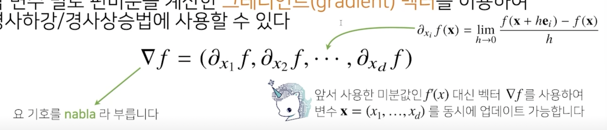
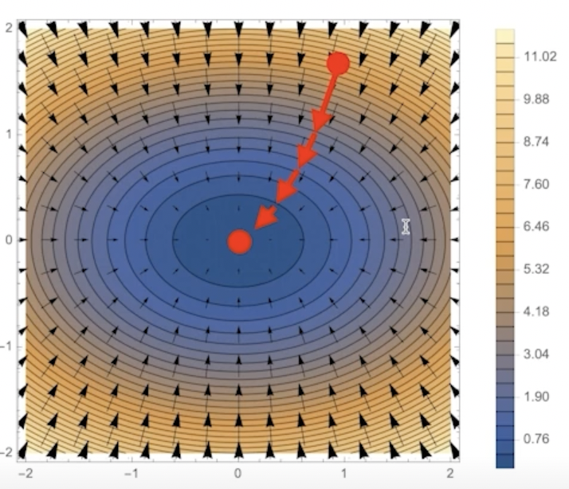

# 경사하강법 - 순한맛

미분의 개념과 그래디언트 벡터에 대해 설명합니다.

경사하강법의 알고리즘과 실제 코드에서의 구현을 보여줍니다.

접선의 기울기를 이용해서 함수의 최솟값으로 점을 이동시키는 원리를 알면 이를 바탕으로 경사하강법의 알고리즘과 수식을 이해할 수 있습니다.

특히 변수가 벡터인 경우, 편미분을 통해서 구한 그래디언트 벡터를 통해 d-차원으로 경사하강법을 확장할 수 있다는 개념을 확실하게 잡고 가시기 바랍니다.

## 1. 미분

- 미분(differentiation)은 **변수의 움직임에 따른 함수값의 변화를 측정하기 위한 도구**로 최적화에서 제일 많이 사용하는 기법


- 최근에 미분을 손으로 직접 계산하는 대신 컴퓨터가 계산해줄 수 있음
- `sympy.diff`를 가지고 미분을 컴퓨터로 계산 가능

```python
sym.diff(sym.poly(x**2 + 2*x + 3), x)  # 수식을 x에 대해 미분해라
Poly(2*x + 2, x, domain='ZZ')
```

### 1.1 미분을 그림으로 이해

- 미분은 함수 $f$의 주어진 점 $(x, f(x))$ 에서의 **접선의 기울기**를 구함
- 한 점에서 접선의 기울기를 알면 어느 방향으로 점을 움직여야 함수값이 증가하는지/감소하는지 알 수 있음
- **증가**시키고 싶다면 미분값을 **더하고** **감소**시키고 싶으면 미분값을 **뺸다**.
- 미분값을 더해주면 최대화해주게 되고 미분값을 뺴주면 최소화해줌
- **미분값을 더하면 경사상승법(gradient ascent)**이라 하며 함수의 **극대값**의 위치를 구할 때 사용
  - 목적함수를 **최대화** 할 때 사용
- **미분값을 빼면 경사하강법(gradient descent)**이라 하며 함수의 **극소값**의 위치를 구할 때 사용
  - 목적함수를 **최소화**할 때 사용
- **경사상승**/**경사하강** 방법은 극값에 도달하면 움직임을 멈춤


### 1.2 경사하강법: 알고리즘

```python
# Input: gradient, inint, lr, eps, Output: var
# gradient: 미분을 계산하는 함수
# init: 시작점, lr: 학습률, eps: 알고리즘 종료조건
var = init
grad = gradient(var)
while (abs(grad) > eps):
    var = var - lr * grad
    grad = gradient(var)
```

- 컴퓨터가 계산할 때 미분이 정확히 0이 되는 것은 불가능하므로 `eps`보다 작을 때 종료하는 조건이 필요
- 경사하강법에서는 그레디언트를 빼줌
- lr(학습률)을 가지고 학습의 속도를 조절
  - 다룰때 조심해서 다뤄야 함

### 1.3 변수가 벡터라면?

- 벡터가 입력인 다변수 함수의 경우 **편미분(partial differentiation)**을 사용
    - x에 대해 미분한다면 y를 상수로 생각하고 미분


```python
import sympy as sym
from sympy.abc import x, y

sym.diff(sym.poly(x**2 + 2*x*y + 3) + sym.cos(x + 2*y), x)
2*x + 2*y - sin(x + 2*y)
```

- 각 변수 별로 편미분을 계산한 **그레디언트(gradient) 벡터**를 이용하여 경사하강/경사상승법에 사용할 수 있음



### 1.4 그레디언트란?

- 그레디언트 벡터에 (-)값을 곱하면 y의 최소점(극소점)으로 향하는 화살표들의 움직임
- 그레디언트 벡터 $\nabla f(x, y)$는 각 점 $(x, y)$ 에서 **가장 빨리 증가하는 방향**으로 흐르게 됨
- $-\nabla f$는 $\nabla (-f)$랑 같고 이는 각 점에서 **가장 빨리 감소하게 되는 방향**과 같음



```python
# Input: gradient, inint, lr, eps, Output: var
# gradient: 미분을 계산하는 함수
# init: 시작점, lr: 학습률, eps: 알고리즘 종료조건
var = init
grad = gradient(var)
while (norm(grad) > eps):
    var = var - lr * grad
    grad = gradient(var)
```

- 경사하강법 알고리즘은 그대로 적용된다. 그러나 벡터는 절대값 대신 노름(norm)을 계산해서 종료조건을 설정


