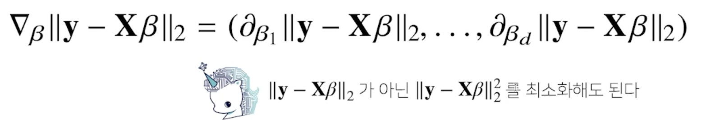
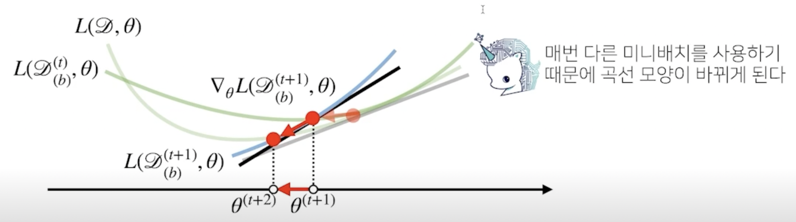

# 경사하강법 - 매운맛

## 1. 경사하강법으로 선형회귀 계수 구하기

 - 선형회귀의 목적식은 $||y - X\beta||_2$ 이고 이를 최소화하는 $\beta$를 찾아야 하므로 다음과 같은 그레디언트 벡터를 구해야 함




- 목적식을 최소화하는 $\beta$를 구하는 경사하강법 알고리즘은 다음과 같음


- L2 노름의 제곱을 목적식으로 해도 목적식을 최소화하는 것은 같음

```python
# Input: X, y, lr, T, Output: beta
# norm: L2-노름을 계산하는 함수
# lr: 학습률, T: 학습횟수
for t in range(T):
    error = y - X @ beta
    grad = - transpose(X) @ Error
    beta = beta - lr * grad
```

- 이 알고리즘을 이용하면 무어펜로즈 역행렬을 이용하지 않아도 회귀계수를 계산 가능
- 학습횟수를 작게 잡으면 목표로하는 값으로 수렴하지 않음
- 학습률을 너무 작게 잡으면 수렴이 잘 안되고 크게 잡으면 발산할 수 있음


## 2. 경사하강법은 만능인가?

- 이론적으로 경사하강법은 미분가능하고 볼록(convex)한 함수에 대해선 **적절한 학습률과 학습횟수를 선택했을 때 수렴이 보장**되어 있음
- 볼록한 함수는 그레디언트 벡터가 항상 최소점을 향함
- 특히 선형회귀의 경우 목적식 $||y - X\beta||_2$은 회귀계수 $\beta$에 대해 볼록함수이기 때문에 알고리즘을 충분히 돌리면 수렴이 보장
- 하지만 비선형회귀 문제의 경우 목적식이 볼록하지 않을 수 있으므로 수렴이 항상 보장되지는 않음
- 특히 딥러닝을 사용하는 경우 목적식은 대부분 볼록함수가 아니므로 수렴이 보장되지 않음

## 3. 확률적 경사하강법

- 확률적 경사하강법(stochastic gradient descent)은 모든 데이터를 사용해서 업데이트하는 대신 데이터 한개 또는 일부(mini-bach) 활용하여 업데이트 함
- 볼록이 아닌(non-convex) 목적식은 SGD를 통해 최적화할 수 있음
- SGD라고 해서 만능은 아니지만 딥러닝의 경우 SGD가 경사하강법보다 실증적으로 더 낫다고 검증 되었음
- 데이터의 일부를 사용해서 계산한 그레디언트 벡터값의 기대값이 전부를 사용한 그레디언트 벡터와 유사하다고 확률적으로 보장됨
- SGD는 데이터의 일부를 가지고 패러미터를 업데이트하기 때문에 연산자원을 좀 더 효율적으로 활용하는데 도움

### 3.1 확률적 경사하강법의 원리: 미니배치 연산

- 경사하강법은 전체데이터 $D = (X, y)$ 를 가지고 목적식의 그레디언트 벡터인 $\nabla L(D, \theta)$를 계산
- SGD는 미니배치 $D_(b) = (X_(b), y_(b)) \subset D$를 가지고 그레디언트 벡터를 계산
- 그레디언트 값이 다르기 때문에 완전히 같진 않지만 방향은 비슷할거라는 아이디어
- 미니배치는 확률적으로 선택하므로 목적식 모양이 바뀌게 됨



- 목적식의 모양이 확률적으로 변하기 때문에 극소점에서도 탈출이 가능
- SGD는 볼록이 아닌 목적식에서도 사용 가능하므로 경사하강법보다 머신러닝 학습에 더 효율적

--- 
# Further Question

강의영상 03:47부터 소개되는 내용인, d-차원 벡터(베타)에 대한 그레디언트 벡터를 구하는 계산을 각자 직접 손으로 해보기 바랍니다!

