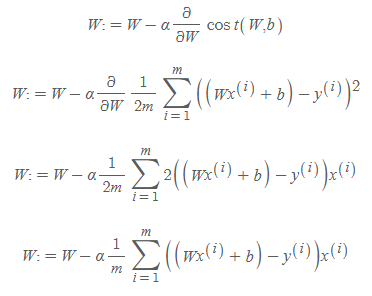

[Day3] 파이썬 6 ~ 7강 & AI math 1 ~ 4강 & 선택과제 1

* numpy에 대한 개념과 이해
* pandas에 대한 개념과 이해
* groupby, pivot table, crosstab 등에 대한 이해

* 벡터에 대한 개념과 이해
* 행렬과 역행렬에 대한 개념과 이해
  * 유사역행렬, 무어펜로즈 역행렬
* 경사하강법에 대한 개념과 이해

* gradient descent 구현방법에 대한 이해

* 벡터와 행렬에 대해 꽤 안다고 생각했지만 깊이 들어갈수록 모르는 것 투성이라는 것을 깨달음.

* 경사하강법(GD)의 기본 아이디어는 **비용함수 or 손실함수 or loss or error or cost**를 최소화하기 위해 반복해서 파라미터를 조정해 나가는 것

* 비욤함수는 W에 대해서 2차 함수식

* 경사하강법은 원래 값에서 기울기를 빼가면서(내려가면서) cost 값이 최소가 되는 지점을 찾는 것

* 경사하강법 수식을 풀어보면

