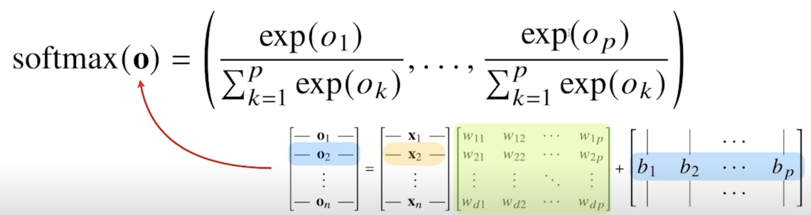
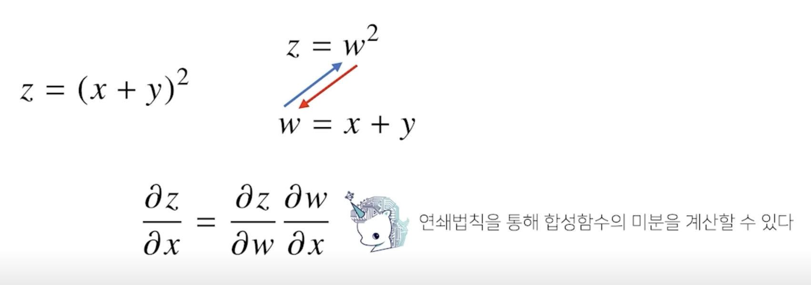

# 딥러닝 학습방법 이해하기

이전 강의에서 배웠던 선형모델은 단순한 데이터를 해석할 때는 유용하지만 분류문제나 좀 더 복잡한 패턴의 문제를 풀 때는 예측성공률이 높지 않습니다. 

이를 개선하기 위한 비선형 모델인 신경망을 본 강의에서 소개합니다.

신경망의 구조와 내부에서 사용되는 softmax, 활성함수, 역전파 알고리즘에 대해 설명합니다.

딥러닝은 여러 층의 선형모델과 활성함수에 대한 합성함수로 볼 수 있으며, 이 합성함수의 그래디언트를 계산하기 위해서 연쇄법칙을 적용한 역전파 알고리즘을 사용합니다. 

이와 같은 딥러닝의 원리를 꼭 이해하시고 넘어가셨으면 좋겠습니다.

## 1. 비선형모델인 신경망(neural network)

- 각 행벡터 $O_i$는 데이터 $x_i$와 가중치 행렬 $W$ 사이의 행렬곱과 절편 $b$ 벡터의 합으로 표현된다고 가정하면

    

- 데이터가 바뀌면 결과값도 바뀌게 됨
- 이 때, 출력 벡터의 차원은 d에서 p로 바뀌게 됨

    

- d개의 변수로 p개의 선형모델을 만들어서 p개의 잠재변수를 설명하는 모델
- $x_1$ ~ $x_d$ 까지의 변수들이 $o_1$ ~ $o_p$ 출력으로 연결되는 수식이라고 이해하면 됨
- 화살표에 해당하는 것이 가중치 행렬 $W_{ij}$의 역할이라고 보면 됨   

## 2. 소프트맥스 연산

- 소프트맥스(softmax) 함수는 **모델의 출력을 확률로 해석**할 수 있게 변환해주는 연산
- **분류 문제**를 풀 때 선형모델과 소프트맥스 함수를 결합하여 예측
- 특정 벡터가 어떤 클래스에 속할 확률인지 계산해줄 수 있음

    

```python
def softmax(vec):
    denumerator = np.exp(vec - np.max(vec, axis=-1, keepdims=True))
    numerator = np.sum(denumerator, axis=-1, keepdims=True)
    val = denumerator / numerator
    return val
```

- np.max(vec)를 사용하는 이유는 오버플로우 발생을 막아주기 위해 사용
- 학습이 아닌 추론의 경우에는 굳이 softmax 함수를 사용할 필요 없음

- 신경망은 **선형모델과 활성함수(activation function)를 합성한 함수**
- 소프트맥스는 전체의 값들을 다 고려해서 나오는 반면 활성함수는 개개의 값들을 받아서 출력
  - 활성함수는 실수값을 받아서 계산
  - 소프트맥스는 벡터를 받아서 계산

- 활성함수를 이용해서 딥러닝에서는 선형모델로 나온 출력물을 비선형의 값으로 변환 가능

## 3. 활성함수

- 활성함수(activation function)는 $R$ 위에 정의된 비선형(nonlinear) 함수로서 딥러닝에서 매우 중요한 개념
- 활성함수를 쓰지 않으면 딥러닝은 선형모형과 차이가 없음
- 시그모이드(sigmoid) 함수나 tanh 함수는 전통적으로 많이 쓰이던 활성함수지만 딥러닝에선 ReLU 삼수를 많이 사용

    

- 다층(multi-layer) 퍼셉트론(MLP)은 **신경망이 여러층 합성된 함수**

    

- $H$와 $Z$는 모양이 같지만 활성함수를 씌웠느냐의 차이
- 순차적인 신경망 계산을 순전파(forward propagation)라고 함
  - 학습이 아닌 주어진 순서에 따라 출력물을 내놓는 과정

## 4. 왜 층을 여러개를 쌓을까?

- 이론적으로는 2층 신경망으로도 임의의 연속함수를 근사할 수 있음
  - 그러나 딥러닝에서는 무리가 있음
- 층이 깊을수록 목적함수를 근사하는데 필요한 뉴런(노드)의 숫자가 훨씬 빨리 줄어들어 좀 더 효율적으로 학습이 가능
- 층이 얇으면 필요한 뉴런의 숫자가 기하급수적으로 늘어나서 넓은(wide) 신경망이 되어야 함
- 많은 층을 쌓은 딥러닝 모델이 좀 더 효율적
- 층이 깊다고해서 좀 더 복잡한 모델을 근사할 수 있지만 최적화가 더 쉽다는 얘기를 할 수는 없음
- 좀 더 복잡한 모델은 최적화에 더 많은 노력이 필요
- 층이 깊어지면 깊어질 수록 학습이 더 어려워 질 수 있음
  - 추후 convolution -> residual 강의 할 때 다시 얘기

## 5. 딥러닝 학습원리 : 역전파 알고리즘

- 딥러닝은 역전파(backpropagation) 알고리즘을 이용하여 각 층에 사용된 패러미터를 학습

    

- 저층의 gradient를 계산할 때 위층의 gradient가 필요
- 각 층 패러미터의 그레디언트 벡터는 윗층부터 역순을 계산

### 5.1 역전파 알고리즘 원리 이해하기

- 역전파 알고리즘은 합성함수 미분법인 **연쇄법칙(chain-rule) 기반 자동미분(auto-differentiation)**을 사용

    

- backpropagation은 미분을 계산하고 저장해야 하기 때문에 메모리를 더 많이 사용

---

# Further Question

## 1. 분류 문제에서 softmax 함수가 사용되는 이유가 뭘까요?

- 모델을 통한 나온 출력에 softmax 함수를 사용하면 확률로 해석이 가능해져서 분류 카테고리의 하나하나의 확률로 해석가능 그렇기 때문에 softmax 함수를 사용한다.

## 2. softmax 함수의 결과값을 분류 모델의 학습에 어떤식으로 사용할 수 있을까요?

- softmax 함수의 결과값은 분류할 카테고리의 확률값으로 나오게 되는데 이 중 가장 큰 확률을 가진 카테고리를 정답으로 채택해서 모델이 분류한 정답과 실제 정답의 차이를 비교해 학습