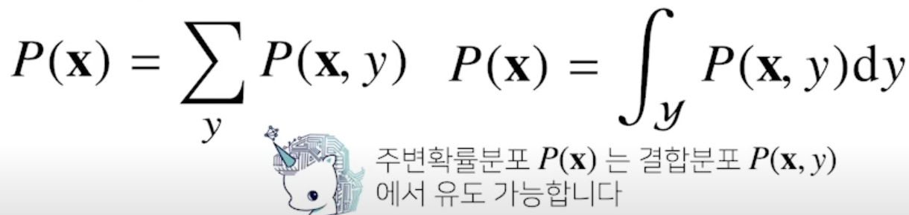
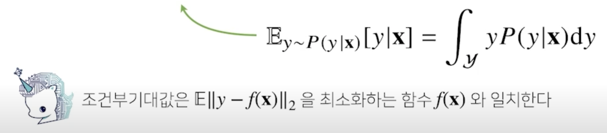
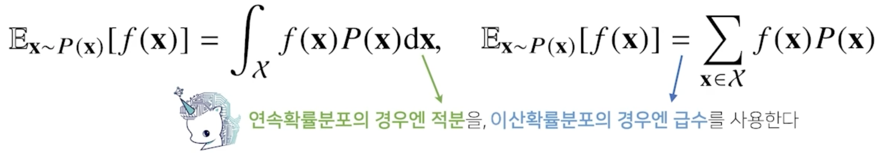
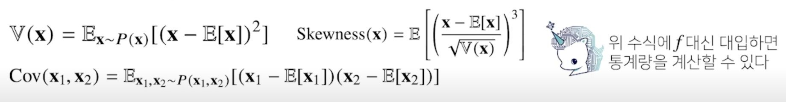
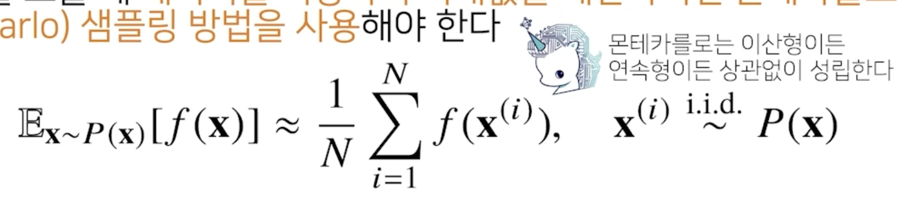

# 확률론 맛보기

딥러닝의 기본 바탕이되는 확률론에 대해 소개합니다.

확률분포, 조건부확률, 기댓값의 개념과 몬테카를로 샘플링 방법을 설명합니다.

데이터의 초상화로서 확률분포가 가지는 의미와 이에 따라 분류될 수 있는 이산확률변수, 연속확률변수의 차이점에 대해 설명합니다.

확률변수, 조건부확률, 기댓값 등은 확률론의 매우 기초적인 내용이며 이를 정확히 이해하셔야 바로 다음 강의에서 배우실 통계학으로 이어질 수 있습니다. 

기댓값을 계산하는 방법, 특히 확률분포를 모를 때 몬테카를로 방법을 통해 기댓값을 계산하는 방법 등은 머신러닝에서 매우 빈번하게 사용되므로 충분히 공부하시고 넘어가시기 바랍니다.

## 1. 딥러닝에서 확률론이 왜 필요한가?

- 딥러닝은 확률론 기반의 기계학습 이론에 바탕을 두고 있음
- 기계학습에서 사용되는 손실함수(loss function)들의 작동 원리는 데이터 공간을 통계적으로 해석해서 유도하게 됨
  - 예측이 틀릴 위험(risk)을 최소화하도록 데이터를 학습하는 원리는 통계적 기계학습의 기본 원리

- 회귀 분석에서 손실함수로 사용되는 $L_2$-노름은 예측오차의 분산을 가장 최소화하는 방향으로 학습하도록 유도
- 분류 문제에서 사용되는 교차엔트로피(cross-entropy)는 모델 예측의 불확실성을 최소화하는 방향으로 학습하도록 유도

- 분산 및 불확실성을 최소화하기 위해서는 측정하는 방법을 알아야 함
  - 두 대상을 측정하는 방법을 통계학에서 제공하기 때문에 기계학습을 이해하려면 확률론의 기본 개념을 알아야 함

## 2. 확률분포

- 데이터공간을 $x$ x $y$ 라 표기하고 $D$는 데이터 공간에서 데이터를 추출하는 분포
- 데이터는 확률변수로 ($x$, $y$) ~ $D$ 라 표기
- 결합분포 $P$($x$, $y$) 는 $D$ 를 모델링 함
  - 결합분포 $P$($x$, $y$)는 주어진 데이터의 모양을 보고 적절하게 선택할 수 있음
- $P$(x) 는 입력 x 에 대한 주변확률분포로 $y$ 에 대한 정보를 주진 않음

    

- 조건부확률분포 $P$(x|$y$) 는 데이터 공간에서 입력 x 와 출력 $y$ 사이의 관계를 모델링
  - $P$(x|$y$) 는 특정 클래스가 주어진 조건에서 데이터의 확률분포를 보여줌

### 2.1 이산확률변수 vs 연속확률변수

- 확률변수는 확률분포 $D$ 에 따라 이산형(discrete)과 연속형(continuous) 확률변수로 구분
  - 데이터공간 $x$ x $y$ 에 이해 결정되는 것으로 오해를 하지만 $D$에 의해 결정
- 이산형 확률변수는 확률변수가 가질 수 있는 경우의 수를 모두 고려하여 확률을 더해서 모델링

    

- 연속형 확률변수는 데이터 공간에 정의된 확률변수의 밀도(density) 위에서의 적분을 통해 모델링

    

## 3. 조건부확률과 기계학습

- 조건부확률 $P$($y$|x) 는 입력변수 x 에 대해 정답이 $y$ 일 확률을 의미
  - 연속확률분포의 경우 $P$($y$|x) 는 확률이 아니고 밀도로 해석한다는 것을 주의!!
- 로지스틱 회귀에서 사용했던 선형모델과 소프트맥스 함수의 결합은 데이터에서 추출된 패턴을 기반으로 확률을 해석하는데 사용
- 분류 문제에서 softmax($W \phi$ + $b$) 은 데이터 x 로부터 추출된 특징패턴 $\phi$(x) 과 가중치행렬 $W$ 을 통해 조건부확률 $P$($y$|x) 을 계산
- 회귀 문제의 경우 조건부기대값 $E$[$y$|x] 을 추정

    

    - 조건부 기대값은 $L_2$-노름을 최소화하는 함수와 일치

### 3.1 기대값이란?

- 확률분포가 주어지면 데이터를 분석하는데 사용 가능한 여러 종류의 통계적 범함수(statistical functional)를 계산
- 기대값(expectation)은 데이터를 대표하는 통계량이면서 동시에 확률분포르 통해 다른 통계적 범함수를 계산하는데 사용
     

- 연속확률변수인 경우에는 밀도함수를 곱해서 적분하고 이산확률변수인 경우에는 질량함수를 곱해서 합한다.

- 평균과 동일한 의미 그러나 기계학습에선 더 깊이 들어감
- 기대값을 이용해 분산, 첨도, 공분산 등 여러 통계량을 계산할 수 있음
    
- 딥러닝은 다층신경망을 사용하여 데이터로부터 특징패턴 $\phi$을 추출
    - 특징패턴을 학습하기 위해 어떤 손실함수를 사용할지는 기계학습 문제와 모델에 의해 결정

### 3.2 몬테카를로 샘플링

- 기계학습의 많은 문제들은 확률분포를 명시적으로 모를 때가 대부분
- 확률분포를 모를 때 데이터를 이용하여 기대값을 계산하려면 몬테카를로(Monte Carlo) 샘플링 방법을 사용
    
    - 데이터를 샘플링할 때 독립적으로 샘플링해줘야만 몬테카를로 샘플링 방법이 작동하니까 기억!!

- 몬테카를로 샘플링은 독립추출만 보장된다면 대수의 법칙(law of large number)에 의해 수렴성을 보장

---
# Further Question

# 1. 몬테카를로 방법을 활용하여 원주율에 대한 근삿값을 어떻게 구할 수 있을까요?

1. 변의 길이가 2인 정사각형을 그리고 정사각형에 꼭 맞는 반지름이 1인 원을 중심이 (0, 0) 인 곳에서 그려서 2사분면을 사용하자
2. 원의 방정식은 $x^2$ + $y^2$ = 1이 된다.
3. 4분원의 넓이는 $\pi / 4$
4. 2사분면의 사각형의 넓이는 1
5. 2사분면의 사각형에서 4분원의 넓이의 비율은 $\pi / 4$
6. 0~1 사이의 난수를 생성해서 4분원안에 들어오는 비율을 계산
7. 난수의 개수를 늘리면 늘릴수록 난수가 4분원 안에 들어오는 비율이 $\pi / 4$ 와 비슷하게 된다.
8. $\pi$는 난수가 4분원 안에 들어오는 비율 * 4 를 해주면 됨

