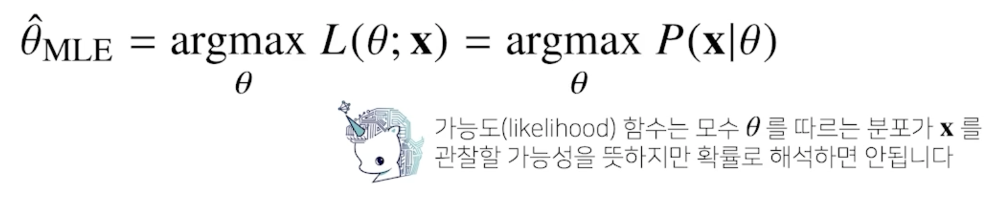
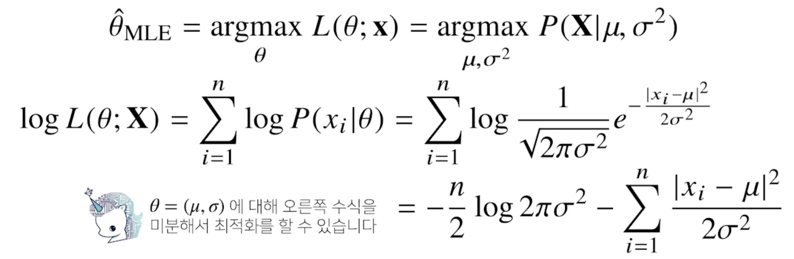
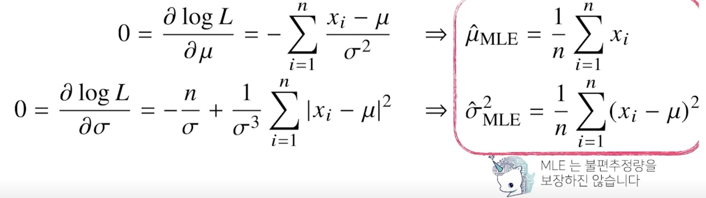
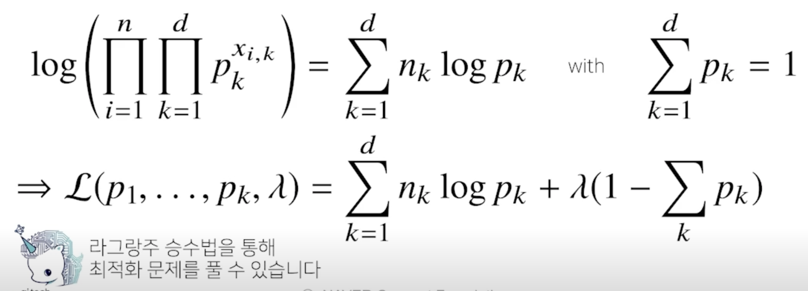
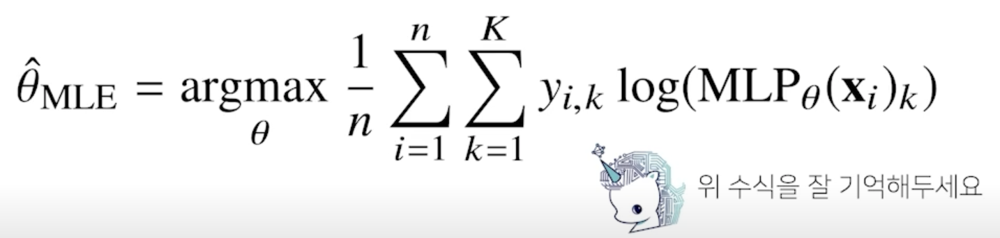
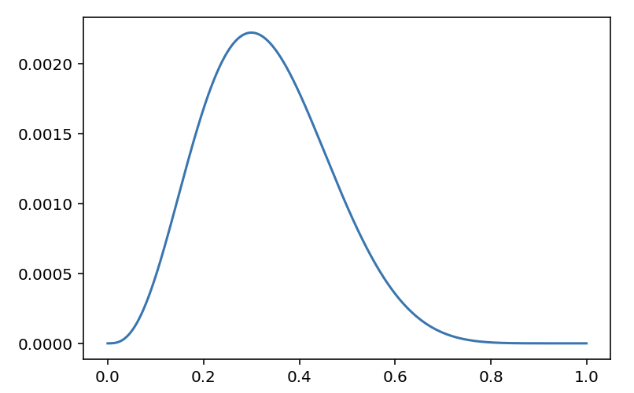

# 통계학 맛보기

모수의 개념과 모수를 추정하는 방법으로 최대가능도 추정법을 소개합니다.

정규분포, 카테고리분포에서의 예제로 최대가능도 추정법을 설명합니다.

표본분포와 표집분포, 가능도(likelihood)와 확률 등 헷갈릴 수 있는 개념들이 많이 소개되므로 각각의 정확한 의미와 차이점을 충분히 공부하고 넘어가시기 바랍니다.

최대가능도 추정법을 통해서 정답에 해당하는 확률분포와 모델이 추정하는 확률분포의 거리를 최소화함으로써 모델을 학습시킬 수 있으며, 이 원리는 딥러닝/머신러닝에서 아주 유용하게 사용되기 때문에 확실하게 이해하셨으면 좋겠습니다.

## 모수란?

- 통계적 모델링은 적절한 가정 위에서 확률분포를 추정(inference)하는 것이 목표이며, 기계학습과 통계학이 공통적으로 추구하는 목표
- 그러나 유한한 개수의 데이터만 관찰해서 모집단의 분포를 정확하게 알아낸다는 것은 불가능하므로, 근사적으로 확률분포를 추정할 수 밖에 없음
  - 예측모형의 목적은 분포를 정확하게 맞추는 것보다는 데이터와 추정 방법의 불확식성을 고려해서 위험을 최소화하는 것

- 데이터가 특정 확률분포를 따른다고 선험적으로(a priori) 가정한 후 그 분포를 결정하는 모수(parameter)를 추정하는 방법을 모수적(parametric) 방법론이라고 합니다.
- 특정 확률분포를 가정하지 않고 데이터에 따라 모델의 구조 및 모수의 개수가 유연하게 바뀌면 비모수(nonparametric) 방법론 이라 부름
  - 기계학습의 많은 방법론은 비모수 방법론에 속함
  - 비모수 방법론이라고 해서 모수가 없는것은 아니다

## 확률분포 가정하기 : 예제

- 확률분포를 가정하는 방법 : 우선 히스토그램을 통해 모양을 관찰
  - 데이터가 2개의 값(0 또는 1)만 가지는 경우 -> 베르누이분포
  - 데이터가 n개의 이산적인 값을 가지는 경우 -> 카테고리분포
  - 데이터가 [0,1] 사이에서 값을 가지는 경우 -> 베타분포
  - 데이터가 0 이상의 값을 가지는 경우 -> 감마분포, 로그정규분포 등
  - 데이터가 $R$ 실수 전체에서 값을 가지는 경우 -> 정규분포, 라플라스분포 등
- 기계적으로 확률분포를 가정해서는 안 되며, 데이터를 생성하는 원리를 먼저 고려하는 것이 원칙
- 각 분포마다 검정하는 방법들이 있으므로 모수를 추정한 후에는 반드시 검정을 해야함

## 데이터를 모수로 추정해보자!

- 데이터의 확률분포를 가정했다면 모수를 추정해 볼 수 있음
- 정규분포의 모수는 평균 $\mu$ 과 분산 $\sigma^2$ 으로 이를 추정하는 통계량(statistic)은 다음과 같다.
  
- 통계량의 확률분포를 표집분포(sampling distribution)라 부르며, 특히 표본평균의 표집분포는 $N$이 커질수록 정규분포 $N$($\mu$, $\sigma^2$/$N$) 를 따름
- 중심극한정리(Central Limit Theorem)
  - 데이터는 정규분포를 따르지 않더라도 표본평균의 분포는 N이 커질수록 정규분포를 따름

## 최대가능도 추정법

- 표본평균이나 표본분산은 중요한 통계량이지만 확률분포마다 사용하는 모수가 다르므로 적절한 통계량이 달라지게 됨
- 이론적으로 가장 가능성이 높은 모수를 추정하는 방법 중 하나는 **최대가능도 추정법(maximum likelihood estimation, MLE)**
  

  - 가능도(likelihood) 함수 : $L$($\theta$;x)
  - 데이터가 주어져 있는 상황에서 $\theta$를 변형시킴에 따라서 값이 바뀌는 함수로 이해하면 좋음
  - 확률로 해석하면 안됨
  - $\theta$에 따라서 대소비교를 하기위한 함수로 이해하면 좋음
- 데이터 집합 $X$ 가 독립적으로 추출되었을 경우 로그가능도를 최적화 함
    

## 왜 로그가능도를 사용하나요?

- 로그가능도를 최적화하는 모수 $\theta$ 는 가능도를 최적화하는 MLE 가 됨
- 데이터의 숫자가 적으면 상관없지만 만일 데이터의 숫자가 수억 단위가 된다면 컴퓨터의 정확도로는 가능도를 계산하는 것은 불가능
- 데이터가 독립일 경우, 로그를 사용하면 가능도의 곱셈을 로그가능도의 덧셈으로 바꿀 수 있기 때문에 컴퓨터로 연산이 가능
- 경사하강법으로 가능도를 최적화할 때 미분 연산을 사용하게 되는데, 로그가능도를 사용하면 연산량을 $O(n^2)$ 에서 $O(n)$ 으로 줄여줌
- 경사하강법을 사용하는 경우 목적식을 최소화 해야 하는데 로그가능도 같은 경우는 maximum을 찾아주게 되는데 그래서 음의 로그가능도(negative log-likelihood)를 최적화하게 됨

## 최대가능도 추정법 예제: 정규분포

- 정규분포를 따르는 확률변수 $X$ 로 부터 독립적인 표본 ${x_1, ..., X_n}$ 을 얻었을 때 최대가능도 추정법을 이용하여 모수를 추정하면?
  
- 왼쪽 수식은 분산만 들어가는 term이 되고 오른쪽 수식은 분산과 평균이 들어가는 term 이 됨
     

## 최대가능도 추정법 예제 : 카테고리 분포

- 카테고리 분포 Multinoulli(x; $p_1$, ..., $p_d$) 를 따르는 확률변수 $X$ 로 부터 독립적인 표본 {$x_1$, ..., $x_n$}을 얻었을 때 최대가능도 추정법을 이용하여 모수를 추정하면?
  
  
- 제약식이 주어진 상황에서 최대가능도 추정법을 사용해야 함
- $x_{i, k}$ 는 주어진 $x_i$에 대해서 k 값이 1인 데이터의 개수를 세는 개념으로 이해
  
  
- 주어진 라그랑주 목적식을 각각의 모수 $p_k$에 대해서 미분을 해준다음 라그랑주 승수인 $\lambda$에 대해서도 미분을 해줌

## 딥러닝에서 최대가능도 추정법

- 최대가능도 추정법을 이용해서 기계학습 모델을 학습할 수 있음
- 딥러닝 모델의 가중치를 $\theta$ = ($W^{(1)}$, ..., $W^{(L)}$)라 표기했을 떄 분류 문제에서 소프트맥스 벡터는 카테고리분포의 모수 ($p_1$, ..., $p_K$) 를 모델링 함
- 원핫벡터로 표현한 정답레이블 y = ($y_1$, ..., $y_K$) 을 관찰데이터로 이용해 확률분포인 소프트맥스 벡터의 로그가능도를 최적화할 수 있음
  

## 확률분포의 거리를 구해보자

- 기계학습에서 사용되는 손실함수들은 모델이 학습하는 확률분포와 데이터에서 관찰되는 확률분포의 거리를 통해 유도함
- MLE로 추정하게 되는 굉장히 많은 모델학습 방법들이 확률분포의 거리를 최적화하는것과 굉장히 밀접

- 데이터 공간에 두 개의 확률분포 P(x), Q(x) 가 있을 경우 두 확률분포 사이의 거리(distance)를 계산할 때 다음과 같은 함수들을 이용
  - 총변동 거리 (Total Variation Distance, TV)
  - 쿨백-라이블러 발산 (Kullback-Leibler Divergence, KL)
  - 바슈타인 거리 (Wasserstein Distance)

## 쿨백-라이블러 발산

- 쿨백-라이블러 발산(KL Divergence)은 다음과 같이 정의
  
- 쿨백-라이블러는 다음과 같이 분해할 수 있음
  
- 분류 문제에서 정답레이블을 P, 모델 예측을 Q 라 두면 최대가능도 추정법은 쿨백-라이블러 발산을 최소화하는 것과 같음
- 최대가능도 추정법에서 Log-likelihood를 최대화시키는 것과 정답레이블에 해당하는 확률분포 P 와 모델예측에 사용되는 확률분포 Q 사이에 거리(다시말해, 쿨백-라이블러 발산)를 최소화 하는 것과 동일

---
# Further Question

1. 확률과 가능도의 차이는 무엇일까요? (개념적인 차이, 수식에서의 차이, 확률밀도함수에서의 차이)
  - 개념적인 차이
    - 확률 : 주어진 모델 파라미터 값과 어떠한 관찰된 데이터에 대한 참조 없이, 랜덤 출력에 대한 일어날 뻔한 가능성
    - 가능도 : 주어진 특정한 관찰된 데이터를 기반으로 하여 모델 파라미터 값들이 될 뻔한 가능성
  - 수식에서의 차이
    - 확률 : $f(x|\theta)$
      - 파라미터가 주어졌을 때 x 가 될 확률
    - 가능도 : $L(\theta|x)$
      
      - x가 주어졌을 때 파라미터들이 될 수 있는 확률
  - 확률밀도함수에서의 차이
  

2. 확률 대신 가능도를 사용하였을 때의 이점은 어떤 것이 있을까요?
   - 실제 데이터의 분포를 알 수 없으므로 모수를 알 수 없지만 주어진 데이터를 가지고 모수을 추정할 수 있음   

3. 다음의 code snippet은 어떤 확률분포를 나타내는 것일까요? 해당 확률분포에서 변수 theta가 의미할 수 있는 것은 무엇이 있을까요?
```python
import numpy as np
import matplotlib.pyplot as plt
theta = np.arange(0, 1, 0.001)
p = theta ** 3 * (1 - theta) ** 7
plt.plot(theta, p)
plt.show()
```
  

  - n = 10, k = 3, p = $\theta$ 인 이항 분포
  - $K$ ~ $B(10, \theta)$
  - $f(3; 10, \theta)$ = $\theta^3$$(1 - \theta)^7$