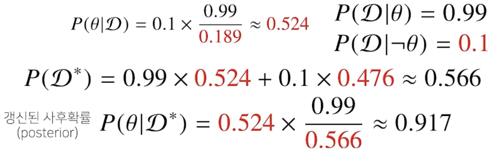
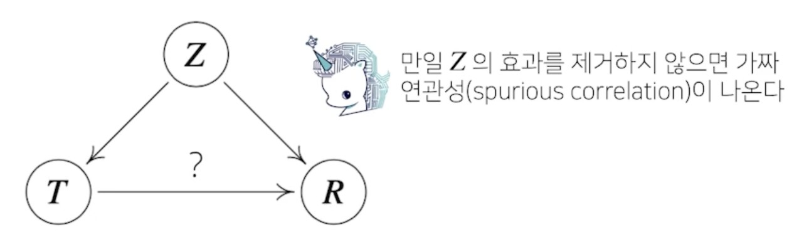

# 베이즈 통계학 맛보기

조건부확률에서 이어지는 개념인 베이즈 정리와 인과관계 추론에 대해 설명합니다.

베이즈 정리는 데이터가 새로 추가되었을 때 정보를 업데이트하는 방식에 대한 기반이 되므로 오늘날 머신러닝에 사용되는 예측모형의 방법론으로 굉장히 많이 사용되는 개념입니다. 

이 때 나오는 사전확률, 사후확률, evidence 등의 개념은 강의에서 나오는 예제를 활용해서 정확히 이해하시기 바랍니다.

인과관계 추론의 경우, 조건부확률을 섣불리 사용해선 안되는 이유와 중첩효과를 제거함으로써 얻은 인과관계를 어떤 방식으로 활용할 수 있는지에 초점을 두고 공부하시면 좋겠습니다.

## 조건부 확률이란?

- 베이즈 통계학을 이해하기 위해선 조건부확률의 개념을 이해해야 함
    
- 베이즈 정리는 조건부확률을 이용하여 정보를 갱신하는 방법을 알려줌
    

    
    - $D$ : 새로 관찰하는 데이터
    - $\theta$ : 모델링하는 어떤 이벤트, 모델에서 계산하고 싶어하는 파라미터 즉, 모수
    - $P(\theta|D)$ : 사후확률(posterior), 데이터가 주어져 있을 때 이 파라미터가 성립할 확률
      - 데이터를 관찰한 이후에 측정하는 확률이기 때문에 이름이 붙여짐
    - $P(\theta)$ : 사전확률(prior), 데이터가 주어지지 않은 상황에서 $\theta$에 대한 모델링을 하기 이전에 사전에 주어진 확률
      - 데이터를 분석하기 전에 어떤 모수나, 가설이나 모델링 하고자 하는 타겟에 대해서 사전에 미리 가정을 깔아두고 확률분포에 대해서 사전에 설정하는 확률분포
    - $P(D|\theta)$ : 가능도(likelihood), 현재 주어진 파라미터, 모수 또는 가정에서 이 데이터가 관찰될 확률
    - $P(D)$ : Evidence, 데이터 자체의 분포

- COVID-99 의 발병률이 10% 로 알려져있다. COVID-99 에 실제로 걸렸을 때 검진될 확률은 99%, 실제로 걸리지 않았을 때 오검진될 확률이 1% 라고 할 때, 어떤 사람이 질병에 걸렸다고 검진결과가 나왔을 떄 정말로 COVID-99 에 감염되었을 확률은?
  - 사전확률, 민감도(Recall), 오탐율(False alarm)을 가지고 정밀도(Precision)를 계산하는 문제
    
    - 발병률 : 사전확률 $P(\theta)$ = 0.1
    - 실제로 걸렸을 때 검진될 확률 : 가능도 $P(D|\theta)$ = 0.99
    - 실제로 걸리지 않았을 때 오검진될 확률 : 가능도 $P(D|-\theta)$ = 0.01
    - evidence : $P(D)$  -> 전체확률의 법칙으로 계산
    - 어떤사람이 질병에 걸렸다고 검진결과가 나왔을 때 정말로 COVID-99 에 감염되었을 확률 : $P(\theta|D)$
    
    
  - 오탐율(False alarm)이 오르면 테스트의 정밀도(Precision)가 떨어짐

## 조건부 확률의 시각화

- 사전확률을 알 지 못하면 베이즈통계학에서의 효과가 상당히 떨어지게 되므로 주의!!

## 베이즈 정리를 통한 정보의 갱신

- 베이트 정리를 통해 새로운 데이터가 들어왔을 떄 앞서 계산한 사후확률을 사전확률로 사용하여 갱신된 사후확률을 계산할 수 있음
    
    
- 베이즈 통계학의 큰 장점은 데이터가 들어올 때마다 이런식으로 사후확률을 업데이트 할 수 있는데 그럴때마다 좀 더 업데이트된 정보를 가지고 모델링 할 수 있기 때문에 실제로 굉장히 유효한 테스트를 할 수 있음

## 조건부 확률 -> 인과관계?

- 조건부 확률은 유용한 통계적 해석을 제공하지만 인과관계(causality)를 추론할 때 함수로 사용해서는 안됨!
  - 데이터가 많아져도 조건부 확률만 가지고 인과관계를 추론하는 것은 불가능
- 인과관계는 데이터 분포의 변화에 강건한 예측모형을 만들 때 필요
- 인과관계를 알아내기 위해서는 중첩요인(confounding factor)의 효과를 제거하고 원인에 해당하는 변수만의 인과관계를 계산해야 함
    

