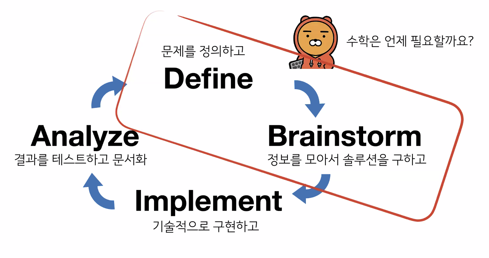

# AI Math FAQ

임성빈 교수님

email : sungbin@unist.ac.kr

퍼절리티? - 강의에서 소개됨 - 잘 알아뒀으면 좋겠음

#### 책 추천 
- [Dive into Deep Learning](https://d2l.ai/) appendix 부분 공부하는걸 추천
- [The Book of Why: The New Science of Cause and Effect](https://www.amazon.com/Book-Why-Science-Cause-Effect/dp/046509760X)

## 1. 인공지능 수학 공부하기

    1.1 수학 너무 어려워요 쉽게 공부하는 방법이 있나요?
        - 보고 또 보고 듣고 또 듣고 해야 익숙해지고 쉬워지는게 많음
        - 머리로는 원래 수학이 어렵습니다. 하지만 손으로 익히는 건 가능합니다.
        - 폰 노이만
        - 수학은 이해할 수 없다. 익숙해지는 것이다.

    1.2 똑똑하게 익숙해지는 방법
        - 많이 보는 것보다 많이 사용하는게 더 좋다!
        - 용어의 정의(Definition)는 일단 외우는 것부터 시작합니다.
        - 교과서나 위키피디아를 활용하면 좋습니다.
        - 만일 용어 사용이 헷갈린다면 인공지능 커뮤니티에 물어보세요!
        - 용어를 외웠다면 예제를 찾아보도록 합시다.
        - 가령 likelihood example 을 구글링 해보면 위와 같은 설명 자료를 찾을 수 있습니다.
        - 언제 어떻게 쓰는 것인지를 익히는걸 추천

    1.3 여러 모델들의 수학적 원리를 모두 이해하고 있어야 하나요?
        - 모두 이해하는 것은 어렵지만 적어도 원리를 이해하는데 필요한 기초는 갖춰야 합니다. 

    1.4 어떤 분야가 기초일까?
        - 대학교 2-3 학년 강의계획서들을 유심히 살펴보자!

        - 선형대수/확률론/통계학은 꼭 알아두는게 좋아요
          - 기업 및 대학원 면접 때 정말 많이 물어봅니다
          - 알고리즘이랑 최적화 내용도 같이 공부하면 시너지가 좋습니다
        - 머신러닝 이론을 공부할 게 안니라면 해석학/위상수학까지 공부할 필요는 없어요
        - 기초 자체를 공부하기보다 머신러닝에서 어떻게 활용되는지 검색해보세요
          - 예) 분류 문제에서 왜 cross-entropy를 손실함수로 사용하는가?
        - 기초 공부는 기초에서 끝나는게 아니라 걔네들을 어떻게 활용하는지 이해해야 완성!

    1.5 ML 엔지니어는 수학을 어느 정도 알아야 할까요?
        - 필요한 걸 공부해서 빠르게 따라잡을 수 있을만큼 알아야 합니다.
        - 엔지니어는 어떤 사람일까?
          - 굉장히 제약된 환경에서 어디가 고장나고 고쳐야 하는지를 빠르게 판단하고 고치는 사람들
          - 언제 어떤 상황에서 문제를 어떻게 해결할지 많이 경험한 사람
          - 문제를 빠르게 해결할 수 있는 준비를 하는게 엔지니어의 덕목

    1.6 Problem Solving Loop

    1.7 추천시스템 공부할 때 알아야 할 내용이 있나요?
        - Dive into Deep Learning 16장 내용을 보면 관련 내용들이 많이 나오니 추천합니다.
    
    1.8 Multi-Armed Bandit
        - 최근엔 MAB 도 중요한 테크닉으로 사용되니 공부해보세요.
        - NETFLIX : A Multi-Armed Bandit Framework for Recommendations 추천

## 2. 인공지능대학원 관심 있어요!

    2.1 AI 분야에서 학석박 간에 어떤 차이가 있을까요?
        - 분야마다 다르겠지만 전문성이 다르고 대중화되지 않은 영역은 학위과정이 중요할 수 있어요
        - 이제 뜨기 시작하고 이거 인기가 많을 것 같다고 생각되는 분야에서는 학위가 요구될 수 있음
        - 강화학습은 대중화되기 쉽지 않고 진입장벽이 있어서 대학원에서 배우는게 좋음
        - CV, NLP 부분은 대중화된 부분이 많아서 

    2.2 The Direction of AI Research
        - Challenges of AI Research
          - Seeing like human (NAS, Detectron)
          - Listening like human (LibriSpeech)
          - Speaking like human (Tacotron)
          - Drawing like human (GAN)

    질문 
        - XAI 분야는 이제 뜨는 분야라서 석박이 요구될 수 있음
        - AutoML은 개발력에 자신이 있으면 괜찮
    
    2.3 인공지능 분야에서 대학원이 필수일까요?
        - 필수는 아닙니다. 하지만 본인이 관심을 가진 분야가 새로운 분야라면 대학원을 추천합니다.

## 3. 사전질문

    3.1 가장 중요한 수학과목은?
        - 선형대수, 확률론, 통계학 꼭 놓치지 말고 알고리즘, 최적화까지 공부하는게 도움이 되실 겁니다.

    3.2 학부새이고 취업을 하고 싶은데 기업에서 대학원생을 선호하는 것 같다는 느낌을 받습니다. 기업에서 대학원생을 선호하는 이유가 있을까요? 대학원생과 견줄 만한 스펙을 갖출 수 있는 활동을 추천해 주시면 감사하곘습니다.
        - 아무래도 대학원에서 공부하고 온 사람이 전문성이 갖출 가능성이 큼
        - 완전 개발력이 뛰어난 사람이 아니라면 논문을 구현해보라고 한다던지, 새로운 분야가 있을때 한번 뚫어보라고 문제를 던져주면 대학원생들은 연구적인 문제를 푸는 트레이닝을 받기 떄문에 대학원생을 선호
        - 대학원 자체가 스펙이라고 얘기할 수 없음
        - 학교 Namevalue 이런거 신경 별로 안씀
        - 어느 랩실에서 연구했는지 보고 주로 뭘 연구했는지 봄
        - 전문성을 평가하는 척도
          - 이 분야에 대해서 논문을 썼는가?
          - 논문에서 공개가 안된 코드를 구현해서 오픈소스로 구현했는지 즉, 논문구현이 가능한지
          - 중요한 주제에 코드가 공개되지 않은 논문을 비슷한 성능으로 구현할 수 있는 능력이 있으면 좋음
        - 대학원을 가게되면 랩에서 인턴을 많이 연결해줌 
          - 같이 일해본 사람과 일하는게 좀 더 마음이 가게 됨
          - 인턴 경험이 있으면 좀 더 연결이 쉬워짐
        - 교수님들의 추천, 아는 사람의 추천, 인턴 경험이 이유가 됨

    3.3 수포자라서 그랬는지 AI Math 강의가 너무 매웠습니다. 혹시 그런 학생들을 위한 난이도가 좀 낮은 AI Math 나 딥러닝 서적을 추천해 주실 수 있을까요?
        - 어떤 책을 공부하더라도 익숙해지려는 노력이 없으면 도움이 안되ㅣㅁ
        - 밑바닥부터 시작하는 딥러닝

    3.4 심슨의 역설에서 큰 쇼크를 받았습니다. 혹시 이것 외에도 다른 통계의 오류가 있을까요? 잘 정리된 책이 있을지 궁금합니다.
        - 책 추천 : The Book of Why: The New Science of Cause and Effect
        - 주의해야할 문제(통계적오류)들이 많이 있음

    3.5 수학이든 모델이든 line-by-line 으로 구현해보는 연습을 계속 해보는 것이 좋을지 혹은 모든 이론의 근간이 되는 기초적인 개념(GD) 정도만 구현할 수 있어도 충분한지 여쭙고 싶습니다.
        - 주니어레벨이라면 line-by-line으로 구현해보는 연습이 가장 중요
        - 논문 구현하다 보면 중요한 테크닉이 몇개 있는데 그런애들은 line-by-line으로 구현하는게 중요
        - 딥러닝 프레임워크에서 구현하는것들은 개념적인 것만 알아도 되는데 프레임워크에서 구현해주지 않은 것들은 line-by-line으로 구현할 줄 알아야함
        - 연습해볼 가치가 있는 중요한 것들은 직접 구현해보는 연습을 해보는게 좋음
        - linearregression 의 역행렬 구한다던지 하는 것들은 직접 구현할 필요 없음
        - 시니어가 된다면 더 디테일하게 봐야 한다
        - 주니어가 질문 할 때 말해줘야 함
        
    3.6 논문을 읽다 보면 모델의 구조나 학습 방법이 명확하지 않은 경우가 있는것 같은데 이런 논문을 구현함에 있어서 중요한 점은 무엇이 있을까요?
        - 엔지니어의 상상력이 필요한 시점
        - 그거랑 비슷한 상황에서 어떻게 구현했는지 찾아보는 방법 밖에 없음
        - 왠만하면 구현하기 쉬운 논문부터 연습을 하고 그 다음에 어려운 논문을 구현하는 연습을 해야함
        - 공부는 절대 혼자 하지 말고 커뮤니티, 조교, 마스터에게 질문!!

