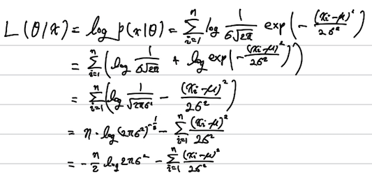
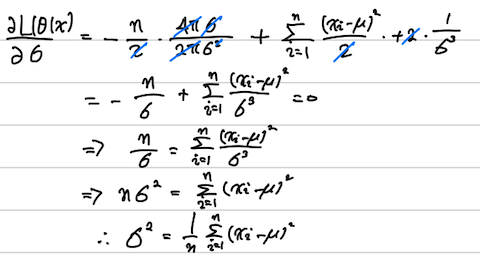
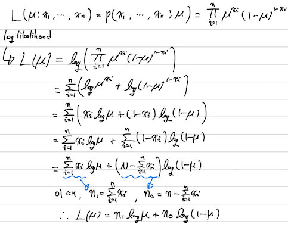

# [선택과제 3] Maximum Likelihood Estimation (MLE)

## TODO 1. 로그의 성질을 가지고 위의 수식을 전개하여 식을 간단히 정리해주세요. 



$$L(\theta|x) = \log P(x|\theta) = \sum_{i=1}^{n}\log\frac{1}{\sigma\sqrt{2\pi}}\exp\left(-\frac{(x_i-\mu)^2}{2\sigma^2}\right) $$

$$= \sum_{i=1}^{n}\left(\log\frac{1}{\sigma\sqrt{2\pi}} + \log\exp\left(-\frac{(x_i-\mu)^2}{2\sigma^2}\right)\right)$$

$$= \sum_{i=1}^{n}\left(\log\frac{1}{\sqrt{2\pi\sigma^2}} -\frac{(x_i-\mu)^2}{2\sigma^2}\right)$$

$$= n\log{{2\pi\sigma^2}}^{-\frac{1}{2}} -\sum_{i=1}^{n}\frac{(x_i-\mu)^2}{2\sigma^2}$$

$$= -\frac{n}{2}\log{2\pi\sigma^2} -\sum_{i=1}^{n}\frac{(x_i-\mu)^2}{2\sigma^2}$$

---
$$\frac{\partial L(\theta|x)}{\partial \mu}
= -\frac{1}{2\sigma^2}\sum_{i=1}^{n}\frac{\partial}{\partial \mu}\left(x_i^2-2x_i\mu+\mu^2\right) $$

## TODO 2. 위의 수식을 전개하여 미분계수가 0이 되게 하는 $\mu$ 값을 구해주세요.


$$\frac{\partial L(\theta|x)}{\partial \mu}
= -\frac{1}{2\sigma^2}\sum_{i=1}^{n}\frac{\partial}{\partial \mu}\left(x_i^2-2x_i\mu+\mu^2\right)$$

$$= -\frac{1}{2\sigma^2}\sum_{i=1}^{n}\left(-2x_i+2\mu\right)$$

$$= -\frac{1}{2\sigma^2}\left(-2\sum_{i=1}^{n}x_i+2n\mu\right)$$

$$= \frac{1}{\sigma^2}\sum_{i=1}^{n}x_i - \frac{1}{\sigma^2}2n\mu = 0$$

$$=> \frac{1}{\sigma^2}2n\mu = \frac{1}{\sigma^2}\sum_{i=1}^{n}x_i$$

$$=> \mu = \frac{1}{n}\sum_{i=1}^{n}x_i$$

---

## TODO 3. 로그가능도 함수 $L$을 $\sigma$로 편미분한 후, 편미분계수가 0이 되게 하는 $\sigma$(또는 $\sigma^2$)를 구하세요.



$$ \frac{\partial L(\theta|x)}{\partial \sigma}  = \frac{\partial}{\partial \mu}\left(-\frac{n}{2}\log2\pi\sigma^2 - \frac{1}{2\sigma^2}\sum_{i=1}^{n}\left(x_i-\mu\right)^2\right)$$ 

$$= -\frac{n}{2}\frac{4\pi\sigma}{2\pi\sigma^2} + \frac{2}{2\sigma^3}\sum_{i=1}^{n}\left(x_i-\mu\right)^2$$ 

$$= -\frac{n}{\sigma} + \frac{1}{\sigma^3}\sum_{i=1}^{n}\left(x_i-\mu\right)^2 = 0$$ 

$$=> \frac{n}{\sigma} = \frac{1}{\sigma^3}\sum_{i=1}^{n}\left(x_i-\mu\right)^2$$

$$=> n\sigma^2 = \sum_{i=1}^{n}\left(x_i-\mu\right)^2$$

$$=> \sigma^2 = \frac{1}{n}\sum_{i=1}^{n}\left(x_i-\mu\right)^2$$

---

## TODO 4. 다음 코드를 실행하기 위해 빈칸을 완성하세요. 

```python
plt.plot(x, norm(loc=-1, scale=1).pdf(x), ls='-.')
plt.plot(x, norm(loc=0, scale=1).pdf(x), ls='--')
plt.plot(x, norm(loc=1, scale=1).pdf(x), ls='-')

print('mu=-1: likelihood at x_0=1 is {:.4f}'.format(p1))
print('mu=0: likelihood at x_0=1 is {:.4f}'.format(p2))
print('mu=1: likelihood at x_0=1 is {:.4f}'.format(p3))
```

---

## TODO 5. 그래프를 그리고 관찰한 사실을 바탕으로 다음의 빈칸의 결과를 기입해주세요.

*   $N(x;μ=−1)$이라는 확률분포에서 $x_0=1$이 나올 가능도(확률밀도)는 **0.0540**이다.
*   $N(x;μ=0)$이라는 확률분포에서 $x_0=1$이 나올 가능도(확률밀도)는 **0.2420**이다.
*   $N(x;μ=1)$이라는 확률분포에서 $x_0=1$이 나올 가능도(확률밀도)는 **0.3989**이다.

---

## Extra Work 베르누이분포의 최대가능도 모수 추정



$$\hat\mu_{\text{MLE}} = \arg \max_{\mu} L(\mu) = n_1\log\mu + n_0\log(1-\mu)$$ 

수식 풀고 하는 일에 대해서는 그래도 꽤 할 만했음.
