# CNN 첫걸음

Convolution 연산과 다양한 차원에서의 연산방법을 소개합니다.

Convolution 연산의 역전파에 대해 설명합니다.

Convolution 연산은 오늘날 굉장히 많은 모델에서 이미지나 영상을 처리하기 위해 사용됩니다. 

지금까지 배웠던 fully connected layer와 비교해서 CNN(Convolutional Neural Network)의 커널 연산이 가지는 장점과, 

Convolution 연산이 다양한 차원에서 어떻게 진행되는지를 이해하시고 넘어가시기 바랍니다.

Convolution 연산의 경우, 커널의 모든 입력데이터에 대해 공통으로 적용이 되기 때문에 역전파를 계산하는 경우에도 똑같이 Convolution 연산이 나오게 됩니다. 

강의에서 그림과 함께 잘 설명되어 있기 때문에 커널을 통해 그레디언트가 어떻게 전달이 되는지, 역전파가 어떻게 이루어지는지 꼭 짚고 넘어가셨으면 좋겠습니다.

## Convolution 연산 이해하기

- 지금까지 배운 다층신경망(MLP)은 각 뉴런들이 선형모델과 활성함수로 모두 연결된 (fully connected) 구조

    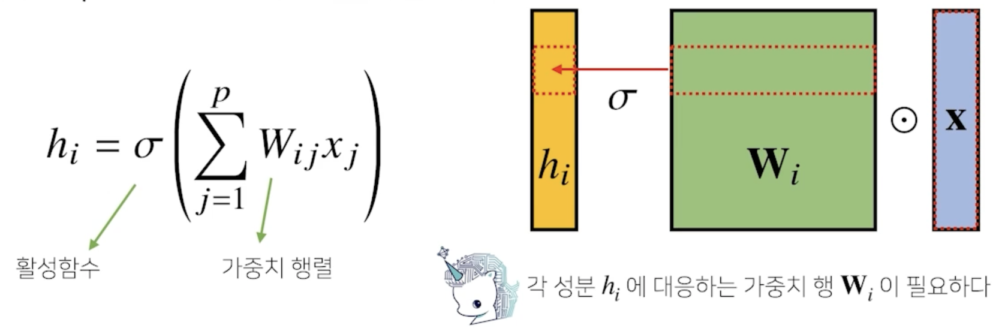

- 만일 i가 바뀌면 사용되는 가중치도 바뀜

- Confolution 연산은 이와 달리 커널(kernel)을 입력벡터 상에서 움직여가면서 선형모델과 합성함수가 적용되는 구조
  
    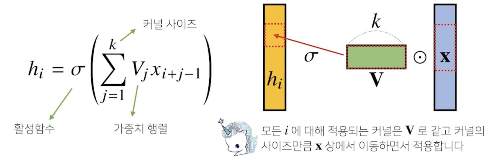

- 만일 i가 바뀌게 되면 활성함수와 커널을 제외하고 컨볼루션 연산이 x 입력 벡터 위에서 움직여가면서 적용된다는 사실이 앞에서 배운 MLP와는 좀 다른 형태
- Convolution 연산도 선형변환에 속함
- 가중치 행렬이 i 에 따라서 바뀌는 것이 아니라 고정된 커널을 움직여가면서 계산
- i 값에 상관없이 kernel 사이즈가 고정된 형태로 공통적으로 적용되기 떄문에 parameter 사이즈를 많이 줄일 수 있음

- Convolution 연산의 수학적인 의미는 신호(signal)를 커널을 이용해 국소적으로 증폭 또는 감소시켜서 정보를 추출 또는 필터링하는 것

    

    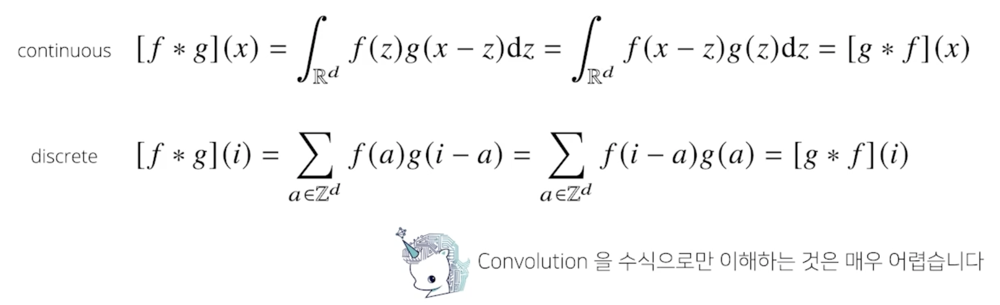

- 전체 공간에서는 +, - 냐가 중요하지 않기 떄문에 convolution이냐 cross-correlation이냐가 사실은 똑같이 성립하게 되는데 저희가 사용하는 컴퓨터에서는 큰 차이가 있음
- 엄밀히 말하자면 cross-correlation 연산을 사용한다

- 커널은 정의역 내에서 움직여도 변하지 않고(translation invariant) 주어진 신호에 국소적(local)으로 적용함

## 다양한 차원에서의 Convolution

- Convolution 연산은 1차원 뿐만 아니라 다양한 차원에서 계산 가능

    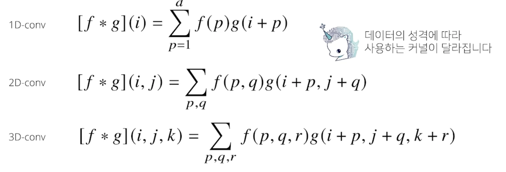

- 여기서 중요한 건 i, j, k 의 위치가 바뀌어도 kernel $f$의 값은 바뀌지 않음

    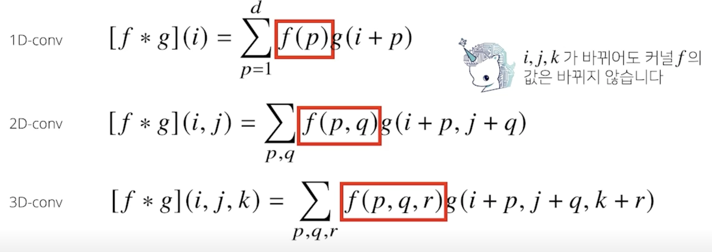

## 2차원 Convolution 연산 이해하기

- 2D-Conv 연산은 이와 달리 커널(kernel)을 입력벡터 상에서 움직여가면서 선형모델과 합성함수가 적용되는 구조

    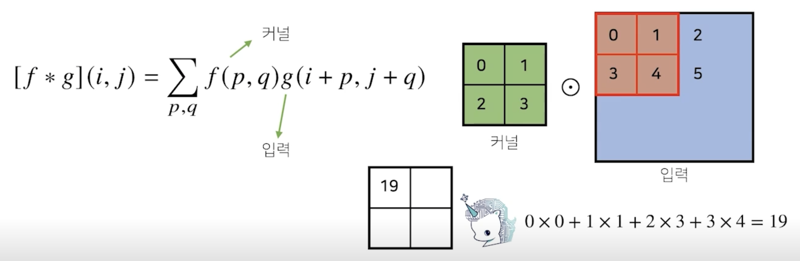

- element wise 곱을 해서 더해줌

    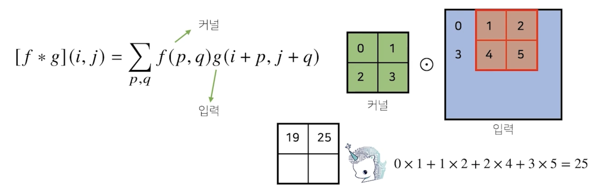

- 커널은 변하지 않고 입력값만 바뀜

- 입력 크기를 ($H$, $W$) 커널 크기를 ($K_H$, $K_W$), 출력 크기를 ($O_H$, $O_W$)라 하면 출력 크기는 다음과 같이 계산

$$ O_H = H - K_H + 1$$
$$ O_W = W - K_W + 1$$

- 가령 28x28 입력을 3x3 커널로 2D-Conv 연산을 하면 26x26이 됨

- 채널이 여러개인 2차원 입력의 경우 2차원 Convolution 을 채널 개수만큼 적용한다고 생각하면 됨
- 텐서를 직육면체 블록으로 이해하면 좀 더 이해하기 쉬움

    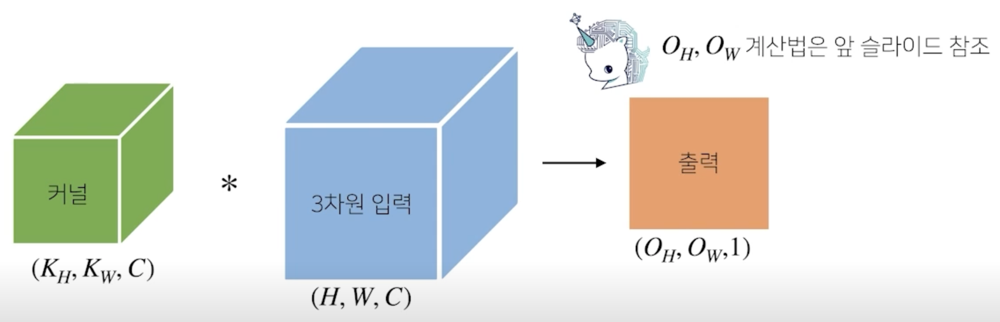

-  출력이 여러개의 채널을 가지게 만들고 싶으면 커널을 많이 만들면 됨
-  input 채널과 output 채널을 조절함으로서 출력의 크기를 조절

    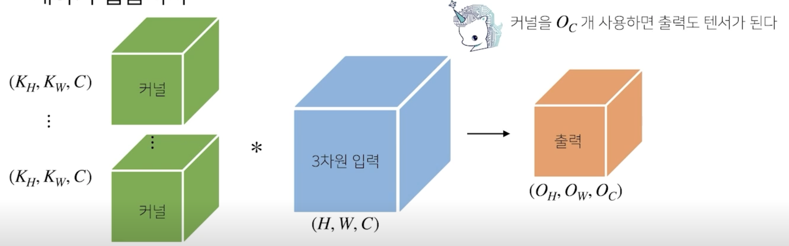

## Convolution 연산의 역전파 이해하기

- Convlution 연산은 커널이 모든 입력데이터에 공통으로 적용되기 때문에 역전파를 계산할 때도 convolution 연산이 나오게 됨
- convolution 연산은 미분을 해도 convolution 연산이 나온다
 
    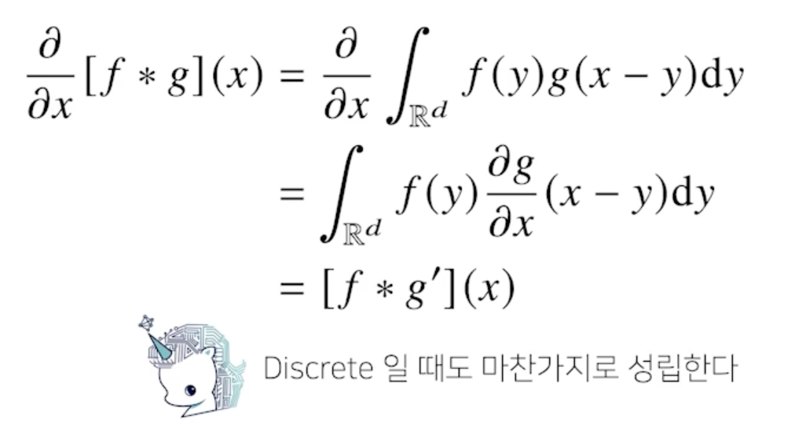

- 예제

    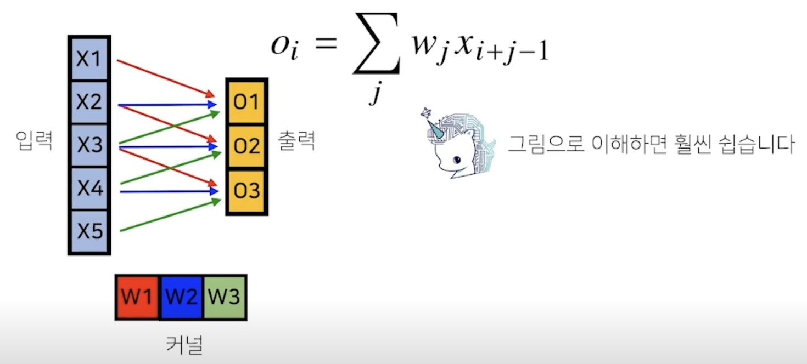

- $\delta_1$, $\delta_2$, $\delta_3$ 은 그레디언트를 의미
- forward propagation 연산을 할 때와 반대로 곱해지는 $w$ 순서가 바뀜

    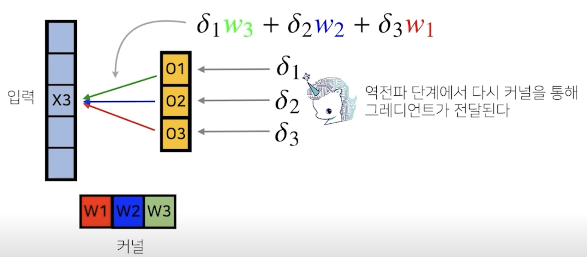

- 커널에는 아래 그림과 같이 전달 됨

    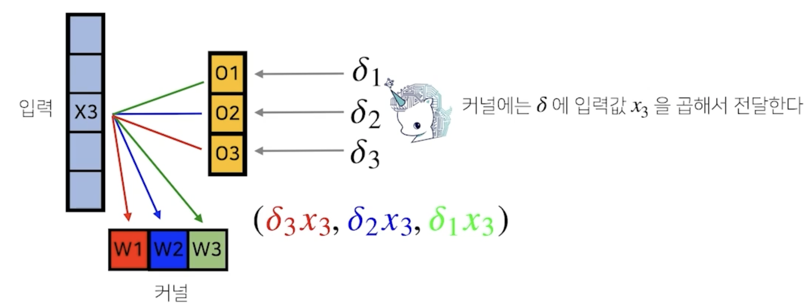

    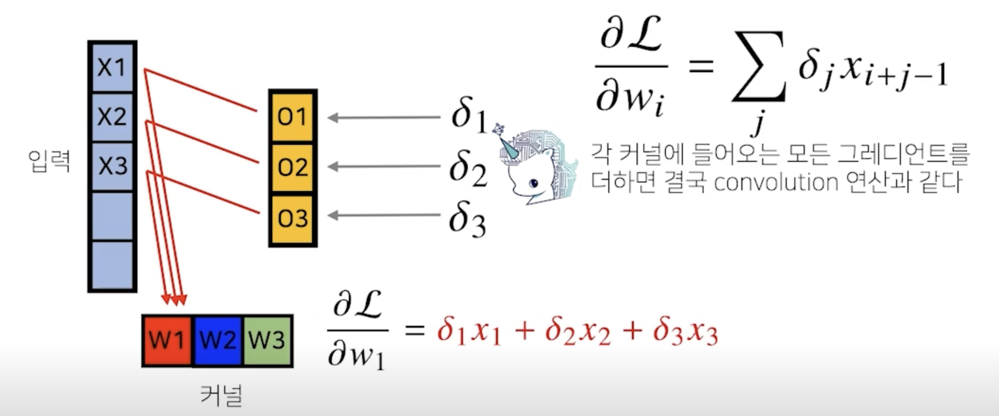
    

