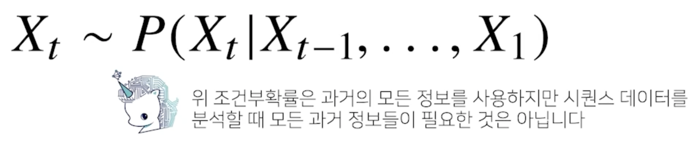
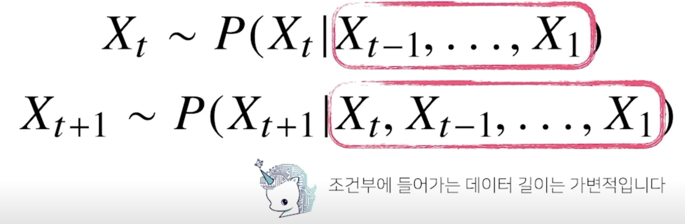
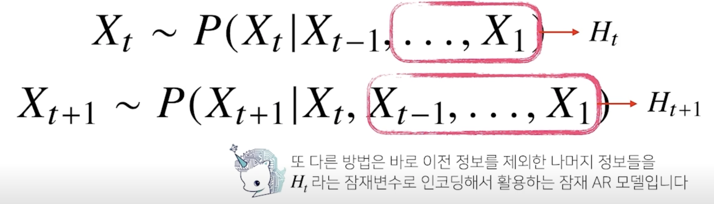
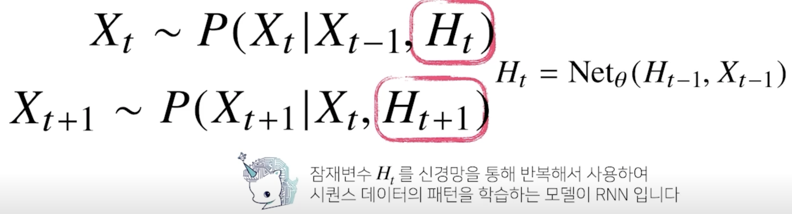
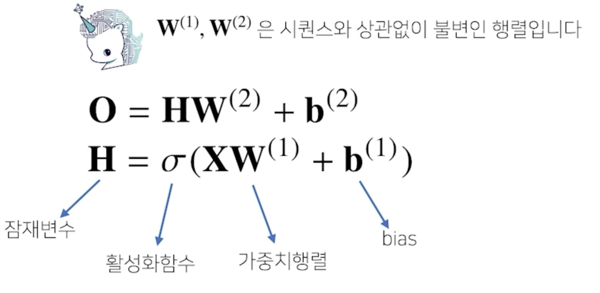
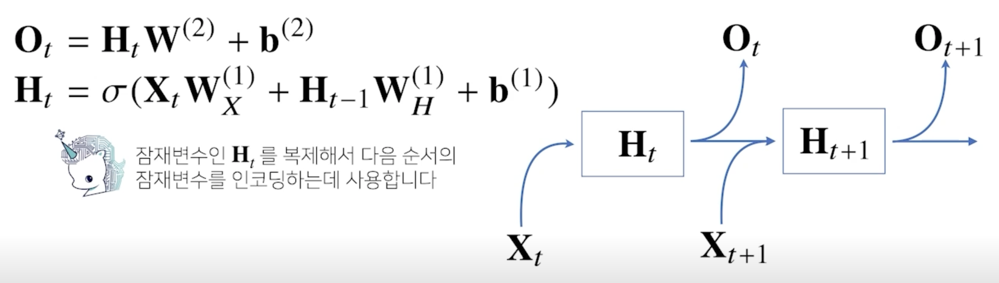
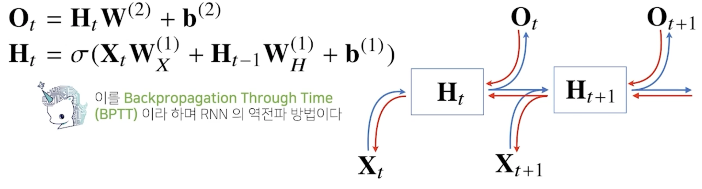
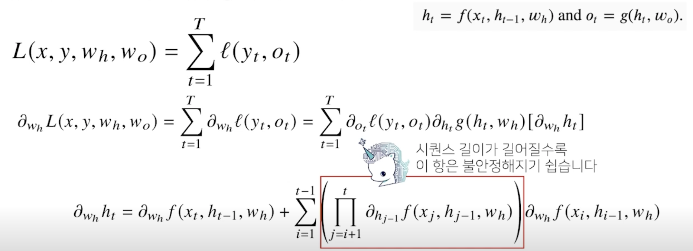

# RNN 첫걸음

시퀀스 데이터의 개념과 특징, 그리고 이를 처리하기 위한 RNN을 소개합니다.

RNN에서의 역전파방법인 BPTT와 기울기 소실문제에 대해 설명합니다.

시퀀스 데이터만이 가지는 특징과 종류, 다루는 방법, 그리고 이를 위한 RNN(Recurrent Neural Network)의 구조를 

앞선 강의에서 배웠던 CNN이나 다른 MLP(Multi Layer Perceptron)와 비교하면서 공부하시면 좋겠습니다.

RNN에서의 역전파 방법인 BPTT(Back Propagation Through Time)를 수식적으로 이해하고, 

여기서 기울기 소실문제가 왜 발생할 수 있는지, 이에 대한 해결책은 어떤 것들이 있는지를 집중해서 보시기 바랍니다.

## 시퀀스 데이터 이해하기

- 소리, 문자열, 주가 등의 데이터를 시퀀스(sequence) 데이터로 분류
- 시계열(time-series) 데이터는 시간 순서에 따라 나열된 데이터로 시퀀스 데이터에 속함
- 시퀀스 데이터는 독립동등분포(i.i.d.) 가정을 잘 위배하기 때문에 순서를 바꾸거나 과거 정보에 손실이 발생하면 데이터의 확률분포도 바뀌게 됨
- 과거 정보 또는 앞뒤 맥락 없이 미래를 예측하거나 문장을 완성하는건 불가능

## 시퀀스 데이터를 어떻게 다루나요?

- 이전 시퀀스의 정보를 가지고 앞으로 발생할 데이터의 확률분포를 다루기 위해 조건부확률을 이용할 수 있음

$$P(X_1, ..., X_t) = P(X_t|X_1, ..., X_{t-1})P(X_1, ..., X_{t-1})$$
$$= P(X_t|X_1, ..., X_{t-1})P(X_{t-1}|X_1, ..., X_{t-2})P(X_1, ..., X_{t-2})$$
$$= \prod_{s=1}^t P(X_s|X_{s-1}, ..., X_1)$$

- $\prod_{s=1}^t$ (파이): 이 기호는 s = 1, ..., t까지 모두 곱하라는 기호 

- 과거의 모든 정보들이 필요한 것은 아님
- 몇개의 과거 정보는 truncation(자르기) 하는 기법도 있음

    

- 시퀀스 데이터를 다루기 위해선 길이가 가변적인 데이터를 다룰 수 있는 모델이 필요

    

- 과거의 모든 데이터가 필요하지 않고 최근 몇년간의 데이터가 필요한 경우에 고정된 길이 $\tau$(타우) 만큼의 시퀀스만 사용하는 경우 AR($\tau$)(Autoregressive Model) 자기회귀모델이라고 부름

- $\tau$ 같은 경우에는 HYPER PARAMETER 모델링을 하기전에 사전에 정해줘야 하는 변수가 되기 때문에 $\tau$를 결정하는데도 사전 지식이 필요할 떄가 가끔씩 있고 문제에 따라서는 $\tau$가 바뀌는 경우도 있음

- 먼 과거의 데이터도 필요할 떄가 있어서 이런 경우에는 어떻게 해야할지 궁금할텐데 이런 경우에 사용할 모델이 RNN의 기본 모형인 latent Autoregressive Model 잠재자기회귀모델이라고 부름

    

- 이 모델의 장점은 과거의 모든 데이터를 활용해서 예측을 할 수 있고 가변적인 데이터 문제를 고정적인 문제로 바꿀수 있음

    

## Recurrent Neural Network 을 이해하기

- 가장 기본적인 RNN 모형은 MLP 와 유사한 모양

    

- 이 위 그림의 모델은 과거의 정보를 다룰 수 없음
    - t 시점의 데이터만 들어오기 때문

- RNN 은 이전 순서의 잠재변수와 현재의 입력을 활용하여 모델링 함
- 입력으로 부터 전달하게 되는 가중치 행렬 $W_{X}^{(1)}$ 과 이전 잠재 변수로부터 정보를 전달받게 되는 가중치 행렬 $W_{H}^{(1)}$ 을 만들게 됨

    

- t 번째 잠재변수는 현재들어온 입력벡터 $X_t$와 이전 시점의 $H_{t-1}$을 받아서 $H_t$를 만들게 됨
- 가중치 행렬이 3개가 나옴
  - 입력 데이터에서 부터 선형모델을 통해서 잠재변수로 인코딩하게 되는 $W_{X}^{(1)}$
  - 이전 시점의 잠재변수로 부터 정보를 받아서 현재 시점의 잠재변수로 인코딩 해주는 $W_{H}^{(1)}$
  - 이렇게 만든 잠재변수를 통해서 다시 출력으로 만들어주는 $W^{(2)}$

- $W_{X}^{(1)}$ 와 $W_{H}^{(1)}$ 와 $W^{(2)}$ 는 t에 따라서 변하지 않는 가중치 행렬
- t에 따라서 변하는 것은 오로지 잠재변수와 입력벡터

- RNN 의 역전파는 잠재변수의 연결그래프에 따라 순차적으로 계산
- 이를 Backpropagation Through Time(BPTT) 이라 하며 RNN 의 역전파 방법

    

- 잠재변수에 들어오는 그레디언트는 벡터는 2개가 들어옴 
  - 다음 시점에서의 잠재변수에서 들어오는 그레디언트 벡터와 출력에서 들어오는 그레디언트 벡터 2개가 전달
  - 이 들어온 그레디언트 벡터를 입력과 그 이전 시점의 잠재변수로 전달
  - 이 과정을 반복

## BTPP를 좀 더 살펴봅시다

- BTPP 를 통해 RNN 의 가중치행렬의 미분을 계산해보면 아래와 같이 미분의 곱으로 이루어진 항이 계산됨

    

- 최종적으로 나오는 빨간색 박스의 프로덕트 텀에서 j=i+1 에서부터 t시점까지의 모든 히든변수(잠재변수)에 대한 미분텀이 곱해지게 되서 더해지게 되는데 시퀀스 길이가 길어질수록 곱해지는 텀들이 불안정해지기 쉬움
- 이 값이 1보다 크게 되면 굉장히 크게 커지게 되고 이 값이 1보다 작게 되면 굉장히 작아지게 됨
- 미분값이 엄청 커지거나 작아지게 됨
- 일반적인 BPTT를 모든 t시점에서 적용하게 되면 RNN 의 학습이 불안정해지기 쉬움

## 기울기 소실의 해결책?

- 시퀀스 길이가 길어지는 경우 BTPP 를 통한 역저나 알고리즘의 계산이 불안정해지므로 길이를 끊는 것이 필요
- 이를 truncated BTPP 라 부름
- 그레디언트를 모든 t시점에 전달하지 않고 특정 블록에서 끊고 그레디언트를 나눠서 전달하는 방식

- 이런 문제들 때문에 Vanilla RNN 은 길이가 긴 시퀀스를 처리하는데 문제가 있음
- 이를 해결하기 위해 등장한 RNN 네트워크가 LSTM 과 GRU 

