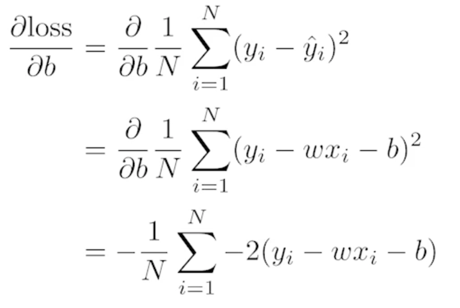
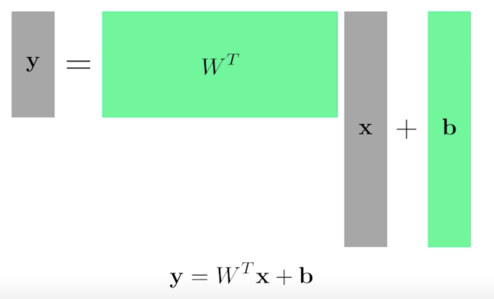
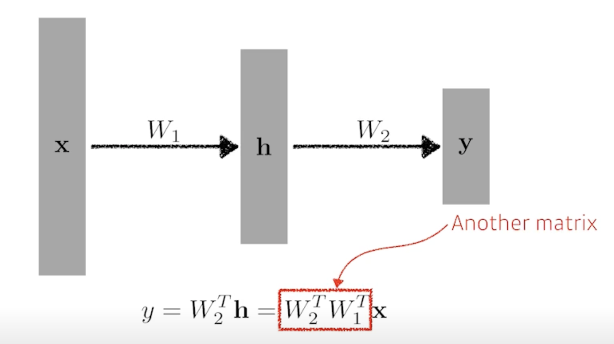
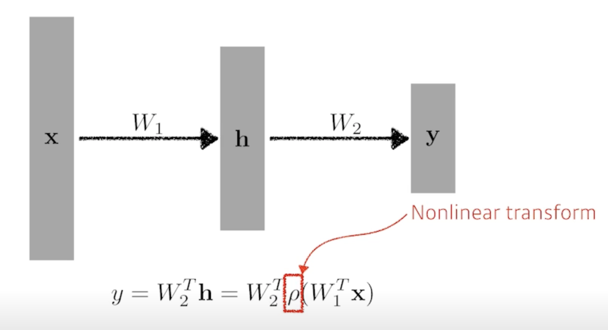
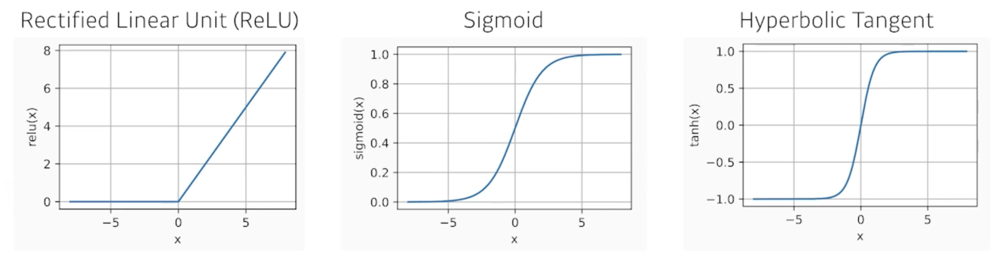
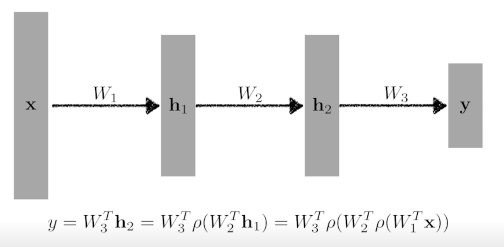
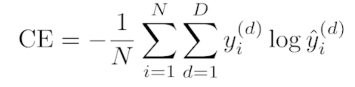

# 뉴럴 네트워크 - MLP (Multi-Layer Perceptron)

## Neural Networks

- "Neural networks are computing systems vaguely inspired by the biological neural networks that consitute animal brains." - wikipedia
- vaguely inspired : 애매하게 영향을 받은
- 인간의 뇌를 모방했기 때문에 잘 된다고 해석하기 보다 그 자체의 모델만 놓고 수학적으로 분석하는 방법이 더 옳다고 생각

- Neural networks are function approximators that stack affine transformations followed by nonlinear transformations.
- 함수를 근사하는 모델
- affine transformations : 행렬 연산
- nonlinear transformations : activation function 이라 불리는 비선형 연산

## Linear Nueral Networks

- Data: $D$ = $\{(x_i, y_i)\}^{N}_{i=1}$
- Model: $\hat y = wx + b$
- Loss: loss = $\frac{1}{N}\sum_{i=1}^{N}(y_i - \hat y_i)^2$
- 어떻게 $w$ 와 $b$를 찾을까?
- We compute the partial derivatives w.r.t. the optimization variables.

    

    

- Then, we iteratively update the optimization variables.
  
    

- $\eta$ : Stepsize
  - $\eta$가 너무 크게되면 학습이 안됨
  - 적절한 Stepsize를 정하는게 중요

- Of course, we can handle multi demensional input and output

    

- 두 개의 벡터스페이스 사이의 선형변환을 찾겠다

## Beyond Linear Neural Networks

- What if we stack more?

    

    - 이 과정은 한개 층과 다를게 없음

- We need nonlinearity.

    

    - 네트워크가 표현할 수 있는 표현력을 극대화하기 위해서는 선형결합을 N번 반복하는게 아니라 Activation function을 이용해서 nonlinear transform 을 거치고 그렇게 얻어진 feature vector를 다시 선형변환을하고 nonlinear transform을 하고 이 과정을 N번 반복하면 더 많은 표현력을 가지게 됨

- Activation functions

    

    - 어떤게 좋을지는 아무도 모름

- 뉴럴 네트워크가 왜 잘 되냐?
  - 인간의 뇌를 모방했기 때문
  - 히든레이어가 하나 있는 뉴럴네트워크는 어떤 대부분의 continuous 하고 measurable 한 function을 근사할 수 있음
  - **Caution**: It only guarantees the existence of such networks.
    - 이런 걸 만족하는 뉴럴네트워크는 세상 어딘가에 있다는것을 말해주지 우리가 학습한 뉴럴 네트워크가 그런 성질을 가질거라고 말하면 안됨

## Multi-Layer Perceptron

- This class of architectures are often called multi-layer perceptrons.
- Of course, it can go deeper.

    

- What about the loss functions?
  - Regression Task

    

  - Classification Task

    

  - Probabilistic Task

    
