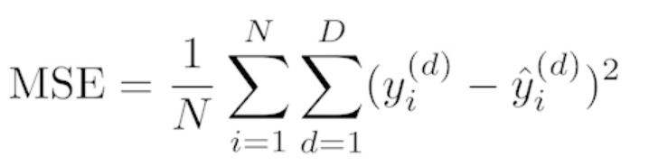
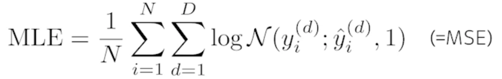

# 딥러닝 기본 용어 설명 - Historical Review

## Instroduction

- Disclaimer
  - 딥러닝이라고 불리는 분야는 한 사람이 짧은 시간동안 다루기에는 너무나 많은 다양한 주제가 있음

- What make you ad good deep learner?
  - 구현실력
  - Math Skill(Linear Algebra, Probability)
  - 현재(최근)에 어떤 논문들이 나오는지 이해하고 알고 있는지

- 인공지능의 정의
  - 사람의 지능을 모방하는 것
  - 딥러닝만 지능을 모방하는건 아님

- Key Components of Deep Learning
  - 데이터 : The **data** that the model can learn from
  - 모델 : The **model** how to transform the data
  - 손실함수 : The **loss** function that quantifies the badness of the model
  - 알고릴즘 : The **algorithm** to adjust the parameters to minimize the loss

## Data

- Data depend on the type of the problem to solve
  - 데이터는 풀고자 하는 문제에 의존
  

## Model

- 이미지가 주어지거나, 텍스트 문장, 단어가 주어졌을 때 이러한 단어를 내가 직접적으로 알고 싶어하는 class label이 되었든 아니면 문장에대한 sentimental analysis 가 되었든 이런 것들을 바꿔주는 모델

- 같은 태스크가 주어졌더라도 모델에 성질에 따라서 좋은 결과가 나올 수도 있고 안좋은 결과가 나올수도 있음

    

# Loss

- The **loss** function is a proxy of what we want to achieve
- Loss function은 우리가 이루고자 하는것의 근사치

- 모델이 정해져있고 데이터가 정해져있을 때 모델을 어떻게 학습할지 입니다.
- 회귀문제를 푼다고 하면 MSE

    

- 분류문제를 푼다고 하면 Cross Entropy

    

- 확률적인 모델을 활용해서 출력값이 어떤 값이아니라 그 값의 대한 평균값과 분산 가우시안으로 모델링 한다고 했을 때 MLE(Maximum Likelihood Estimation) 관점으로 문제를 풀 수 있음

    

- 이 Loss function 을 왜 사용하고 이 Loss 가 줄어드는 것이 우리가 진짜 풀고자 하는 문제를 어떻게 푸는지를 이해하는것이 중요!!

## Optimization Algorithm

- 최적화 방법은 데이터가 정해져있고, 모델이 정해져있고, Loss function이 정해져있을 때 네트워크를 어떻게 줄일지에 대한 내용
- 우리의 목적은 모델이 학습하지 않은 데이터에서 잘 동작하는게 목적이기 때문에 Dropout, Early stopping, k-fold validation, Weight decay, Batch normalization, MixUp, Ensemble, Bayesian Optimization 등에 대해서 배울 예정

## Historical Review

- 2012 - AlexNet
  - Convolution network
  - ImageNet 대회에서 딥러닝을 이용해 1등

- 2013 - DQN
  - Q-learning 이라는 강화학습 방법을 이용
  - 오늘날의 딥마인드가 있게한 논문

- 2014 - Encoder / Decoder
  - NMT(Neural Machine Translation) 문제를 풀기위한 것
  - seq2seq 모델

- 2014 - Adam Optimizer
  - Adam의 결과는 왠만하면 잘 된다

- 2015 - Generative Adversarial Network
  - 이안 굿 펠로우가 쓴 논문
  - 이미지를 어떻게 만들어 낼 수 있을지
  - 텍스트를 어떻게 만들어 낼 수 있을지

- 2015 - Residual Networks
  - 딥러닝이 왜 딥러닝이냐? 네트워크를 깊게 쌓았기 때문
  - 레이어를 깊게 쌓으면 학습이 잘 안된다는 말이 있었음
  - Training error 는 굉장히 작아지지만 test 데이터에 적용하면 성능이 안좋음
  - Res-net이 나온 이후에는 트렌드가 바뀜
  - 깊게 쌓아도 성능이 잘 나올 수 있음을 보여줌

- 2017 - Transformer
  - Attention Is All You Need
  - RNN 구조를 대체하고 있고 vision 까지 넘보고 있음

- 2018 - BERT(**B**idirectional **E**ncoder **R**epresentations from **T**ransformers) (fine-tuned NLP models)
  - NLP 모델은 language model 을 학습하는데 쉽게말하면 이전의 단어가 주어졌을 때 다음에 어떤 단어가 나올지를 맞추는 문제
  - fine-tuned 모델은 굉장히 다양한 단어 혹은 위키피디아와 같은 큰 말뭉치를 활용해서 pre-train을 하고 그 다음에 내가 풀고자 하는 소수의 문제에 fine-tuning을 하는것

- 2019 - BIG Language Models
  - GPT-3
  - 굉장히 많은 parameter로 되어있음 (1750억개)
  
- 2020 - Self Supervised Learning
  - SimCLR : a simple framework for contrastive learning of visual representations
  - 대표적인 구글의 논문
  - 학습데이터 외 라벨을 모르는 데이터를 사용하겠다는 아이디어
  - 도메인 지식을 활용해서 학습데이터를 만들겠다는 아이디어도 많이 연구되고 있음
