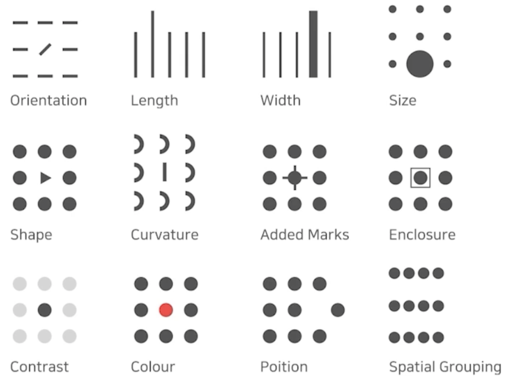

# 시각화의 요소

## 1. 데이터 이해하기

### 1.1 '데이터' 시각화

- 데이터 시각화를 위해서는 **데이터**가 우선적으로 필요
- 
- 시각화를 진행할 데이터
  - 데이터셋 관점(global)
    - 전체 데이터의 대한 구성
  - 개별 데이터의 관점(local)
    - 개별 데이터의 대한 정보

### 1.2 데이터셋의 종류

- 수많은 데이터셋
  - 정형 데이터
    - 테이블 형태로 제공되는 데이터
    - 일반적으로 csv, tsv 파일로 제공
    - Row가 데이터 개 **item**
    - Column은 **attribute(feature)**
    - 가장 쉽게 시각화 할 수 있는 데이터셋
      - 통계적 특성과 feature 사이 관계
      - 데이터간 관계
      - 데이터간 비교
      
  - 시계열 데이터
    - 시간 흐름에 따른 데이터를 Time-Series라고도 부름
    - 기온, 주가 등 정형데이터와 음성, 비디오와 같은 비정형 데이터 존재
    - 시간 흐름에 따른 **추세(Trend), 계절성(Seasonality), 주기성(Cycle)**등을 살핌
  
  - 지리 데이터
    - 지도 정보와 보고자 하는 정보 간의 조화 중요 + 지도 정보를 단순화 시키는 경우도 존재
    - 거리, 경로, 분포 등 다양한 실사용
    - 정형데이터 시각화와는 다르게 실제로 어떻게 사용할 수 있을지가 중요
    - 거리정보가 중요하기 때문에 지도를 표현하는 방식, 위도, 경도와 정보들도 추가적으로 학습 필요
  
  - 관계형(네트워크) 데이터
    - 객체와 객체 간의 관계를 시각화
      - Graph Visualization / Network Visualization
    - 객체는 Node(정점)로, 관계는 Link로 표현
    - 크기, 색, 수 등으로 객체와 관계의 가중치를 표현
    - 휴리스틱하게 노드 배치를 구성
    - 지리 데이터도 관계형 데이터로 바꿀 수 있고 정형데이터에서도 관계가 있다면 관계형 데이터로 바꿀 수 있음
  
  - 계층적 데이터
    - 관계 중에서도 포함관계가 분명한 데이터
      - 네트워크 시각화로도 표현 가능
    - Tree, Treemap, Sunburst 등이 대표적
  
  - 다양한 비정형 데이터

### 1.3 데이터의 종류

- 데이터의 종류는 다양하게 분류 가능
- 대표적으로는 4가지로 분류
  - 수치형(numerical)
    - 연속형 (continuous) : 길이, 무게, 온도 등
    - 이산형 (discrete) : 주사위 눈금, 사람 수 등

  - 범주형(categorical)
    - 명목형 (nominal) : 혈액형, 종교 등
    - 순서형 (ordinal) : 학년, 별점, 등급 등

## 2. 시각화 이해하기

### 2.1 마크와 채널

- A **mark** is a basic graphical element in an image
  - 점, 선, 면으로 이루어진 데이터 시각화

- A visual **channel** is a way to control the appearance of marks, independent of the dimensionality of the geometric primitive.
  -  각 마크를 변경할 수 있는 요소들

## 2.2 전주의적 속성

- Pre-attentive Attribute
- 주의를 주지 않아도 인지하게 되는 요소
  - 시각적으로 다양한 전주의적 속성이 존재

- 동시에 사용하면 인지가 어려움
  - 적절하게 사용할 때, 시각적 분리(**visual pop-out**)

