# Optimization

- 용어들의 명확한 컨셉을 갖고 넘어가는게 중요!

## Gradient Descent (경사하강법)

- First-order iterative optimization algorithm for finding a local minimum of a differentiable function
- 1차 미분 값 사용
- 반복적으로 최적화 시키고
- 로컬 미니멈으로 갈 수밖에 없음, local minimum 을 찾는게 목적

## 1. Important Concepts in Optimization (최적화의 중요한 컨셉)

- Generalization
- Under-fitting vs. over-fitting
- Cross validation
- Bias-variance tradeoff
- Bootstrapping
- Bagging and boosting

### 1.1 Generalization

- How well the learned model will behave on unseen data.
- 일반화 성능을 높이는게 목적

    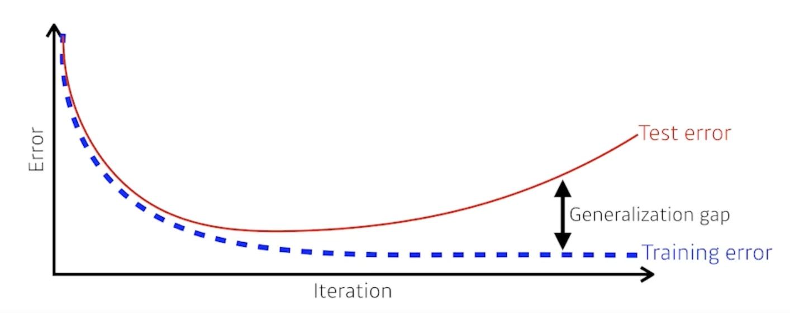

- 일반화 성능이 좋다의 의미는?
  - 이 네트워크의 성능이 학습데이터와 비슷하게 나올거다라고 보장
  - 하지만, 학습데이터의 성능이 좋지 않은데 일반화 성능이 좋다고해서 테스트데이터의 성능이 좋다고 말할 수 없음

### 1.2 Underfitting vs. Overfitting

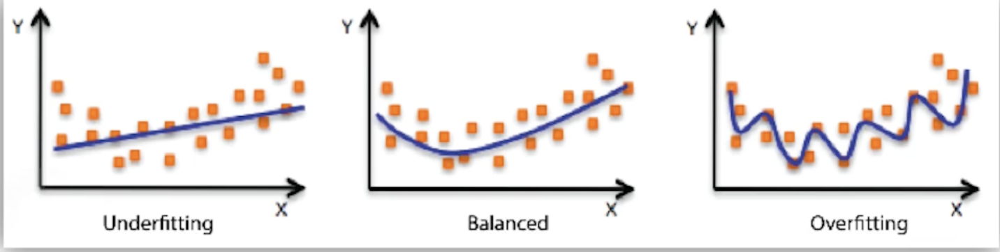

- Overfitting : 학습데이터에서는 잘 동작하지만 테스트데이터에서는 잘 동작하지 않는 현상
- Underfitting : 네트워크가 너무 간단하거나 학습을 너무 조금시켜서 학습데이터도 잘 못맞추는 현상
- Balanced : Overfitting 과 Underfitting 의 중간

### 1.3 Cross-validation

- Cross-validation is a model validation technique for assessing how the model will generalize to an independent (test) data set.
- 일반적으로 train data 와 validation data 를 나눠서 학습을 진행
- train data 로 학습된 모델이 학습에 사용되지 않은 validation data 에 대해 얼마나 잘 작동하는지를 보는 것
- 어떨 때 쓰는가?
  - 뉴럴 네트워크를 학습하는데 있어서 내가 정하는 값 HYPER PARAMETER(learning_rate, loss_function 등) 가 존재
  - cross-validation 을 통해서 최적의 HYPER PARAMETER 를 찾고 그 다음에 HYPER PARAMETER 를 고정한 상태에서 학습할 때는 모든 데이터를 사용해서 진행
- test data 는 학습에 어떤 방법으로든 사용되선 안됨

### 1.4 Bias and Variance

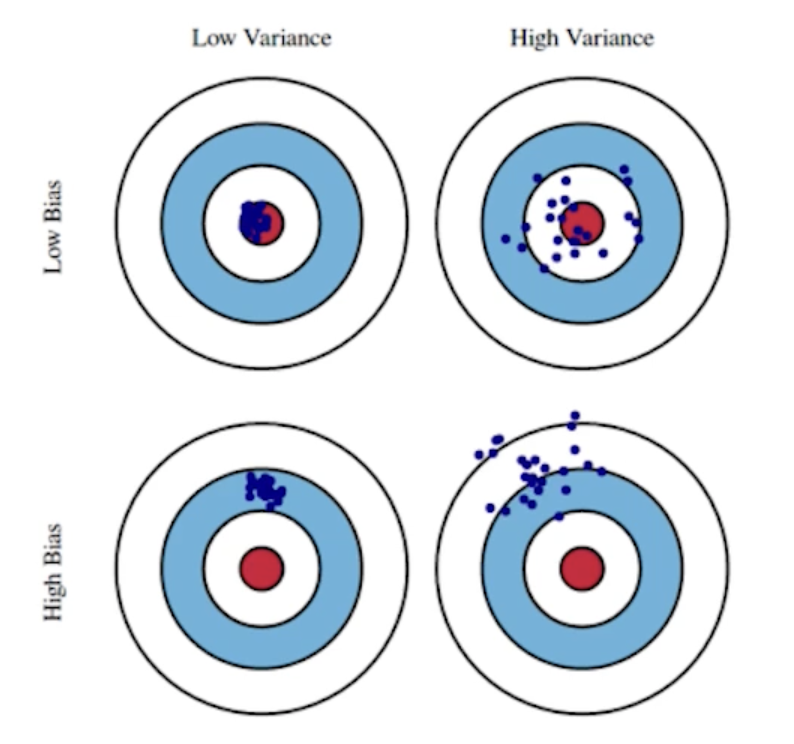

- Variance : 어떤 비슷한 입력을 넣었을 때 출력이 얼마나 일관적으로 나오는지
- Bias : 비슷한 입력에 대해서 출력이 많이 분산되더라도 True Target에 접근하게 되면 Bias가 낮다고 함

### 1.5 Bias and Variance Trade off

- 학습데이터에 노이즈가 껴있다고 가정했을 때, 내가 이 노이즈가 껴있는 학습데이터를 minimize 하는 것은 3가지 파트로 나뉠 수 있음
- 내가 minimize 하는 값은 한가지 값인데 이 값이 사실은 3가지 component 로 이루어져 있어서 이 3개 중에 각각을 minimize 하는게 아니라 하나가 줄어들면 하나가 커질 수 밖에 없다는것을 의미

    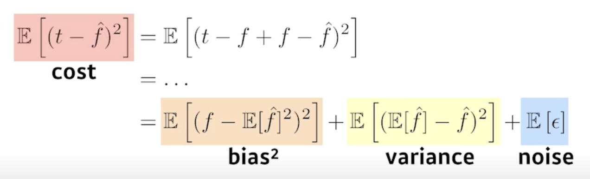

- 모델 특성이 Bias를 많이 줄이게 되면 Variance 가 높아질 가능성이 크고 Variance 를 줄이면 Bias 가 높아질 가능성이 큼

### 1.6 Bootstrapping

- Bootstrapping is any test or metric that uses random sampling with replacement
- 학습데이터가 100개가 있으면 이 학습데이터 중에서 몇개만 활용을 하겠다.
- 100개중에서 80개씩 활용한 모델을 여러개 만들 수 있을텐데
- 이렇게 여러개의 모델이 있을 때 하나의 입력에 대해서 각각의 모델이 하나의 값을 예측할 수도 있지만 다른 값을 예측할수도 있을 것
- 이 모델들이 예측하는 값들의 consensus 얼마나 일치를 이루는지를 보고 전체적인 모델의 uncertainty(불확실성)을 예측하고자 하는 이럴 때 사용

### 1.7 Bagging vs. Boosting

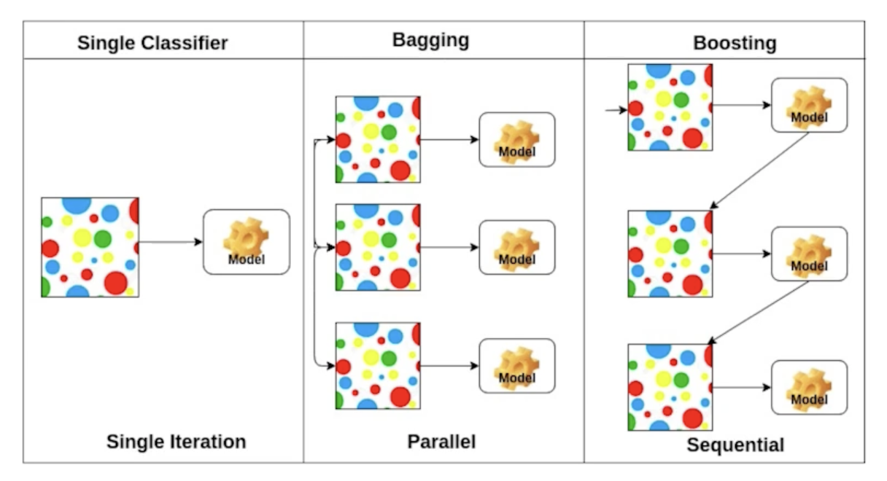

#### 1.7.1 Bagging (**B**ootstrapping **agg**regat**ing**)

- Multiple models are being trained with bootstrapping.
- ex) Base classifiers are fitted on random subset where individual predictions are aggregated (voting or averaging).

- 학습데이터를 여러개로 만들어 여러 모델을 만들고 여러 모델의 아웃풋을 가지고 평균을 내겠다
- 앙상블이라고 불리기도 함
- 학습데이터 전체를 사용해서 만든 한개의 모델보다 80% 정도만 쓴 모델 여러개를 만들어서 나오는 아웃풋의 평균을 사용하는게 성능이 더 좋음

#### 1.7.2 Boosting

- It focuses on those specific training samples that are hard to classify.
- A strong model is built by combining weak learners in sequence where each learner learns from the mistakes of the previous weak learner.

- 학습데이터가 100개가 있을 때 모델을 간단하게 만들고 돌려보면 80개에 대해서는 잘 예측하고 20개에 대해서는 잘 예측을 못하는 경우 2번째 모델을 또 만들고 20개의 잘 예측을 못한 데이터에 대해서 잘 동작하는 모델을 만드는 것
- 이렇게해서 여러개의 모델을 만들어서 이 모델을 합치는 것
- 하나하나의 모델(weak learner)을 시퀀스하게 합쳐서 하나의 strong learner 를 만드는 것

## 2. Practical Gradient Descent Methods

- Stochastic gradient descent
  - Update with the gradient computed from a single sample.
  - 하나의 샘플로 그레디언트를 계산해서 업데이트 하는 것

- Mini-batch gradient descent
  - Update with the gradient computed from a subset of data.
  - 배치사이즈의 데이터로 그레디언트를 계산해서 업데이트 하는 것

- Batch gradient descent
  - Update with the gradient computed from the whole data.
  - 데이터 전체를 사용해서 그레디언트를 계산해서 업데이트 하는 것

### 2.1 Batch-size Matters

- 배치사이즈가 굉장히 중요!!
- 증거를 발견했다.
- 큰 배치사이즈를 활용하게 되면 날카로운 미니마이저에 도달
- 작은 배치사이즈를 활용하게 되면 평평한 미니마이저에 도달
- sharp minimizer 보다 flat minimizer 에 도달하는게 더 좋다
    
    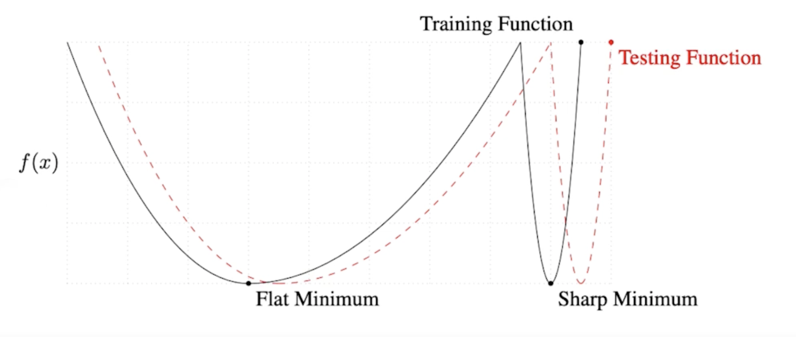

- Flat minimizer 인 경우엔 학습에서 잘 동작하면 테스트에서도 잘 동작한다
  - 일반화 성능이 높음
- Shapr minimizer 인 경우엔 Training Function 에서 local minimum에 도달했어도 Testing Function에서는 약간만 벌어져 있어도 Testing Function 에서는 굉장히 높은 값이 나옴
  - 일반화 성능이 떨어짐

### 2.2 Gradient Descent Methods

- Stochastic gradient descent
- Momentum
- Nesterov accelerated gradient
- Adagrad
- Adadelta
- RMSprop
- Adam

- 알아서 해주지만 우리는 골라서 사용해야 함

#### 2.2.1 (Stochastic) Gradient descent

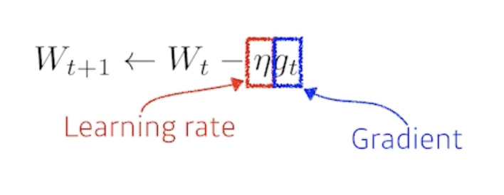

- 딥러닝 프레임워크가 기본적으로 해주는것은 그레디언트를 계산해줌 $g_t$
- 가장 큰 문제는 learning_rate(stepsize)를 잡는게 너무 어려움
  
#### 2.2.2 Momentum

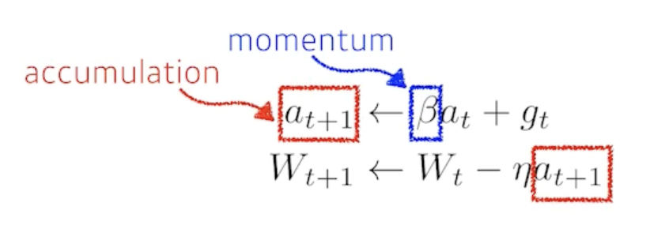

- 이전 배치에서의 그레디언트 방향을 활용해보자
- 한번 흘러가기 시작한 그레디언트 방향을 어느정도 유지시켜주기 때문에 그레디언트가 굉장히 왔다갔다해도 굉장히 잘 학습하게 됨

#### 2.2.3 Nesterov Accelerated Gradient

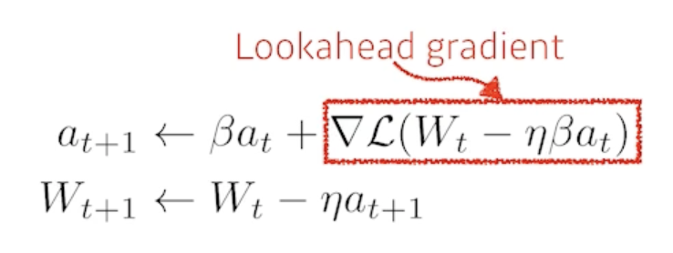

- a 라고 불리는 현재 정보가 있으면 그 방향으로 한번 가보고 그 간 곳에서 그레디언트를 계산한 것을 가지고 accumulation 하는 것
- local minimize 에 더 빨리 converge 하는 효과가 생김

#### 2.2.4 Adagrad

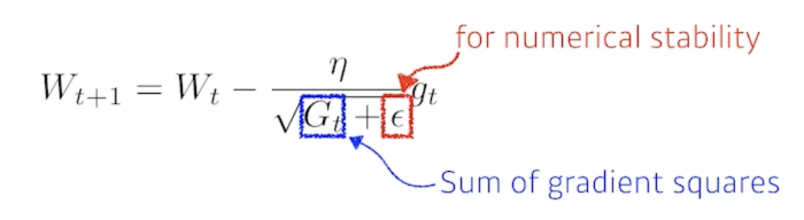

- Adagrad adapts the learning rate, performing larger updates for infrequent and smaller updates for frequent parameters.
- 뉴럴네트워크의 파라미터가 많이 변화된 파라미터는 더 적게 변화시키고 안변한 파라미터는 많이 변화시킴
- 지금까지 그레디언트가 얼마나 변했는지를 저장하는 $G_t$ 
- 가장 큰 문제는?
  - $G_t$가 계속 커지기 때문에 무한대로 가게 되면 분모가 무한대니까 $W$가 업데이트가 안됨
  - 뒤로 가면 갈수록 학습이 점점 멈추는 현상

#### 2.2.5 Adadelta

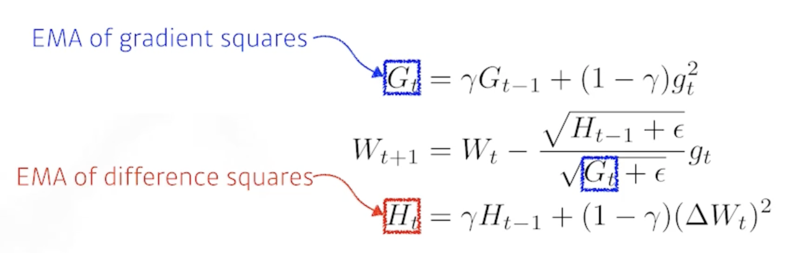

- Adadelta extends Adagrad to reduce its monotonically decreasing the learning rate by restricting the accumulation window.
- Adagrad가 가지는 $G_t$가 계속해서 커지는 현상을 막겠다
- 타입 스텝 t가 주어졌을 때 어느정도 윈도우 만큼의 파라미터 시간에 대한 그레디언트 제곱의 변화를 보겠다.
- 문제가 있음 윈도우가 100이라면 이전 100개 동안의 G를 들고 있어야함
- exponential moving average를 이용해서 $G_t$를 업데이트
- 가장 큰 특징은 learning_rate 가 없음
- 잘 활용되지 않음

#### 2.2.6 RMSprop

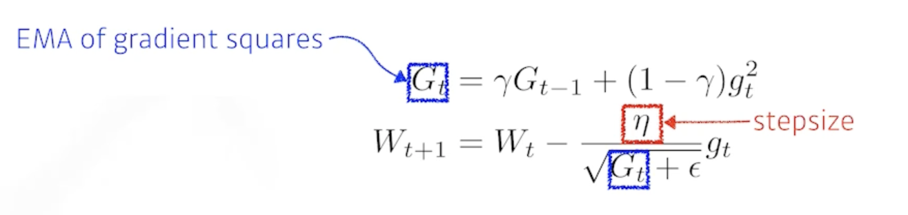

- RMSprop is an unpublished, adaptive learning rate method proposed by Geoff Hinton in his lecture.
- RMSprop을 사용하면 잘 됐다.

#### 2.2.7 Adam

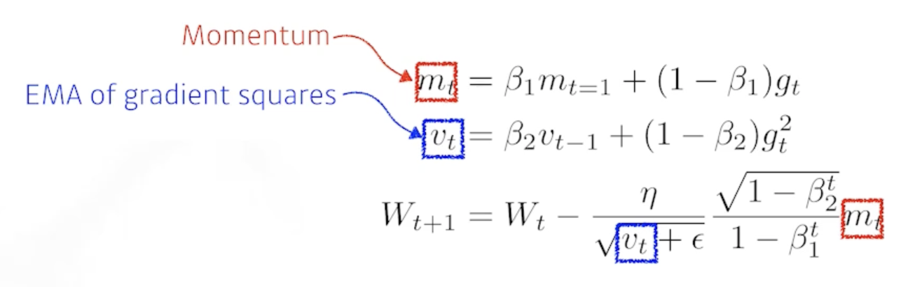

- Adaptive Moment Estimation (Adam) leverages both past gradients and squared gradients
- 그레디언트의 크기가 변함에 따라서 adaptive 하게 learning_rate를 바꾸는 것과 이전의 그레디언트 정보를 해당하는 모멘텀 2개를 잘 합친게 Adam
- $m_t$ : Momentum
- $v_t$ : EMA of gradient squares
- $\beta_1$ : 얼마나 momentum을 유지시킬 것인가
- $\beta_2$ : gradient squares의 대한 EMA 정보
- $\eta$ : learning_rate
- $\epsilon$ : 분모가 0이 되지 않게 하는 값인데 이 값을 잘 바꾸는게 중요

## 3. Regularization

- Early stopping
- Parameter norm penalty
- Data augmentation
- Noise robustness
- Label smoothing
- Dropout
- Batch normalization

### 3.1 Early Stopping

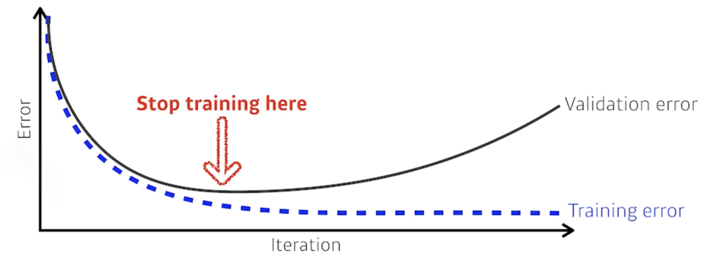

- 학습을 멈추는 것
- 일반적으로 validation_error 을 활용
- validation_erorr 가 커질 때 멈춤
- 추가적인 validation 데이터가 필요

### 3.2 Parameter Norm Penalty

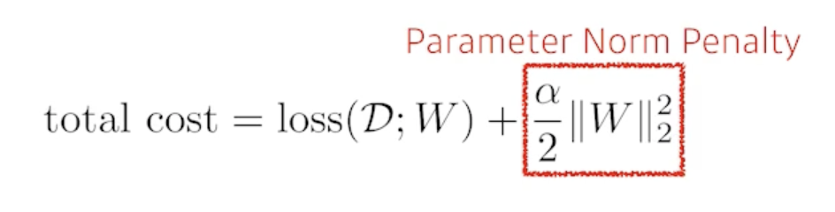

- It adds smoothness to the function space.
- 뉴럴네트워크 파라미터가 너무 커지지 않게 하는 것
- 이왕이면 네트워크의 웨이트의 숫자들이 크기 관점에서 작으면 작을수록 좋다
- 부드러운 함수일수록 일반화 성능이 높을거다라는 가정을 가짐

### 3.3 Data Augmentation

- More data are always welcomed
    
    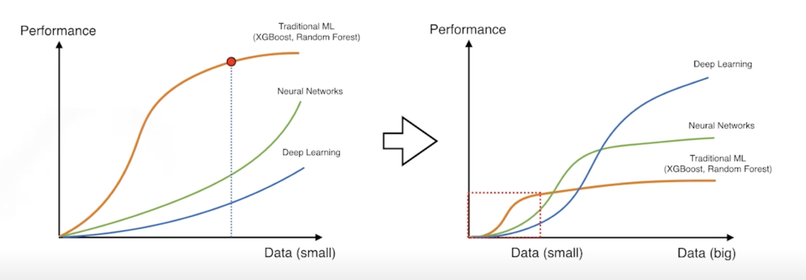

- 데이터가 많으면 많을 수록 좋은데 뉴럴네트워크는 굉장히 많은 데이터도 다 표현할 능력이 됨
- 문제는 데이터가 한정적이다
- However, in most cases, training data are given in advance.
- In such cases, we need data augmentation
- 데이터의 라벨이 바뀌지 않는 한도내에서 변화시키는 것을 data augmentation 이라고 함

### 3.4 Noise Robustness

- Add random noises inputs or weights.
- 왜 잘되는지에 대해서는 아직도 의문이 있음
- 입력데이터에 노이즈를 집어 넣는 것
- 단순히 입력에만 노이즈를 집어넣는 것이 아니라 웨이트에도 집어넣음

### 3.5 Label Smoothing

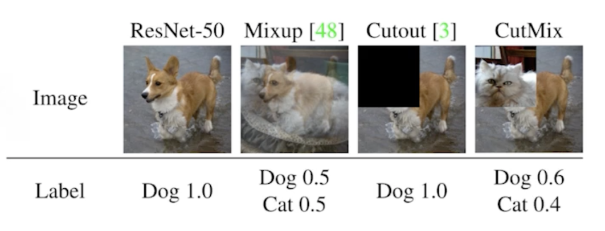

- Mix-up constructs augmented training examples by mixing both input and output of two randomly selected training data.
- 데이터 2개를 뽑아서 이 2개를 섞어주는 것
- CutMix constructs augmented training examples by mixing inputs with cut and paste and outputs with soft labels of two randomly selected training data.
- 라벨을 섞어 버림

### 3.6 Dropout

- In each forward pass, randomly set some neurons to zero
- 뉴럴 네트워크의 웨이트를 0으로 바꾸는 것
- 쓰면 성능이 올라가는 효과가 생김

### 3.7 Batch Normalization

- Batch normalization compute the empirical mean and variance independently for each dimension (layers) and normalize
- 내가 적용할 레이어에 statistics를 정규화 시키는 것
- 논란이 있으나
- 일반적으로 성능이 올라가게 됨
- There are different variances of normalizations
    
    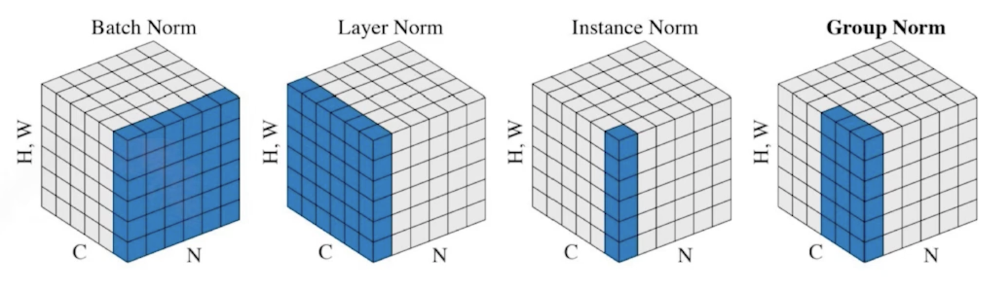

- 간단한 분류문제를 푸는 것에 있어서는 사용하면 성능을 올릴 수 있음