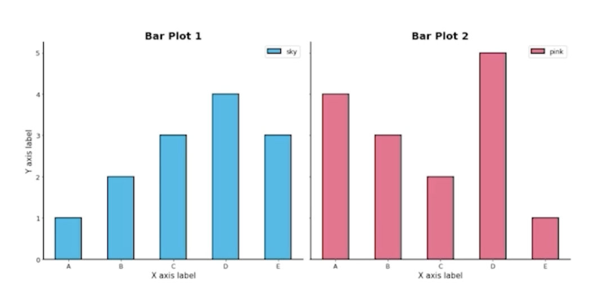
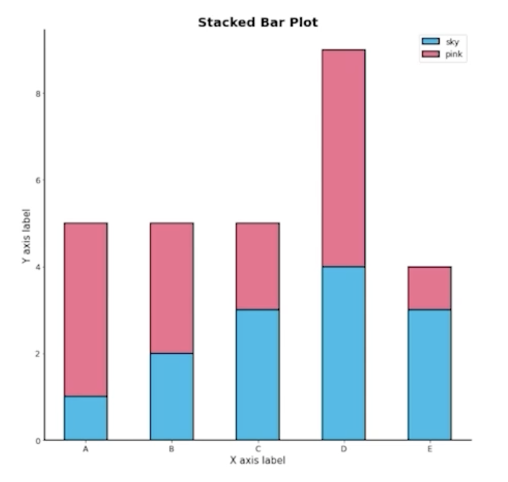
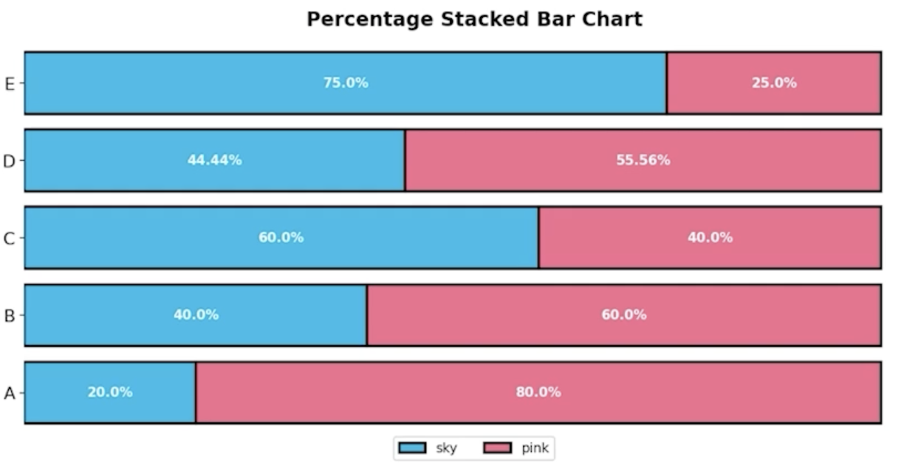

# Bar Plot 사용하기

## 1. 기본 Bar plot

### 1.1 Bar Plot 이란?

- Bar plot 이란 직사각형 막대를 사용하여 데이터의 값을 표현하는 차트/그래프
- 막대 그래프, bar chart, bar graph 등의 이름으로 사용됨
- 범주(category)에 따른 수치 값을 비교하기에 적합한 ㅂ아법
  - 개별 비교, 그룹 비교 모두 적합

- 막대의 방향에 따른 분류 (.bar() / .barh())
  - 수직 (vertical) : x 축에 범주, y 축에 값을 표기 (default)
  - 수평 (horizontal) : y 축에 범주, x 축에 값을 표기 (범주가 많을 때 적합)

## 2. 다양한 Bar Plot

### 2.0 Raw Data

- 임의의 그룹데이터를 시각화해보자
  - A, B, C, D, E 데이터가 2 그룹에 존재
  - Group Sky : [1, 2, 3, 4, 3]
  - Group Pink : [4, 3, 2, 5, 1]
- 이 두 데이터를 비교하기 위해서 어떤 방법을 쓸 수 있을까?

### 2.1 Multiple Bar Plot

- Bar Plot 에서는 범주에 대해 각 값을 표현 -> 즉 1개의 feature에 대해서만 보여줌
- 여러 Group 을 보여주기 위해서는 여러가지 방법이 필요

1. 플롯을 여러 개 그리는 방법
    
    

3. 한 개의 플롯에 동시에 나타내는 방법 - 비교에 더 ㅎ효과적
   1. 쌓아서 표현하는 방법
   2. 겹쳐서 표현하는 방법
   3. 이웃에 배치하여 표현하는 방법

### 2.2 Stacked Bar Plot

- 2개 이상의 그룹을 쌓아서(stack) 표현하는 bar plot 
  - 각 bar에서 나타나는 그룹의 순서는 항상 유지

    

- 맨 밑의 bar의 분포는 파악하기 쉽지만
  - 그 외의 분포들은 파악하기 어려움 -> 수치를 annotation 해주는 것을 추천!!
  - 2개의 그룹이 positive/negative 라면 축 조정 가능

- `.bar()` 에서는 `bottom` 파라미터를 사용`
- `.barh()` 에서는 `left` 파라미터를 사용

- 응용하여 전체에서 비율을 나타내는 Percentage Stacked Bar Chart 가 있음

    

### 2.3 Overlapped Bar Plot

- 2개 그룹만 비교한다면 겹쳐서 만드는 것도 하나의 선택지
  - 3개 이상에서는 파악이 어렵기 때문

- 같은 축을 사용하니 비교가 쉬움
  - 투명도를 조정하여 겹치는 부분 파악(`alpha`)

- Bar plot 보다는 Area plot 에서 더 표과적
  - 후에 seaborn 에서 다룰 예정

### 2.4 Grouped Bar Plot

- 그룹별 버무에 따른 bar 를 이웃되게 배치하는 방법
- Matplotlib 으로는 비교적 구현이 까다로움 (후에 seaborn에서 다룰 예정)
  - 적당한 테크닉 (`.set_xticks()`, `.set_xtickslabels()`)

- 앞서 소개한 내용 모두 그룹이 5개 ~ 7개 이하일 때 효과적
  - 그룹이 많다면 적은 그룹은 ETC로 처리

## 3. 정확한 Bar Plot

### 3.1 Priciple of Proportion Ink

- 실제 값과 그에 표현되는 그래픽으로 표현되는 잉크 양은 비례해야함
- 반드시 x 축의 시작은 zero(0) !!
  - 만약 차이를 나타내고 싶다면 plot의 세로 비율을 늘리기

- 막대 그래프에만 한정되는 원칙은 아니다!
  - Area plot, Donut Chart 등등 다수의 시각화에서 적용됨

### 3.2 데이터 정렬하기

- 더 정확한 정보를 전달하기 위해서는 정렬이 필수
  - Pandas 에서는 `sort_values()`, `sort_index()` 를 사용하여 정렬

- 데이터의 종류에 따라 다음 기준으로 정렬
    1. 시계열 : 시간순
    2. 수치형 : 크기순
    3. 순서형 : 범주의 순서대로
    4. 명목형 : 범주의 값 따라

- 여러 가지 기준으로 정렬을 하여 패턴을 발견
- 대시보드에서는 Interactive 로 제공하는 것이 유용

### 3.3 적절한 공간 활용

- 여백과 공간만 조정해도 가독성이 높아짐
- Matplotlib 의 bar plot 은 ax 에 꽉 차서 살짝 답답함
- Matplotlib techniques
  - X/Y axis Limit (`.set_xlik()`, `.set_ylime()`)
  - Spines (`.spines[spine].set_visible()`)
  - Gap (`width`)
  - Legend (`.legend()`)
  - Margins (`.margins()`)

### 3.4 복잡함과 단순함

- 필요없는 복잡함은 NO!!!!
  - 무의미한 3D 는 Never....
  - 직사각형이 아닌 다른 형태의 bar 는 지양

- 무엇을 보고 싶은가? (시각화를 보는 대상이 누구인가?)
  - 정확한 차이 (EDA)
  - 큰 틀에서 비교 및 추세 파악 (Dashboard)

- 축과 디테일 등의 복잡함
  - Grid (`.grid()`)
  - Tkcklabels (`.set_ticklabels()`)
    - Major & Minor
  - Text 를 어디에 어떻게 추가할 것인가 (`.text()` or `.annotate()`)
    - Bar 의 middle / upper

### 3.5 ETC

- 오차 막대를 추가하여 Uncertainty 정보를 추가 가능 (`errorbar`)
- Bar 사이 Gap 이 0이라면 -> 히스토그램(Histogram)
  - `.hist()` 를 사용하여 가능
  - 연속된 느낌을 줄 수 있음

- 다양한 Text 정보 활용
  - 제목 (`.set_title()`)
  - 라벨 (`.set_xlabel()`, `.set_ylabel()`)

