# [도메인 특강] 서대원 & 박선규

## 1. Level 2 커리큘럼 및 경진대회 소개

### CV, NLP 강의 및 경진대회 소개

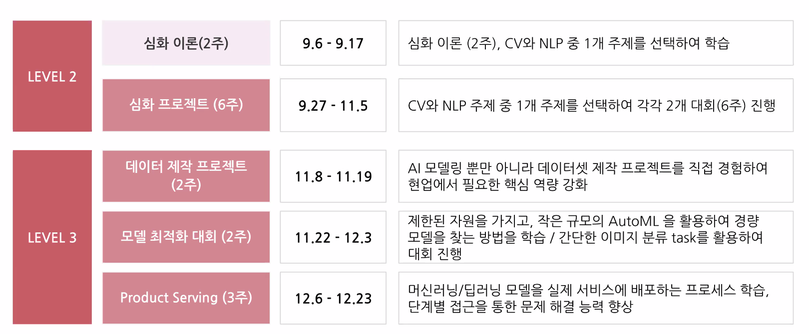

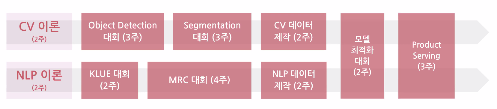

- P Stage 대회 소개 [NLP] 
  1. 한국어 언어 모델 학습 및 다중 과제 튜닝 (KLUE)
  2. 기계 독해 (Machine Reading Comprehension)

- P Stage 대회 소개 [CV]
  1. 객체 영역 검출 (Object Detection)
  2. 객체 영엉 구분 (Image Segmentation)

- 모든 대회는 팀단위로 진행
- 캠퍼와 멘토분들이 함께 진행

## 2. CV 도메인 특강 - 박선규

- Taskonomy (CVPR 2018 best paper)
  - 컴퓨터 비전과 관련된 26개의 태스크를 하나하나 정리
  - 서로간의 태스크가 연관관계
  - 굉장히 다양한 태스크를 포함

- OCR
  - 이미지에서 글자를 읽는 태스크

- Vision Transformer (ViT)
  - 이미지를 단어처럼 생각해서 사용하는 모델

    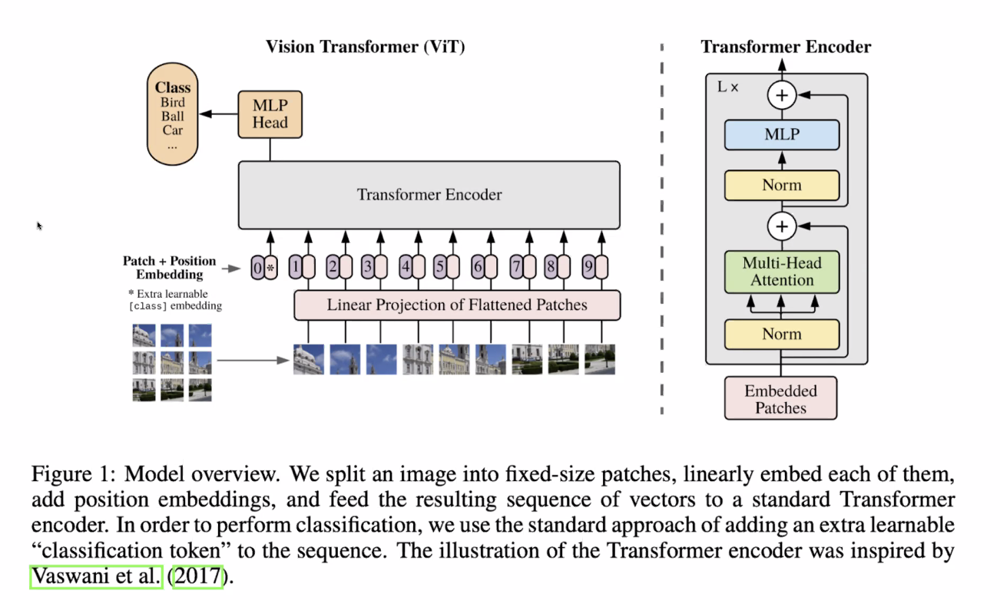

- Alias-Free GAN

- 결론
  - Computer Vision 이라하면 이미지 or 시각정보를 다루는 기술
  - Img to Text or Text to Img 등
  - 굉장히 다양한 subtext 를 포함하는 광범위한 분야
  - Convolution(CNN) 에 대해서 자세히 배우게 될 것
  - 상당히 오래 써먹을 수 있지 않을까 생각

## 3. NLP 도메인 특강 - 서대원

- NLP란?
  - 언어학, 컴퓨터공학, AI의 sub field
  - 사람의 document를 이해
    - document에서 정보를 뽑아내거나 insight를 뽑거나
    - document를 분류하거나 정리하는 태스크
  - NLU, NLG 를 포함

- 구글 검색창 NLP 최신기술이 많이 적용되어 있음
  - TF-IDF or 전통적인 방법이 아닌 언어모델이 들어감
- Voice Assistant
  - 시리, 구글, 빅스비 등
- Tanslation
  - 구글 번역, 파파고 등
  - 데이터를 만들거나 다른 학습에 도움이 되기도 함

- NLP Task
  - Topic Classification
  - Semantic Textual Similarity
  - Natural Language Inference
  - Named Entity Recognition
  - Relation Extraction
  - Dependency Parsing
  - Machine Reading Comprehension
  - Dialogue State Tracking

- NLP Trend 1
  - Transfer Learning with Large Models

- NLP Trend 2
  - Retrieval-based Model
  - Large Model : 굉장히 똑똑한 아이에게 모든 내용을 머릿속에 집어 넣는 것
  - Retrieval-based Model : 아이에게 어떤 질문이 주어졌을 때 관련된 내용을 주어주고 거기서 답변을 찾아내는 방식
    - 관련 논문 : Dense Passage Retrieval for ~~
    
- NLP Trend 3
  - Multimodality
  - Text 와 관련된 Image 생성
    - 자연어로 설명이 들어가면 자연어와 관련된 동작을 함
    - DALL E 
  - Image를 설명하는 Text를 생성 - Image Captioning
    - 한 이미지가 들어오면 우리가 주목하는 부분이 어디인가를 학습하고 주목하는 부분별로 다양한 문장을 생성하는 방식으로 발전 중
  - 음성데이터
    - NLU 에서 더 나아가서 SLU (Spoken Language Understanding)

- NLP 엔지니어에게 요구되는 역량
  - 학습데이터가 있고 모델링해서 성능을 낸다. 라고 생각하지만
  - 데이터가 없기 때문에
  - 데이터를 크롤링, 데이터 관리, 데이터 versioning 하는 일
  - 뉴럴넷의 architecture의 이해
  - RNN, CNN, Transforemr
  - 논문 수치를 재현하는 능력
  - 재현된 논문 수치를 바탕으로 주어진 태스크에서 더 높은 수치를 내는 역량
  - 코드를 관리하거나 모델을 관리하는 역량
  - 모델 서빙하기 위한 API를 만든다던지 실제로 Production에 들어갔을 때 로그를 받고 로그를 분석하는 능력

- 주니어 레벨에서 기본적으로 갖춰야 할 것
  - 자료구조, 알고리즘의 대한 기본 지식
  - ML 모델에 대한 기본기
  - 나머지는 자연스럽게 습득이 될거라고 생각

## 4. 사전질문 Q&A

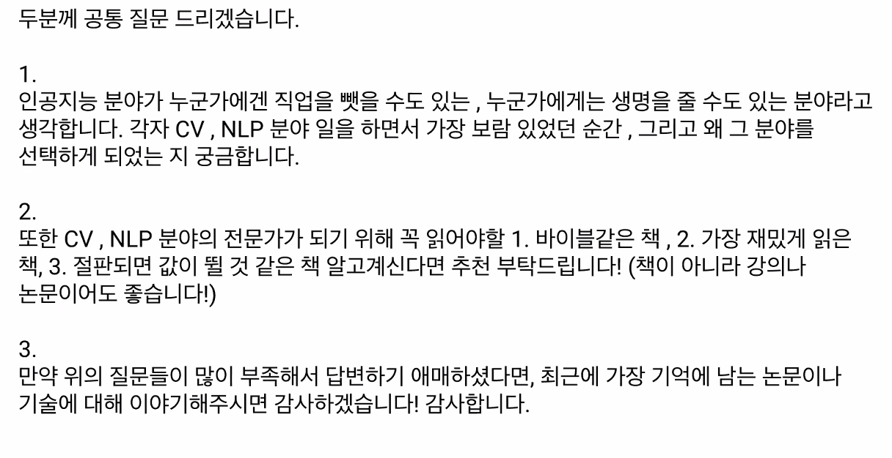

- 책의 형태는 이미 지나버린 내용이라고 생각해서 안읽음
- NLP 모델들이 Transformer 로 대동단결 하는 상태라서 Attention is All you need 이 논문 여러번 읽어볼 것

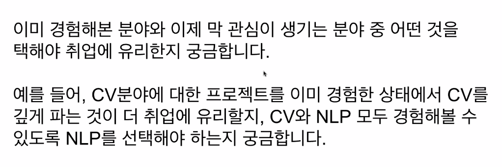

- 굉장히 유망한 분야라고 생각이 들고 좋아하고 더 재밌는 분야를 선택하면 될 것 같음
- 본인이 더 남들과 차별화되서 잘할 수 있는 분야를 고르는게 맞다고 생각

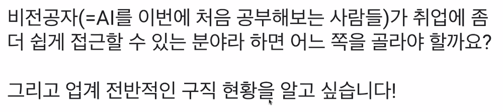

- 조금이라도 더 이해가 잘 되는 분야를 선택하는게 도움이 될 듯
- 어느 분야에서 성과를 낸다고 하면 둘 다 괜찮음
- 어차피 결국엔 다 해야되는 분야더라
- 엔지니어링에 포커스를 맞추는 것도 좋은 듯
- job market 이 좋은 상황

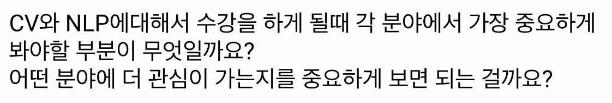

- KLUE를 진행하면서 NLP 태스크에 이런것들이 있구나 감을 잡고
- 이런 태스크를 기반으로 어떤 application을 만들 수 있을까를 생각하고
- 언어 모델이 어떻게 학습이 되고 왜 잘되고 어떤 언어모델이 어느분야에서 잘되는지를 중점적으로 생각하면 좋을 듯

- 네트워크 자체가 어떤식으로 학습이 되는지 일반적인 부분에 초점을 맞추는 것이 좋을 듯

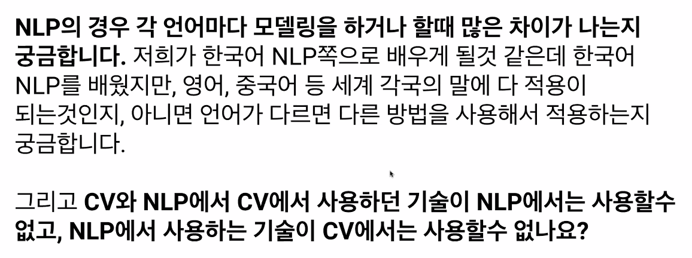

- 언어 특성에 따라서 차이가 나는 경우가 있긴 함
  - 한국어 같은 경우 형태소 분석을 미리 진행하고 학습하면 성능이 올라간다
- 점점 dependency 가 많이 사라지고 있음

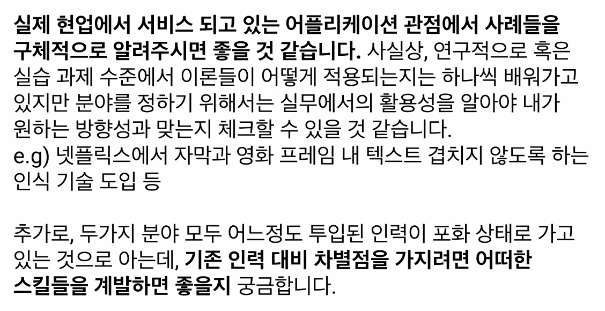

- 인력이 포화상태가 된 것 같진 않고
- 한 가지 태스크를 바닥까지 파본 깊이
- 다양한 태스크를 한번씩이라도 접해봤다 넓이
- 차별점 자체도 다양한 부분에서 가질 수 있다.

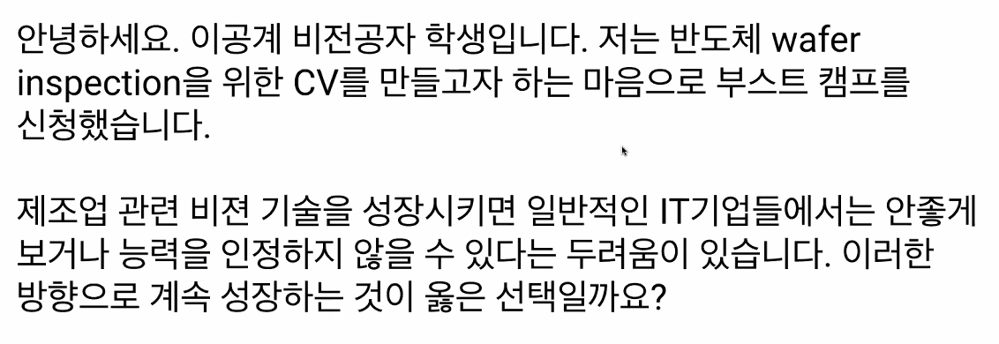

- 다른 부분에서도 잘 쓰일 수 있는 건지 잘 구분해서 보는 게 도움이 될 것 같음

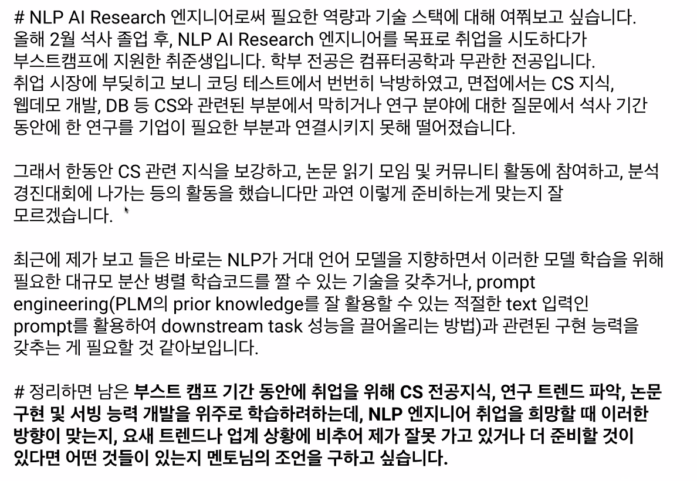

- 적어 주신 내용으로 가는게 맞음
- 세부적으로 계획을 짜서 하면 좋을 것 같음

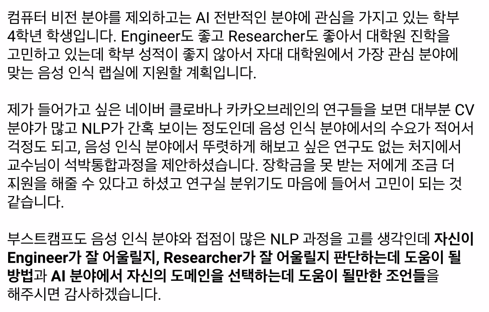

- 둘 다 해보기 전에는 알 수가 없음
- 인턴을 하거나 회사에서 만난 분들의 어떤 행보를 보다 보면 둘 다 해보는 것 같음
- 산업에서의 경험, 연구에서의 경험을 동시에 해보고 맞는걸 찾는 듯
- 연구원은 데이터가 정해져있고 이 데이터에서 성능을 올리는 방향
- 엔지니어는 데이터가 정해져 있지 않고 모델링을 밑바닥에서 부터 하지 않고 이미 만들어진 모델을 이용하고 서빙하고 만드는 과정
- 인턴이나 연구실 경험을 해보는게 좋을 듯

- 이 둘을 판단을 해보는 게 좋을 듯
  - 한 쪽은 논문을 읽고 쓰는 것
  - 서비스를 만들어서 핵심 기능을 넣고 그것이 어떤 시장의 인정을 받는게 좋은지
  - 그러나 완벽하게 분리되는 분야는 아닌 듯