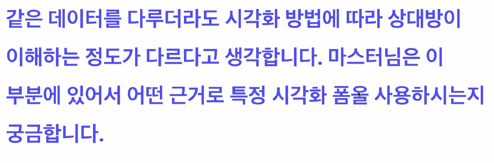
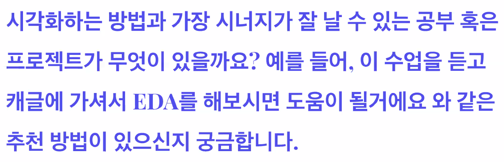
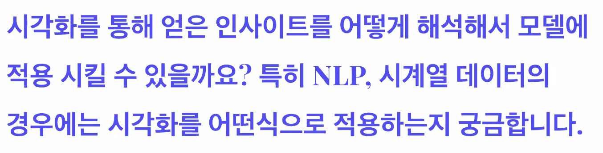

# [마스터클래스] 안수빈 강사님

## Data Literacy & Data Visualization

- 멋있는 개발자가 되야 한다!
- 함께 일할 때 실력이 없는건 죄가 된다!
- 기본 적인 실력은 갖춰야 한다!
- 어떤 문제가 세상에 필요한지 제시를 할 수 있어야 한다!
- 개발자도 소통이 굉장히 중요하다!
- 어떻게 하면 잘 포장할 수 있을까?(브랜딩)
- 어떤 프로덕트(서비스)로 기술이 나와야 한다고 생각하고 그런 것들을 전달 할 수 있어야 한다!!
- 머신러닝과 인공지능을 잘 포장하기 위해서 일반인들 비기너들에게 잘 설명하기 위해서 데이터 시각화를 공부하기 시작!!

## 데이터 시각화란?

- 데이터를 필요에 맞게 시각적 요소로 변환하여 이해하기 쉽게 시각적으로 전달
  - Data manipulation & Encoding
  - Goal & Target Audience
  - Prevent Misleading
  - Observation & Aesthetic

## Data Science 에서 Visualization 을 하는 이유

1. 시각화를 하는 과정에서 데이터를 살피며 데이터에서 인사이트 얻기
2. 결과를 효율적으로 보여주기

## Data Science 에서 Visualization 이 중요한 이유

- 블랙박스
  - 결과에 대한 신뢰도는 성능 100%가 아닌 한 부족
  - 결과 중심이 되서는 안된다.
- 이미 정보는 많다! 하지만 단순히 많기만 한 정보는 의미가 없다

## Data Visualization 종류

- Information Visualization
  - 기존 데이터의 통계치 등의 정보를 시각적으로 전달
- Scientific Visualization
  - 이미지, 오디오, 3D 객체 등의 객체 관찿ㄹ 또는 시뮬레이션을 효과적으로 살피기 위한 시각화
- Infographic
  - 전달하고자 하는 메시지를 데이터를 통한 스토리텔링으로 전달
- Data Art
  - 데이터를 사용하여 예술적으로 표현

## AI 에서 Data Visualization 이 중요한 이유

- 데이터를 사용한 설득
  - 의료, 경제 등 실질적 손실이 가는 분야일수록 신뢰가 필요
  - 기계가 하는 걸 어떻게 믿어요? 와 사람이 하는 걸 어떻게 믿어요 의 커넥션
- Metric 에 따라 높은 Score 를 가지면 좋은 AI Model 일까?
  - 기본적인 성능과 안전성은 필수
  - 그 다음은 Product 이고, 그때부터는 UX!! (사용자 경험)
  - 제한적인 환경(논문, 서비스 등)에서 최대한으로 보여줄 수 있어야 한다.
  - 시각화는 UX의 다양한 고려점 중 하나이자 좋은 연습 도구

## AI 에서 Data Visualization 을 하는 이유

- 해석가능하고 설명가능한 인공지능을 위해
  - Tensorboard
- 모델을 비교하고 선택하기 위해
  - 성능을 비교하기 위해
- 모델을 디버깅 / 모델의 성능을 향상하기 위해
- 딥러닝 이론을 가르치기 위해

## AI 에서 Data Visualization 툴

- Tensorboard
- CNN Explainer
- Facet : 데이터셋 탐색 도구
- Distill : 인터랙티브 논문 및 Article

## 언제?

- 훈련 전
  - 데이터를 살피는 단계
- 훈련 중
  - 데이터가 잘 훈련되고 있는가
- 훈련 후
  - 결과를 어떻게 해석할 것인가?

## 누구를 위해?

- Experts
  - 모델을 개발하고, 연구하는 전문가
  - 더 나은 모델을 개발하기 위한 분석 방법
  - 분석고 ㅏ발표 모두 중요

- None-Experts
  - End-User 또는 AI 적용을 위한 비전문가
  - 앞으로 타겟은 이 사람들이 아닐까?
  - 비전문가가 바라보는 AI는 어떨까?
  - 얼마나 전달하는 것이 좋을까?

- How?
  - 방법론을 알자
  - 인지적 관점
  - 구현으로 완성

## Python 시각화가 답인가?

- 꼭 Python이 답은 아니다!
  - DL/ML 에 Python 을 많이 사용하기에 편리할 뿐
- 경우에 따라 R, MATLAB 등의 언어가 더 적합한 언어일수도
- 웹으로 가게 된다면 D3JS와 같이 밑바닥부터 구현하는게 나을 수도 있음
- Tableau, Sportfire 등 시각화 GUI 툴도 잘 사용하면 좋음
- Wandb, Tensorboard 등의 기존 툴도 추천
- 포토샵, 일러스트, PPT도 최종적인 도구

## 얻었으면 좋겠는 것

- 새로운 데이터를 보고 빠르게 파악하기
  - 데이터를 wrangling하고 시각화까지 연결하기
- 오용 및 남용하지 않기
  - 오용하지 않으면서 이쁜 시각화란?
  - 시각화 올바르게 해석하기 (읽기)
- 시각화로 원하는 정보를 강조 및 전달
- 필요한 시각화와 필요없는 시각화를 구분

## 사전 질문

- 데이터를 사용하는 사람들 인터뷰부터 시작
- requirements를 만들고 시작
- 데이터 분석을 하는 사람들에게는 필요한 데이터만 시각화를 진행

- 데이터가 바뀌어도 쉽게 코딩을 진행할 수 있음
- Tableau는 원본 데이터가 바뀌면 적용해야하고 전처리 측면에서 한계가 있음

- 많은 데이터를 살펴보는게 중요
- 본인이 좋아하는 도메인의 데이터셋을 찾는게 중요
- 재밌는 주제로 어떤 시각화를 할 수 있을지 고민
- 깃허브와 캐글에 공유를 해서 다양한 사람들과 얘기를 하는게 중요
- 데이콘 & 캐글에서 시각화 competition도 있음

- 캐글에서 다양한 솔루션들을 찾아보는게 좋을 것 같음
- 꼭 시각화를 통해서 인사이트를 찾을 필요는 없음

- 고려를 하는 곳도 있고 안하는 곳도 있지만 너무 기업 by 기업이 아닐까
- 시각화를 잘 못하더라도 결과를 잘 내는분도 많고
- 시각화부터 결과까지 다 잘하는 사람도 있고
- 시각화의 역량을 측정하기엔 어려움

- 가장 큰 계기는 캐글
- 적당한 성능을 내고 사용자들에게 더 좋게 전달하는게 좋지 않을까 생각
- 커리큘럼 시각화쪽으로 연구 진행 중
- 원하는 연구실이 어떤걸 하는지 살피는게 중요

