# Convolution은 무엇인가?

## Convolution

- Continuous convolution

    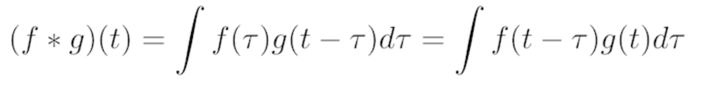

- Discrete convolution

    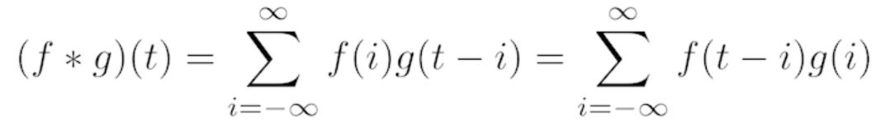

- 2D image convolution

    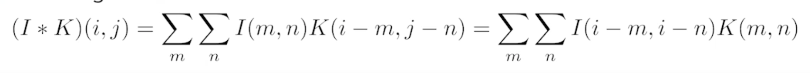

    - I : 전체 이미지 공간
    - K : 적용하고자 하는 필터의 모양

    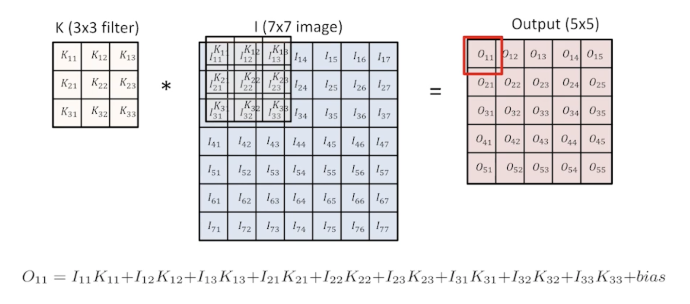

- 2D conolution in action

    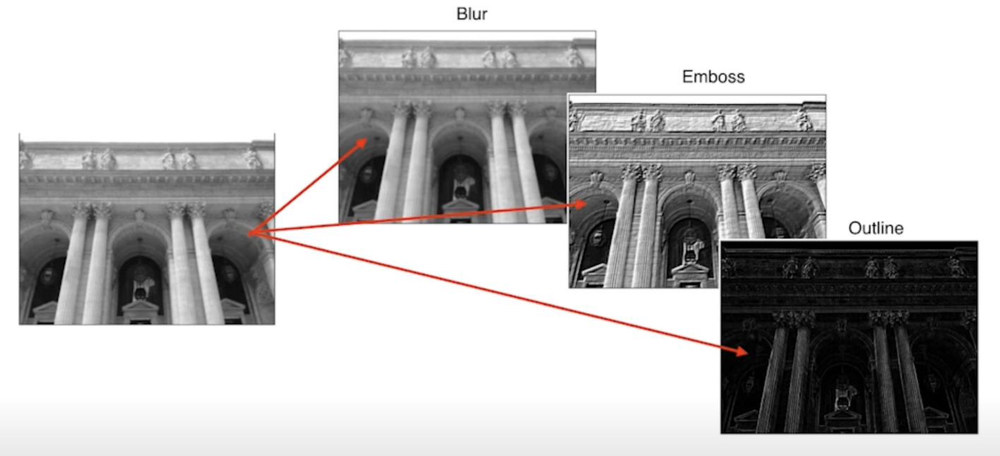

  - blur
  - 강조
  - 외곽선
  - 등

- RGB Image Convolution
  - 수학적으로 RGB를 표현할 때 tensor로 표현
  - 32x32x3 짜리를 convolution 한다고 하면 5x5 filter 를 사용할 때 필터의 크기는 항상 같다는게 숨겨져 있음 -> 그래서 5x5x3 짜리 filter를 사용하게 되고 그 output은 28x28x1 이된다
  - feature map 의 channel 숫자는 어떻게 생기게 되는 거냐면
    - convolution filter 가 여러개 있다고 볼 수 있음
  - input channel 과 output convolution feature map 의 channel을 알면 여기에 적용되는 convolution feature의 크기 역시 같이 계산할 수 있음

- Stack of Convolutions
  - 연산에 필요한 parameter 숫자를 잘 생각을 해야함!!
  
    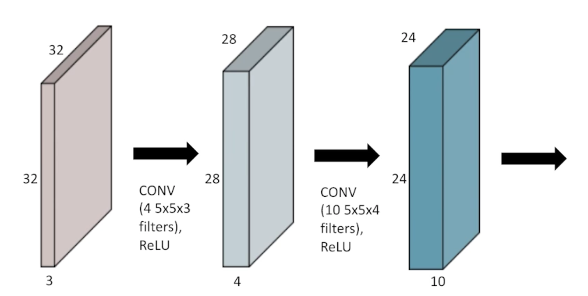

  - 32x32x3 RGB Image를 28x28x4 짜리 convolution feature map 을 얻기 위해 필요한 parameter 수는 5x5x3x4가 된다.
    - filter 의 크기 : 5x5
    - input 의 channel : 3
    - output 의 channel : 4
    - 따라서 paramter 수는 5x5 x 3 x 4

- 28x28x4 -> 24x24x10 이 되려면 parameter의 수는 5x5x4x10 이 된다.

## Convolutional Neural Networks

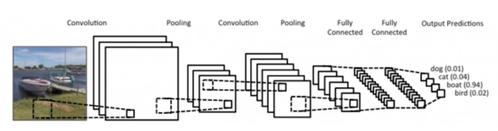

- CNN consists of convolution layer, pooling layer, and fully connected layer.
  - Convolution and pooling layers: feature extraction
    - 이미지에서 유용한 정보를 뽑아줌
  - Fully connected layer: decision making (e.g. classification)
    - 분류를 하거나 회귀를 해서 원하는 출력값을 얻어줌

- 점점 Fully connected layer가 없어지고 줄어드는 추세
- 왜 이러냐면?
  - parameter 의 숫자의 dependent 하게 됨

- 머신러닝에서 학습시키고자 하는 모델의 parameterd 의 숫자가 늘어나면 늘어날수록 학습이 어렵고 generalization performance(일반화성능)이 떨어진다고 알려져 있음
  - generalization performance(일반화 성능) : 학습에서 얻어지는 결과가 실제 한번도 본적없는 테스트에서 얼마나 잘 동작할지
- CNN이 발전하는 방향이 같은 모델을 만들고 최대한 모델을 deep 하게 convolution layer를 최대한 많이 가져가지만 동시에 parameter 숫자를 줄이는데 집중하게 됨
- 네트워크를 봤을 때 이 네트워크의 파라미터가 몇개인지 감을 갖는게 중요!!

## Convolution Arithmetic (of GoogLeNet)

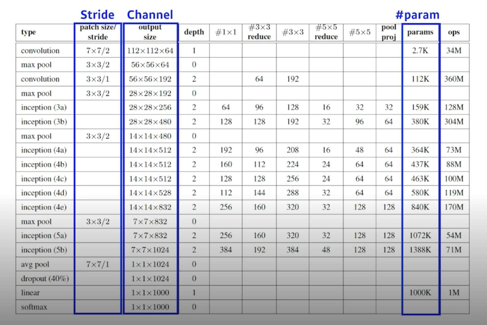

- 어떤 뉴럴네트워크에 대해서 우리가 다룰 뉴럴네트워크에 대해서 파라미터가 몇개인지를 손으로 한번 계산해보시고 이 표가 진짜로 맞는지를 계산해보면 좋을 것 같음

## Stride

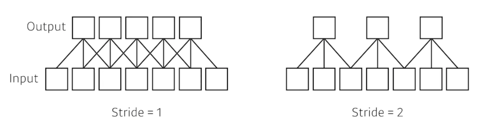

- Stride = 1 : 내가 가진 convolution filter(kernel)을 매 픽셀마다 찍고 한 포인트 옮겨서 찍고 하는걸 말함
- Stride = 2 : 2칸씩 옮김
- 2차원이 되면 width 방향 height 방향 2개의 방향을 갖는 stride가 정의 

## Padding

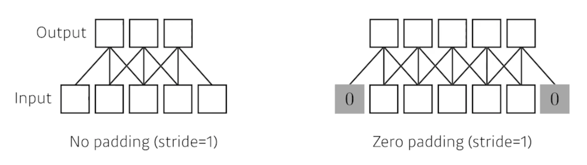

- 패딩이 없으면 가장자리 값이 버려지게 됨
- zero-padding : 겉에다가 0으로 덧대줌
- 패딩을 하게 되면 input 과 output 의 spacial demension 이 똑같게 됨

## Stride? Padding?

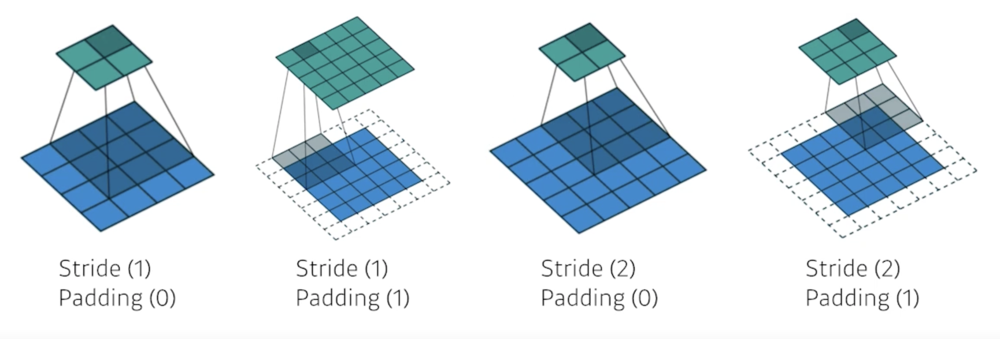

- kernel 사이즈가 3이면 패딩이 1이 필요하고 5면 2가 필요하고 7이면 3이 필요하고 이런식

## Convolution Arithmetic

- Padding (1), Stride (1), 3 x 3 Kernel

    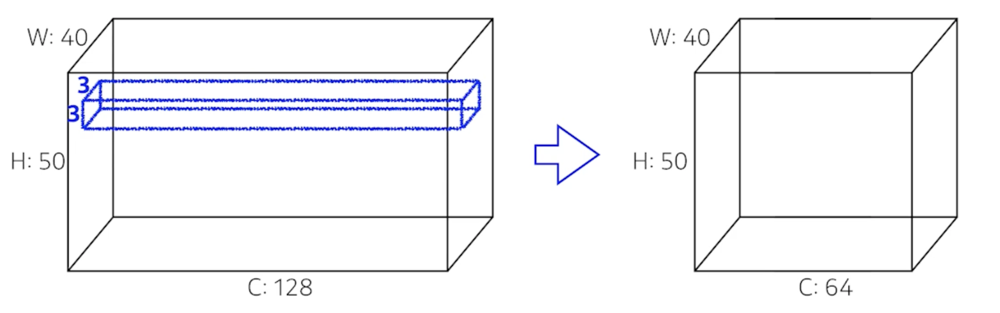

- 하나의 convolution feature 혹은 convolution filter 혹은 kernel의 크기는 3x3x128 이 된다.
- 이 하나의 kernel을 input 에 찍게 되면 채널이 1개 나옴
- 궁극적으로 얻고 싶은건 채널이 64니까 이런 커널이 64개 필요
- 그래서 parameter 의 숫자는 3x3x128x64 = 73,728개가 됨
- 파라미터의 갯수가 만단위인지, 10만단위인지 이런 감이 있는게 중요!!

## Exercise

- AlexNet

    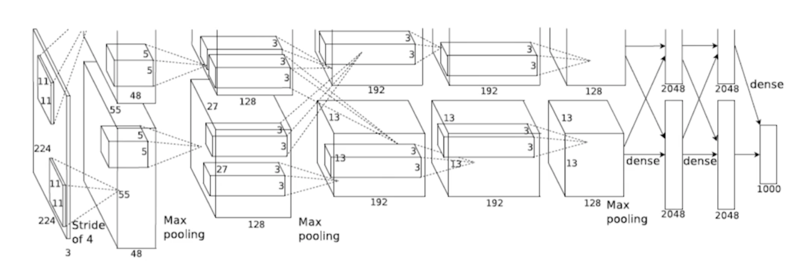

  - 입력으로 들어오는 이미지가 224x224x3 인것을 알 수 있음
  - 11x11 convolution 이 이루어지게 됨
  - 한 개의 kernel 은 11x11x3 이겠구나를 알 수 있음
  - 알렉스넷은 그 당시의 gpu 성능 때문에 2개로 나눠서 계산
  - 첫번쨰 output layer의 채널이 48이므로 parameter 의 숫자는 11x11x3x48x2 = 약 35000개
  - 두번째 layer에서는 filter의 크기가 5x5으로 줄어듦
  - 두번째 parameter의 숫자는 5x5x48x128x2 = 약 30만7000개
  - 세번쨰 layer에서는 filter의 크기가 3x3으로 줄어듦
  - 세번째 layer에서는 interchange가 일어나서 2배씩 늘어남
  - 세번째 parameter의 숫자는 3x3x128x2x192x2 = 약 80만4000개
  - 네번째 layer에서는 filter의 크기 그대로 유지
  - 네번째 parameter의 숫자는 3x3x192x192x2 = 약 66만3000개
  - 다섯번째 layer에서는 filter의 크기 그대로 유지
  - 다섯번째 parameter의 숫자는 3x3x192x128x2 = 약 44만2000개
  - Fully Connected layer의 parameter 의 갯수는 input의 뉴런 갯수와 output의 뉴런 갯수를 곱한것 만큼임
  - 여섯번째 layer(Fully Connected Layer) 에서는 
  - input의 이미지 크기 13x13x128x2 output의 크기 2048x2
  - parameter의 숫자는 13x13x128x2x2048x2 = 약 177M
  - 다음은 2048x2x2048x2 = 약 16M
  - 다음은 2048x2x1000 = 약 4M

- Dense layer가 일반적으로 훨씬 더 많은 parameter를 갖게 되는 이유는 Convolution operator가 각각의 하나의 kernel이 모든 위치에서 동일하게 적용되기 때문
- convolution operator는 일종의 shared parameter
- 뉴럴 네트워크의 발전 즉, 성능을 올리기 위해서는 parameter의 숫자를 줄이는게 중요한대 결국 대부분의 paramter가 fully connected layer에 들어가 있기 때문에 네트워크가 발전되는 성향이 뒷단에 있는 Fully connected layer를 줄이고 앞단에 convolution layer를 깊게 쌓는게 트렌드!!
  - 1x1 convolution 등 여러가지 시도 중

## 1x1 Convolution

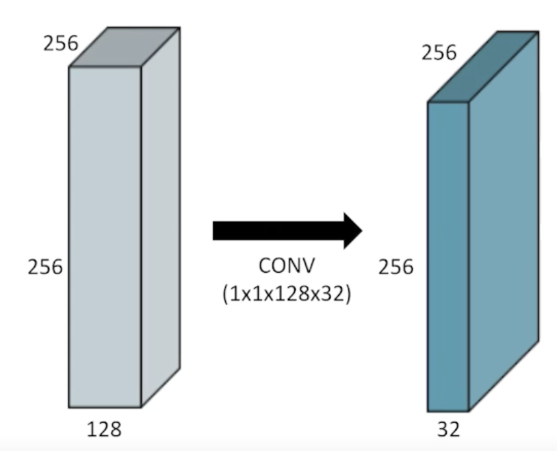

- 이미지에서 한 pixel만 보는 것
- 그리고 channel 방향으로 무언가 줄이는 것
- 이걸 왜 쓸까?
  - dimension reduction : 차원(채널)을 줄이기 위해
  - To reduce the number of parameters while increasing he depth : convolution layer를 더 깊게 쌓으면서 동시에 parameter 숫자를 줄일 수 있게됨
    - e.g. bottleneck architecture
