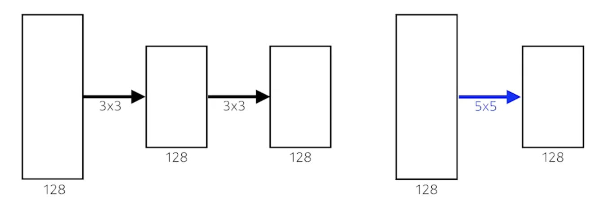
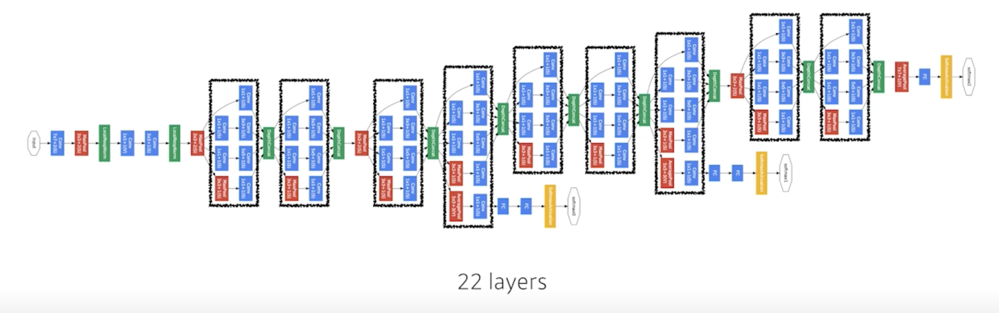
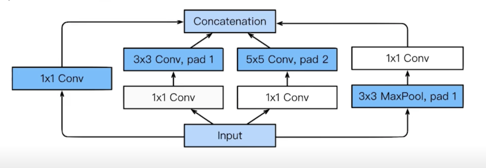
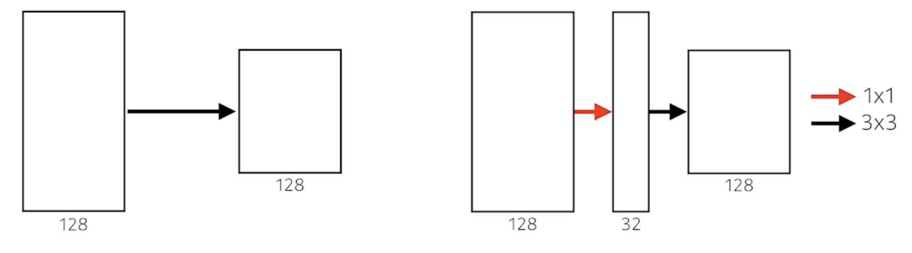
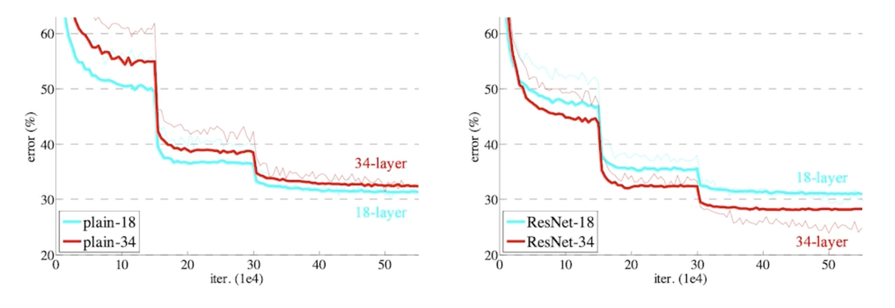
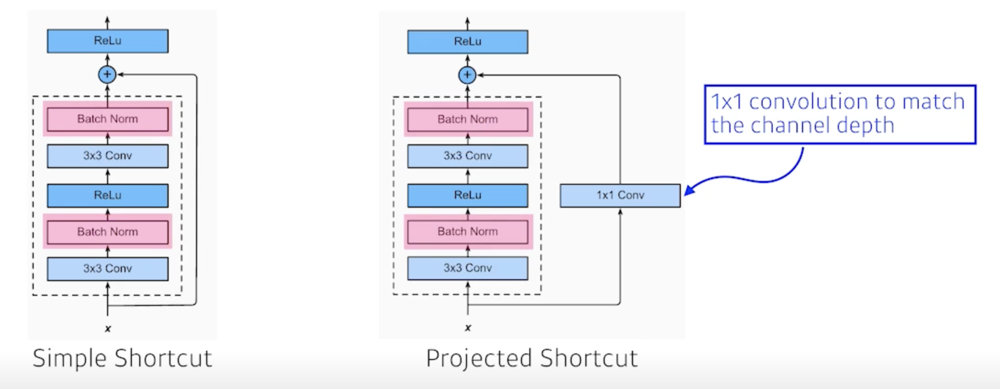
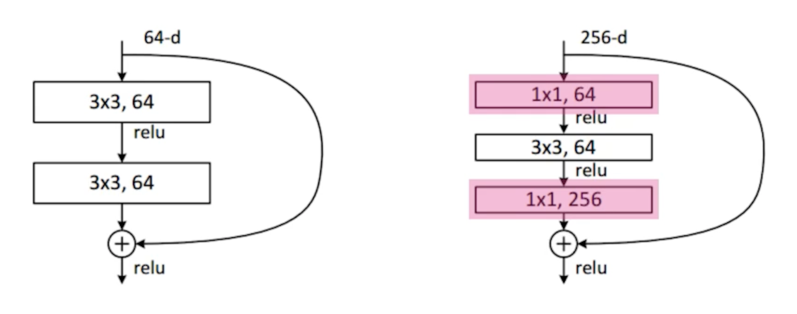
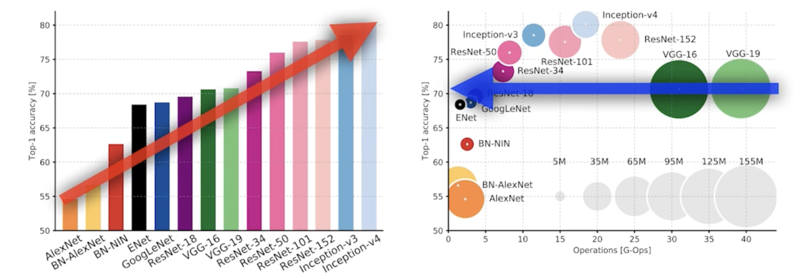
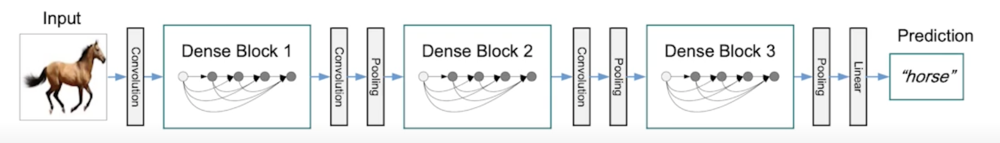

# Modern CNN - 1x1 convolution의 중요성

## ILSVRC

- **I**mageNet **L**arge-**S**cale **V**isual **R**ecognition **C**hallenge
  - Classsification / Detection / Localization / SEgmentation
  - 1,000 defferent categories
  - Over 1 million images
  - Training set: 456,567 images

- 2015년 이후 부터 사람의 성능보다 좋아졌다.

## AlexNet

- 2012년도 ILSVRC 에서 1등
- 네트워크가 2개로 나눠져 있음
  - GPU의 성능이 좋지 않아서 최대한 parameter를 집어 넣고 싶어서 
- 11x11 kernel을 사용하는건 좋은 선택이 아님 
  - convolutional kernel이 볼 수 있는 image level에서의 영역은 커지지만 상대적으로 더 많은 parameter가 필요
- 5 convolutional layers, 3 dense layers
- 총 8개의 layer로 이루어져 있음
- Key Ideas
  - Rectified Linear Unit (ReLU) activation
    - 효과적인 activation function
    - non-linear
    - x > 0 일때 기울기가 1이기 때문에 기울기가 사라지거나 하는 일이 없음
  - GPU implementation (2 GPUs)
  - Local response normalization, Overlapping pooling
    - 지금 많이 활용되지 않음
  - Data augmentation
  - Dropout
- ReLU Activation
  - Preserves properties of linear models
    - gradient가 activation 값이 커도 gradient를 그대로 가지고 있게 됨
    - 0보다 작을 떄는 0으로 바꿔주고
  - Easy to optimize with gradient descent
    - 학습이 용이하게 됨
  - Good generalization
    - 결과론적인 얘기
- Overcome the vanishing gradient problem
  - activation function을 활용할 때 문제가 되는 것
    - sigmoid, tanh 0을 기점으로 값이 커지면 slope(기울기)가 줄어들게 됨
    - slope가 gradient니까 내가 가진 뉴런의 값이 크면 즉 0에서 멀어지면 그 곳에서의 gradient(slope)는 굉장히 0에 가까움
    - 그래서 소위 말하는 vanishing gradient 문제가 생김
    - 이런걸 ReLU는 없애준다

## VGGNet

- 2014년도 ILSVRC 에서 1등
- Increasing depth with 3 x 3 convolution filters (with stride 1)
  - 3x3 convolution filter 만 사용
- 1 x 1 convolution for fully connected layers
  - 그리고 1x1 covolution filter 사용
  - 그렇게 중요하진 않음 여기서는 parameter를 줄이려고 사용한 것은 아님
- Dropout(p=0.5)
- VGG16, VGG19
  - layer의 갯수에 따라서 VGG16, VGG19 라고 명칭

- Why 3 x 3 convolution?
  
  - kernel size 가 커짐으로써 가지는 이점이 뭐냐면?
    - 하나의 convolution filter 가 찍었을 때 고려되는 input의 크기가 커진다.
    - 이것이 소위 말하는 Receptive field 를 말한다.
    - Receptive field : 
      - 하나의 convolution feature map 값을 얻기 위해서 고려할 수 있는 입력의 spacial dimension

  - 우리가 3 x 3 convolution 을 2번 했다고 해보자
    
    

  - 가장 마지막 단에 있는 하나의 값은 중간에있는 intermedia convolution feature map 의 3 x 3 을 보게되고 intermedia convolution feature map의 하나의 값은 input의 3 x 3을 보니까 사실상 마지막 layer에 있는 하나의 값은 input layer 에 5 x 5 픽셀 값이 합쳐진 값이 된다.
  - 3 x 3 이 2번 이루어지게 되면 Receptive field는 5 x 5가 된다.
  - 그리고 채널이  128 x 128이라고 해보자
  - 3 x 3 을 2번 사용한것과 5 x 5를 한번 사용한건 Receptive field 에서는 동일함
  - parameter를 계산해보자
    - 3 x 3 을 2번 사용하면
      - 3 x 3 x 128 x 128 + 3 x 3 x 128 x 128 = 294,912
    - 5 x 5 을 1번 사용하면
      - 5 x 5 x 128 x 128 = 409,600
  - 거의 1.5배의 차이가 남

## GoogLeNet

- 비슷하게 보이는 네트워크가 반복
- 네트워크모양이 네트워크안에 있다해서 network in network (NIN) 구조라고 함
- 2014년 ILSVRC 1등
- Inception blocks
    
    

  - 3 x 3 convolution 하기 전에 1 x 1 이 들어가고 5 x 5 convnolution 하기 전에 1 x 1 하는게 중요한 역할!!
- What are the benefits of the inception block?
  - Reduce the number of parameter.
  - 1 x 1 convolution filter 를 통해서 전체적인 파라미터 개수를 줄임
- How?
  - Recall how the number of parameters is computed
  - 1 x 1 convolution can be seen as channel-wise dimension reduction
    - 채널 방향으로 dimension을 줄이는 효과가 있다

- Benefit of 1 x 1 convolution

    

    - 3 x 3 convolution 을 생각
    - 왼쪽의 네트워크를 정의하기 위한 parameter의 숫자는?
      - 3 x 3 x 128 x 128 = 147456
    - 오른쪽의 네트워크를 정의하기 위한 parameter의 숫자는?
      - 1 x 1x 128 x 32 + 3 x 3 x 32 x 128 = 40960

---

## Quiz

- Which CNN architecture has the least number of parameters?
  1. AlexNet (8-layers) -> (60M)
  2. VGGNet (19-layers) -> (110M)
  3. GoogLeNet (22-layers) -> (4M)
 
- The answer is GoogLeNet

---

## ResNet

- 2015년 ILSVRC 1등
- Deeper neural networks are hard to train
  - Overfitting is usually caused by an excessive number of parameters
  - But, not in this case

    

  - 56 layer 보다 20 layer 가 더 학습이 잘됨
  - 오버피팅은 아니지만 네트워크가 학습을 못 시킴

- Add an identity map (skip connection)

    

    

    - identity map 을 사용하게 되면 층이 더 깊은 네트워크가 학습을 더 잘함

- Add an identity map after nonlinear activations
  
    

    - projected shortcut 에서 channel을 맞춰주기 위해서 1 x 1 Conv 사용
    - 일반적으로 Simple Shortcut convolution을 활용

    - Batch Norm 이 3 x 3 Conv 뒤에 일어나게 됨
    - 그 다음에 activation
    - 그 다음에 3 x 3 Conv
    - 그 다음에 Batch Norm

- Bottleneck architecture

    

    - 3 x 3 convolution을 하기 위해서는 3 x 3 x input_channel x output_channel parameter 개수 피요
    - 3 x 3 conv 하기 전에 input_channel을 줄이면 전체적인 parameter 숫자를 줄일 수 있음

---

### Performance increases while parameter size decreases!!

---

## DenseNet

- DenseNet uses concatenation instead of addition
  - concatenate 하면 channel이 기하급수적으로 커짐
    - 뒤에 있는건 앞에 있는 channel을 다 concatenate 했기 때문
  - channel이 커지면 parameter의 개수도 늘어나기 때문에 원하는 방향이 아님
  - 그래서 channel 을 줄이기 위해 1x1 Conv 를 추가한다.

- Dense Block
  - Each layer concatenates the feature maps of all preceding layers
  - The number of channels increases geometrically
  - concatenate 해서 convolution feature map 을 기하급수적으로 키운 다음에
- Transition Block
  - BatchNorm -> 1 x 1 Conv -> 2 x 2 AvgPooling
  - Dimension reduction
  - feature map 사이즈를 줄여버림

---

## Summary

- Key takeaways
  - VGG: repeated 3x3 blocks
  - GoogLeNet: 1x1 convolution
  - RestNet: skip-connection
  - DenseNet: concatenation

