# Computer Vision Applications

> Semantic Segmentation

- 이미지가 있으면 이미지의 각 픽셀마다 분류하는 것
- 자율주행에 가장 많이 활용

> Fully Convolutional Network
    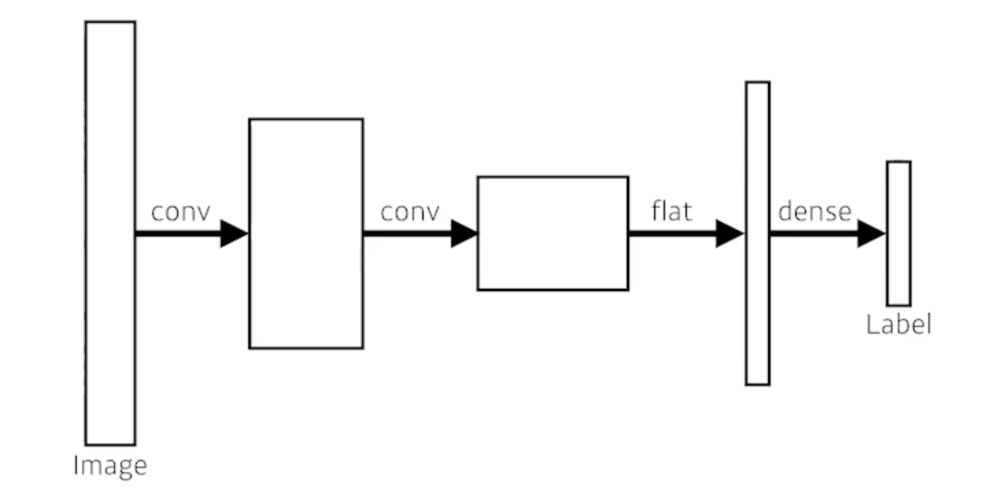

- This is how an ordinary CNN looks like

> 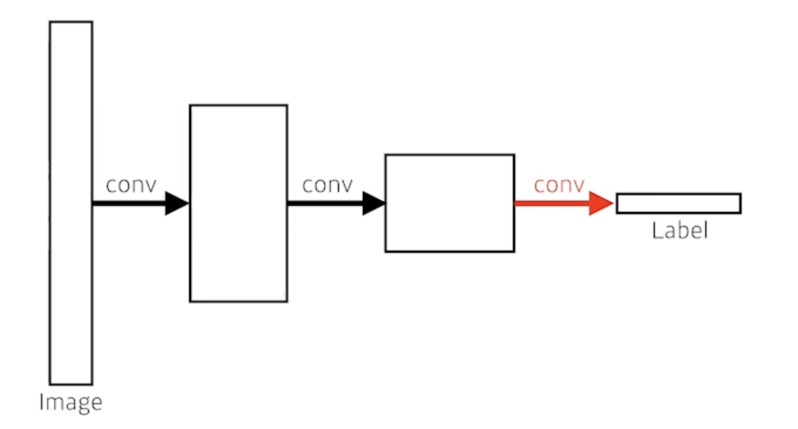

- This is **fully convolutional** network
  - Dense layer를 없앤 것
    - convolutionalization 라고 부름
  - 가장 큰 장점은? Dense layer가 없어진 것

- 기존의 모델과 파라미터의 개수는 똑같음
- 사실상 달라진게 없음
 
 > 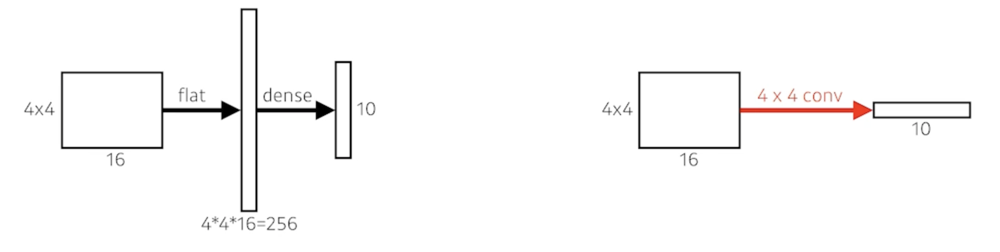

 - \# of parameters
   - Left: 4 x 4 x 16 x 10 = 2,560
   - Right: 4 x 4 x 16 x 10 = 2,560
 - This process is called **convolutionalization**

> 왜 이런걸 사용할까?

- Transforming fully connected layers into convolution layers enables a classification net to output a heat map
- While FCN can run with inputs of any size, the output dimensions are typically reduced by subsampling
- So we need a way to connect the coarse output to the dense pixels

> Deconvolution (conv transpose)

- spacial dimension을 키워주게 됨
- 엄밀히 말하면 convolution의 역은 아니다
- 그렇지만 그렇게 생각하면 좋은 이유는 network architecture를 만들 때 parameter의 숫자와 network architecture의 크기를 잘 계산할 때 그냥 convolution의 역이라고 생각하면 계산하기가 편해짐

> Results
    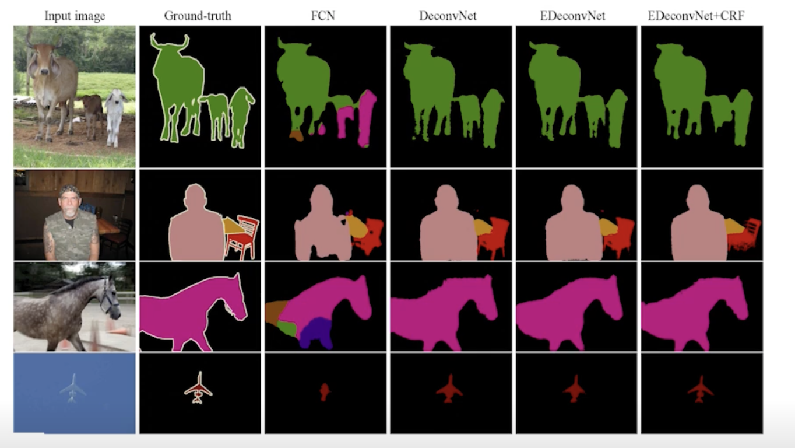

## Detection

> R-CNN
    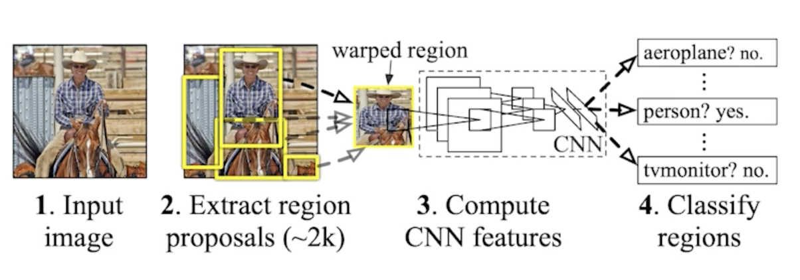

1. takes an input image
2. extracts around 2,000 region proposals (using Selective sesarch)
   - 뽑을때는 모르고 그냥 뽑음 대충 여기 이미지 있을것 같다고 생각하고 똑같은 크기로 뽑음
3. compute features for each proposal (using AlexNet)
   -  feature를 뽑을 떄 AlexNet으로 뽑고
4. calssifies with linear SVM
   - 분류를 하는데 서포트벡터머신 활용

> 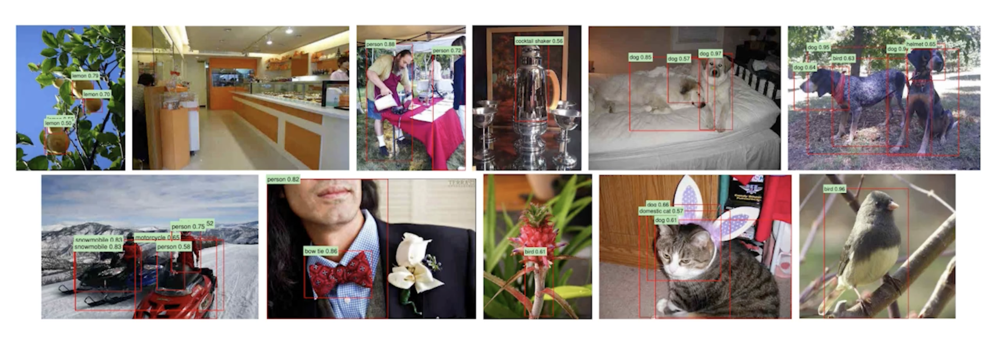

> SPPNet (Spatial Pyramid Pooling)

- R-CNN의 문제점
  1. 이미지 안에서 2,000개의 bounding box를 뽑으면 2,000개의 이미지 혹은 petch를 CNN을 다 통과시켜야 함
  2. convolution network 2,000번 돌려야 1개의 image를 돌리는 것임
  3. 하나의 이미지를 돌리는데 1분이 걸림
- 그러면 우리가 image 안에서 CNN을 한번만 돌리자!
  1. image 안에서 bounding box를 뽑고
  2. image 전체에 대해서 convolution feature map 을 만든다음에
  3. 뽑힌 bounding box 위치에 해당하는 convolution feature map 의 tensor 만 끌고오자!

> Fast R-CNN
    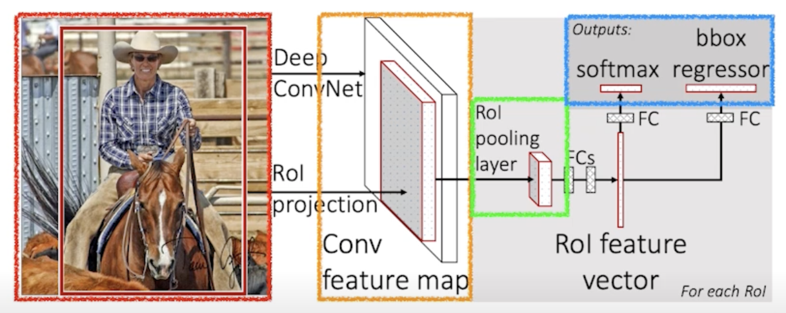

1. Takes an input and a set of bounding boxes.
   - input image가 들어오고
   - bounding box를 Selective search 를 통해서 미리 2,000개 정도 뽑음
2. Generated convolutional feature map
   - CNN을 한번 통과
3. For each region, get a fixed length feature from ROI pooling
   - 각각의 region에 대해서 fixed length feature를 뽑음
   - 이게 ROI Pooling
4. Two outputs: class and bounding-box regressor
   - 뉴럴 네트워크를 통해서 bounding-box regression 내가 얻어지는 bounding-box를 어떻게 움직이면 좋을지 그리고 이 bounding-box에 대한 label을 찾게 됨

> Faster R-CNN
    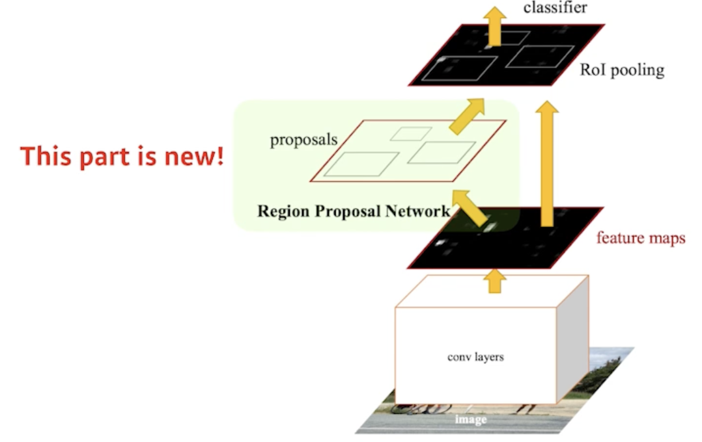

- Faster R-CNN = Region Proposal Network + Fast R-CNN
- bounding box를 뽑는 것도 network로 학습하자!

> Region Proposal Network
    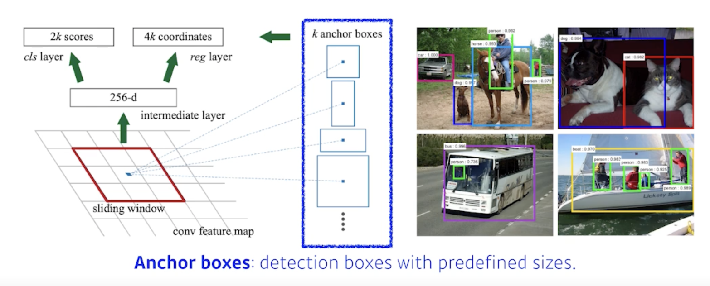

- 이미지가 있으면 이 이미지가 이미지에서 특정영역이 patch가 bounding-box로서의 의미가 있을지 없을지 여기안에 물체가 있을것 같은지 아닌지를 찾아주는 것
- 이 물체가 무엇인지는 뒷단에 있는 새로운 network가 해주지만 여기에 물체가 있을것 같다 Region Proposal을 해주는 것
- Anchor boxex : Region Proposal을 하기 위해 미리 정해놓은 bounding-box의 크기 
  - 대충 이미지 안에 어떤 크기의 물체들이 있을 것 같다 라는걸 미리 알고있는 상태
  - k개의 template을 만들어 놓고 template들이 얼마나 바뀔지에 대한 offset을 찾고 궁극적으로는 Template를 미리 고정해 놓는게 이 RPN에 가장 큰 특징!!

> 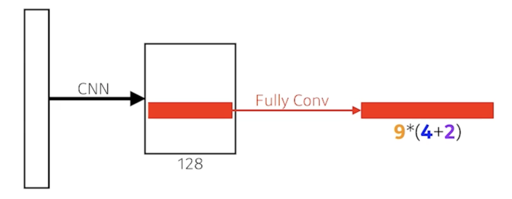

- fully convolution network가 활용
- fully convolution network의 역할은 해당하는 영역의 이미지가 과연 어떤 물체가 들어있을지 안들어있을지를 이 kernel(fully convolution network)이 들고있게 된다.
- 9: Three different region sizes (128, 256, 512) with three different ratios (1:1, 1:2, 2:1)
  - 사이즈와 비율의 combination으로 9개의 region size 중에 하나를 고르게 됨
- 4: four bounding box regression parameters
  - 각각의 region size 마다 얼마나 bounding-box를 키우고 줄일지 box의 width, height를 바꾸고 x, y의 offset을 주는 형태이기 때문에 4개의 parameter가 필요하고 
- 2: box classification (whether to use it or not)
  - 해당 bounding-box가 쓸모 있는지 없는지 판단하는 2개의 parameter

- 총 54개의 channel이 나오는 convolution feature map 이 되고 54개의 값을 잘 뜯어보면 해당 bounding-box에서 해당 영역에서 어떤 bounding-box를 사용할지 말지를 정하게 됨

> 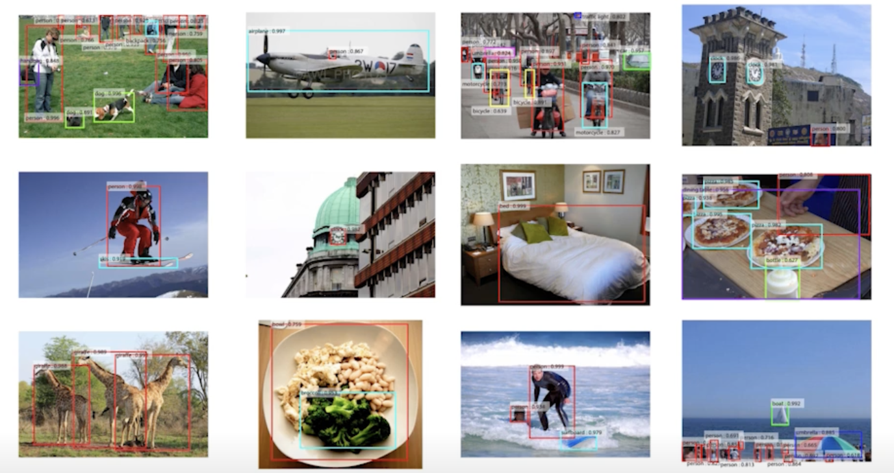

> YOLO
    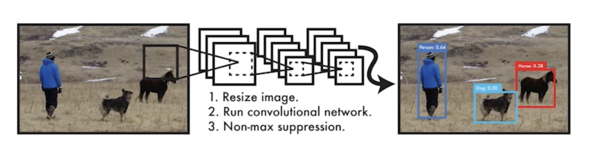

- YOLO (v1) is an extremely fast object detection algorithm
  - 가장 기본이 되는 YOLO (v1)
  - baseline: 45fps / smaller version: 155fps
- it simultaneously predicts multiple bounding boxes and class probabilities
  - Bounding-box를 따로 뽑는 Region Proposal 과정이 없기 때문에 속도가 빠름
  - No explicit bounding box sampling (compared with Faster R-CNN)

> 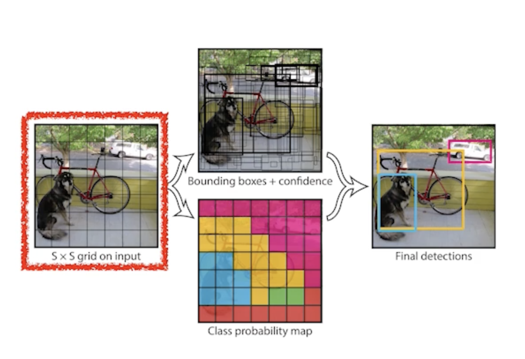

- Given an image, YOLO divides it into SxS grid
  - 이미지가 들어오면 이미지를 SxS 그리드로 나누게 됨
  - If the center of an object falls into the grid cell, that grid cell is responsible for detection
    - 이미지 안에 내가 찾고 싶은 물체의 중앙이 해당 grid 안에 들어가면 그 그리드 셀이 해당 물체의 대한 bounding-box와 그 해당 물체가 무엇인지를 같이 예측해줘야함
- Each cell predicts B bounding boxes (B=5)
  - 각각의 셀은 B개(논문에서는 5개 사용)의 bounding-box를 예측하게 됨
    - Each bounding box predicts
      - box refinement(x / y / w / h)
        - box의 x, y, width, height를 찾아주게 되고
      - confidence (of objectness)
        - bounding box가 실제로 쓸모있는지 없는지를 찾게 됨
- Each cell predicts C class probabilities
  - 그와 동시에 각각의 SxS grid가 이 bounding box 혹은 이 grid cell에 속하는 중점에 있는 어떤 object가 어떤 class 인지를 예측하게 됨

- In total, it becomes a tensor with SxSx(B*5+C) size
  - SxS: Number of cells of the grid
  - B*5: B bounding boxes with offsets (x, y, w, h) and confidence
    - B개의 bounding box 마다 box에 대한 probability offset과 confidence(쓸지 말지)가 나오고
  - C: Number of classes
    - C개의 probability가 나옴

- 그래서 SxSx(B*5+C)개의 tensor가 나오면 이게 YOLO의 전부가 됨

> 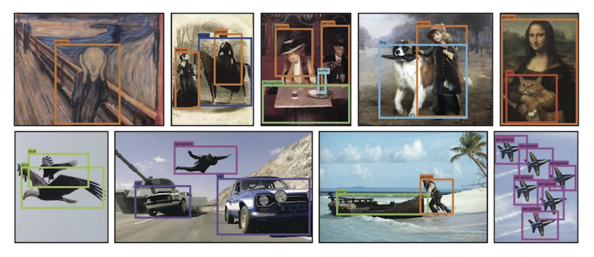