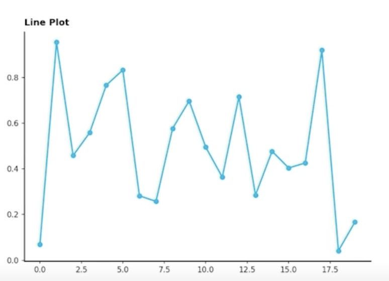
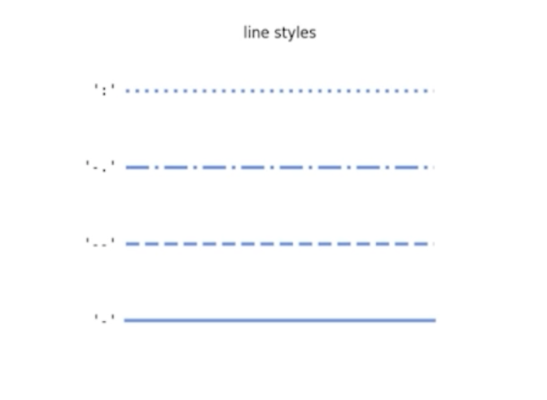
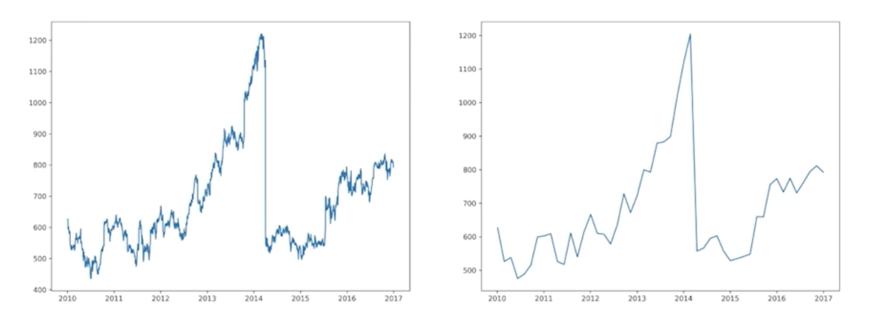
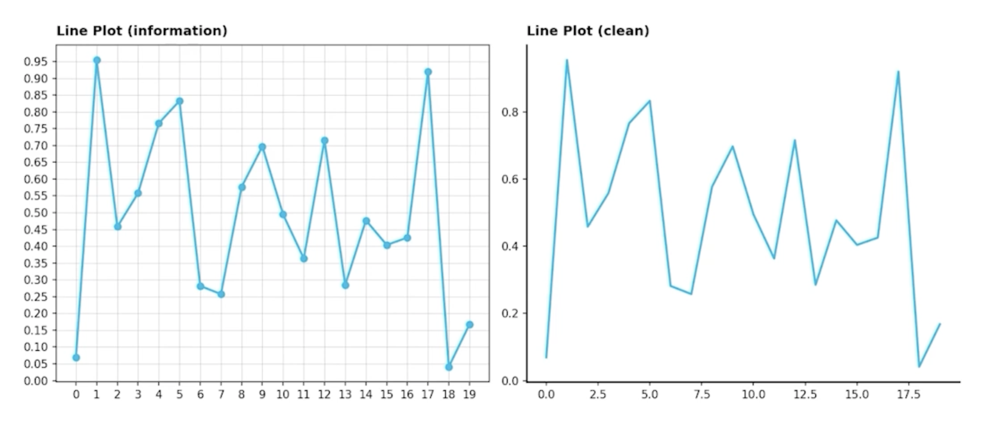
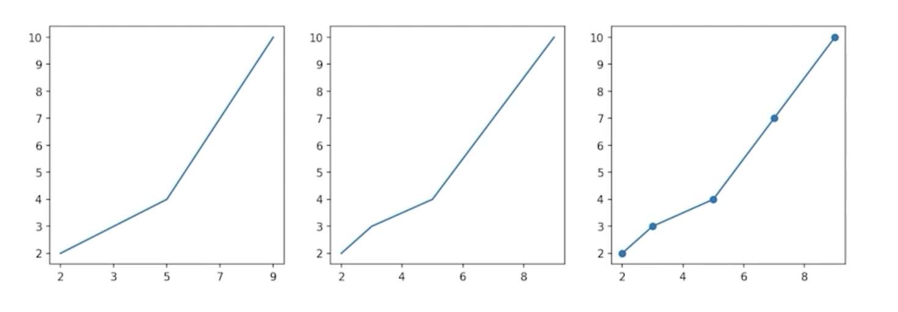
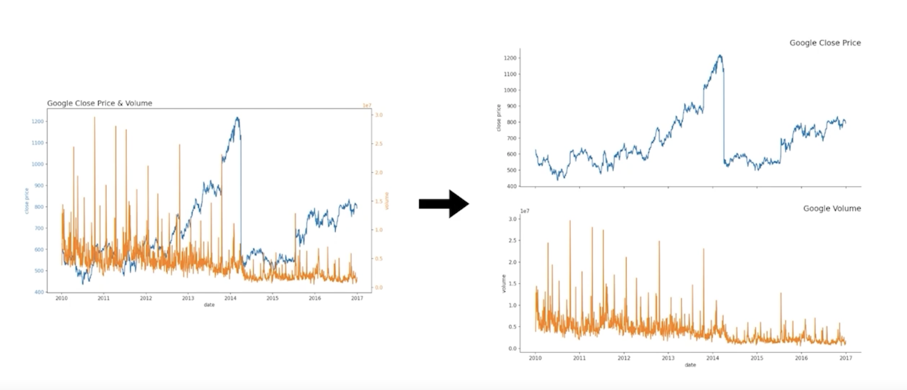
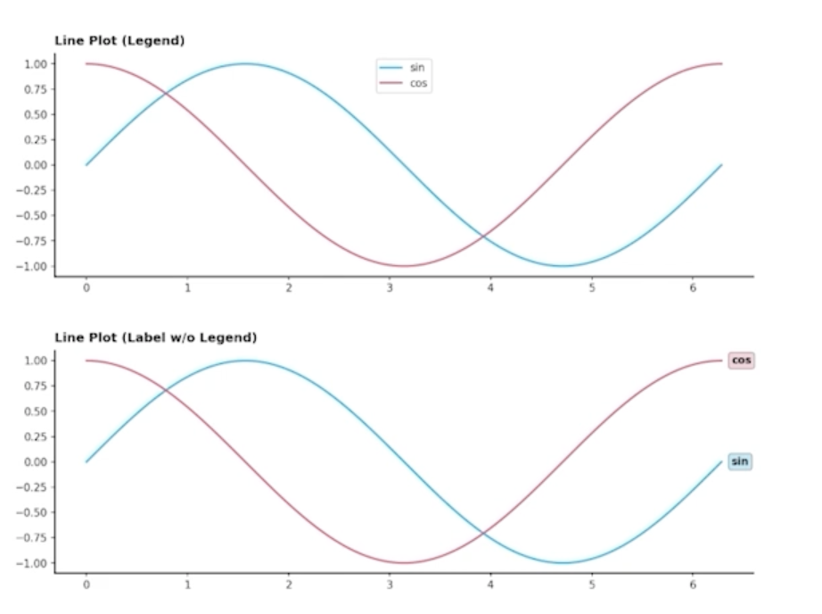
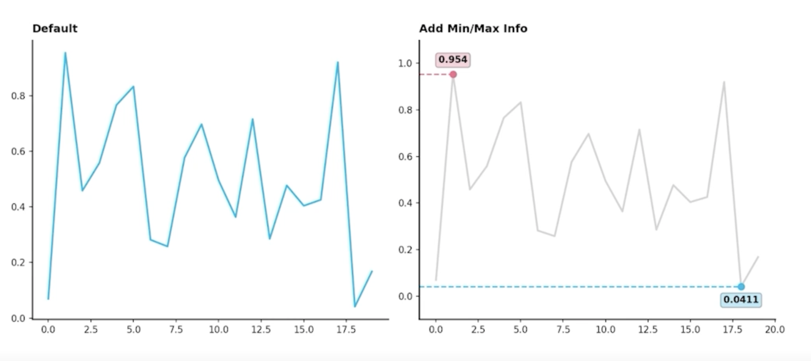
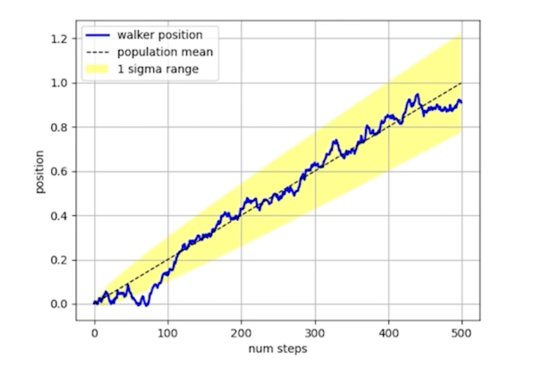

# Line Plot 사용하기

## 1. 기본 Line Plot

### 1.1 Line Plot 이란?

> 

- Line Plot은 연속적으로 변화하는 값을 순서대로 점으로 나타내고, 이를 선으로 연결한 그래프
- 꺾은선 그래프, 선 그래프, line chart, line graph 등의 이름으로 사용됨
- 시간/순서에 대한 변화에 적합하여 추세를 살피기 위해 사용
  - 시계열 분석에 특화!!
- 신기하게 .line이 아니라 `.plot()`

### 1.2 Line Plot의 요소

- 5개 이하의 선을 사용하는 것을 추천
  - 더 많은 선은 중첩으로 인한 가독성 하락

- 그렇다면 이를 구별하는 요소는 어떤 것이 있을까?
    > 
  1. 색상(color)
  2. 마커(marker, markersize)
  3. 선의 종류(linestyle, linewidth)

### 1.3 Line Plot을 위한 전처리
> 
- 시시각각 변동하는 데이터는 Noise로 인해 패턴 및 추세 파악이 어려움
- Noise의 인지적인 방해를 줄이기 위해 smoothing을 사용
  - Smoothing : 어떤 구간에 대해서 평균을 내줘서 전체적인 트렌드만 보여줄 때 사용
    - 대표적인 Smoothing 방법 moving average

## 2. 정확한 Line Plot

### 2.1 추세에 집중

> 

- Bar plot과 다르게 꼭 축을 0에 초점을 둘 필요는 없음
  - 추세를 보기 위한 목적이므로
  - Ink 비례의 원칙에서는 살짝 벗어나도 됨
  - 실제 값의 minimum값과 maximum값을 기준으로 살짝 margin을 둬서 trend를 잘 보여주는게 중요!!

- 너무 구체적인 line plot보다는 생략된 line plot이 더 나을 수 있다.
  - Grid, Annotate 등 모두 제거
  - 디테일한 정보는 표로 제공하는 것을 추천

- 생략되지 않는 선에서 범위를 조정하여 변화율 관찰 (`.set_ylim()`)

- EDA를 해서 실제값이 엄청 중요하다! 주식데이터의 0.1%를 보고싶다 그러면 왼쪽처럼 많은 데이터를 주고
- 데이터가 큰 흐름 몇년간의 데이터다 한다면 왼쪽보다는 추세에 집중해서 보여주는게 좋음

### 2.2 간격

> 

- 규칙적인 간격이 아니라면 오해를 줄 수 있다.
  - 그래프 상에서 규칙적일 때 : 기울기 정보의 오해
  - 그래프 상에서 간격이 다를 때 : 없는 데이터에 대해 있다고 오해

- 규칙적인 간격의 데이터가 아니라면 각 관측 값에 점으로 표시하여 오해를 줄이자.

- marker를 사용해서 없는 데이터에 대한 오해를 줄임

### 2.3 보간

- Line은 점을 이어 만드는 요소 -> 점과 점 사이에 데이터가 없기에 이를 잇는 방법(보간)
- 데이터의 error나 noise가 포함되어 있는 경우, 데이터의 이해를 돕는 방법
  - Moving Average
  - Smooth Curve with Scipy
    - `scipy.interpolate.make_interp_spline()`
    - `scipy.interpolate.interp1d()`
    - `scipy.ndimage.gaussian_filter1d()`

- Presentation에는 좋은 방법일 수 있으나
  - 없는 데이터를 있다고 생각하게 할 수 있으며
  - 작은 차이를 없앨 수 있음
  - 일반적인 분석에서는 지양할 것!

### 2.4 이중 축 사용

- 한 plot에 대해 2개의 축을 이중 축(dual axis)라고 함
- 같은 시간 축에 대해 서로 다른 종류의 데이터를 표현하기 위해서는 축이 2개가 필요
  - `.twinx()`를 사용

- 한 데이터에 대해 다른 단위(ex. radian과 degree)
  - `.secondary_xaxis()`, `.secondary_yaxis()` 사용
- 2개의 plot을 그리는 것 >>>> 이중 축 사용
  - 이중 축은 지양할 것

> 

- 이중 축을 사용하는 것보다 2개의 plot을 사용하는게 가독성이 더 좋음

### 2.5 ETC

- 라인 끝 단에 레이블을 추가하면 식별에 도움 (범례 대신)
    > 

- Min/Max 정보(또는 원하는 포인트)는 추가해주면 도움이 될 수 있음 (annotation)
    > 

- 보다 연한 색을 사용하여 uncertainty 표현 가능 (신뢰구간, 분산 등)
    > 