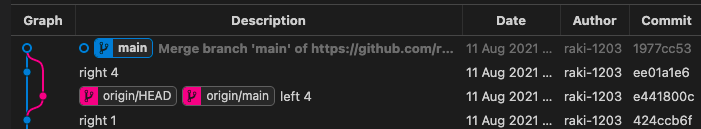

# [github 특강1] 이고잉 강사님

[강의자료주소](https://github.com/egoingsb/offline/wiki/git)

---

git client : git command line, source tree, visual studio code 내장되어 있음

git server : github.com, gitlab, bitbucket 등

git client는  visual studio code git 을 사용

git server는 github.com 을 사용

---

history 에서 선택하고 browse files 누르면 이전 버전으로 변경가능

---

issue - 게시판 기능

---

extension - git graph

- 화면 하단 아래쪽에 Git Graph
- 버전이 쫙 나열 됨
- 
---

- terminal에서
  - git config --global user.name <자기 이름>
  - git config --global user.email <자기 이메일>
  - git config --list

---

- origin/main 의 의미는?
    - origin/main 위에서 부터 커밋이 되어있는 것들은 내 컴퓨터에만 있는 것들
    - main이 아직 push 하지 않았음을 의미

---

- push 하면
  - origin/main 이 제일 상단으로 이동
  - 자동으로 push 되지 않는 이유는 정교하게 컨트롤하기 위해서

---

- pull 하면
  - origin에 올라온 것들을 동기화

---

- 동시에 commit 하면 어떻게 될까?
  - 먼저 push한 사람이 있으면
  - 뒤에 push한 사람이 push 하면 어떻게 될까?
    - git이 reject(거절) 함
  - 일단 pull 해서 떙겨와야 함

    
  
  - Merge branch git이 자동으로 만든 것임
  - 왼쪽이 작업한 것과 오른쪽이 작업한 커밋을 가지고 만든 커밋임
  - 그 다음에 push가 가능
  - 먼저 push 한 사람도 pull 땡겨 받으면 둘이 똑같아 짐

---

- pull 이란?
  - fetch + merge
  - fetch : 다운로드
  - merge : 다운로드 한것을 합치는 것