# Sequential Models - RNN

- Sequential data : 일상적에서 다루는 대부분의 데이터
  - ex) 듣고있는 말, 비디오, 하고있는 손의 동작
- Sequential data를 처리하는데 어려움
  - 얻고 싶은건 하나의 label 이나 정보일 때가 많음
  - 정의상 길이가 언제 끝날지 모름
  - 내가 받아 들여야 하는 입력의 차원을 알 수가 없음
  - 몇개의 입력들이 들어오든 동작할 수 있는 모델이 필요!

## Sequential Model

> Naive sequence model
    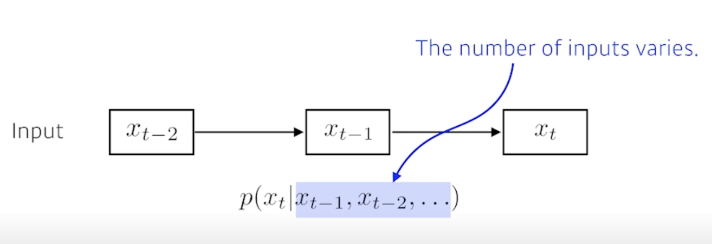

- 이전 데이터들이 들어왔을 때 다음 번을 예측
- 시점이 뒤로 갈수록 고려해야하는 conditioning vector의 숫자가 늘어남

> Autoregressive model
    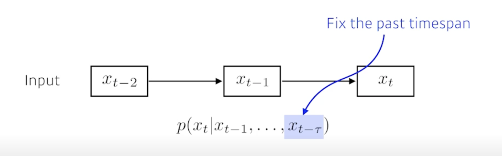

- Fix the past timespan
  - 과거의 몇개만 보는 것
  - ex) AR(1) : 현재의 이전 1개의 시점만 고려, AR(2) : 현재의 이전 2개의 시점만 고려

> Markov model (first-order autoregressive model)
    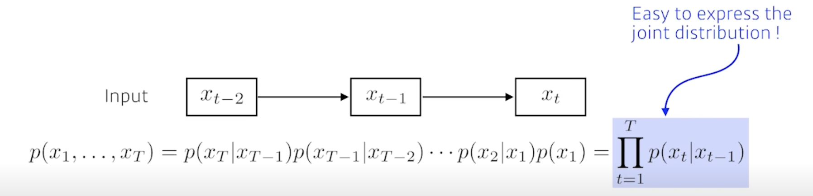

- 내가 가정을 하기에 나의 현재는 과거(바로 전 과거)에만 dependent 한 것
- 현실에서 얼마나 말이 안되는지를 예를 들자면
  - 내일의 수능 점수는 전날 공부한 것에만 dependent 한 것
- markov model 은 많은 정보를 버릴 수 밖에 없음
- 가장 큰 장점
  - Easy to express the joint distribution
  - 결합분포를 표현하기가 너무 쉬움

> Latent autoregressive model
    

- 중간에 hidden state를 하나 들어가 있음
- 이 hidden state가 과거의 정보를 요약하고 있다고 봄
- 다음번 tiem step은 이 hidden step 하나에만 dependent 함

---
## Recurrent Neural Network

> 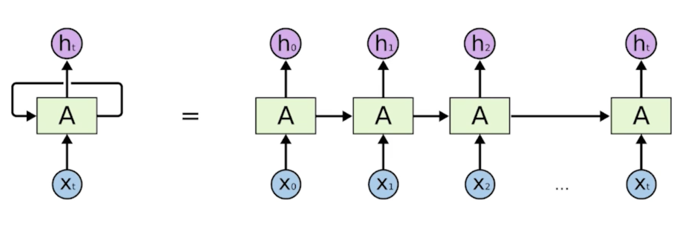

> Short-term dependencies
    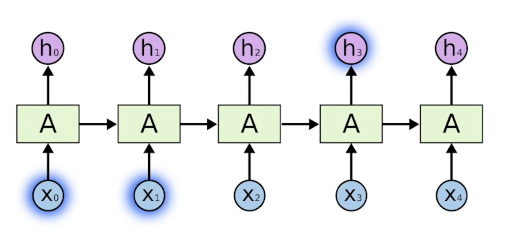

- 간단한 내가 말하는거에 있어서 몇 step 전에 있는 정보는 내가 현재 고려가 잘 되는데 한참 멀리있는 정보는 고려하기 힘듦
  - ex) 음성인식이나 문장이 나오면 답을 말하는 문제에서 문장이 길어져도 이전의 중요하게 생각하는 정보를 다 가지고 있다가 걔를 잘 요약을 계속하다가 필요할 때 써먹어야 하는데 5초전에 들은말을 기억을 하나도 못한다고 하면 이 모델이 혹은 사람이 할 수 있는 사고는 굉장히 제한적일 것 왜냐면 5초밖에 고려를 못하니까

> Long-term dependencies
    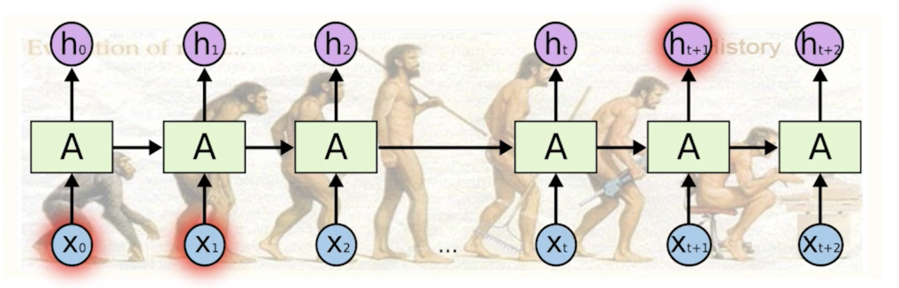

- 과거의 얻어지는 정보들이 다 summarize 되서 미래에서 그걸 고려해야 하는데 RNN 자체는 어떤 하나의 fix rule로 이 정보들을 계속 취합하기 때문에 이전에 꽤 먼 과거에 있던 정보가 미래까지 살아남기가 힘듦

> 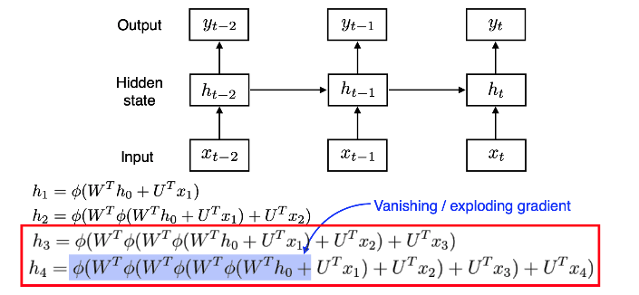

- RNN 학습이 왜 어려운지 얘기해 보면
  - 네트워크를 풀게되면 굉장히 큰 network 혹은 width가 커지는 time step 만큼 커지는 network 가 됨
  - 계속 중첩되는 구조가 들어가 있음
    - 이 거 때문에 $h_0$가 $h_4$까지 가기 위해서는 굉장히 많은 똑같은 weight를 곱하고 non-linear를 통과시키는 일이 생기게 됨
    - activation function이 sigmoid라고 생각해보자
    - sigmoid의 성질은 계속 값을 0~1로 만듦 다시 말하면 정보를 줄여버림
    - $h_0$에서 왔던 정보가 어떤 네트워크의 weight를 곱하고 squashing 곱하고 squashing 계속 반복하기 때문에 사실 거기서 나오는 값이 의미가 없어짐(값이 줄어듦)
    - sigmoid나 tanh가 아니고 ReLU를 쓴다고 해보자
    - 어쩌다 보니 W가 양수에요 그러면 ReLU는 0보다 큰값을 by pass 시켜버리기 때문에 W라는 숫자를 N번 곱하게 됨
    - 그러면 $h_0$의 값이 $h_4$로 갈 때 굉장히 크게 반영되겠죠 
    - activation이 sigmoid 같은 경우에는 vanishing gradient이 정보가 죽어버려서 학습이 안되거나 
    - activation을 ReLU를 쓰게 되면 expolding gradient 학습할 때 네트워크가 폭발해버려서 학습이 안되는 현상이 생김
    - 이거 때문에 RNN을 할 때 ReLU를 안쓰는 것도 있고 학습이 어려운 것도 있음

> Vanila RNN
    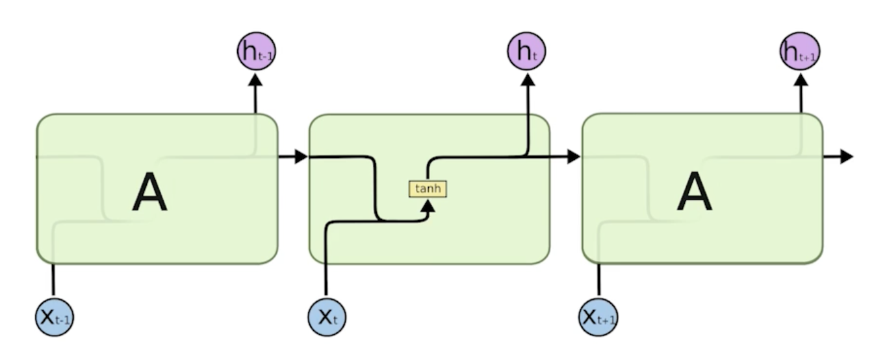

- x가 있고 x가 어떤 network를 통과(weight를 곱함)해서  그 다음에 이전에서 나온 cell state를 합쳐서(concatenate) network를 통과(weight를 곱함)해서 non-linear(tanh)를 나오는게 output으로 나오고 걔가 다음번 time-step에 들어감

---
## Long Short Term Memory

> LSTM의 구조
    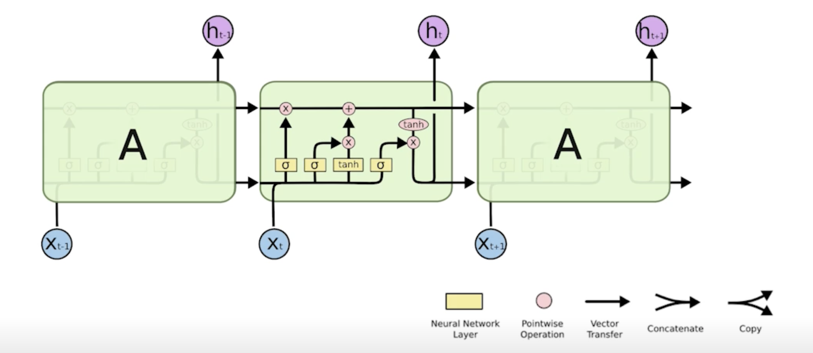

> 한 부분만 떼어와서 봄
    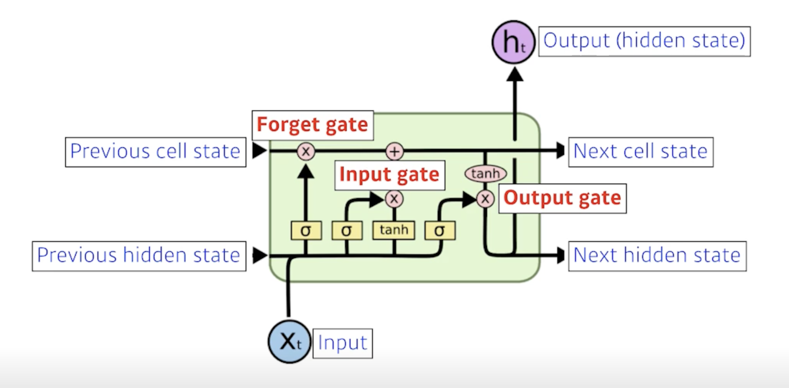

- $x_t$ : 입력
  - 일반적으로 language model이라 그러면 단어가 됨
  - 단어를 50000개를 쓰겠다고 하면 $x_t$는 50000짜리 one-hot-vector일 수도 있고 일반적으로는 걔가 줄어들어서 얻어지는 word-embedding(단어 하나마다 vector)가 들어감

- $h_t$ : output
  - hidden state라고 부름

- 위쪽 line : previous cell state
  - LSTM network 밖으로 나가지는 않음
  - 내부에서만 흘러가고 0~t까지 들어왔던 t+1개의 정보를 다 취합해서 summarize 해준 정보

- 아래쪽 line : previous hidden state
  - previous output
  - output(hidden state)이 위로도 나오기도 하지만 아래로도 흘러감
  - 아래로도 흘러간 output이 다음번의 previous hidden state로 들어감

- LSTM의 입력값은 previous cell state, previous hidden state, input이 됨
- input이 3개, output도 3개
- 그러나 실제로 나가는 건 hidden state 1개

- LSTM은 3개의 gate로 이루어져 있음
  1. Forget gate
  2. Input gate
  3. Output gate

> Core idea

- 핵심 아이디어는 중간에 흘러가는 cell state!!
  - cell state : time-step t까지 들어오는 정보를 요약하는 역할
  - 마치 컨베이어벨트라고 보면되는데 매번 time-step t마다 정보가 올라옴 이 때 어떤 정보가 유용하고 유용하지 않은지를 가지고 얘를 잘 조작해서 다음번으로 넘겨줌
  - 이 과정에서 어떤걸 빼고 어떤걸 저장할지를 정하는게 gate의 역할

> Forget Gate
    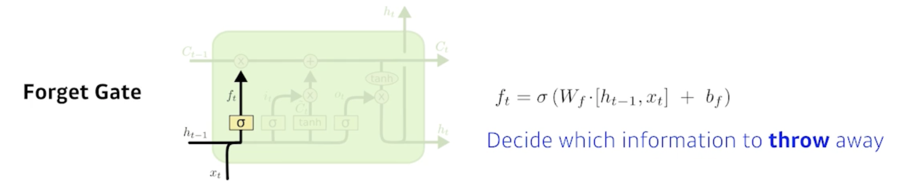

- Decide which information to throw away
  - 어떤 정보를 버릴지
- 현재의 입력 $x_t$와 이전의 output $h_{t-1}$이 들어가서 $f_t$라는 숫자를 얻어내게 됨
- $f_t$는 sigmoid를 통과하기 때문에 항상 0~1사이의 값을 갖게 됨
- 이전의 cell state에서 나오는 정보중에 어떤것을 버리고 어떤것을 살릴지를 정해주게 됨

> Input Gate
    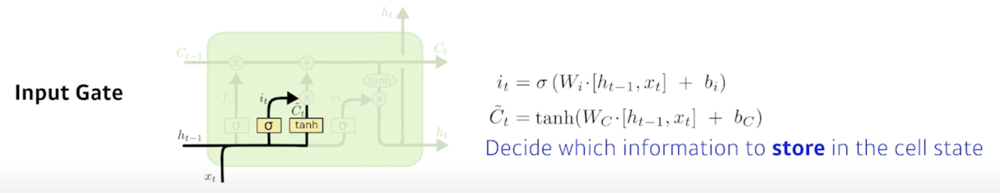

- Decide which information to store in the cell state
  - 현재 입력(정보)이 들오오면 이 정보를 무작정 cell state에 올리는게 아니라 이 정보중에 어떤 정보를 올릴지 말지 정함
- previous hidden state($h_{t-1}$)와 현재 입력($x_t$)을 가지고 $i_t$라는 정보를 만들게 됨
- 추가로 어떤걸 알아야 되냐면 우리가 올릴 정보를 알아야 함
- $\tilde{C_t}$ : cell state candidate라고 하는데 이전의 cell state와 현재의 입력이 들어와서 다른 neural network 따로 학습되는 neural network를 통해서 tanh를 통과해서 모든 값이 -1~1로 정규화된 값
- 현재 정보와 이전 출력 값을 가지고 cell staet 예비군인 셈
- 이전에 나왔던 cell state(이전의 정보가 summarize 된 cell state)와 내가 현재 정보와 이전 output으로 얻어지는 cell state candidate를 잘 섞어서 새로운 cell state로 업데이트 해야됨

> Update cell
    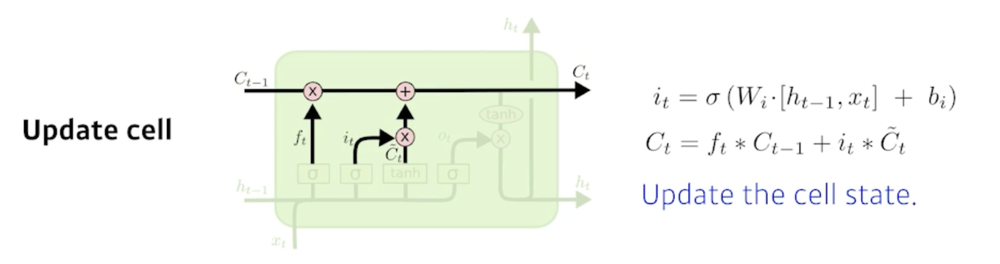

- Forget Gate에서 나온 $f_t$만큼 previous Cell state에 곱하고
- Input Gate에서 나온 $i_t$와 $\tilde{C_t}$를 곱해서 어느 값을 cell state에 올릴지를 정해서
- 이 두 값을 combine 한 걸 새로운 cell state로 update 함

> Output Gate
    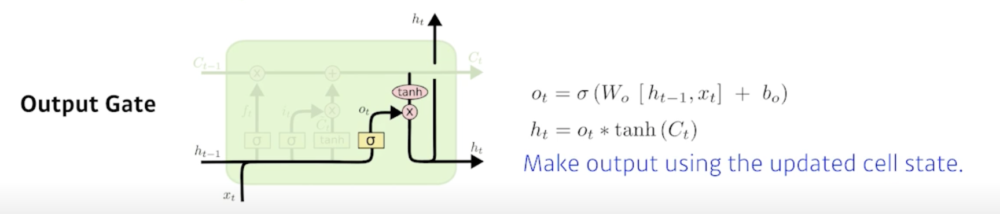

- 취합된 cell state에서 내가 어떤 값을 밖으로 내보낼지에 해당하는 Output Gate를 만들고 그 Output Gate만큼 곱해서 $h_t$(현재 output)으로 나오고 previous Hidden state로 흘러가게 됨

> To summarize
    

- Input, Previous cell state, Previous hidden state 이게 network 안으로 들어오게 되면 Previous cell state를 얼만큼 지워버릴지를 정하고 Previous hidden state와 Input을 가지고 어떤 값을 올릴지 $\tilde{C_t}$를 정하고 Update 된 cell state와 현재 내가 올릴 $\tilde{C_t}$(candidate cell state)를 다시 조합해서 새로운 cell state를 만들고 그 정보를 얼만큼 밖으로 빼낼지를 정해서 최종적인 출력값이 나옴 

---
## Gated Recurrent Unit(GRU)

- 조경현 교수님이 만든 architecture

> 

- 그림을 보면 알겠지만 gate가 2개밖에 없음
  1. Reset Gate
  2. Update Gate

- hidden state가 곧 output이고 걔가 다음번 previous hidden state가 됨
- cell state가 없음
- Output Gate가 필요 없어짐
- Reset Gate 가 Forget Gate 역할을 해줌
- 2개의 gate만 가지고도 LSTM과 비슷한 역할을 해줌
- 똑같은 Task에 대해서 GRU를 활용할 때 성능이 올라가는 경우가 꽤 있음

---
요즘에는 Transformer 가 많이 사용되서 LSTM이나 GRU가 많이 사용되지 않음
