# Sequential Models - Transformer

> what makes sequential modeling a hard problem to handle?
    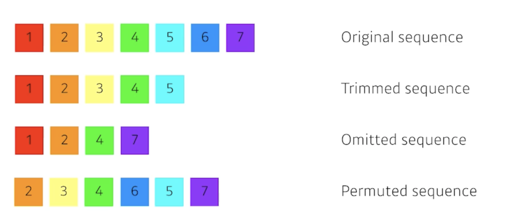
- 문장은 항상 길이가 달라질 수 있음 
- 중간에 단어가 빠질 수도 있음
- 좀 밀리거나 하는 경우도 있음
- 순서가 뒤 바뀌거나 

## Transforemr

> Trnasformer is the first sequence transduction model based entirely on attention
    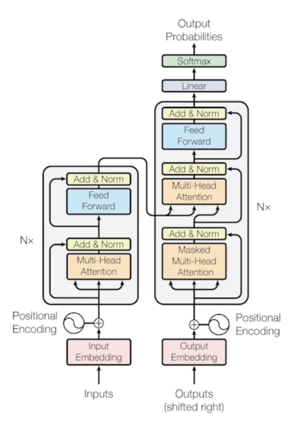

- RNN 이라는 것은 하나의 입력이 들어가고 또 다른 입력이 들어가고 이 때 이전 recurrent neural network에서 가지고 있던 cell state가 다시 다음번에 들어가고 이런 식으로 계속 반복해서 재귀적으로 돌아가는게 RNN이었는데
- Transforemr는 이런 재귀적인 구조가 없고 sequence를 다루는 model 인데 attention이라고 불리우는 구조를 활용했다 라는게 제일 큰 contribution이고 
 
> From a bird's-eye view, this is what the Transformer does for machine translation tasks
    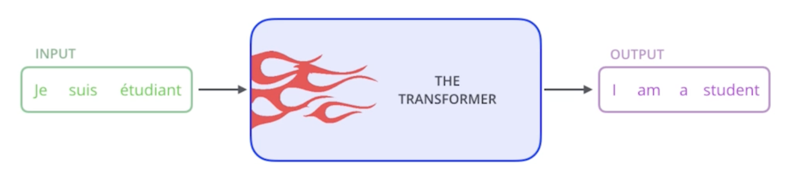

- 이 방법론은 sequential한 데이터를 처리하고 이 데이터를 encoding하는 방법이기 떄문에 NLP문제에만 적용되지가 않음
- 단순히 기계어 번역 뿐만 아니라 이미지분류, 이미지 detection, visual transformer, DALE (GPT-3기반) 등 다양한 곳에 사용

> If we glide down a little bit, this is what the Transformer does.
    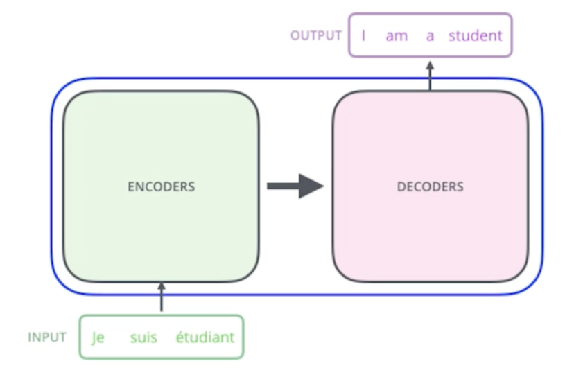

- 어떤 문장이 주어지면(여기선 불어), 이걸 영어로 바꾸는 것
- seq2seq model 이라고 함

> 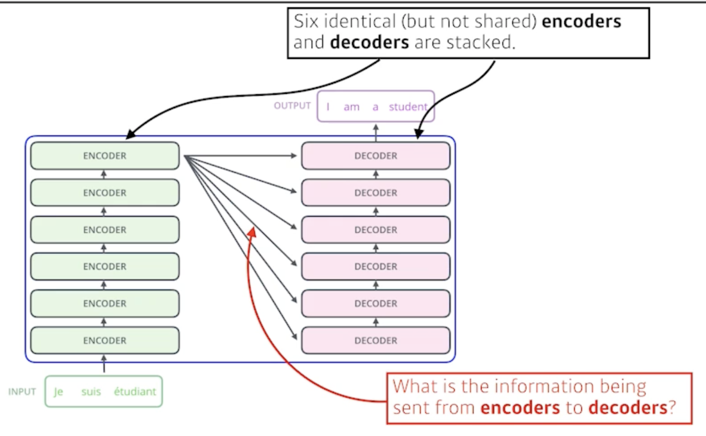

1. 입력시퀀스와 출력시퀀스는 단어 숫자가 다를 수 있구나!
2. 입력시퀀스의 도메인과 출력시퀀스의 도메인도 다를 수 있구나!

- 모델은 하나의 모델이 있는 것!

- 10개 단어가 들어가든 100개 단어가 들어가든 기존의 RNN처럼 재귀적으로 돌지 않고 한번에 10개 or 100개 단어를 encoding 가능
- generation 할 경우엔 단어단어마다 돌긴 함
- encoder 부분 self-attention이라구 불리우는 구조에서는 한번에 N개의 단어를 처리할 수 있는 구조
- encoder와 decoder 구조로 되어있고
- encoder와 decoder가 동일한 구조를 갖지만 network parameter가 다르게 학습되는 encoder와 decoder가 stack 되어 있는 구조

> encoder가 바뀔 수 있는 N개의 단어를 어떻게 한번에 처리할 수 있는지?
    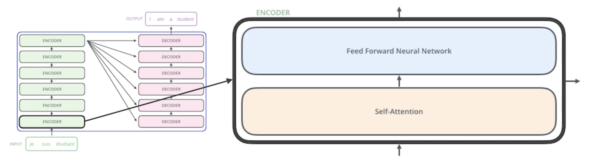

- encoder를 보면 결국 N개의 단어가 들어가는 것이다. vector가 200개, 150개 등이 한번에 들어간다고 보면 됨
- 그러면 self-attention이라는 구조와 feed-forward network구조를 2단 한단씩 거치는게 하나의 encoder고 그 출력대로 나오는 다시 N개의 출력값이 2번째 layer의 encoder로 들어가고 이런식으로 쭉쭉 stack이 되게 됨
- The Self-Attention in both encoder and decoder is the cornerstone of Transformer
  - 셀프어텐션이 왜 Transformer가 잘되게 됐는지를 나타내 줌

> First, we represent each word with some embedding vectors
    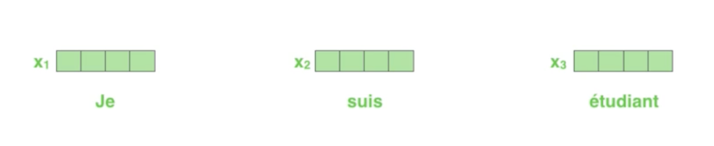

- 3개의 단어만 들어온다고 가정
- 3개의 vector가 있는 것

> Then, Transformer encodes each word to feature vectors with Self-Attention
    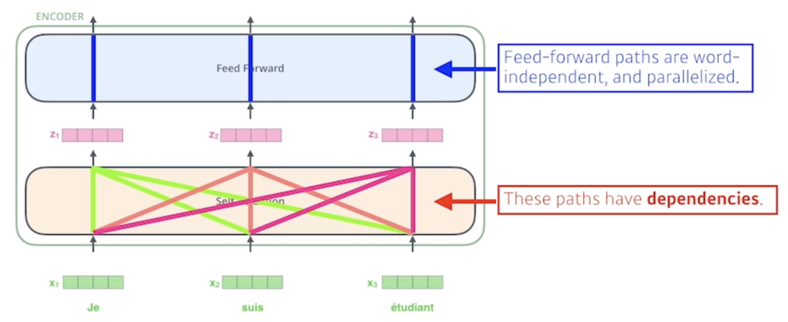

- 셀프 어텐션이 어떤걸 해주냐면 3개의 단어가 주어지면 3개의 vector로 찾아줌, 각 벡터마다
- 4개가 주어지면 4개가 나오고 5개가 주어지면 5개가 나오고
- 중요한 점은 vector 에서 vector로 가는게 하나의 feed forward network라고 볼 수도 있지만 여기서 중요한 self-attention은 하나의 vector 첫번째 $x_1$이 $z_1$으로 넘어갈 때 단순히 $x_1$의 정보만 활용하는게 아니라 $x_2$와 $x_3$의 정보를 같이 활용
- N개의 단어($x$)가 주어지고 N개의 $z$ vector를 찾는데 각각의 $r$번째 $x$ vector를 $z_i$로 바꿀 때 우리가 나머지 n-1개의 $x$ vector를 같이 고려하는게 바로 self-attention의 가장 큰 묘미라고 볼 수 있음
- self-attention은 서로 다른 단어에 대해서 dependency가 있음
- N개의 vector를 만들 때 나머지 N개의 vector를 모두 활용하게 됨
- 그러나, feed forward network는 서로 다른 단어에 대해서 dependency가 없음
- 각각의 vector를 그냥 변환해주는 것 밖에 못함

> Suppose we are encoding two words: Thinking and Machines
    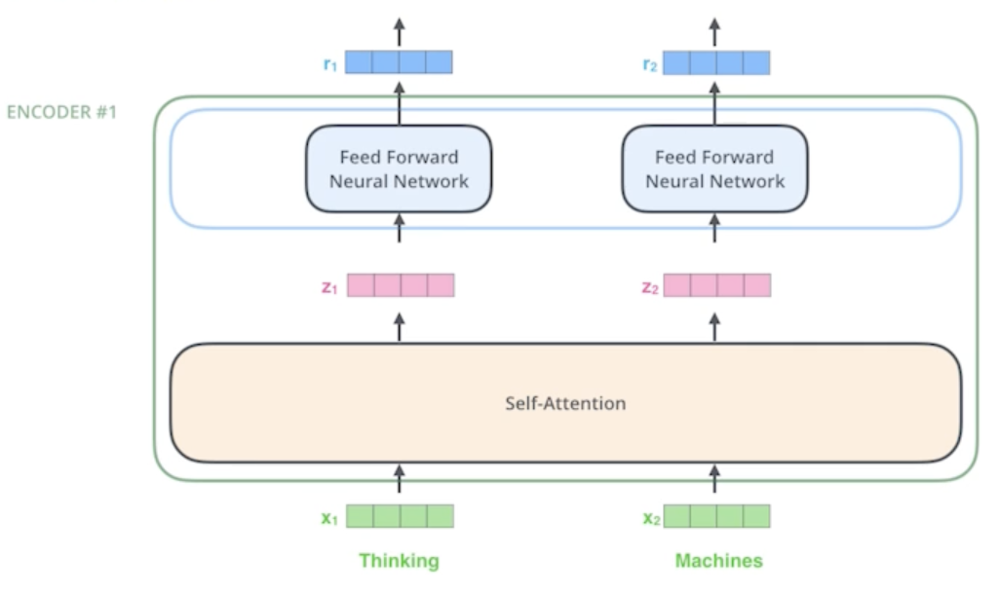

> Self-Attention at a high level
    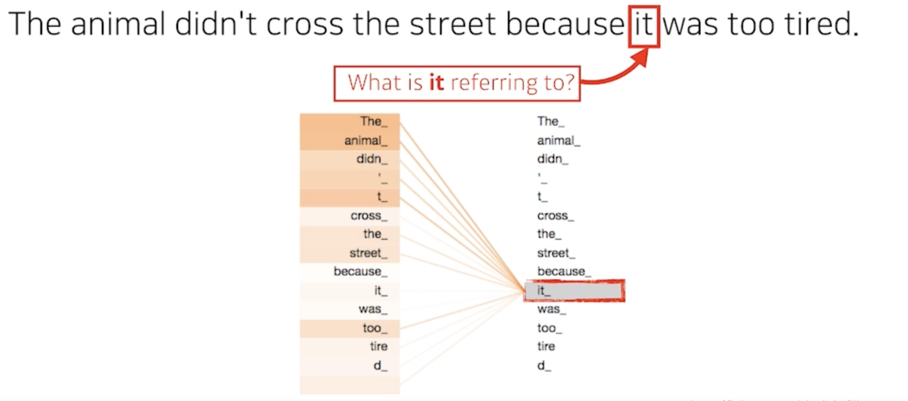
    
- 문장을 이해하려면 중요한 점중에 하나가 it이라는 단어가 어떤 단어에 depent하는지를 알아야 함
- 바꿔말하면 우리가 하나의 문장에서 있는 단어를 설명할 때는 단어를 그 자체로만 이해하면 되는게 아니라 그 단어가 문장속에서 다른 단어들과 어떻게 interaction이 있는지를 이해하는게 중요
- Transformer가 어떤 것을 해주냐면 it이라는 단어를 우리가 encoding(표현)을 할 때 다른 단어들의 관계성을 보게 되고 특별히 학습된 결과를 보게되면 이 it이 animal과 굉장히 높은 관계가 있다고 알아서 학습이 됨
- 이런식으로 학습이 되어있기 때문에 더 잘 단어를 표현할 수 있고 기계가 단어를 문장구조 속에서 더 잘 이해할 수 있음

> 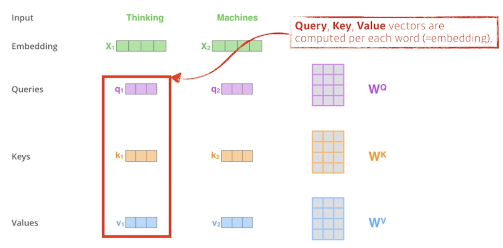

- 우리가 하나의 단어 Thinking 그리고 다른 단어 Machine이 주어졌을 때 기본적으로 self-attention구조는 3가지 vector를 만들어 냄
- 3개의 neural network 구조가 있다고 보면 됨
- 그 vector가 Query, Key, Value vector라고 불림
- 주어진 하나의 단어가 주어졌을 때 하나마다 3개의 vector를 만들게 되고 이 3개의 vector를 통해서 우리가 $x_1$이라고 불리우는 첫번째 단어에 대한 embedding vector를 우리가 어떤 새로운 vector로 바꿔줌

> Suppose we are encoding the first word: 'Thinking' given 'Thinking' and 'Machines'
    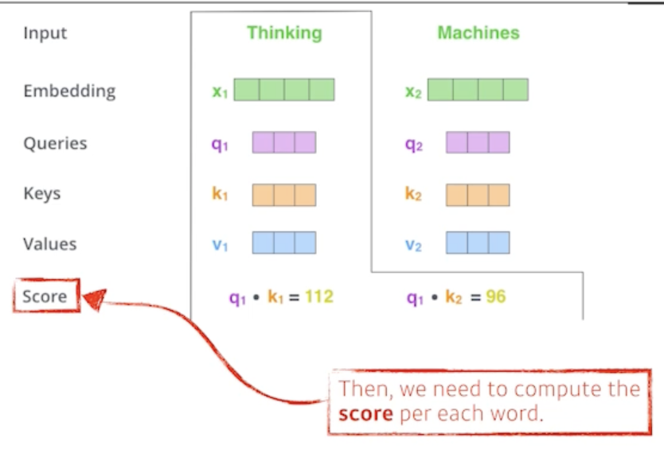
> 
> 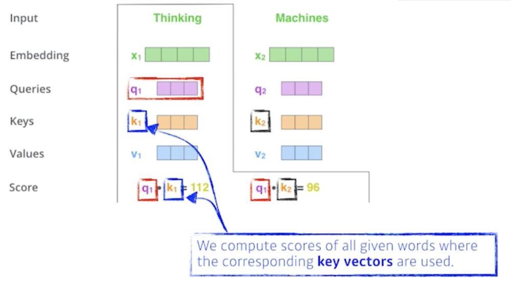

- 먼저 Thinking 이라는 단어를 찾을 떄 어떤 일을 해주냐면

- 각각의 단어마다 Query, Key, Value vector를 만들었고 그 다음에 score vector를 만들게 됨
- score vector가 뭐냐면?
  - Thinking에 대한 첫 번째 단어에 대한 score vector를 계산할 때 내가 encoding을 하고자 하는 vector의 Query vector와 나머지 모든 N개의 단어에 대한 Key vector를 구함
  - 그리고 그 2개를 내적을 함
  - 바꿔 말하면 이 2벡터가 얼마나 aling이 잘 되어있는지를 보고 얘가 어떤걸 의미하냐면?
    - i 번째 단어가 나머지 N개의 단어와 얼마나 유사도가 있는지 관계가 있는지를 정하게 됨

- 그래서 이 내적을 한게 i 번째 단어와 나머지 단어들 사이의 얼마나 interaction을 해야하는지를 알아서 학습하게 하는거고 이게 사실은 attention이죠
- 특정 task를 수행할 때 특정 time-step에 어떤 입력들을 더 주의깊게 볼지에 해당하는게 attention에서 나온 것
- Thinking이라는 단어를 encoding을 하고 싶은데 그 때 어떤 나머지 단어들 혹은 자기자신 들과 더 많이 interaction이 일어나야 되는지를 Query vector와 나머지 단어들의 Key vector의 내적으로 표현하는 것

> We compute the scores of each word with respect to 'Thinking'
    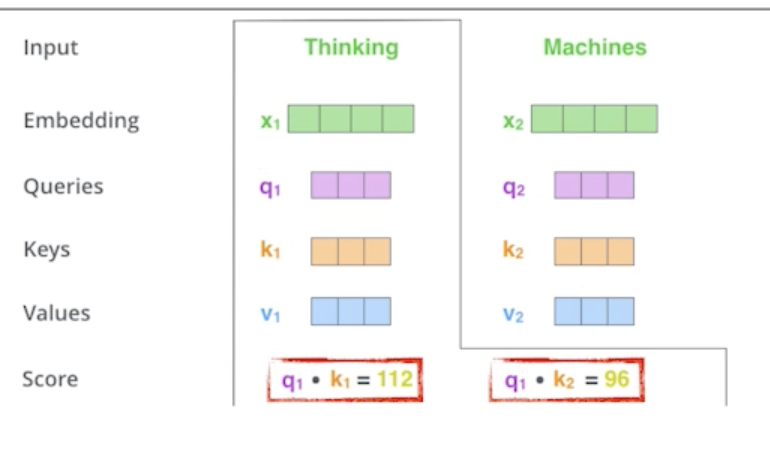

> Then, we compute the attention weights by scaling followed by softmax
    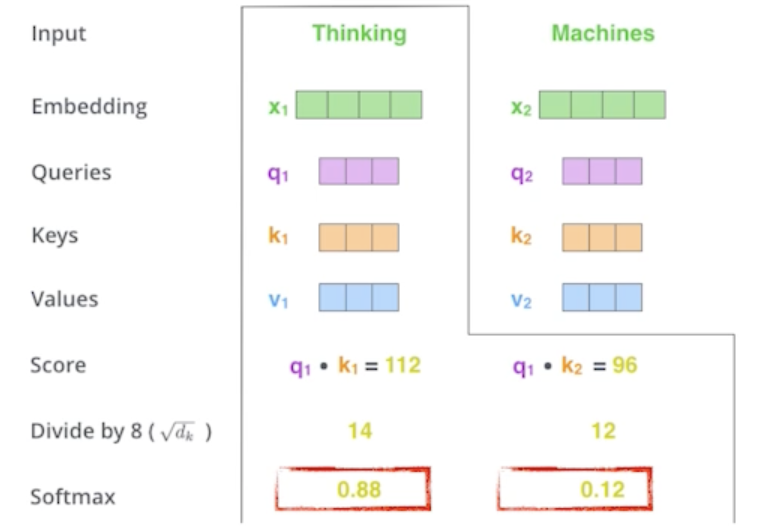

- 스코어 벡터가 나오면 얘를 한번 normalize 해줌
  - 8로 나눠주게 되는데 8이라는 숫자는 Key vector의 dimension에 dependent 함
  - 정확히는 Key vector가 몇 차원으로 만들지는 HYPER PARAMETER 이다.
  - 여기 논문에서는 64개의 vector로 만들었고 64 vector의 square root를 취해줘서 걔로 나눠주게 됨

- 값 자체가 너무 커지지 않게 만들어 줌

- 그리고나서 normalize score 가 sum to one (확률)이 되도록 softmax를 취해주게 됨
- 그러면 'Thinking' 이라는 단어가 자기 자신과의 attention에 대한 interaction의 값은 0.88이 되고 'Machines'과의 interaction은 0.12가 됨

> 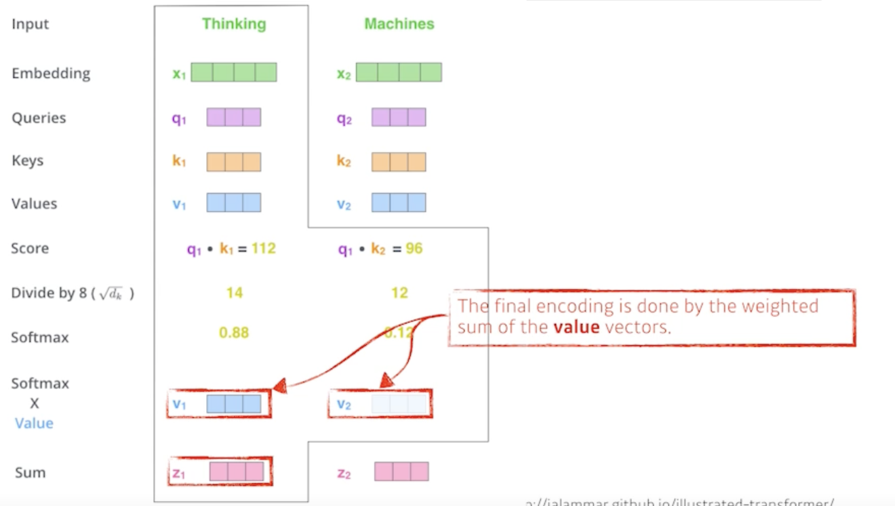

- 그 다음에 attention weight는 각각의 단어가 다른 단어 혹은 자기 자신 단어와 얼마나 interaction을 해야하는 거고 걔는 scalar로 나옴
- 중요한 것은 그 값이 어떤 값이 될지인데 걔를 Value vector로 가지게 됨
- 다시 한번 얘기하면, embedding vector가 주어지면 각각의 embedding vector 마다 Query, Key, Value vector들을 각각의 neural network를 통해서 만들었고 그리고 나서 나오는 Key vector와 Value vector의 내적으로 score vector를 만들었고 score vector를 scalar값으로 만들었고 걔를 softmax를 취해가지고 sum to one 이 되는 값을 만든 다음에 최종적으로 내가 직접적으로 사용할 값은 각각의 단어에서 나오는 단어 embedding에서 나오는 Value vector 들의 weighted sum 이 되는거다.?

> 정리하자면

- Value vector들의 weight를 구하는 과정이 각 단어에서 나오는 Query vector와 Key vector사이에서 나오는 내적 그거를 normalize 하고 softmax 취해주고 그렇게 해서 나오는 attention을 Value vector와 weighted sum을 한게 최종적으로 나오는 'Thinking' 이라는 단어의 혹은 'Thinking'이라는 단어의 embedding vector의 어떤 encoding 된 vector가 되는것이다.

> 이 과정을 거치면 하나의 단어에 대한 encoding vector가 나오게 됨

> 여기서 주의할 점!

1. Qeury vector와 Key vector는 항상 차원이 같아야함
   - 둘을 내적해야 하기 때문에
2. 하지만, Value vector는 차원이 달라도 됨
   - Value vector는 weighted sum을 하기만 하면 되니까
3. 그리고 우리가 최종적으로 나오는 'Thinking' 이라는 vector의 encoding 된 vector의 차원은 Value vector의 차원과 동일
   - 이 셋팅에서는 같아지게 됨

> Calculating Q, K, and V from X in a matrix from
    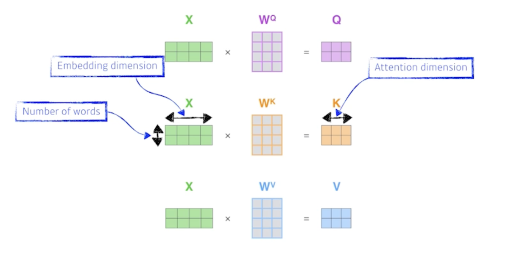

- X가 2 x 4 matrix 인데 단어가 2개고 각 단어의 임베딩 차원이 4인걸 뜻함
- 3개의 weight matrix를 찾는데 Query, Key, Value vector를 찾아내는 multilayer perceptron 이 있다고 생각
  - multilayer perceptron은 encoding 된 단어마다 모두 share 하게 됨
- 최종적으로 2개의 단어가 주어졌으니까 2개의 Key vector들 2개의 Query vector들 2개의 Value vector들이 나오게 됨
- 그러면 방금 얘기했던 Qeury vector, Key vector를 내적해서 scalar를 뽑고 걔를 square root 의 Key dimension으로 나눠주고 걔를 softmax를 취한 다음에 Value vector에 대해서 weighted sum을 하는 이 모든 과정이 방금 얘기했던 요 한 줄 수식으로 표현 됨
  
    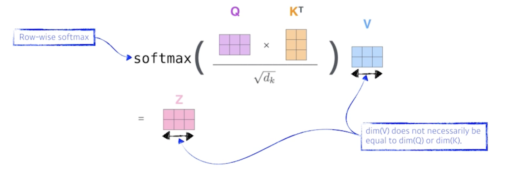

- 결국은 embedding vector가 나옴

> 여기까지가 single headed attention 이 됩니다.

> 왜 이게 잘될까?

- 이미지 하나가 주어졌다고 생각해보면 이미지 하나를 Convolution neural network나 multilayer perceptron으로 dimensibon을 바꾸면 input이 fix 되어 있으면 출력이 고정됨
- 왜냐면?   
  - 얘를 operation을 통해서 나오는 convolution filter나 아니면 내 weight가 고정되어 있기 때문

- Transformer 는 하나의 input이 고정되어 있다고 하더라도 그 network가 fix 되어 있다고 하더라도, 내가 이 encoding 하려는 단어와 그 옆에 있는 단어들에 따라서 내가 encoding 된 값이 달라지게 됨
- multilayer perceptron 모델보다 더 flexible한 모델
- 왜냐면?   
  - 입력이 고정되어 있을 때 출력이 고정되는게 아니라 입력이 고정되더라도 내 옆에 주어지는 다른 입력들이 달라짐에 따라서 출력이 달라질 수 있는 여지가 있는 것이다.
- 그래서 훨씬 더 많은 것을 표현할 수 있는게 Trnasformer 구조라고 생각할 수 있음

- N개의 단어를 한번에 처리해야 하고 그 competition cost가 $N^2$에 비례하게 되기 때문에 length가 길어짐에 따라서 처리할 수 있는 한계가 있음
- memory를 많이 먹기도 함
- 그러나 얻을 수 있는 이득은 훨씬 더 flexible하고 더 많은 걸 표현할 수 있는 network를 만들 수 있음

> Multi-headed attention (MHA) allows Transformer to focus on different positions
    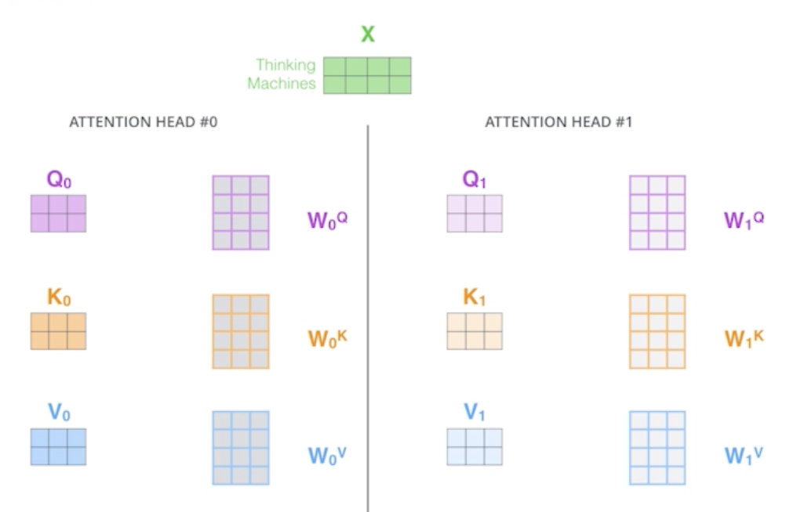

- 앞에서 얘기한 attention을 여러번 하는 것
- 하나의 입력에 대해서 하나의 encoding 된 vector에 대해서 Query, Key, Value를 하나만 만드는게 아니라 N개 만드는 것

> If eight heads are used, we end up getting eight different sets of encoded vectors (attention heads)
    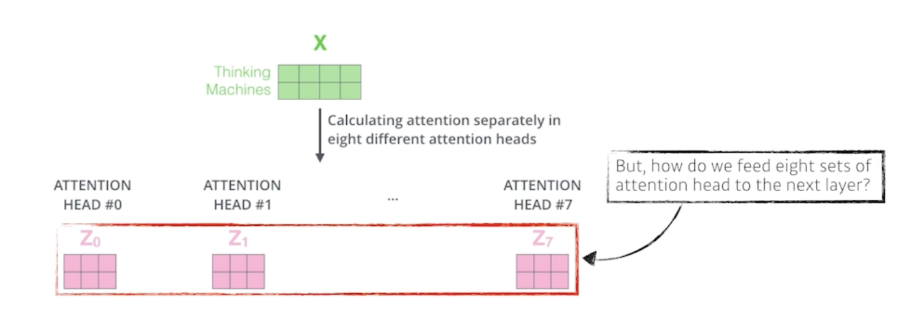

- 얘를 함으로써 우리가 얻을 수 있는건 결국 N개의 attention을 반복하게 되면 N개의 encoding 된 vector가 나오게 됨
- embedding 된 dimension과 encoding 되어서 self-attention으로 나오는 vector가 항상 같은 차원이어야 함

> We simply pass them through additional (learnable) linear map

- 8개의 혹은 N개의 output이 나오니까 여기서 설명하기로는 learnable linear map 원래가 10 dimension이었고 8개가 나왔으면 80dimension짜리 encoding된 vector가 있다고 볼 수 있는데 얘를 80 x 10짜리 행렬을 곱해서 10차원으로 줄여버린다라고 설명

> 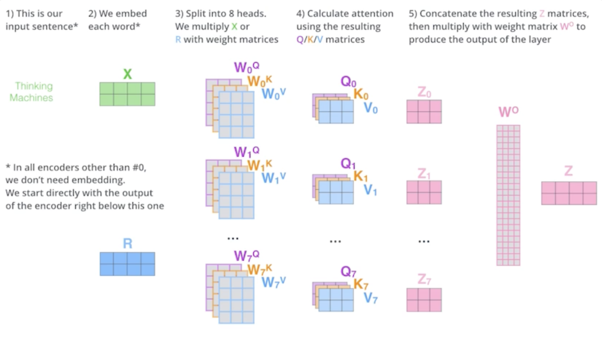

- 실제로 구현된 거에선 이렇게 구현되지 않음
- 원래 내 주어진 embedding dimension이 100이었고 내가 10개의 head를 사용한다고 하면 100dimension을 10개로 나눔
- 실제로 Query, Key, Value vector를 만드는건 10dimension짜리만 가지고 돌아가게 됨

> Why do we need positional encoding?
    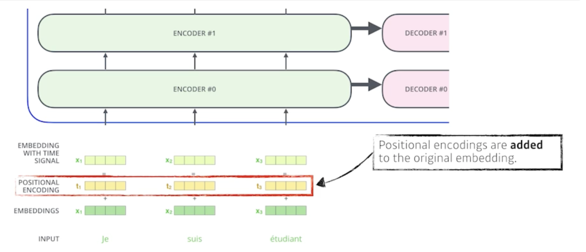

- 입력의 특정 값을 더해주는 것 bias 라고 볼 수 있음
- 왜 positional encoding이 필요할까?
  - N개의 단어를 sequential 하게 넣어줬다고 치지만 이 sequential 한 정보가 사실은 이안에 포함되어 있지 않음
  - abcd라는 단어를 넣어주거나 bcde를 넣거나 dacb를 넣거나 각각의 a단어 b단어 c단어 d단어가 encoding 되는 값은 달라질 수가 없음
- sequential 한 정보가 중요한데 이걸 표현하기 위해 사용

> This is the case for 4-dimensional encoding
    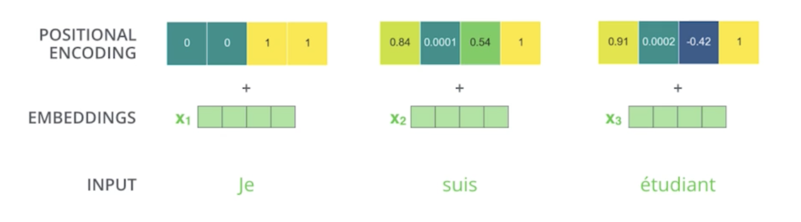

- 특정 방법으로 vector를 만들게 되고

> This is the case for 512-dimensional encoding
    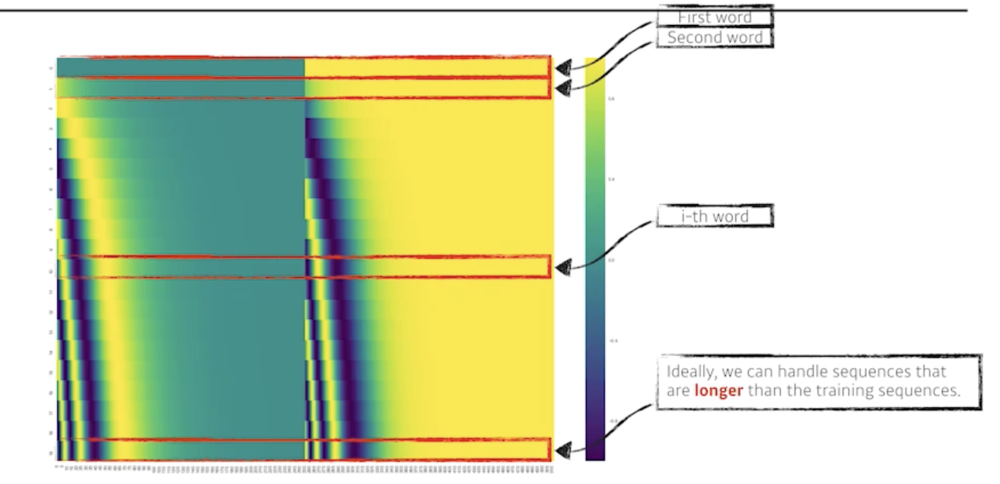

- 원래 논문에서 512-dimension이면 각각의 단어의 vector의 해당하는 값을 그대로 더해주는 것
- 일종의 값에 offset을 주는것

>  Recent (July, 2020) update on positional encoding
    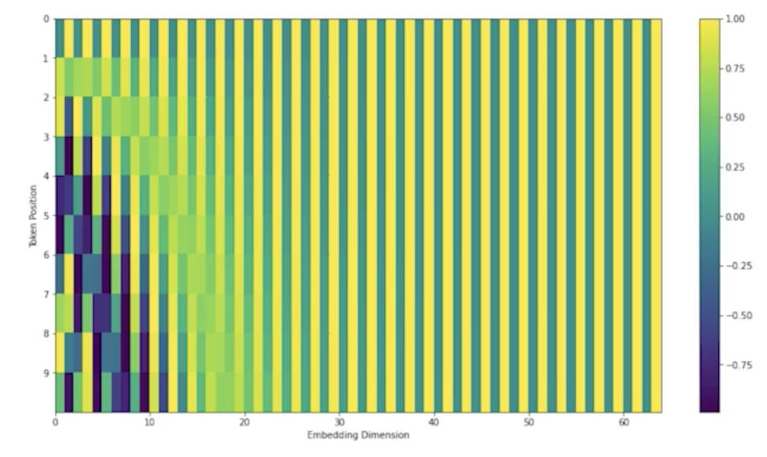

- 최근에는 positional encoding이 이렇게 바뀜

> 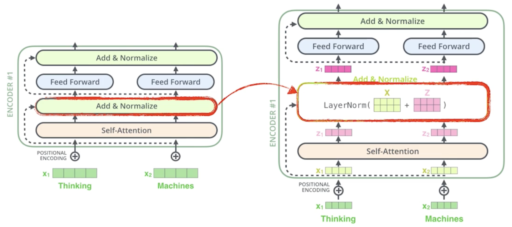

> Now, let's take a look at the decoder side.
    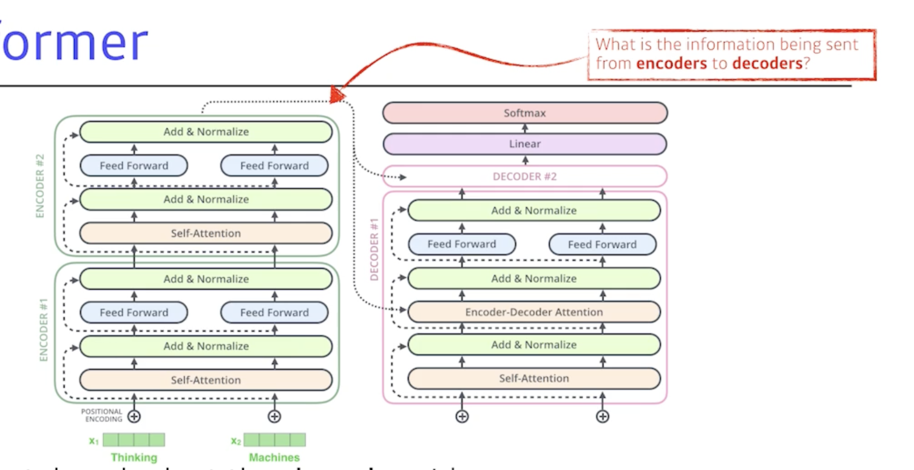

- encoding vector를 가지고 무언가를 생성해내는 작업
- encoder에서 decoder로 어떤 정보가 전해지는지가 중요

> Transformer transfers Key(K) and value(V) of the topmost encoder to the decoder

- encoder에 있는 단어들을 decoder에 출력하고자 하는 단어들에 대해서 attention map을 만들려면 input에 해당하는 단어들의 Key vector와 Value vector가 필요하고 얘네를 단순히 가장 상위의 layer에서 가져오고 
- 그렇게 해서 decoder에서 만들어지는 Qeury vector와 encoder 입력으로 주어지는 단어들로 얻어지는 2개의 vector들을 가지고 최종값이 나오게 됨

> The output sequence is generated in an autoregressive manner
    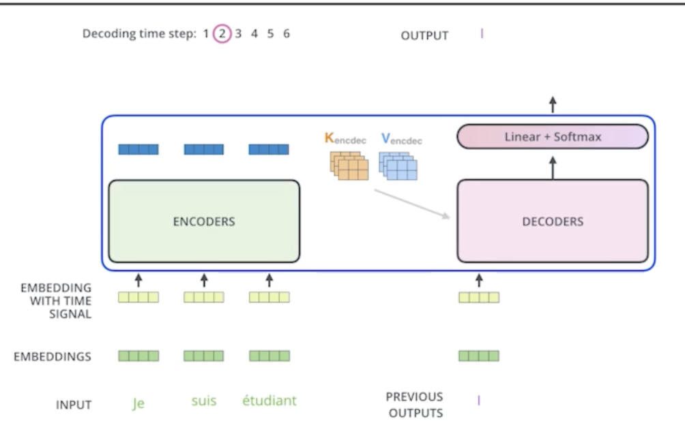

- 최종 출력은 autoregressive하게 하나의 단어씩 만들게 됨
- <EOS> special token이 나오면 끝나게 됨

> In the decoder, the self-attention layer is only allowed to attend to tearlier positions in the output sequence which is done by masking future positions before the softmax step.
    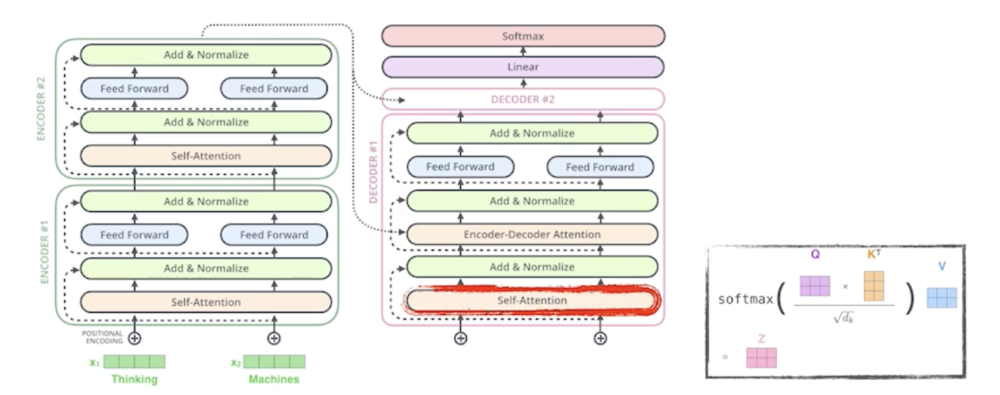

- 학습할 때는 내가 결국 입력과 출력 정답을 알고 있는데 내가 i번째 단어를 만드는데 이미 모든 문장을 다 알고 있으면 학습할 이유가 없으니까 학습단계에서 masking이라는 것을 함
- masking?
  - 이전 단어들만 dependent하고 뒤에 있는 단어들에대해서는 dependent하지 않게 만드는 일종의 방법
- 물론 inference 할 때도 masking한 걸 집어넣게 됨
- 미래에 대한 정보를 활용하지 않겠따

> The "Encoder-Decoder Attention" layer works just like multi-headed self-attention, except it creates its Queries matrix from the layer below it, and takes the Keys and Values from the encoder stack
    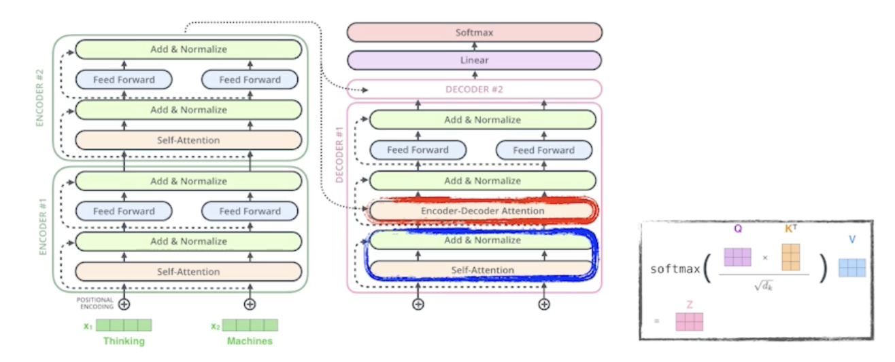

- Encoder-Decoder Attention : encoder와 decoder 사이의 관계
- 지금 decoder에 들어간 단어들, 지금까지 generation된 단어들만 가지고 Query를 만들고 Key, Value는 encoder layer에서 나오는 vector를 활용

> The final layer converts the stack of decoder outputs to the distribution over words
    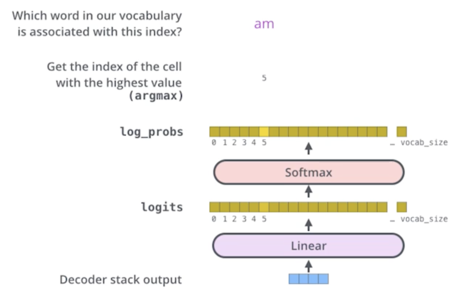

- 단어들의 분포를 만들어서 그 중에 단어하나를 매번 sampling하는 식으로 돌아가게 됨

---

## Vision Transformer

- 이미지 도메인에도 최근 많이 활용하고 있음
- 이미지 분류를 할 때 encoder만 활용하게 되고 encoder에서 나오는 첫번째 encoded vector를 그냥 classifier에 집어넣는 식으로 하게 됨
- 차이점이 있다면 NLP에서는 단어들의 sequence가 주어지는데 그걸 조금 더 이미지에 맞게 하려고 이미지를 특정 영역으로 나누고 각각의 영역에 있는 sub-patch들을 linear layer를 통과해가지고 걔를 마치 하나의 입력인것 처럼 넣어주게 됨
- 물론 positional embedding이 들어가게 됨
- 단순히 NLP에 활용되는게 아니라 vision영역에도 활용 되고 있다.

---

## DALL-E

- 문장이 주어지면 문장에 맞는 이미지를 만들어냄
- Transforemr에 있는 decoder 만 활용했고 이미지도 16x16그리드로 나눠서 sequence로 집어넣고 문장도 역시나 단어들의 sequence로 집어넣어서 2개를 조합해서 새로운 문장이 주어졌을 때 그 문장에 대한 이미지를 만들 수 있는 방법을 제안
- 아직은 blog밖에 공개가 안되서 자세한 방법은 모름
- OPEN-AI 분들이 GPT-3 구조를 사용했다고 함
- 