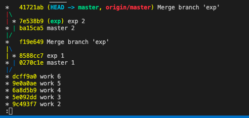
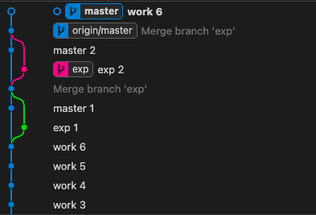
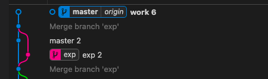
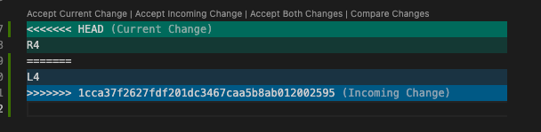

# [github 특강2] 이고잉 강사님

> local folder를 가지고 git repository 생성

1. vsc 사용
2. local folder 하나 생성
3. source control 에서 initialize repository 클릭
4. 새파일 만들고
5. 커밋

> 복수개의 작업을 각각 commit

- staging area : staging change 버전을 분리하기 위한 일종의 장바구니 역할
- \+ : add

> .git 폴더가 repository

> 버전 관리 기능(시간여행)

- git graph에서 Head는 현재 워킹 디렉토리가 어느 버전인지 알려준다.
- checkout head를 바꾼다.
- 마지막 버전은 master가 가르킨다
- master는 마지막 버전이 어디였는지를 가리킨다.
- 원래 버전으로 돌아가려면 어떻게 하는가?
  - 빈 공간을 클릭하고 checkout 하면 master의 테두리가 회색
  - master를 선택하고 checkout master를 선택하면 master의 테두리가 파란색이 됨
- 시간여행 했다가 돌아올 때 master로 checkout 합니다.
- 시간여행할 때는 work 1으로 checkout 하고 돌아올 때는 master에서 checkout branch 한다.

> create branch

- master 옆에 똑같이 생긴 애가 생김
- master는 default branch
- exp라는 사용자 정의 branch를 만든 것
- 테두리가 진한 곳이 지금은 master
- 실험적인 걸 해보려면 head가 exp를 향하게 해야 함
- exp에서 checkout branch를 해서 exp테두리가 진해지게 만듦

> branch 에서 새로운 작업

- branch 선택하고 새로운 파일을 만들어 version을 추가
- 이 때 exp가 commit한걸 따라감
- 왜? head가 exp를 가르키고 있기 때문

> branch 에서 실험이 끝나고

- 실험적인 작업을 적용할 수 있는 상태가 아니면 그냥 두거나 delete branch 하면 됨

- 실험이 끝나서 성공했다면 어떻게 병합할건지에 대한 방향을 정해야 함
- master가 exp를 병합하려는 상황 실험이 끝났다는 것
- exp가 master를 병합한다는 건 exp에도 master의 작업은 필요한 거라 자주 병합해주는게 좋음
- master 테두리가 활성화된 상태에서 exp 우클릭 merge_into_current_branch 
- 병합 끝

> branch 는 버리기 쉽다! 병합하기 쉽다!

> 병합 된 내용은 반드시 똑같아야 함

> master가 exp의 코드를 병합하면 병합된 코드는 master가 따라감
> exp가 master의 코드를 병합하면 병합된 코드는 exp가 따라감

> 어느 정도 작업을 끝내고 원격저장소로 업데이트를 해야하는데 어떻게 할까?

- source control(소스제어) -> ... 클릭 -> remote(원격) -> add remote
- 원격저장소 주소적고 -> 원격저장소 별명으로 origin 이라고 적고 -> enter
- origin이 master를 가리킴
- local master branch 와 원격 master branch가 같은 곳을 가리키고 있다.

> terminal 에서 git

- git log --oneline
- git log --oneline --graph --all
    
- 그래프를 보면 무조건 Head를 찾고 내 저장소는 41721ab를 보고 있구나
- HEAD가 master를 보고 있구나
- 원격도 master를 보고 있구나

- master 와 origin/master가 다른 곳에 있으면 push를 안했구나
- push 하면 같아짐

> 협업

- 누군가가 먼저 작업하고 push 해놓으면 다른사람이 이후에 push 할 때 overwriting이 일어날까봐 push reject 당함
- push 하고 싶은 2번째 사람은 fetch 진행 
- fetch는 download 이기 때문에 절대 문제가 생기지 않음
- local의 master와 origin의 master는 다른 branch
- origin/master를 어떻게 해야 문제가 안생길까?
- origin/master 우클릭 -> merge into current branch 하면 파일이 병합됨
- 그 다음에 push
- 그러면 먼저 push 한사람은 pull해서 다시 가져와야 함

---
- 같은 줄을 수정하고 먼저 푸시하고 퇴근
- 두번째 사람은 push 못하니까 pull
    > 
- 충돌 발생
- 충돌은 git이 가지고 있는 정점의 기능
- 자동으로 합치는 것도 기능이고 자동으로 합치면 안되는 걸 합치지 않는것도 기능임
- Accept Current Change -> R4
- Accept Incoming Change -> L4
- Accept Both Changes -> R4\nL4
- 수정하고 싶은대로 코드 수정 후
- commit 후 push

> Pull Request(Merge Request)

- pull request는 github.com 에서 해야함
- feature/login이 master를 빨리빨리 병합해야 지옥을 경험하지 않을 수 있음
- feature/login에서 완성 한 다음에 push 하고 github.com 에서 merge 하고 난 다음에 master branch에서 pull 받으면 이제 다 합쳐짐

---
> repository -> settings -> maange access 여기에서 협업할 사람 추가할 수 있음