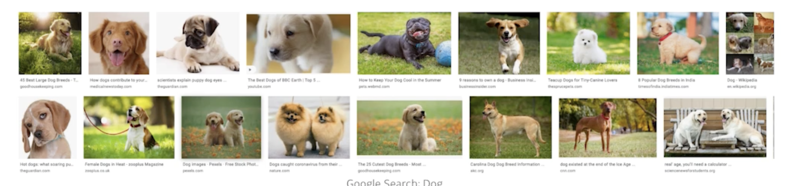
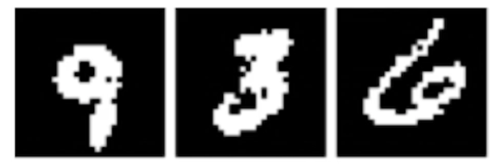
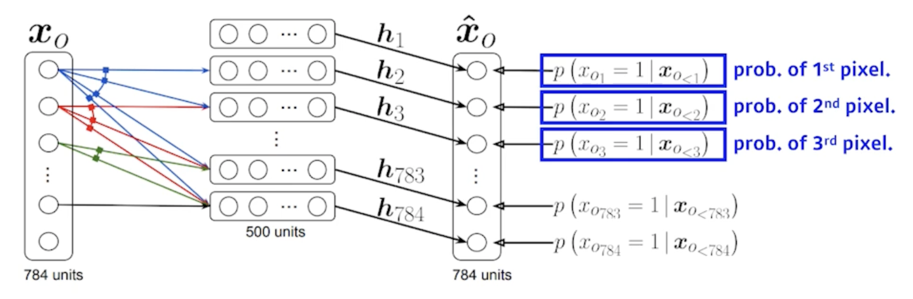
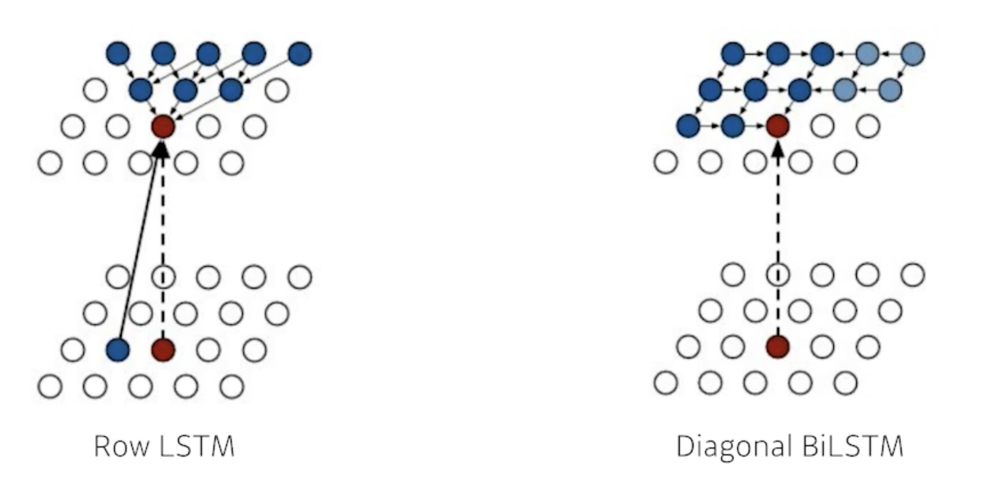

# Generative Models 1

## Introduction

> What I cannot create I do not understand

> What does it mean to learn a generative model?

- 생성모델을 학습한다는 것은 뭘까?
  - 그럴듯한 이미지를 만들거나 그럴듯한 문장을 만드는 것이라고 생각할 수 있지만 이것만이 전부는 아니다

## Learning a Generative Model
> Suppose we are given images of dogs.
    

> We want to learn a probability distribution $P(x)$ such that
  - 강아지를 sampling하는 어떤 모델을 만들고 싶을 수 있다
  - 서로 다른 강아지를 찍어낼 수 있는 것
  - 하지만 그것만이 아니다.
  - Generation: If we sample $x_{new}$ ~ $p(x)$, $x_{new}$ should look likea dog(sampling)
    - 강아지와 같은 이미지(training data에 있지 않은)를 그걸 많이 만들어 낼 수 있는 것
  - Density estimation: $p(x)$ should be high if $x$ looks like a dog, and low otherwise (anomaly detection)
    - 어떤 이미지가 들어 왔을 때 확률값 하나가 튀어나와서 이 이미지가 강아지 같은지 고양이 같은지 혹은 강아지가 아닌 것 같은지를 구분해 내고 싶은 것 - 이상행동 감지
    - Also known as, explicit models
      - 확률값을 얻어 낼 수 있는 모델을 explicit model이라고 부르고 단순히 generation만 할 수 있느 모델(Gan)을 implicit model이라고 부름
  - Unsupervised representation learning: We should be able to learn what these images have in common. e.g. ears, tail, etc(feature learning)
    - 얘는 조금 애매한데 강아지가 있으면 강아지는 귀가 2개고 꼬리가 있고 다른 특성들이 있다 사람과 다르게 이런 걸 feature learning이라고 부르고 feature learning이 generative model에 들어갈 수 있는지 없는지는 조금은 의아한데 standard 강의에서는 포함
  - Then, how can we represent $p(x)$?
    - 어떻게 $p(x)$를 만들까??
    - x라는 입력이 들어갔을 떄 어떤 값이 나오는 것일수도 있고 혹은 x를 샘플링 할 수 있는 어떤 모델일 수도 있음

> Generative Model을 Fully 학습했다고 하면 단순히 만들어만 낼 수 있는게 아니라 어떤 이미지가 강아지가 맞는지 아닌지를 구분할 수 있는 것까지를 포함

---
## Example

> Modeling an RGB joint distribution (of a single pixel)

- $(r, g, b)$ ~ $p(R, G, B)$
- r, g, b가 서로 independent하고 그리고 r 하나는 0~255의 256개 parameter를 가질 수 있음
- Number of cases?
  - 256 x 256 x 256
- How many parameters do we need to specify?
  - 256 x 256 x 256 - 1

- 하나의 rgb pixel을 우리가 fully distribution describe 하기 위해서 필요한 parameter 의 숫자가 엄청 많다는 걸 말하고 싶음

> Suppose we have $X_1, ..., X_n$ of $n$ binary pixels (a binary image)
    

- 각각의 pixel이 0 또는 1인 binary pixel이 있다고 해보고
- How many possible states?
  - n개의 pixel로 되어 있다면 2 x 2 x ... x 2 = $2^n$
- Sampling from $p(x_1, ..., x_n)$ generates an image.
- How many parameters to specify $p(x_1, ..., x_n)$?
  - 필요한 parameter의 수는 $2^n - 1$

- 엄청나게 많은 parameter가 필요함

> 그런데 우리가 알고있는건 일반적으로 기계학습에서 parameter의 수가 많아지면 많아질수록 학습은 어렵다!

---
## Structure Through Independence

> What if $X_1, ..., X_n$ are independent, then
$$p(x_1, ..., x_n) = p(x_1)p(x_2)...p(x_n)$$

- n개의 pixel들이 모두 independent하다고 하면 어떨까?

> How many possible states?
$$2^n$$

- 가능한 possible states는 $2^n$으로 똑같음
- 모든 pixel이 0 또는 1을 가질 수 있으니까

> How many parameters to specify $p(x_1, ..., x_n)$?
$$n$$

- 이 distribution을 표현하기 위해서 필요한 parameter의 숫자는 n개만 있으면 됨
- 왜?
  - 각각의 pixel에 대해서 parameter 1개만 있으면 됨
  - 근데 이 n개가 모두 independent함
  - 모두 독립적이기 때문에 다 더하면 됨

> $2^n$ entries can be described by just $n$ numbers! But this independence assumption is too strong to model useful destributions

- 이 independent 가정이 얼마나 말도안되는 가정인지 알 수 있음

## Conditional Independence

> Three important rules

- Chain rule:
$$p(x_1, ..., x_n) = p(x_1)p(x_2|x_1)p(x_3|x_1, x_2)...p(x_n|x_1, ..., x_{n-1})$$

    - n개의 joint distribution을 n개의 conditional distribution으로 바꾸는 것
    - 얘는 $x_1, ..., x_n$이 독립이 아니더라도 항상 만족

- Bayes' rule:
$$p(x|y) = \frac{p(x, y)}{p(y)} = \frac{p(y|x)p(x)}{p(y)}$$

- Conditional independence:
$$If x \bot y|z, then p(x|y, z) = p(x|z)$$

  - 얘는 가정(assumption)이다.
  - z라는 random variable이 주어졌을 때, x와y가 independent하다면 x라는 random variable을 표하는데 있어서 z가 주어지면 y는 상관이 없는 것
  - conditional distribution에 뒷단에 붙는 값을 날려 줄 수가 있음

> Using the chain rule,
$$p(x_1, ..., x_n) = p(x_1)p(x_2|x_1)p(x_3|x_1, x_2)...p(x_n|x_1, ..., x_{n-1})$$

- How many parameters?
  - 어떠한 가정도 하지 않았기 때문에 fully dependent model과 같은 parameter의 숫자를 갖는다고 예상가능
  - 아무것도 달라진 게 없으니까 식의 표현만 달라졌을 뿐
  - $p(x_1)$: 1 parameter (0 또는 1을 가질 수 있으니까)
  - $p(x_2|x_1)$: 2 parameters (one per $p(x_2|x_1 = 0)$ and one per $p(x_2|x_1 = 1)$)
    - 왜냐면?
    - $x_1$이 주어졌을 때 $x_2$가 0일 확률과 $x_2$가 1이 확률만 있으면 되니까
  - $p(x_3|x_1, x_2)$: 4 parameters
  - Hence, $1 + 2 + 2^2 + ... + 2^{n-1} = 2^n - 1$, which is the same as before
  - 같은 결과가 나옴

> Now, suppose $X_{i+1} \bot X_1, ..., X_{i-1}|X_i$ (Markov assumption), then
    - i+1번째 pixel은 i번째 pixel에만 dependent한 것
    - 10번째 pixel은 9번쨰 pixel에만 dependent하고 1~8번째 pixel에는 independent하다라는 가정
$$p(x_1, ..., x_n) = p(x_1)p(x_2|x_1)p(x_3|x_2)...p(x_n|x_{n-1})$$

- How many parameters?
$$2n-1$$

- Hence, by leveraging the Markov assumption, we get exponential reduction on the number of parameters
  - chain rule만 가지고 joint distribution을 쪼개면 parameter의 숫자는 달라지는게 없는데 쪼갠 다음에 Markov assumption을 가했더니 conditonal independence를 통해서 parameter의 수를 $2^n-1$개에서 $2n-1$개로 줄인 것

- 처음 봤던 fully independent model보다는 parameter의 숫자가 많음
- Auto-regressive models leverage this conditional independency
  - 이런 방법을 AUto-regressive model이라고 부르고 conditional independence를 잘 활용하는게 AR모델임

## Auto-regressive Model

> Suppose we have 28 x 28 binary pixels
    

- Our goal is to learn $p(x) = p(x_1, ..., x_784)$ over $x \in \{0, 1\}^{784}$
- How can we parametrize $p(x)$?
  - Let's use the chain rule to factor the joint distribution
  - $p(x_{1:784}) = p(x_1)p(x_2|x_1)p(x_3|x_{1:2})...
  - This is called an autoregressive model
    - autoregressive model: 하나의 정보가 이전 정보들에 dependent한 걸 말함
    - Markov assumption을 통해서 i번째 pixel이 i-1번째 pixel에만 dependent한 것도 autoregressive model이지만 i번째 pixel이 1부터 i-1번째 모든 히스토리에 dependent한 것도 auto regressive model이다.
  - Note that we need an ordering fo all random variables
    - 순서가 중요
    - 이미지에 순서를 매긴다는게 명확하지 않음
      - 이미지는 2차원 공간인데 순서는 1차원 줄을 매기는 거라서 
      - 순서를 매기는 방법에 따라서 성능이 달라질 수도 있고 방법론이 달라질 수도 있음
    - 어떤 식으로 conditional distribution을 주느냐에 따라서 모델의 structure가 달라지게 됨

---
# NADE: Neural Autoregressive Density Estimator

> 

> The probability distribution of $i$-th pixel is
$$p(x_i|x_{1:i-1}) = \sigma(\alpha_ih_i + b_i) where h_i = \sigma(W_{ix_{1:i-1}}+c)$$

- i번째 pixel을 1~i-1번째 pixel에 dependent하게 한 것
- 첫번째 pixel에 대한 확률분포를 어느 것에도 dependent하지 않게 만들고 
- 두번째 pixel에 대한 확률을 첫번째 pixel에만 dependent하게 dependent 하다는 건 첫번째 pixel값을 입력으로 하는 neural network를 만들어서 single scalar가 나온다음에 sigmoid를 사용해서 0~1값으로 바꾸고 
- 다섯번째 pixel에 대한 확률을 만들 때는 1~4번째 pixel을 다 받아서 걔를 neural network를 통과해서 neural network를 한번더 거쳐서 나오는 거를 sigmoid를 통과해서 확률이 되도록 하는걸 말을 함

- i번째 pixel은 i-1개의 입력에 dependent하게 됨
- 그래서 정확히 AutoRegressive model이고
- neural network 입장에서는 입력차원이 계속 달라짐 그래서 weight가 계속 커지게 됨
  - 첫번째 pixel에 대한 확률분포를 만드는데는 아무것도 필요없고
  - 세번째 pixel에 대한 확률분포를 만들때는 2개의 입력을 받는 weight가 필요하고 
  - 100번째 pixel에 대한 확률분포를 만들때는 neural network는 99개의 입력들을 받을수 있어야 함

> NADE is an explicit model that can compute the density of the given inputs

- 단순히 generation만 하는게 아니라 임의의 binary vector가 주어지면 얘를 확률 계산이 가능
- How can we compute the density of the given image?
  - Suppose we have a binary image with 784 binary pixels, $\{x_1, x_2, ..., x_{784}\}$
    - n개(784)개의 pixel이 주어지면 
  - Then, the joint probability is computed by
    $$p(x_1, ..., x_n) = p(x_1)p(x_2|x_1)...p(x_{784}|x_{1:783})$$
    - where each conditional probability $p(x_i|x_{1:i-}) is computed independently
  - In case of modeling continuous random variables, a mixture of Gaussian can be used
    - 마지막 layer에 mixture of Gaussian model을 활용해서 continuous 한 distribution을 만들겠다고 되어있음

> 일반적으로 Density Estimator가 들어가면 explicit 모델을 말할 때가 많음

---
## Pixel RNN

- 차이점이 있다면 fully connected layer를 사용하지 않고 Recurrent network를 사용해서 만들었음
- RNN을 통해서 generation을 하겠다라는 차이점
- ordering을 어떻게 하냐에 따라서 2가지 알고리즘을 붙임
  
  - Row LSTM
    - i번째 pixel을 만들 때 위쪽의 정보를 활용
  - Diagonal BiLSTM
    - pixel에 대한 가로 ordering을 했다고 했을 때 자기 이전 정보를 다 활용한 정보가 이 pixel의 값을 예측하는데 활용이 됨

 