# Generative Models 2

## Question

> Is an autoencoder a generative model?

- 그렇지 않다!

---
## Variational Auto-encoder

> Variational inference (VI)

- The goal of VI is to optimize the variational distribution that best mathces the posterior distribution
  - 내가 관심있고 찾고자 하는 posterior distribution을 제일 잘 근사할 수 있는 variational distribution을 찾는 일련의 과정을 variational inference라고 함
  - Posterior distribution(사전확률분포): $p_{\theta}(z|x)$
    - 나의 observation이 주어졌을 때 관심있어하는 random variable의 확률분포
    - 여기서 $z$는 latent vector가 됨
  - Variational distribution : $q_{\phi}(z|x)$
    - 일반적으로 posterior distribution을 계산하기가 힘듦 계산이 불가능 할 때가 많음
    - 그래서 얘를 학습할 수 있는 (최적화 시킬수 있는) 어떤걸로 근사하겠다라는게 목적
    - 근사하는 분포가 variational distribution이다.

- In particular, we want to find the variational distribution that minimizes the KL divergence between the true posterior
  - 무언가를 최적화하겠다라고 하면 우리에게 필요한건 objective(loss function) 이다.
  - KL-divergence 라는 metric을 활용해서 나의 variational distribution과 posterior distribution을 줄여보겠다

> 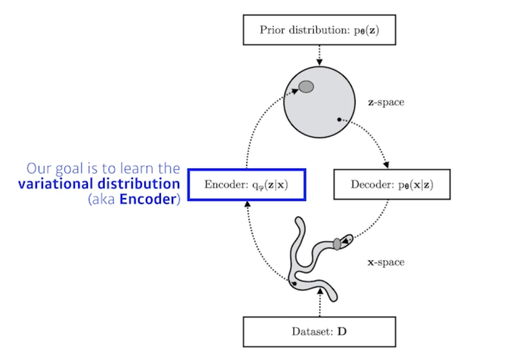

- 우리의 목적은 $p_{\theta}(z|x)$ 우리의 관심있어하는 posterior distribution을 variational distribution으로 찾겠다 
- 이게 variational auto-encoder 의 encoder 부분에 해당

> But how?

- 뭔지도 모르는 posterior distribution을 근사할 수 있는 variational distribution을 찾는다는게 어불성설
- 내가 무엇인지 알수도 없는 object와 가깝게 만드는거에요
- 그런데 이걸 가능하게 해주는데 variational inference 에 있는 ELBO Trick

    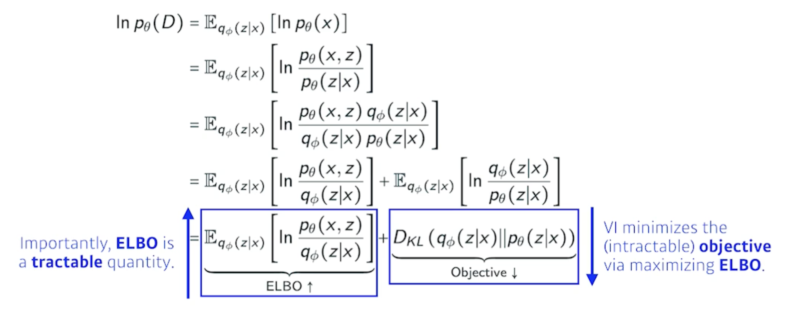

- variational inference의 목적이었던 variational distribution과 posterior distribution 사이의 KL-divergence를 줄이는 것이 사실은 목적인데 이게 불가능!!!!!
- 그래서 우리는 ELBO(Evidence Lower BOund)라는 것을 계산해서 얘를 키움으로써 반대급부로 내가 원하는 object를 얻고자 하는 것
- 이게 바로 variational inference 다.
- 이 수식이 모두 exact하기 때문에 결과론적으로 내가 뭔지도 모르고 계산할 수도 없는 어떤 임의의 posterior distribution과 내가 optimize 하려는 variational distribution사이의 거리를 KL-divergence로 정의되는 거리를 ELBO를 maximize 함으로써 얻을 수 있게됨

> ELBO can further be decomposed into
    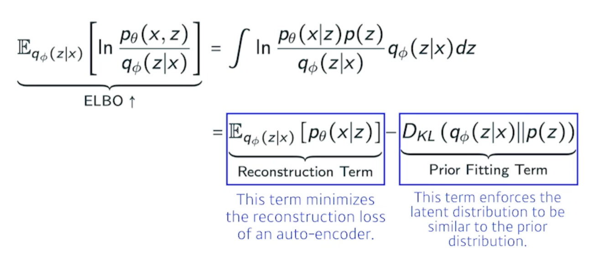

- x 라는 입력 이미지들의 공간이 있고 얘를 잘 표현할 수 있는 $z$라는 latent space를 찾고 싶은 것
- $z$라는 latent space에 해당하는 확률분포 $p(z|x)$ 아니면 posterior를 모르니까 이 posterior를 잘 찾기 위해서 variational distribution으로 혹은 encoder로 걔를 근사하고 싶은 것 근데 posterior를 모르므로 근사할 수 없으니까 ELBO를 maximize 하는 것이 KL-divergence 을 줄여주는 것과 같은 효과가 있더라!!!!!!!
- 그런데, ELBO라는 term을 잘 뜯어보면 reconstruction loss와 prior distribution으로 나뉜다
- 이것이 encoder를 통해서 x라는 입력을 latent space로 보냈다가 다시 decoder로 돌아오는 이 reconstruction loss를 줄이는 것이 바로 reconstruction term이고 prior fitting term은 x라는 이미지를 잔뜩 올려놨어요 그러면 latent space에 점들이 되겠죠 이 점들이 이루는 어떤 분포가 내가 가정하는 latent space의 prior distribution(사전 분포)와 비슷하게 만들어주는 이 2가지 object와 같다!!

- 내가 이걸 계산할 수 있더라 그래서 implicit model이 된다?

> Key limitation:

- It is an intractable model (hard to evaluate likelihood)
  - explicit한 모델이 아님
  - 왜?
    - 어떤 입력이 주어졌을 때 얘가 얼마나 likely 한지 알기가 힘듦
- The prior fitting term must be differentiable, hence it is hard to use diverse latent prior distributions
- In most cases, we use an isotropic Gaussian
  - iostropic : 모든 output dimension이 independent
    
    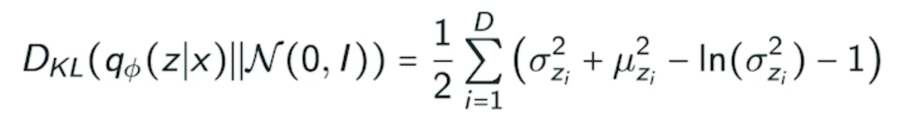

- 어떤 prior distribution이 gaussian이면 우리의 variational distribution과 prior distribution사이의 guassian의 대한 KL-divergence는 이렇게 이쁘게 나오게 됨
- 얘를 loss function에 집어넣어서 학습을 시키면 원하는 결과가 나오더라

> 가장 큰 단점은 encoder를 활용할 때 prior fitting term이 KL-divergence를 활용한다는 것이다

## Adversarial Auto-encoder

> It allows us to use any arbitrary latent distributions that we can sample
    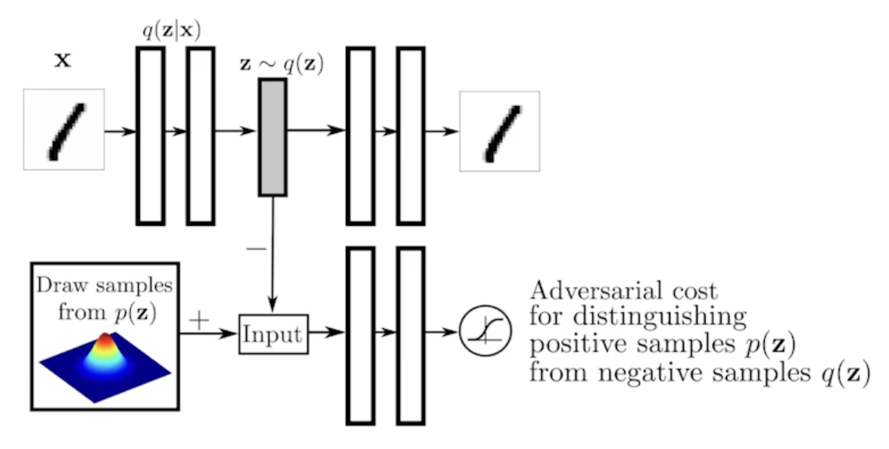

---

## GAN

> 

- 내가 학습의 결과로 나오는 generator를 학습하는 discriminator가 점차점차 좋아진다는게 가장 큰 장점!!
- implicit model

## GAN vs VAE

> 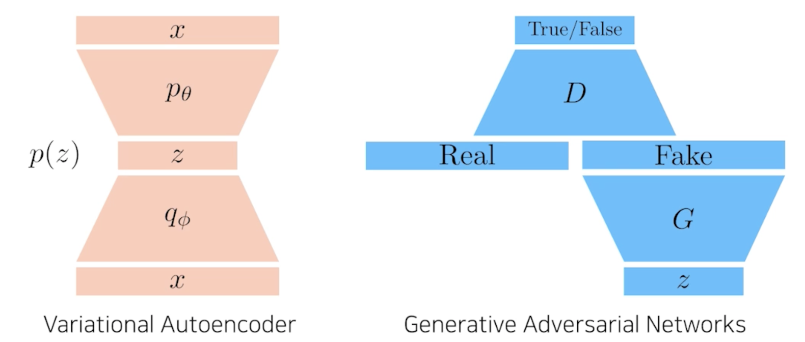

## GAN Objective

> A two payer minimax game between generator and discriminator

- minmax game : 한 쪽은 높이고 싶어하고 한 쪽은 낮추고 싶어하는 것
- For discriminator

    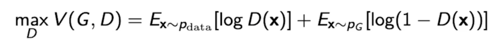

  - where the optimal discriminator is
  
    

    - generator가 fix가 되어있을 때 얘를 항상 최적으로 갈라주는 optimal discriminator는 이 수식이 높으면 True 낮으면 False

- Plugging in the optimal discriminator, we got

    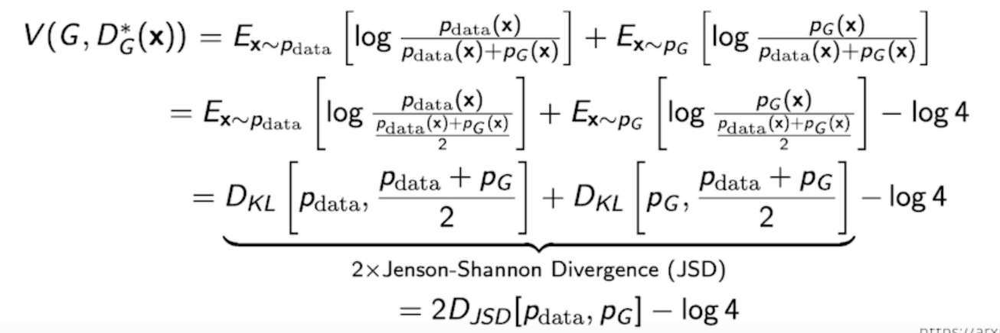

  - 이론적으로는 말이 되지만 현실적으론 약간 의아함

## DCGAN

> 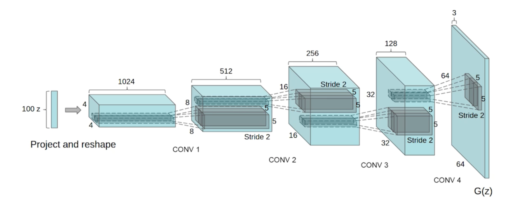

- GAN은 Dense layer를 사용했고 DCGAN은 이미지 도메인으로 했다 deconvolution을 활용
- ricky relu를 쓰자

## Info-GAN

> 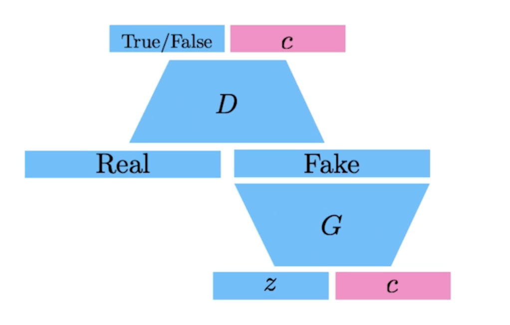

- 학습을 할 때 단순히 z라는 것을 통해서 이미지만 만들어내는게 아니라 클래스라는 c를 랜덤하게 집어넣는 것
- 결과론적으로 generation을 할 때 GAN이 특정 모드로 집중할 수 있도록 만들어 줌
  - 특정 모드 : 식이라는 걸로 나오느 one-hot vector (conditional vector)에 집중할 수 있게 만드는 것

## Text2Image

> 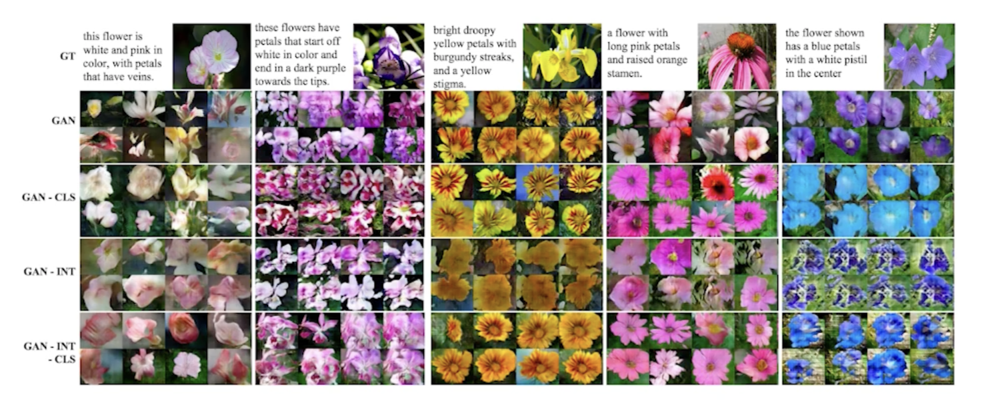

- 문장이 주어지면 이미지를 만듦
- 이 연구로 시작해 OPEN-AI에서 DALL-E가 나왔다.

## Puzzle-GAN

> 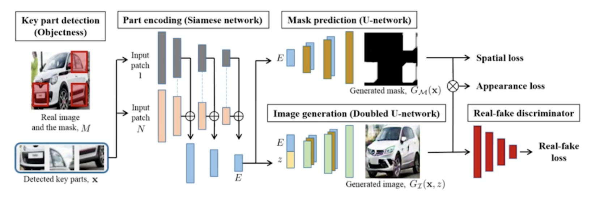

- 이미지 안에 sub-patch들이 있으면 sub-patch들이 들어가면 원래 이미지를 복원하는 것

## CycleGAN

> 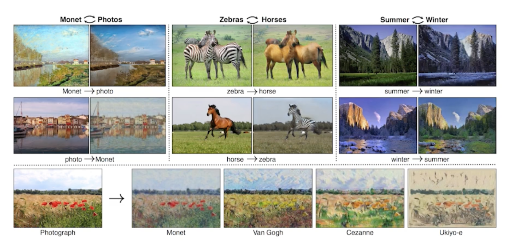

- GAN구조를 활용하지만 이미지 사이의 두개의 domain을 바꿀 수 있음
- Cycle-consistency loss는 꼭 알아야 하는 concept

    

  - 말을 얼룩말로 바꾼다고 하면
  - 두개의 똑같은 이미지에 말과 얼룩말의 사진이 필요한대
  - 얘는 그냥 야생에 떠도는 말 사진 잔뜩 있고 야생을 떠도는 얼룩말 사진 잔뜩 있을 때 알아서 임의의 말이 있는 이미지가 주어지면 얼룩말이 있는 이미지로 바꿔주는 것
  - 이를 위해서 GAN구조가 2개 들어감

## Star-GAN

> 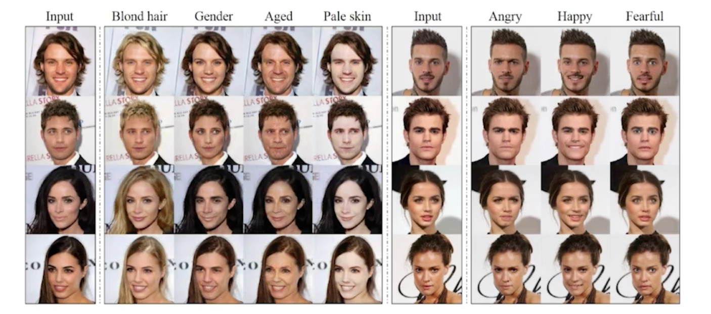

- 우리나라 논문
- 이미지를 단순히 다른 도메인으로 바꾸는게 아니라 내가 control 할 수 있게 만들어 줌

> GAN이라는 구조는 굉장히 고차원의 진짜같은 이미지를 만들어 낼 수 있기 때문에 많은 방법론이 나오고 있음

## Progressive-GAN

> 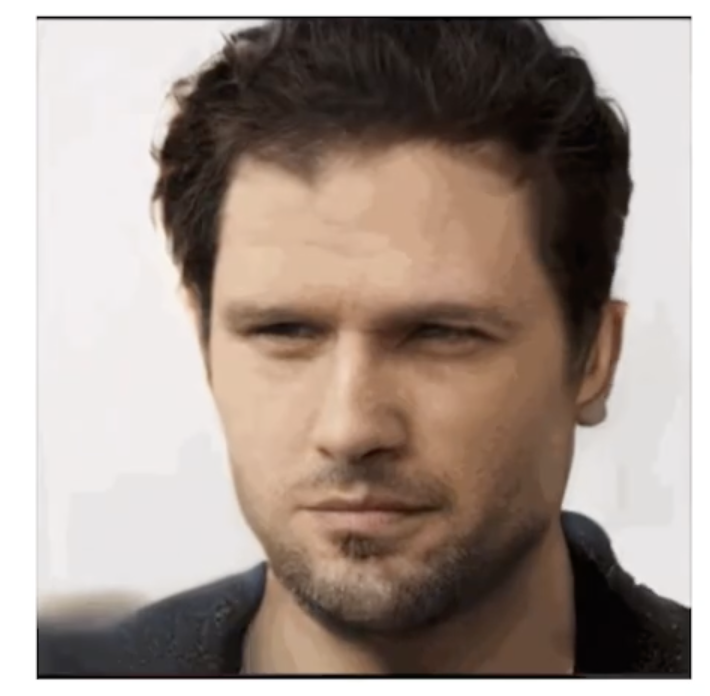

- 되게 고차원의 이미지를 잘 만들 수 있는 방법론
- 엄청나게 좋은 성능

> 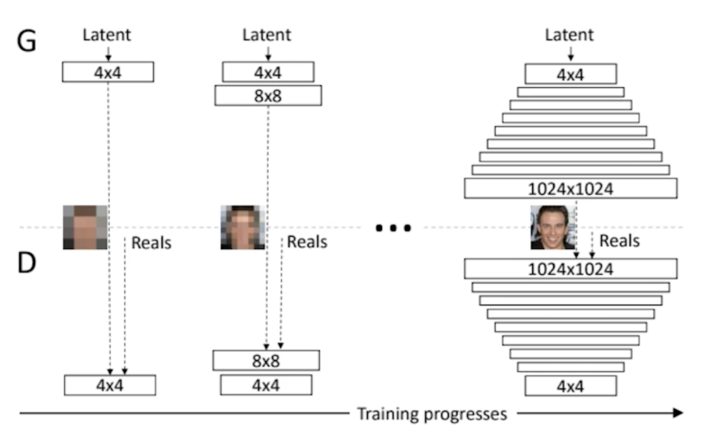

- 저차원 부터 고해상도의 이미지로 점점 늘려나가면서 학습을 시키는 training progresses가 큰 아이디어가 되서 굉장히 좋은 성능을 냄

