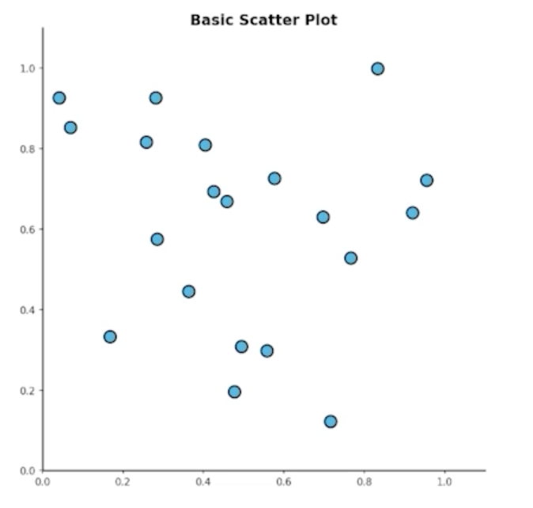
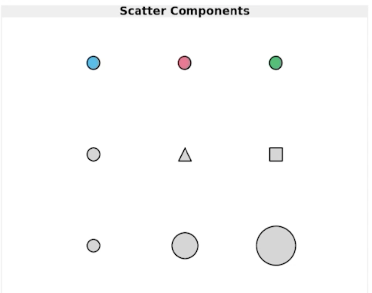
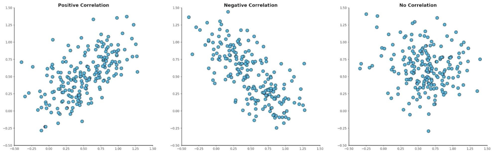
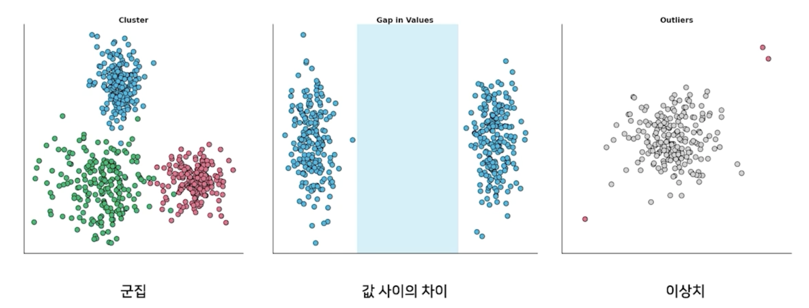
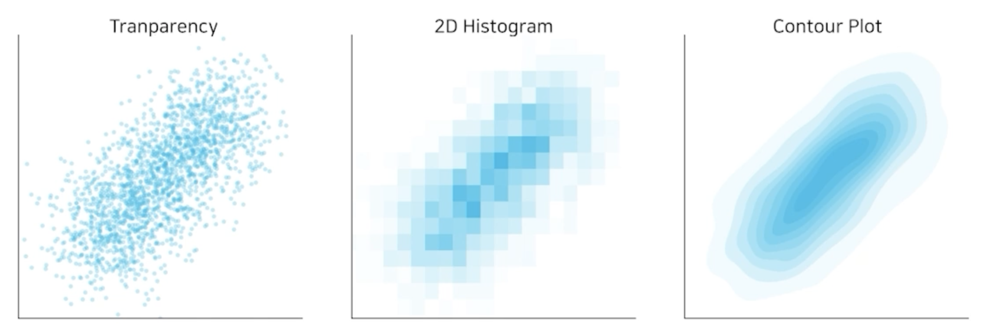
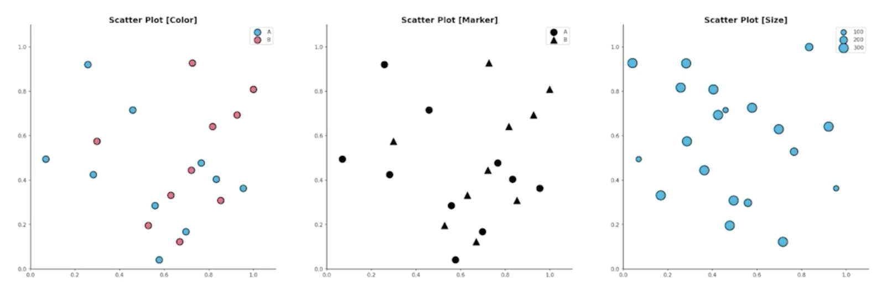
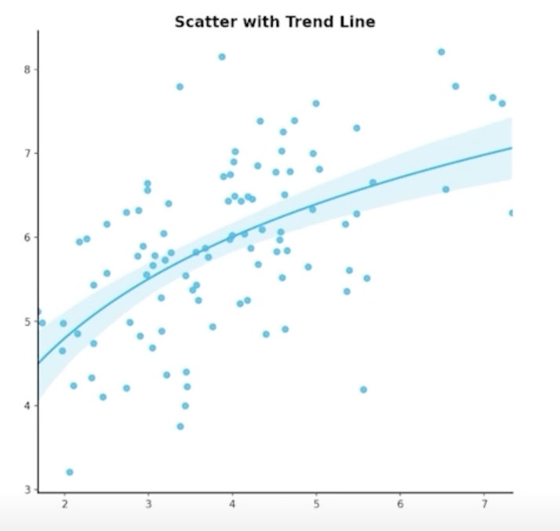
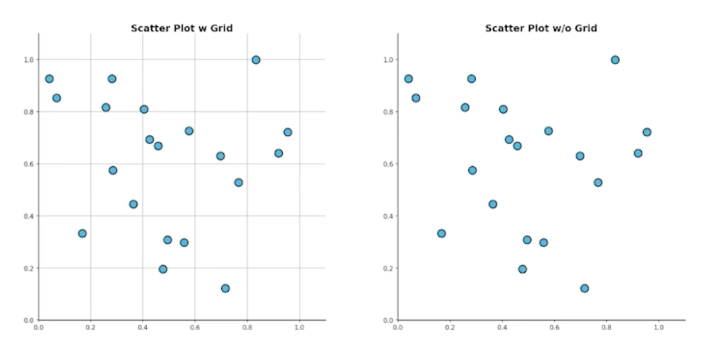

# Scatter Plot 사용하기

## 1. 기본 Scatter Plot

### 1.1 Scatter plot 이란?

> 

- Scatter plot은 점을 사용하여 두 feature간의 관계를 알기 위해 사용하는 그래프
- 산점도 등의 이름을 사용
- 직교 좌표계에서 x축/y축에 feature 값을 매핑해서 사용
- `.scatter()`를 사용

### 1.2 Scatter plot의 요소

> 

- 점에서 다양한 variation 사용 가능 (2차원 데이터에서 N차원 데이터로 확장 가능)
  1. 색 (color)
  2. 모양 (marker)
  3. 크기 (size)

### 1.3 Scatter plot의 목적

> 

- 상관 관계 확인 (양의 상관관계 / 음의 상관관계 / 없음)
- 실제 pearson 상관계수로 값이 있음

- 세 가지를 확인
    
    

- T-SNE, DBSCAN, K-Means 등 군집 알고리즘이랑 같이 사용

## 2. 정확한 Scatter Plot

### 2.1 Overplotting

> 

- 점이 많아질수록 점의 분포를 파악하기 힘들다!
  - 투명도 조정
  - 지터링 (jitering) : 점의 위치를 약간씩 변경
  - 2차원 히스토그램 : 히트맵을 사용하여 깔끔한 시각화
  - Contour plot : 분포를 등고선으로 사용하여 표현

### 2.2 점의 요소와 인지

> 

- 색
  - 연속은 gradient, 이산은 개별 색상으로
- 마커
  - 거의 구별하기 힘들다 + 크기가 고르지 않음
- 크기
  - 흔히 버블 차트 (bubble chart)라고 부름
  - 구별하기는 쉽지만 오용하기 쉬움 (원의 크기 비교)
  - 관계보다는 각 점간 비율에 초점을 둔다면 좋음
  - SWOT 분석 등에 활용 가능

### 2.3 인과관계과 상관관계

- 인과 관계 (causal relation)과 상관 관계 (correlation)은 다름!
  - 분석 과정에서 꼭 고민해볼 것
- 인과 관계는 항상 사전 정보와 함께 가정으로 제시할 것
- 상관관계는 추후 heatmap에서 다시 다룰 예정

### 2.4 추세선

> 

- 추세선을 사용하면 scatter의 패턴을 유추할 수 있음
  - 단, 추세선이 2개 이상이 되면 가독성이 떨어지므로 주의

### 2.5 ETC

> 

- Grid 지양. 사용한다면 최소한으로!
  - 색은 무채색으로
- 범주형이 포함된 관계에서는 heatmap 또는 bubble chart를 추천

Deep Residual Learning for Image Recognition