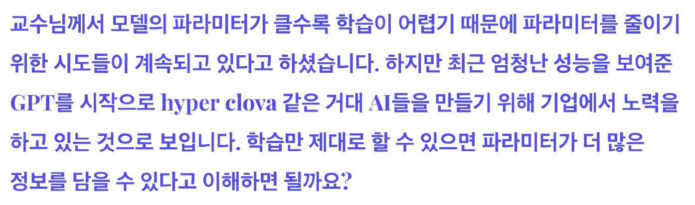

# [마스터클래스] 최성준 교수님

> 실제 생활로 딥러닝이 들어오기 위해서는 학습한 모델이 잘 못 작동하는걸 아는건 중요한 일

- 무언가를 모른다는 것?
- 모르는 것을 구분하는건 좀 다른 얘기가 된다

- Data uncertainty (aleatoric uncertainty)
  - 자연에 내재되어 있는 불확실성
  - 데이터를 더 모으고 학습한다해서 성능이 오를수가 없음
- Model uncertainty
  - 한번도 본적없는 자동차 이미지
  - 모델이 부족하거나 데이터가 부족해서 안되는 일
- Out-of-distribution (novelty detection)
  - 한번도 본적없는 데이터가 들어오는 경우
  - 고양이만 학습했는데 요다가 들어오는 경우

> Data uncertainty & Model uncertainty은 Input-to-Output에서 나오는 불확실성
predict에 대한 불확실성

> Out-of-distribution은 Input에만 불확실성

## Bayesian Neural Network

> Bayesian을 확률이라는 걸로 생각할 때가 많음

- 사후확률을 모델링한다는게 차이점
- 관심있는 대상의 분포를 찾는다

- 문제점
  - 뉴럴네트워크의 웨이트의 분포를 찾는 것이기 때문에 어렵다
  - 웨이트가 있지만 새로운 입력(x*) 가 들어왔을 때 출력값이 정해지지가 않은 것
  - 그럼 출력값 자체도 분포가 되는 것

더이상 모르겠습니다.

---
## Qeustion

> 인공지능이란 무엇인가?

- 모른다
- 굳이 대답을 한다면 데이터에서 무언가 얻어지는 거?/

>  가장 기본이 되는 논문 추천?

- 힘든 시기에 딥러닝을 하고 있음
- 신경쓰지말고 다봐라

> 유망할 딥러닝 세부 분야는?

- 저도 알고 싶네요
- 학회의 workshop을 가서 물어보는 것
- 너네 요즘 뭐하니? 물어보면 됨
  
> Transformer가 SOTA 일까요?

- 도메인이 어디냐에 따라 다르겠지만
- human이 중간에 들어가서 시그널을 받아들일 수 있는 유연한 구조가 뜨고 있다.

> 논문을 어떤 방법으로 읽으시나요?

- 비교할 결과라면 실험결과를 보는 편
- instroduction을 열심히 보는 편

> 석박 이전에도 로봇을 연구하셨나요?

- 이전 부터 관심 있었다.
- 계속 로봇을 하고 싶었다.

> 

- 개인적으로 방법론을 중요하게 생각하지 않음
- 개선할 부분을 정하는데 리더보드의 점수는 아님
- 새로운 문제를 만드는데 관심이 있음

> 

- 구현의 팁은 없고 많이 해볼수록 느는 것 같음
- 구현하지 않으면 이해할 수 없음
- 이해하려면 당연히 구현해봐야 함
- 구현능력은 엔지니어라면 당연히 가져야 하는 능력

> 

- 작년 기준으론 맞는 말이었는데 지금은 틀린말이다
- parameter가 늘어나면 성능도 같이 늘어남
- 학습만 제대로 할 수 있으면 parameter가 많으면 성능이 올라간다.
- 이 논문 꼭 읽어봐라
- https://arxiv.org/abs/2001.08361

> 

- 둘다 쓴다
- 둘다 잘 하고 다 할줄 앎