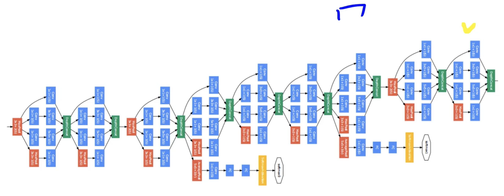
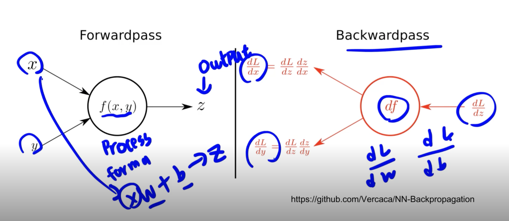

# AutoGrad & Optimizer

## 논문을 구현해 보자!

> 

- 수많은 반복의 연속

- Layer = BLock

- 블록 반복의 연속

## torch.nn.Module

- 딥러닝을 구성하는 Layer의 base class
- Input, Output, Forward, Backward 정의
- 학습의 대상이 되는 parameter(tensor) 정의


> 

## nn.Parameter

- Tensor 객체의 상속 객체
- nn.Module 내에 attribute가 될 때는 required_grad=True로 지정되어 학습 대상이 되는 Tensor
  - AutoGrad의 대상이 됨
- 우리가 직접 지정할 일은 잘 없음
  - 대부분의 layer에는 weights값들이 지정되어 있음

```python
class MyLinear(nn.Module):
    def __init__(self, in_features, out_features, bias=True):
        super().__init__()
        self.in_features = in_features
        self.out_features = out_features
        
        self.weights = nn.Parameter(torch.randn(in_features, out_features))
        self.bias = nn.Parameter(torch.randn(out_features))

    def forward(self, x : Tensor):
        return x @ self.weights + self.bias
```

## Backward

- Layer에 있는 Parameter들의 미분을 수행
- Forward의 결과값 (model의 output=예측치)과 실제값간의 차이(loss)에 대해 미분을 수행
- 해당 값으로 Parameter 업데이트

```python
for epoch in range(epochs):
    ...
    # Clear gradient buffers because we don't want any gradient from previous epoch to carry forwrad
    # 이전의 그레디언트 값이 지금 그레디언트 값에 영향을 미치지 않게하기 위해 초기화
    optimizer.zero_grad()

    # get output from the model, given the inputs
    outputs = model(inputs)

    # get loss for the predicted output
    loss = criterion(outputs, labels)
    print(loss)
    # get gradients w.r.t to parameters
    loss.backward()

    # update parameters
    optimizer.step()
    ...
```

## Backward from the scratch

- 실제 backward는 Module 단계에서 직접 지정가능
- Module 에서 backward 와 optimzier 오버라이딩
- 사용자가 직접 미분 수식을 써야하는 부담
  - 쓸일은 없으나 순서는 이해할 필요는 있음


