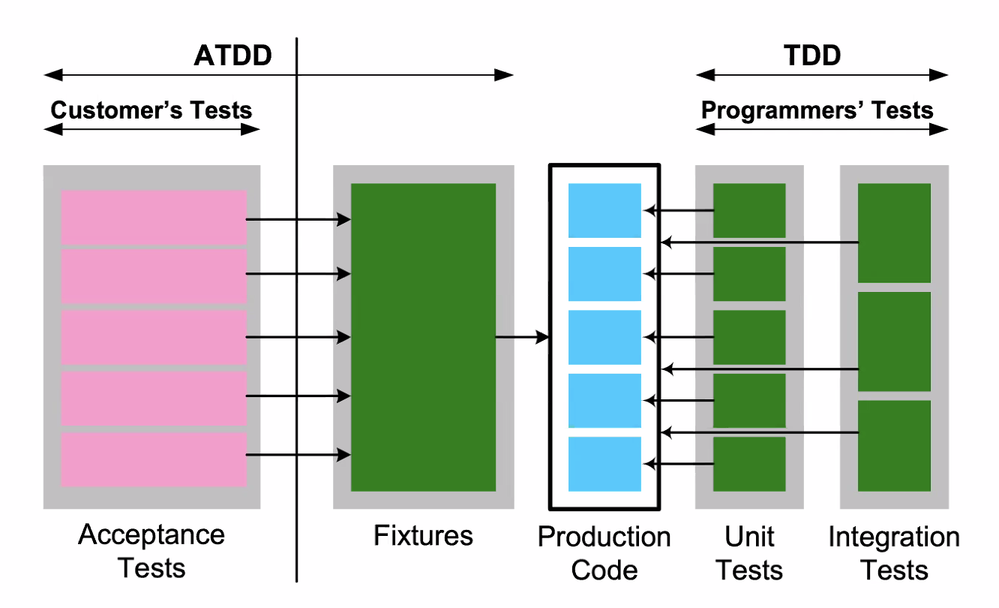

# [특강 - 파이썬 Unit Test] 라이엇 게임즈 유석문 CTO

> TDD Unit Test
    

- Programmer's Tests
- Unit Test의 장점
  - 내가 만든 코드에서의 문제를 찾기 때문에 빠르게 수정 가능
- Integration Tests 에서는 문제를 발경하면 찾는데도 오래걸림

> Test-driven development

- Write tests that describe behaviour
- Implement a system that has that behaviour

- TDD를 하지 않으면 실수를 많이함

> 개발자는 TDD 해야한다.

1. RED: Write a failing unit test
2. GREEN: Write production code to make test pass
3. REFACTOR: Remove duplication and improve design*

> Hello TDD!

- Step 1: Import the unittest module 
- Step 2: Create a testcase by subclassing unittest. TestCase
- Step 3: Define a test as a method inside the class. Name of method must start with 'test'
- Step 4: Each test calls assert function of TestCase class. There are many types of asserts. Following example calls assertEqual() function. assertEqual() function compares result of add() function with arg2 argument add throws assertionError if comparison fails.
- Step 5: Run the test!
- Step 6: Write a production code to pass unit test
- Step 7: Run the test again!
- Step 8: Add one failure test case and run the test for testing purpose

```python
import unittest

def add(x, y):
    return x + y

class SimpleTest(unittest.TestCase):
    def testadd(self):
        self.assertEqual(add(4, 5), 9)

    def testaddfail(self):
        self.assertEqual(add(-0.5, 1), 1.5)

if __name__ == '__main__':
    unittest.main()
```

https://docs.python.org/3/library/unittest.html

- test 별로 반복되는 코드는 setUp()으로 빼놓으면 좋음
- suite() : 여러개의 test를 모아놓음
- @unittest.skip or unittest.skipiif()
  - 테스트를 건너 뜀
- @unittest.expectedFailure
  - 의도한 에러가 나오도록 
  - 테스트를 실패하는 경우에 성공으로 간주

> Machine Learning Unit Tests

- 데이터 전처리 과정에서는 테스트 케이스를 만들 수 있으나 모델 학습에 대해서는 어떻게 할 수 있을까?

- Function을 작게 나눠야지 명확하게 정의를 할 수 있음
- test, 유지보수를 용이하게 하기 위해서는 function을 작게 나누는게 좋음
- function은 반드시 하나의 작업만!!

- 명확하다면 unittest 작성해서 진행
- 명확하지 않다면 간단한 테스트 코드를 만들어서 단계를 거치면서 업데이트가 되는지를 파악한다면 리소스를 절약할 수 있음
- 초기값과 다른 값들이 나오고 있다면 통과라던가?
- 데이터셋을 작게 만들어서 테스트를 해보고 다 집어넣고 진행

