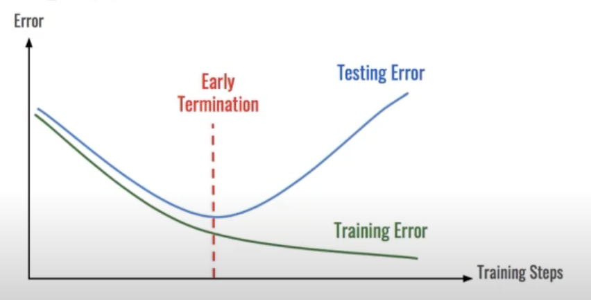
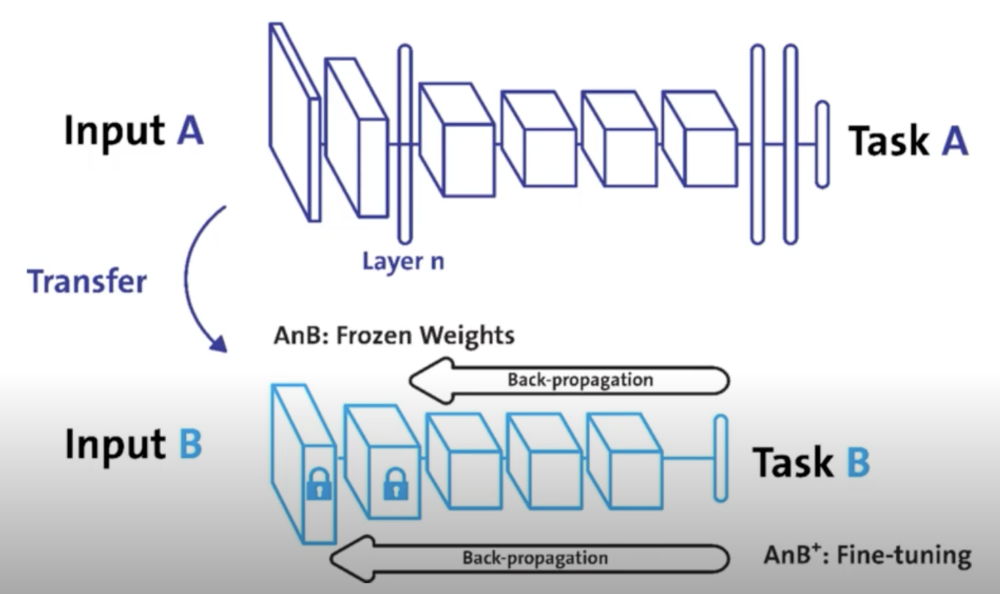

# 모델 불러오기

> 학습 결과를 공유하고 싶다!

- 동료에게, 교수님에게, 다른 연구자에게 등

> 학습 결과를 저장할 필요가 있음!

## model.save()

- 학습의 결과를 저장하기 위한 함수
- 모델 형태(architecture)와 파마메터를 저장
- 모델 학습 중간 과정의 저장을 통해 최선의 결과모델을 선택
- 만들어진 모델을 외부 연구자와 공유하여 학습 재연성 향상

```python
# Pring model's state_dict
# state_dict : 모델의 파라메터를 표시
print("Model's state_dict:")  
for param_tensor in model.state_dict():
    print(param_tensor, '\t', model.state_dict()[param_tensor].size())

# 모델의 파라메터를 저장
torch.save(model.state_dict(),
           os.path.join(MODEL_PATH, 'model.pt'))

# 같은 모델의 형태에서 파라메터만 load
new_model = TheModelClass()
new_model.load_state_dict(torch.load(os.path.join(
    MODEL_PATH, 'model.pt')))

# 모델의 architecture와 함께 저장
torch.save(model, os.path.join(MODEL_PATH, 'model.pt'))

# 모델의 architecture와 함께 load
model = torch.load(os.path.join(MODEL_PATH, 'model.pt'))
```

- 모델 저장시 .pt 를 많이 씀!

## checkpoints

> 

- 학습의 중간 결과를 저장하여 최선의 결과를 선택
- earlystopping 기법 사용시 이전 학습의 결과물을 저장
- loss와 metric 값을 지속적으로 확인 저장
- 일반적으로 epoch, loss, metric을 함께 저장하여 확인
- colab에서 지속적인 학습을 위해 필요

```python
torch.save({
    'epoch': e, # 모델의 정보를 epoch과 함께 저장
    'model_state_dict': model.state_dict(),
    'optimizer_state_dict': optimizer.state_dict(),
    'loss': epoch_loss,
},
f"saved/checkpoint_model_{e}_{epoch_loss/len(dataloader)}_{epoch_acc/len(data_loader)}.pt")

checkpoint = torch.load(PATH)
model.load_state_dict(checkpoint['model_state_dict'])
optimizer.load_state_dict(checkpoint['optimizer_state_dict'])
epoch = checkpoint['epoch']
loss = checkpoint['loss']
```

# pretrained model Transfer learning

> 남이 만든 모델을 쓰고 싶다!

## Transfer learning

- 다른 데이터셋으로 만든 모델을 현재 데이터에 적용
- 일반적으로 대용량 데이터셋으로 만들어진 모델의 성능 올라감
- 현재의 DL에서는 가장 일반적인 학습 기법
- backbone architecture가 잘 학습된 모델에서 일부분만 변경하여 학습을 수행

> TorchVision은 다양한 기본 모델 제공

> NLP는 HuggingFace가 사실상 표준

## Freezing

> 

- pretrained model을 활용시 모델의 일부분을 frozen 시킴

```python
# vgg16 모델을 vgg에 할당하기
vgg = models.vgg16(pretrained=True).to(device)

class MyNewNet(nn.Module):
    def __init__(self):
        super(MyNewNet, self).__init__()
        self.vgg19 = models.vgg19(pretrained=True)
        # 모델에 마지막 Linear Layer 추가
        self.linear_layers = nn.Linear(1000, 1)

    # Defining the forward pass
    def forward(self, x):
        x = self.vgg19(x)
        return self.linear_layers(x)

# 마지막 레이어를 제외하고 frozen
for param in my_model.parameters():
    param.requires_grad = False
for param in my_model.linear_layers.parameters():
    param.requires_grad = True
```

