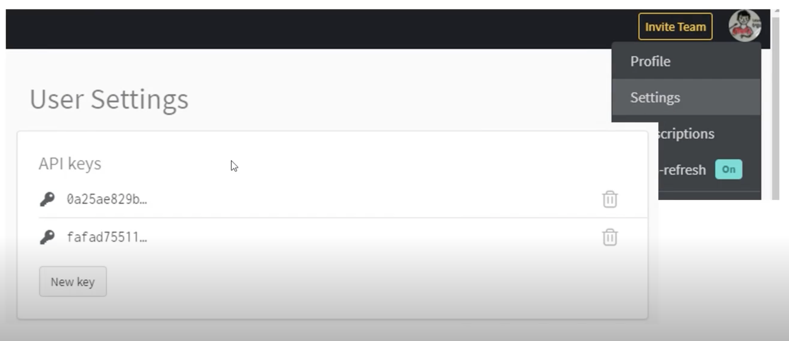
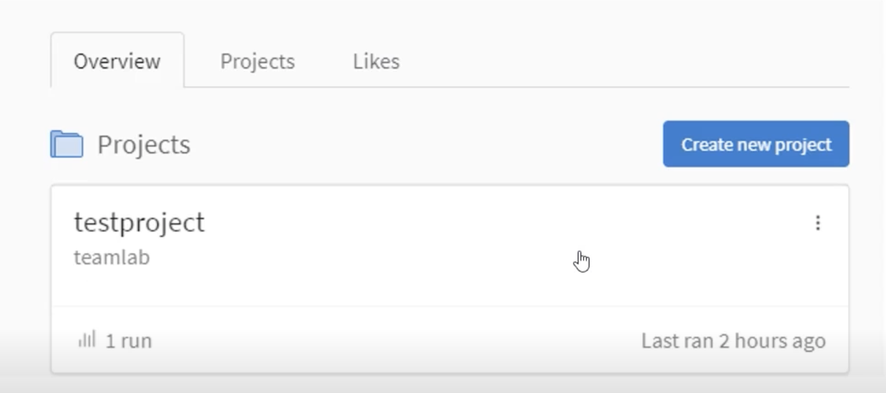

# Monitoroing tools for PyTorch

> 긴 학습 시간 기다림의 기록이 필요!

> 좋은 도구들이 많다!

- Tensorboard
- weight & biases (wandb)

> 이제 pring문은 그만 씁시다!

- 근데 그래도 계속 씁니다.

## Tensorboard

- TensorFlow의 프로젝트로 만들어진 시각화 도구
- 학습 그래프, metric, 학습 결과의 시각화 지원
- PyTorch도 연겨 ㄹ가능 -> DL 시각화 핵심 도구
- scalar : metric(accuracy, loss, precision, recall) 등 상수 값의 연속(epoch)을 표시
- graph : 모델의 computational graph 표시
- histogram : weight 등 값의 분포를 표현
- image : 예측 값과 실제 값을 비교 표시
- mesh : 3d 형태의 데이터를 표현하는 도구

```python
# Tensorboard 기록을 위한 directory 생성
import os
logs_base_dir = 'logs'
os.makedirs(logs_base_dirs, exist_ok=True)

# 기록 생성 객체 SummaryWriter 생성
from torch.utils.tensorboard import SummaryWriter
import numpy as np

writer = SummaryWriter(logs_base_dir)
for n_iter in range(100):
    # add_scalar 함수 : scalar 값을 기록
    # Loss/train : loss category에 train 값
    # n_iter : x 축의 값
    writer.add_scalar('Loss/train', np.random.random(), n_iter)  
    writer.add_scalar('Loss/test', np.random.random(), n_iter)
    writer.add_scalar('Accuracy/train', np.random.random(), n_iter)
    writer.add_scalar('Accuracy/test', np.random.random(), n_iter)
# 값 기록 (disk에 쓰기)
writer.flush()

# jupyter 상에서 tensorboard 수행
%load_ext tensorboard
# 파일 위치 지정 (logs_base_dir)
# 같은 명령어를 콘솔에서도 사용가능
%tensorboard --logdir {logs_base_dir}
```

## weight & biases

- 머신러닝 실험을 원활히 지원하기 위한 상용도구
- 협업, code versioning, 실험 결과 기록 등 제공
- MLOps의 대표적인 툴로 저변 확대 중

- 가입후 API 키 확인
    
    

- 새로운 프로젝트 생성하기 (이름 기억 필요)
  - profile -> create new project
  
    


```python
!pip install wandb -q

config={'epochs': EPOCHS, 'batch_size': BATCH_SIZE, 'learning_rate': LEARNING_RATE}
wandb.init(project='test-project', config=config)
# wandb.config.batch_size = BATCH_SIZE
# wandb.config.learning_rate = LEARNING_RATE

for e in range(1, EPOCHS + 1):
    epoch_loss = 0
    epoch_acc = 0
    for X_batch, y_batch in train_dataset:
        X_batch, y_batch = X_batch.to(device), y_batch.to(device).type(torch.cuda.FloatTensor)
        # ...
        optimizer.step()

        # ...

    # 기록 add_~~~ 함수와 동일
    wandb.log({'accuracy': train_acc, 'loss': train_loss})
```


