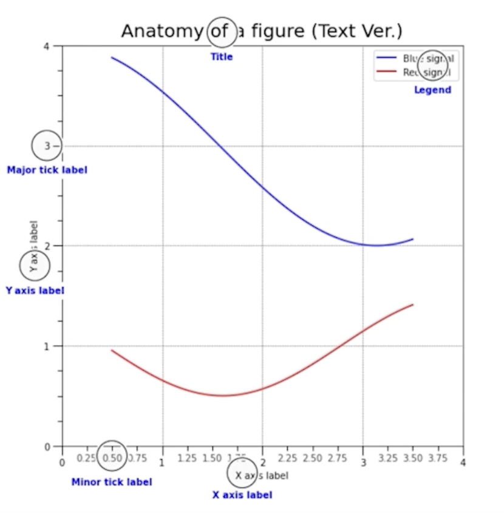

# Text 사용하기

## 1. Matplotlib에서 Text

### 1.1 Text in Viz

- 시각화에서 Text?? 라 할 수 있지만
  - Visual representation 들이 줄 수 없는 많은 설명을 추가해줄 수도
  - 잘못된 전달에서 생기는 오해를 방지할 수도 있음
- 하지만 Text를 과하게 사용한다며 오히려 이해를 방해할 수도 있음
- Matplotlib에서 제공하는 API를 바탕응로 Text 이해하기!

### Anatomy of a Figure (Text Ver.)

> 

- Title : 가장 큰 주제를 설명
- Label : 축에 해당하느 ㄴ데이터 정보를 제공
- Tick Label : 축에 눈금을 사용하여 스케일 정보를 추가
- Legend : 한 그래프에서 2개 이상의 서로 다른 데이터를 분류하기 위해서 사용하는 보조 정보
- Annotation(Text) : 그 외의 시각화에 대한 설명을 추가

