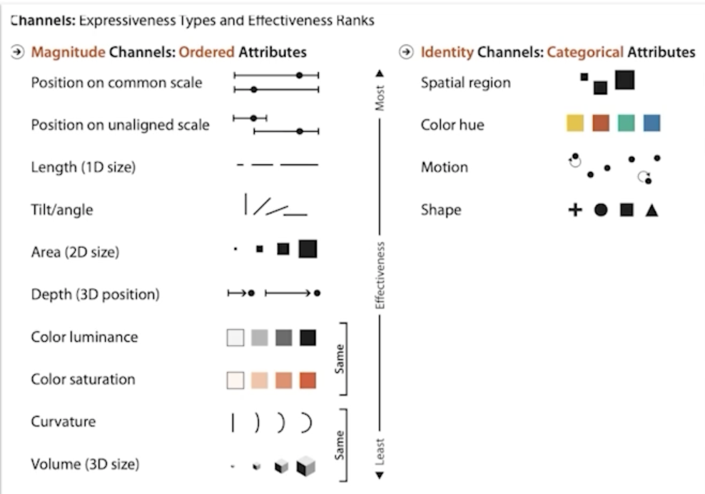
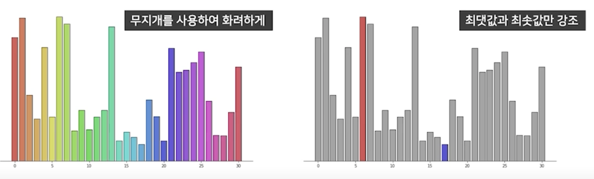
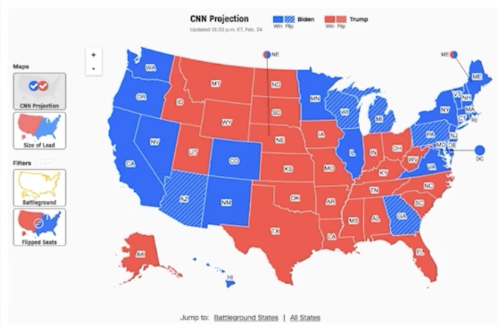
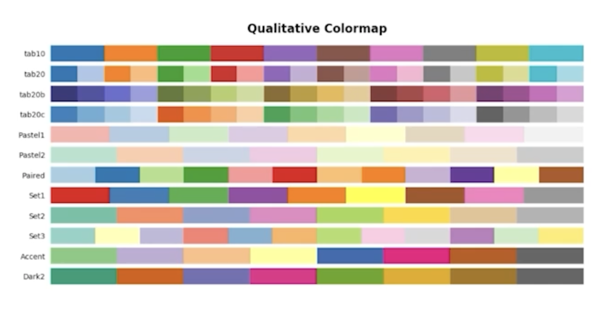
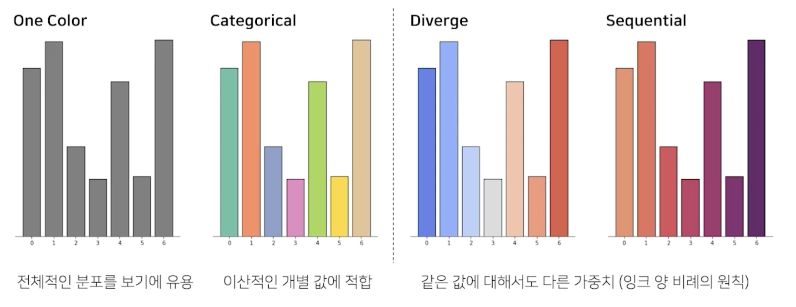
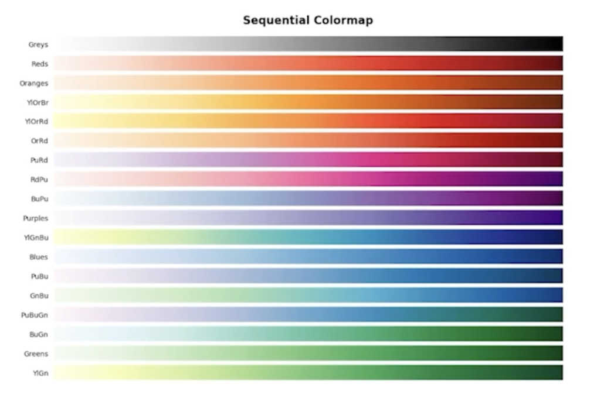
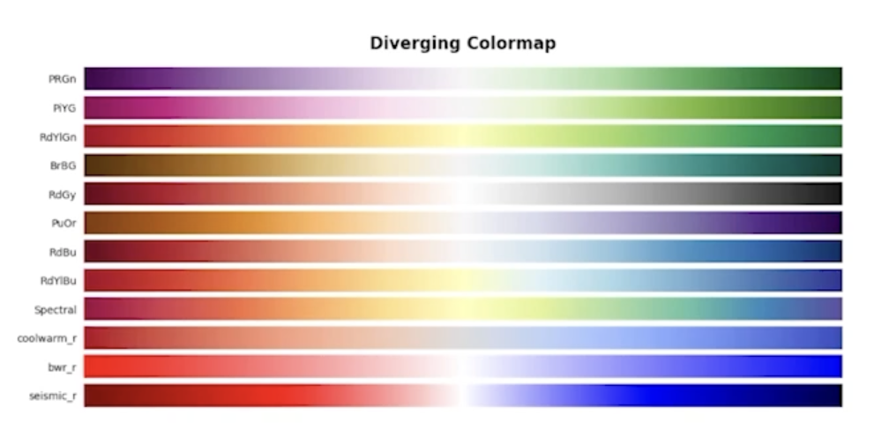
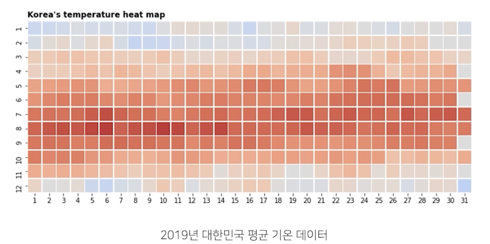
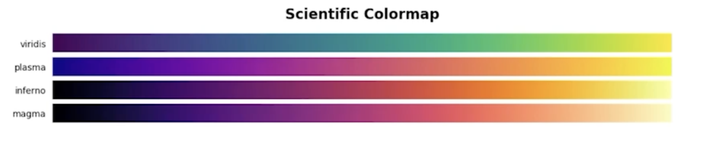

# Color 사용하기

## 1. Color 에 대한 이해

### 1.1 색이 중요한 이유

> 

- 위치와 색은 가장 효과적인 채널 구분
  - 위치는 시각화 방법에 따라 결정
  - 색은 우리가 직접적으로 골라야 한다.
  - 사람이 공통적으로 색이 가지는 느낌은 다르다
  - 그리고 좋은 색과 색 배치는 예쁘다!!

### 1.2 화려함이 시각화의 전부는 아니다!

> 

- 심미적으로 화려한 것은 분명 매력적
  - 하지만 화려함은 시각화의 일부 요소!
- 가장 중요한 것은 독자에게 원하는 인사이트를 전달!
  - 전하고 싶은 내용을 모두 전달했는가 + 그 과정에서 오해는 없었는가

### 1.3 색이 가지는 의미

> 

- 우리는 살면서 이미 많은 색을 사용했다.
  - 높은 온도에서는 파랑, 낮은 온도에는 빨강이라면?
  - 카카오가 초록색, 네이버가 노란색이라면?
  - 기존 정보와 느낌을 잘 활용하는 것이 중요
  - 만약 본인이 정말 감이 없다면?
    - 다른 사례 스터디를 통해 색상 선택
    - 이미 사용하는 색에는 이유가 있다.

## 2. Color Palette의 종류

### 2.1 범주형 (Categorical)

> 

- Discrete, Qualitative 등 다양한 이름으로 불림
- 독립된 색상으로 구성되어 범주형 변수에 사용
- 최대 10개의 색상까지 사용
  - 그 외에는 기타로 묶을 것
- 색의 차이로 구분하는 것이 특징
  - 채도, 명도를 개별적 조정은 지양

> 예시
    

### 2.2 연속형 (Sequential)

> 

- 정렬된 값을 가지는 순서형, 연속형 변수에 적합
- 연속적인 색상을 사용하여 값을 표현
  - 어두운 배경에서는 밝은 색이
  - 밝은 배경에서는 어두운 색이 큰 값을 표현
- 색상은 단일 색조로 표현하는 것이 좋고
- 균일한 색상 변화가 중요

> 예시
    

### 2.3 발산형 (Diverge)

> 

- 연속형과 유사하지만 중앙을 기준으로 발산
  - 상반된 값(ex. 기온)이나,
  - 서로 다른 2개(ex. 지지율)을 표현하는데 적합
- 양 끝으로 갈수록 색이 진해지며
- 중앙의 색은 양쪽의 점에서 편향되지 않아야 함
  - 꼭 무채색일 필요는 없음

> 예시
    

## 그 외 색 Tips

### 3.1 강조, 그리고 색상 대비

- 데이터에서 다름을 보이기 위해 Highlighting 가능
- 강조를 위한 방법 중 하나. 색상 대비(Color Contrast) 사용
  - 명도 대비 : 밝은 색과 어두운 색을 배치하면 밝은 색은 더 밝게, 어두운 색은 더 어둡게 보임

    

  - 색상 대비 : 가까운 색은 차이가 더 크게 보임

    

  - 채도 대비 : 채도의 차이, 채도가 더 높아보임

    

  - 보색 대비 : 정반대 색상을 사용하면 더 선명해 보임

    

### 3.2 색각 이상

> 

- 삼원색 중에 특정 색을 감지 못하면 색맹
- 부분적 인지 이상이 있다면 색약
- 색 인지가 주용한 분야(과학/연구 등)에 있어서는 이에 대한 고려가 필수

