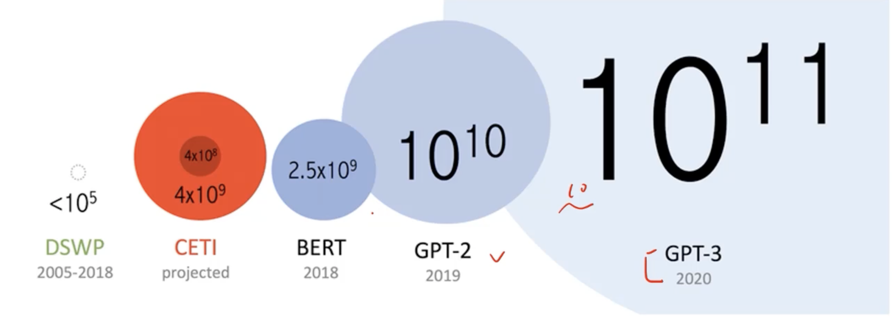
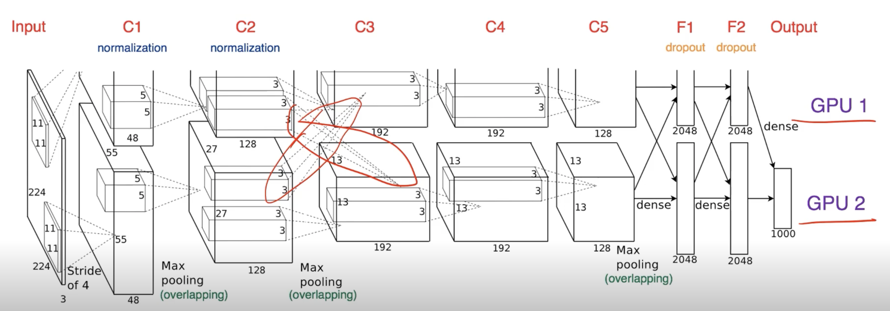
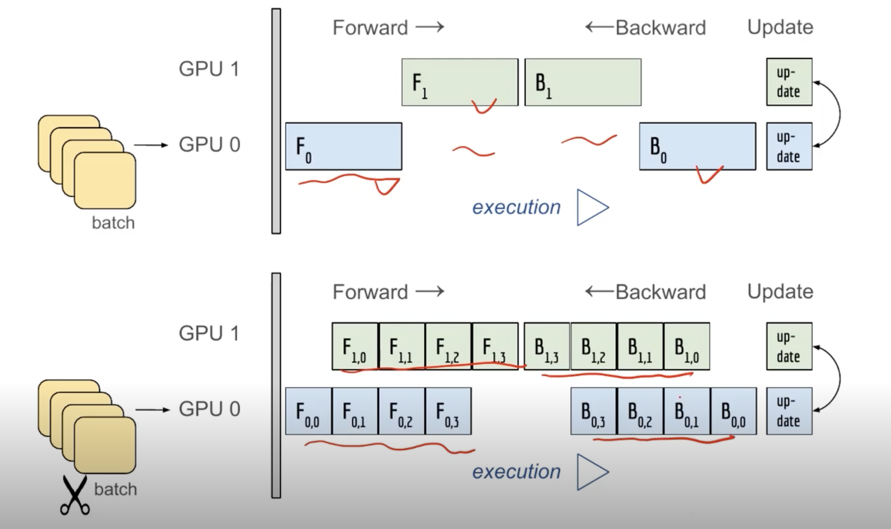
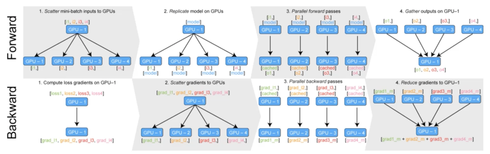

# Multi-GPU 학습

> 오늘날의 딥러닝은 엄청난 데이터와의 싸움
    

> 연구는 장비빨...

## Multi-GPU 어떻게 GPU 다룰 것인가?

### 개념 정리

- Single vs. Multi
  - 한개 vs. 2개이상
- GPU vs. Node
  - 이 때 Node 는 system or 1대의 컴퓨터를 의미
- Single Node Single GPU
  - 1대의 컴퓨터로 1개의 GPU를 사용
- Single Node Multi GPU
  - 1대의 컴퓨터에 여러개의 GPU가 있는 경우
  - Multi-GPU 라고 하면 보통 이 상황을 얘기함
- Multi Node Multi GPU
  - 서버실에 GPU가 달려있는 상황을 생각할 수 있음
  - 궁극적으로 가는 방향인데 어려움

### Model parallel

- 다중 GPU에 학습을 분산하는 두 가지 방법
  - 모델을 나누기 / 데이터를 나누기
- 모델을 나누는 것은 생각보다 예전부터 썼음 (AlexNet)
- 모델의 병목, 파이프라인의 어려움 등으로 인해 모델 병렬화는 고난이도 과제

### Model parallel vs Data parallel

> 

- 교차되는 지점이 GPU간의 병렬적인 처리를 지원하기 위해서 한 것
  - .to(~~~)
  - 다른 GPU를 할당

> 

- GPU0과 GPU1이 하는 작업이 겹치지 않으면 좋은 병렬화라고 할 수 없음


```python
class ModelParallelResNet50(ResNet):
    def __init__(self, *args, **kwargs):
        super(ModelParallelResNet50, self).__init__(
            Bottleneck, [3, 4, 6, 3], num_classes=num_classes, *args, **kwargs)
        
        # 첫번째 모델을 cuda 0 에 할당
        self.seq1 = nn.Sequential(
            self.conv1, self.bn1, self.relu, self.maxpool, self.layer1, self.layer2
        ).to('cuda:0')

        # 두번째 모델을 cuda 1 에 할당
        self.seq2 = nn.Sequential(
            self.layer3, self.layer4, self.avgpool,
        ).to('cuda:1')

        self.fc.to('cuda:1')

    def forward(self, x):
        # 두 모델을 연결하기
        x = self.seq2(self.seq1(x).to('cuda:1'))
        return self.fc(x.view(x.size(0), -1))
```

### Data parallel

- 데이터를 나워 GPU에 할당 후 결과의 평균을 취하는 방법
- minibatch 수식과 유사한데 한번에 여러 GPU에서 수행

> 

- PyTorch에서는 아래 두 가지 방식을 제공
  - DataParallel, DistributedDataParallel
- DataParallel - 단순히 데이터를 분배한 후 평균을 취함
  - GPU 사용 불균형 문제 발생, Batch 사이즈 감소 (한 GPU가 병목), GIL
  - 굉장히 쉽게 구현할 수 있음
- DistributedDataParallel - 각 CPU마다 process 생성하여 개별 GPU에 할당
  - 기본적으로 DataParallel로 하나 개별적으로 연산의 평균을 냄
  - 모으는 작업이 없음
  - 각각이 CPU도 할당을 해서 Gradeint도 구하고 각자 진행

### DataParallel
```python
parallel_model = torch.nn.DataParallel(model)  # Encapsulate the model

predictions = parallel_model(inputs)  # Forward pass on multi-GPUs
loss = loss_function(predictions, labels)  # Compute loss function
loss.mean().backward()  # Average GPU-losses + backward pass
opitmizer.step()  # Optimizer step
predictions = parallel_model(inputs)  # Forward pass with new parameters
```

### DistributedDataParallel
```python
train_sampler = torch.utils.distributed.DistributedSampler(train_data)
shuffle = False
pin_memory = True

trainloader = torch.utils.data.DataLoader(train_data, batch_size=20, shuffle=shuffle,
                                          pin_memory=pin_memory, num_workers=3,
                                          sampler=train_sampler)
```

```python
def main():
    n_gpus = torch.cuda.device_count()
    torch.multiprocessing.spawn(main_worker, nprocs=n_gpus, args=(n_gpus, ))

def main_worker(gpu, n_gpus):
    image_size = 224
    batch_size = 512
    num_worker = 8
    epochs = ...

    batch_size = int(batch_size / n_gpus)
    num_worker = int(num_worker / n_gpus)

    # 멀티프로세싱 통신 규약 정의
    torch.distributed.init_process_group(
        backend='nccl', init_method='tcp://127.0.0.1:2568', world_size=n_gpus, rank=gpu)

    model = MODEL

    torch.cuda.set_device(gpu)
    model = model.cuda(gpu)
    # Distributed dataparallel 정의
    model = torch.nn.parallel.DistributedDataParallel(model, device_ids=[gpu])
```

> Python의 멀티프로세싱 코드

```python
from multiprocessing import Pool

def f(x):
    return x*x

if __name__ == '__main__':
    with Pool(5) as p:
        print(p.map(f, [1, 2, 3]))
```


