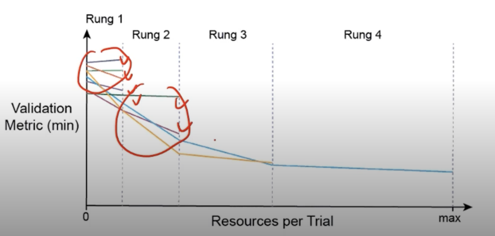

# Hyperparameter Tuning

> 제대로 한번 학습을 해보고 싶다.

> 끝날때 까지 끝난게 아니다.

1. 모델을 바꾼다.
2. 데이터를 추가한다.
   1. 많이 모으면 모을수록 더 좋은 모델을 만들 수 있음
3. Hyperparameter Tuning

## Hyperparameter Tuning

- 모델 스스로 학습하지 않는 값은 사람이 지정
  - (learning rate, 모델의 크기, optimizer 등)
- 하이퍼 파라메터에 의해서 값의 크게 좌우 될 때도 있음 (요즘은 그닥?)
- 마지막 0.01을 쥐어짜야 할 때 도전해볼만!

> 이전 만큼의 중요성은 없어졌고 요즘은 많은 데이터로 극복해 나가는 중

- 가장 기본적인 방법 - grid vs random
  - grid : learning_rate(0.1, 0.01, 0.001), batch_size(32, 64, 128)
  - random : 무작위로 선택
- 최근에는 베이지안 기반 기법들이 주도
  - BOHB 2018

## Ray

- multi-node multi processing 지원 모듈
- ML/DL의 병렬 처리를 위해 개발된 모듈
- 기본적으로 현재의 분산병렬 ML/DL 모듈의 표준
- Hyperparameter Search를 위한 다양한 모듈 제공

```python
data_dir = os.path.abspath('./data')
load_data(data_dir)
# config에 search space 지정
config = {
    'l1': tune.sample_from(lambda _: 2 ** np.random.randint(2, 9)),
    'l2': tune.sample_from(lambda _: 2 ** np.random.randint(2, 9)),
    'lr': tune.loguniform(1e-4, 1e-1),
    'batch_size': tune.choice([2, 4, 8, 16]),
}
# 학습 스케줄링 알고리즘 지정
# ASHAScheduler: 
# 알고리즘이 실행이 되면서 중간중간에 의미없다고 생각하는(loss 값이 잘 안나오는) metric 들은 다 잘라내버림
# 가망이 없는 애들을 먼저 걸러버림
scheduler = ASHAScheduler(
    metric='loss', mode='min', max_t=max_num_epochs, grace_period=1, reduction_factor=2)
# 결과 출력 양식 지정
# CLIReporter:
# command line report
reporter = CLIReporter(
    metric_columns=['loss', 'accuracy', 'training_iteration'])

# 병렬 처리 양식으로 학습 시행
result = tune.run(
    # 데이터를 쪼갬
    partial(train_cifar, data_dir=data_dir),  # train_cifar : 학습하는 함수
    resources_per_trial={'cpu': 2, 'gpu': gpus_per_trial},
    config=config, num_samples=num_samples,
    scheduler=scheduler,
    progress_reporter=reporter
)
```

> 

> Ray 를 사용하기 위해서는 학습과정이 함수로 정의되어야 한다!

> 하이퍼파라미터 튜닝보다 데이터가 훨씬 더 중요하다
> 시간대비 효과가 떨어짐
