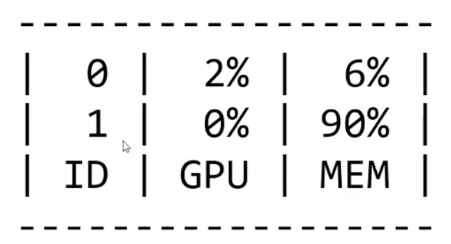
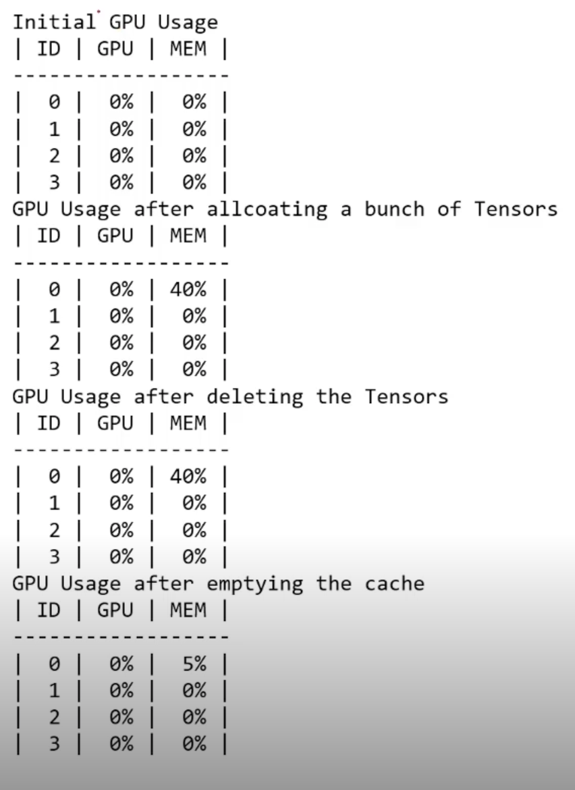
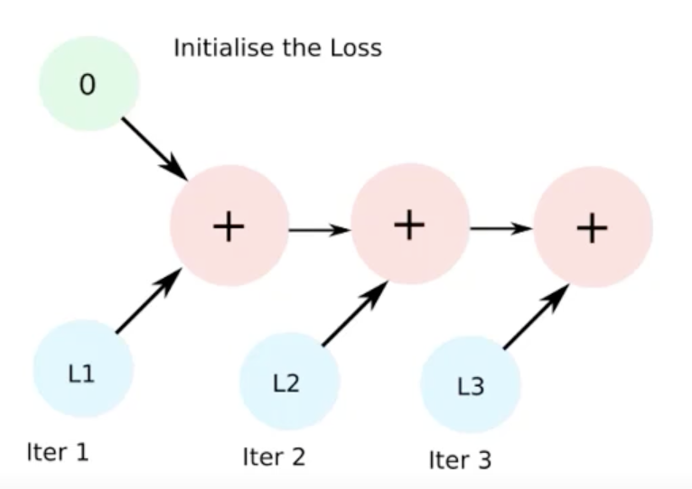

# PyTorch Troubleshooting

> 공포의 단어 OOM(Out Of Memory)

## OOM이 해결하기 어려운 이유들...

- 왜 발생했는지 알기 어려움
- 어디서 발생했는지 알기 어려움
- Error backtracking 이 이상한데로 감
- 메모리의 이전상황의 파악이 어려움

> 1차원적인 해결법 Batch Size down -> GPU clean -> Run

- 이 방법으로 해결이 되는 경우는 코드를 잘 짰다고 생각할 수 있음

> 그 외에 발생할 수 있는 문제들...

## GPUUtil 사용하기

- nivida-smi 처럼 GPU의 상태를 보여주는 모듈
- Colab은 환경에서 GPU 상태 보여주기 편함
- iter 마다 메모리가 늘어나는지 확인!!
  - 메모리가 잘 못 쌓이고 있음

> 

```python
!pip install GPUtil

import GPUtil
GPUTil.showUtilization()
```

## torch.cuda.empty_cache() 써보기

- 사용되지 않은 GPU상 cache를 정리
- 가용 메모리를 확보
- del 과는 구분이 필요
  - del 은 연결된 관계를 끊어버림
- reset 대신 쓰기 좋은 함수

```python
import torch
from GPUtil import showUtilization as gpu_usage

print('Initial GPU Usage')
gpu_usage()

tensorLilst = []
for x in range(10):
    tensorList.append(torch.randn(10000000, 10).cuda())

print("GPU Usage after allcoating a bunch of Tensors')
gpu_usage()

del tensorList

print("GPU Usage after deleting the Tensors')
gpu_usage()

print('GPU Usage after emptying the cache')
torch.cuda.empty_cache()
gpu_usage()
```

> 

## training loop 에 tensor로 축적 되는 변수는 확인할 것

- tensor로 처리된 변수는 GPU상에 메모리 사용
  - requires_grad=True 인 tensor는 gradient를 하기 위해서 메모리 buffer 까지 쌓이기 때문에 훨씬 더 많은 메모리를 잡아먹게 됨
- 해당 변수 loop 안에 연산에 있을 때 GPU에 computational graph를 생성(메모리 잠식)

```python
total_loss = 0
for i in range(10000):
    optimizer.zero_grad()
    output = model(input)
    loss = criterion(output)
    loss.backward()
    optimizer.step()
    total_loss += loss
```

이 경우 total_loss += loss 이 부분에서 gradient 하는 loss 부분이 중첩되서 계속 메모리가 쌓임

- 1-d tensor의 경우 python 기본 객체로 변환하여 처리할 것

```python
total_loss = 0

for x in range(10):
    # assume loss is computed
    iter_loss = torch.randn(3, 4).mean()
    iter_loss.requires_grad = True
    total_loss += iter_loss
```

> 

- .item() 을 써서 기본 객체로 변환하거나 float(iter_loss) 라는 변환 객체를 써주면 됨

## del 명령어를 적절히 사용하기

- 필요가 없어진 변수는 적절한 삭제가 필요함
- python의 메모리 배치 특성상 loop이 끝나도 메모리를 차지함

```python
for x in range(10):
    i = x

print(i)  # 9 is printed
```

```python
for i in range(5):
    intermediate = f(input[i])
    result += g(intermediate)
output = h(result)
return output
```

- 위의 경우 intermediate가 메모리를 많이 잡아먹는다고 하면 python의 특성상 계속 남으므로 
- reuslt += g(intermediat) 다음줄에 `del intermediate` 같은 코드를 추가해주는 것이 좋음

## 가능 batch 사이즈 실험해보기

- 학습시 OOM 이 발생했다면 batch 사이즈를 1로 해서 실험해보기

```python
oom = False
try:
    run_model(batch_size)
except RuntimeError:  # Out of memory
    oom = True

if oom:
    for _ in range(batch_size):
        run_model(1)
```

## torch.no_grad() 사용하기

- Inference 시점에서는 torch.no_grad() 구문을 사용
- backward pass 으로 인해 쌓이는 메모리에서 자유로움

```python
with torch.no_grad():
    for data, target in test_loader:
        output = network(data)
        test_loss += F.nll_loss(output, target, size_average=False).item()
        pred = output.data.max(1, keepdim=True)[1]
        correct += pred.eq(target.data.veiw_as(pred)).sum()
```

## 예상치 못한 에러 메세지

- OOM 말고도 유사한 에러들이 발생
- CUDNN_STATUS_NOT_INIT 이나 device-side-assert 등
  - CUDNN_STATUS_NOT_INIT : GPU를 잘 못 설치했거나 그런 경우
  - device-side-assert : OOM의 일종으로 생각 가능
- 해당 에러도 cuda와 관련하여 OOM의 일종으로 생각될 수 있으며, 적절한 코드 처리의 필요함
- https://brstar96.github.io/shoveling/device_error_summary/
- 여기에 가보면 정리된게 있음

## 그외...

- colab에서 너무 큰 사이즈는 실행하지 말 것
  - (linear, CNN, LSTM)
- CNN의 대부분의 에러는 크기가 안 맞아서 생기는 경우
  - (torchsummary 등으로 사이즈를 맞출 것)
- tensor의 float precision을 16bit로 줄일 수도 있음
  - 그렇게 많이 쓰지는 않음
