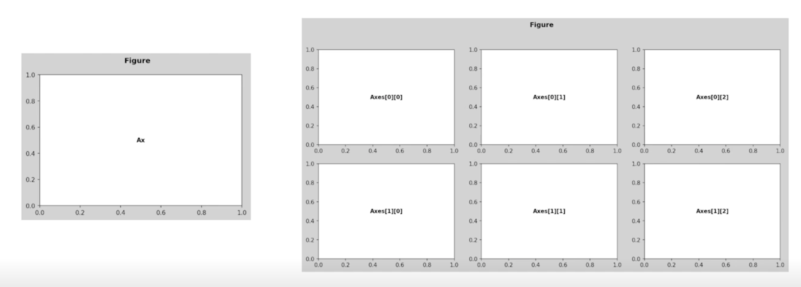
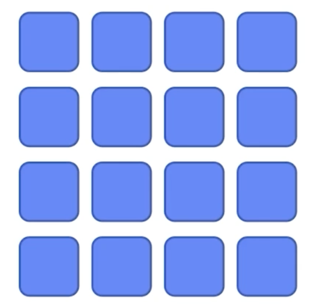
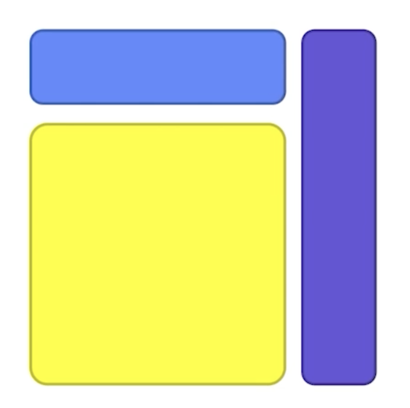
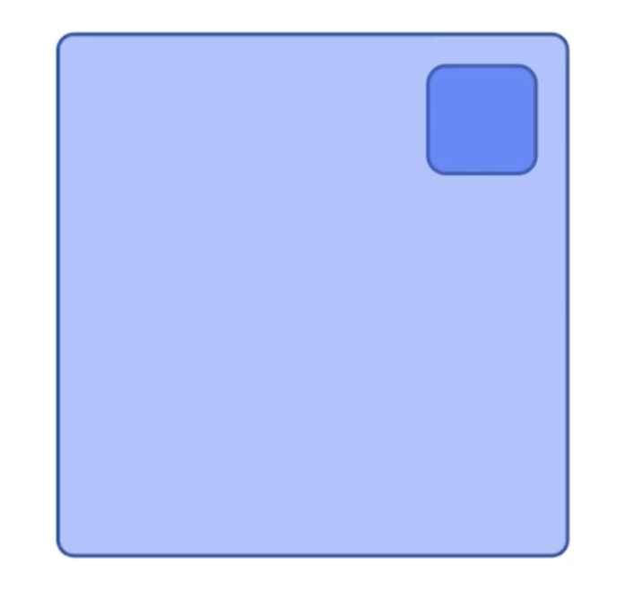
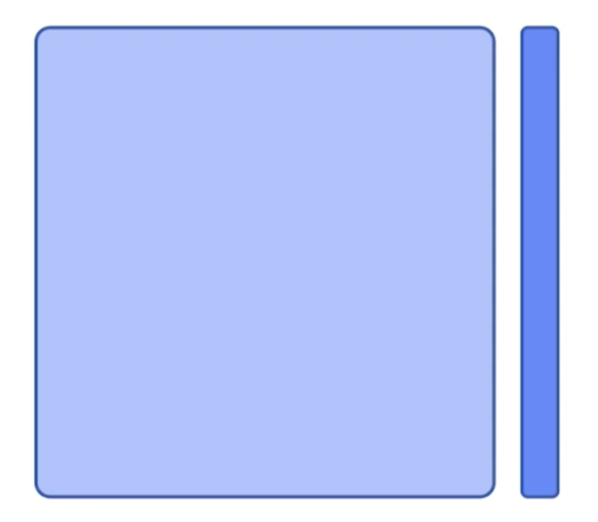

# Facet 사용하기

## 1. Facet

### 1.1 Multiple View

- Facet이란 분할을 의미
- 화면 상에 View를 분할 및 추가하여 다양한 관점에서 전달
  - 같은 데이터셋에 서로 다른 인코딩을 통해 다른 인사이트
  - 같은 방법으로 동시에 여러 feature를 보거나
  - 큰 틀에서 볼 수 없는 부분 집합을 세세하게 보여줄 수 있음

## 2. Matplotlib에서 구현

### 2.1 Figure와 Axes

- Figure는 큰 틀, Ax는 각 플롯이 들어가는 공간
- Figure는 언제나 1개, 플롯은 N개

> 

### 2.2 NxM subplots

- 가장 쉬운 방법은 3가지 방법
  - `plt.subplot()`
  - `plt.figure() + fig.add_subplot()`
  - `plt.subplots()`

- 쉽게 조정할수 있는 요소
  - `figuresize` 
  - `dpi`
  - `sharex`, `sharey`
  - `squeeze`
  - `aspect`

### 2.3 Grid Spec의 

> 

- 그리드 형태의 subplots
- 기존 Subplots로 4 x 4를 만들 수 있음
- 여기서 다른 사이즈를 만들기 위해서는?

> 

- 이 서브플롯을 표현하기 위해서 2가지 방법
  1. Slicing 사용
     - Numpy의 Slicing을 생각해보면...
     - axex[0, :3]
     - axes[1:, :3]
     - axes[3, :]

     - `fig.add_grid_spec()`
  2. x, y, dx, dy를 사용
     - 시작 위치 x, y와 차이 dx, dy로도 표현
     - (x, y), dx, dy 포맷으로 작성하면
     - (0, 0), 1, 3
     - (1, 0), 3, 3
     - (0, 3), 1, 4

     - `fig.subplot2grid()`

### 2.4 내부에 그리기

> 

- Ax 내부에 서브플롯을 추가하는 방법
  - 미니맵과 같은 형태로 추가하거나
  - 외부 정보를 적은 비중으로 추가

- `ax.inset_axes()`

> 

- 그리드를 사용하지 않고 사이드에 추가
  - 단, 방향의 통계정보를 제공할수도
  - 제목 등의 텍스트 추가도 가능

- `make_axes_locatable(ax)`

