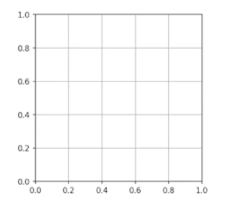
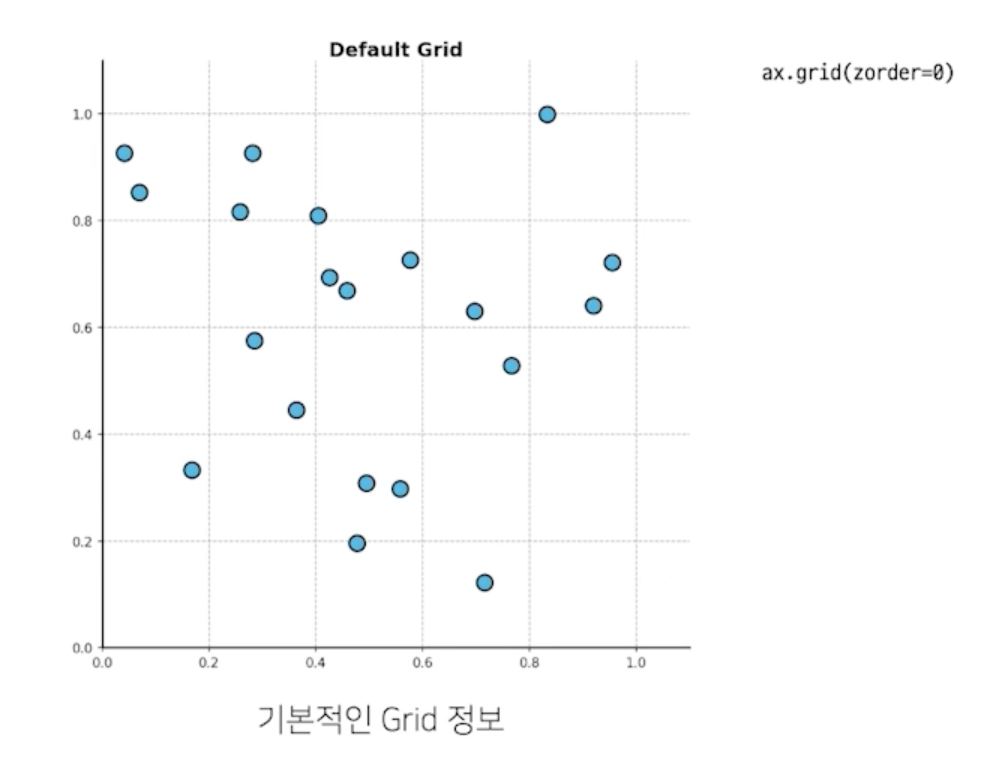
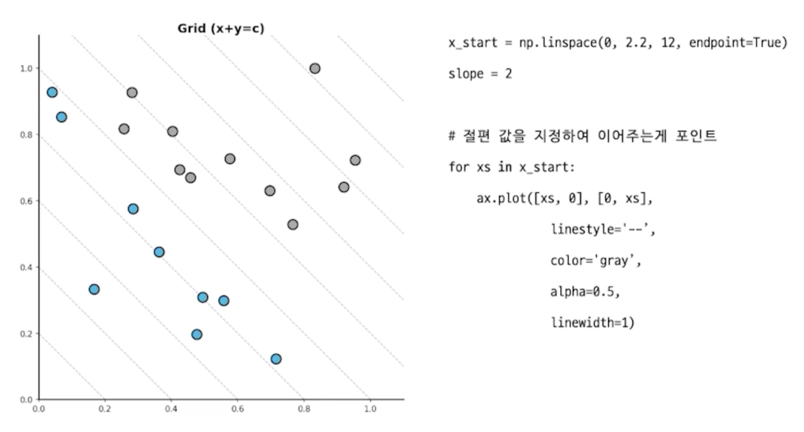
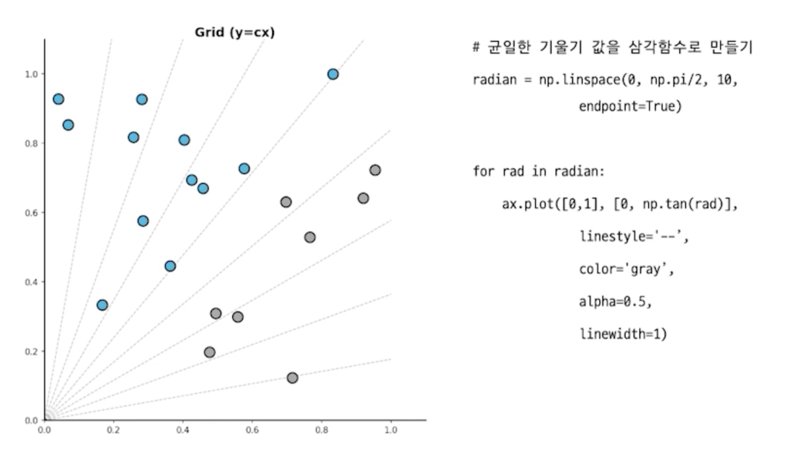
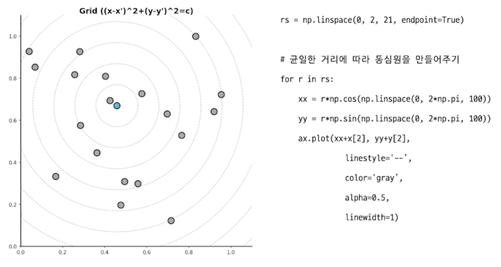
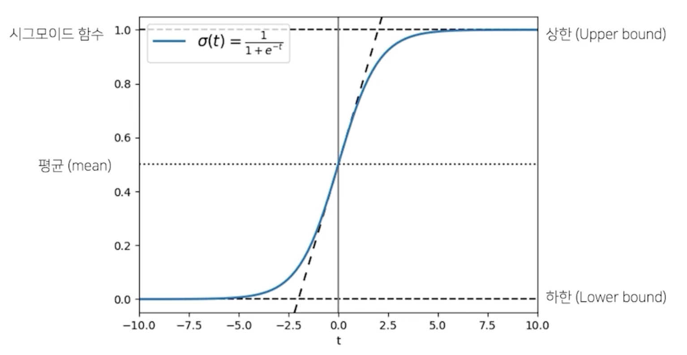
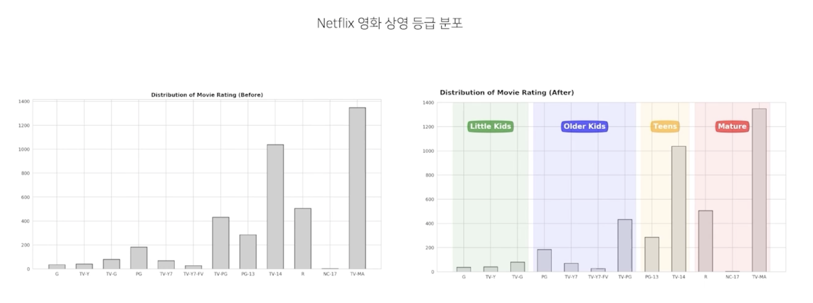
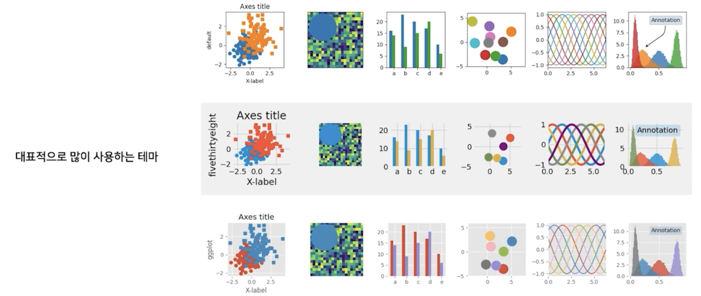

# More Tips

## 1. Grid 이해하기

### 1.1 Default Grid

- 기본적인 Grid는 축과 평행선을 사용하여 거리 및 값 정보를 보조적으로 제공
    

- 색은 다른 표현들을 방해하지 않도록 무채색 (color)
- 항상 Layer 순서 상 맨 밑에 오도록 조정 (zorder)
- 큰 격자 / 세부 격자 (which='major', 'minor', 'both')
- X축? Y축? 동시에 (axis='x', 'y', 'both')

### 1.2 다양한 타입의 Grid

- 전형적인 Grid는 아니지만 여러 형태의 Grid가 존재
  - 두 변수의 합이 중요하다면 x+y = c
  - 비율이 중요하다면 y = cx
  - 두 변수의 곱이 중요하다면 xy = c
  - 특정 데이터를 중심으로 보고 싶다면 (x-x')^2 + (y-y')^2 = c

- 전형적이지 않고, 구현도 까다롭지만
  - numpy + matplotlib으로 쉽게 구현 가능
  - 재미있는 예시는 https://medium.com/nightingale/gotta-gridem-all-2f768048f934

> 전형적인 Grid
    

> X+Y = C를 사용한 Grid
    

- 회색 선에 걸치는 값은 X+Y 값이 동일
- Feature의 절대적 합이 중요한 경우?
  - 공격 + 수비 합으로 평가
  - 국어 + 수학 비중 평가

> Y = CX를 사용한 Grid
    

- 가파를 수록 Y/X가 커짐
- Feature의 비율이 중요한 경우

> 동심원을 사용한 Grid
    

- 특정 지점에서 거리를 살펴볼 수 있음
- 가장 가까운 포인트를 찾거나
- 한 데이터에서 특정 범위의 데이터

## 2. 심플한 처리

### 2.1 선 추가하기

> 

### 2.2 면 추가하기

> 

## 3. Setting 바꾸기

### 3.1 Theme

> 

