# [The Illustrated Transformer](https://nlpinkorean.github.io/illustrated-transformer/) 을 통한 Transformer 재정리!!

## 개괄적인 수준의 설명

Transformer를 하나의 `Black Box` 라고 생각해보자.

> 

`Black Box` 를 열어보면 `encoding` 부분과 `decoding` 부분, 그리고 그 사이를 이어주는 `connection` 들을 보게 된다.

> 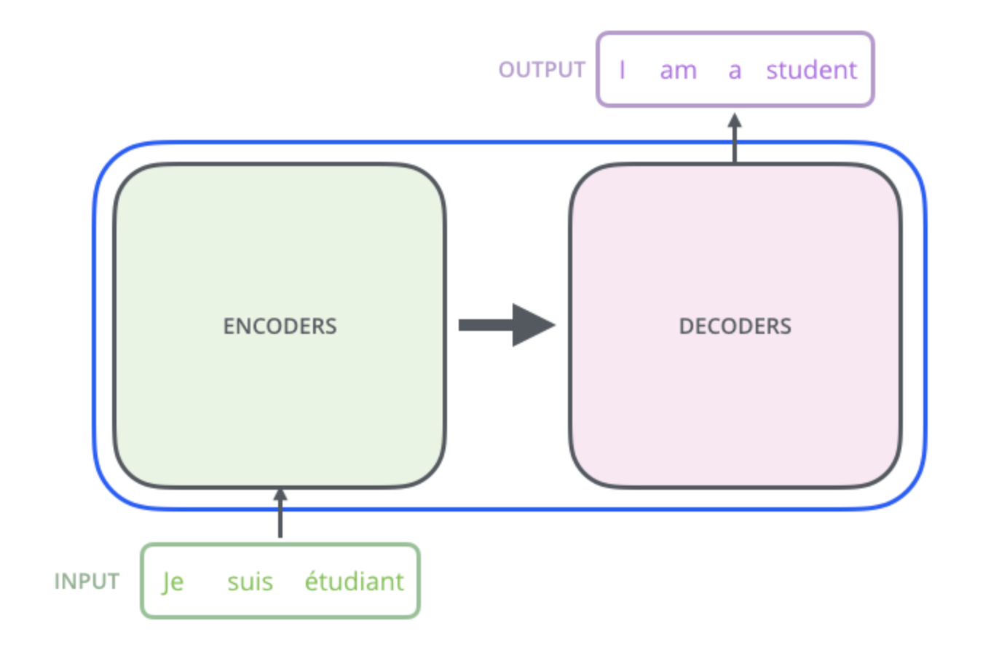

`encoding` 부분은 여러 개의 `encoder` 을 쌓아 올려 만든 것이다. (논문에서는 6개 사용했지만 꼭 6개를 쌓아야 하는 것은 아니고 각자의 세팅에 맞게 얼마든지 변경 가능)

`decoding` 부분은 `encoding` 부분과 동일한 개수 만큼의 `decoder` 을 쌓은 것을 말한다.

> 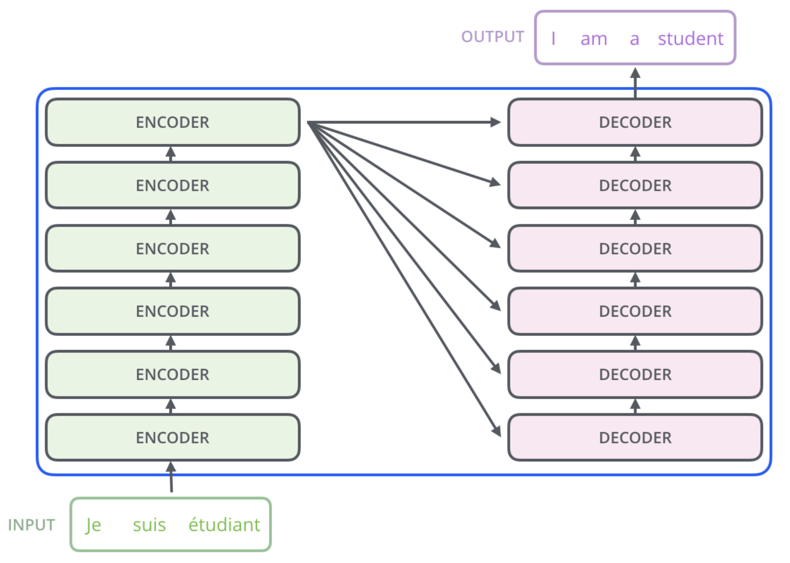

`encoder` 들은 모두 정확히 똑같은 구조를 가지고 있다. (그러나 그들 간의 `weight` 을 공유하진 않는다.)

하나의 `encoder` 를 나눠보면 아래와 같이 두 개의 `sub-layer` 으로 구성되어 있다.

> 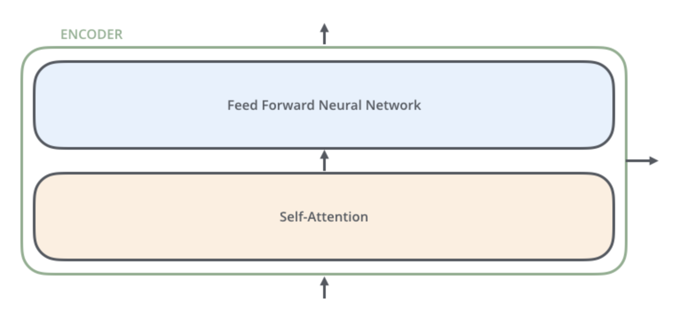

`encoder` 에 들어온 입력은 일단 먼저 `self-attention layer` 를 지나가게 된다.

- 이 `layer` 은 `encoder` 가 하나의 특정한 단어를 `encode` 하기 위해서 입력 내의 모든 다른 단어들과의 관계를 살펴본다.

입력이 `self-attention` 층을 통과하여 나온 출력은 다시 `feed-forward` 신경망으로 들어가게 된다.

- 똑같은 `feed-forward` 신경망이 각 위치의 단어마다 독립적으로 적용돼 출력을 만든다.

> 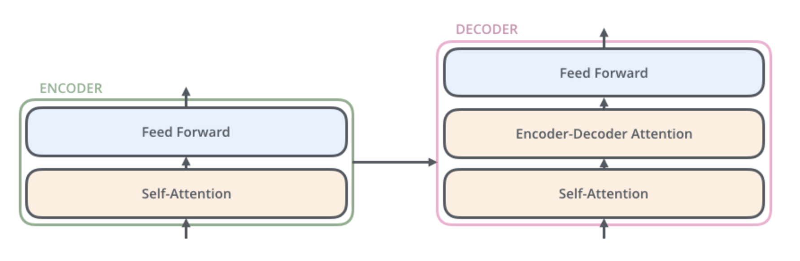

`deoder` 또한 `encoder` 에 있는 두 `layer` 모두를 가지고 있고 그 두 층 사이에 `encoder-decoder attention` 이 포함되어 있다.

- 이는 `decoder` 가 입력 문장 중에서 각 타임 스텝에서 가장 관련 있는 부분에 집중할 수 있도록 해준다.

## 벡터들을 기준으로 그림 그려보기

> 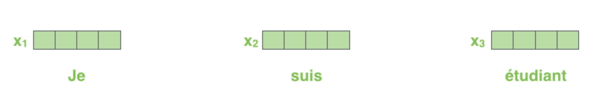

현대에 들어 대부분 NLP 관련 모델에서 그러듯, 먼저 입력 단어들을 `embedding` 알고리즘을 이용해 벡터로 바꾸는 것부터 해야 한다.

각 단어들은 크기 512의 벡터 하나로 `embed` 된다. 이 변환된 벡터들을 위와 같은 간단한 박스로 나타냈다.

## <u>__이 `embedding` 은 가장 밑단의 `encoder` 에서만 일어난다.__</u>

모든 `encoder` 들은 크기 512의 벡터의 리스트를 입력으로 받는다.

- 이 벡터는 가장 밑단의 `encoder` 의 경우에는 `word embedding` 이 될 것이고, 다른 `encoder` 들에서는 바로 전의 `encoder` 의 출력일 것이다.

이 벡터 리스트의 사이즈는 `hyperparameter` 으로 우리가 마음대로 정할 수 있다.

- <u>__가장 간단하게 생각한다면 우리의 학습 데이터 셋에서 `가장 긴 문장의 길이`로 둘 수 있다.__</u>

> 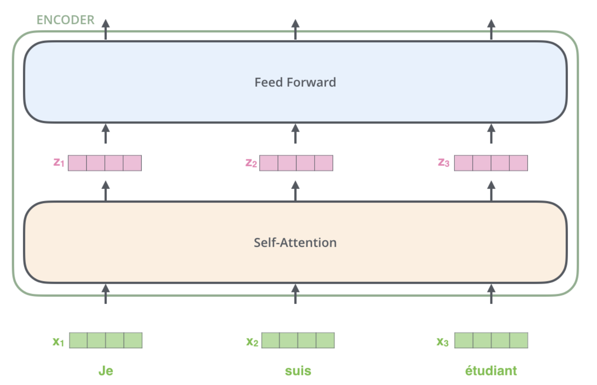

입력 문장의 단어들을 `embedding` 한 후에, 각 단어에 해당하는 벡터들은 `encoder` 내의 두 개의 `sub-layer` 으로 들어가게 된다.

각 위치에 있는 각 단어가 그만의 `path` 를 통해 `encoder` 에서 흘러가는 성질을 가진다.

`Self-attention` 층에서 이 위치에 따른 `path` 들 사이에 다 `dependency` 가 있다.

반면 `feed-forward` 층은 이런 `dependency` 가 없기 때문에 `feed-forward layer` 내의 이 다양한 `path` 들은 병렬처리될 수 있다.

## `Encoding` 을 해보자.

> 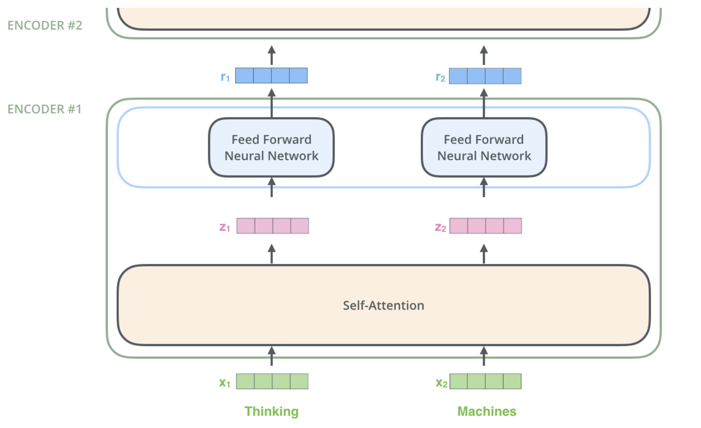

- 예시를 바꿔서 `Thinking` 과 `Machines` 으로 `Encoding` 을 해보자.

각 위치의 단어들은 각각 다른 `self-encoding` 과정을 거친다.

그 다음으로는 모두에게 같은 과정인 `feed-forward` 신경망을 거친다.

## `Self-Attention`

- 어떻게 동작하는지 알아보자.

번역하고 싶은 문장

- `"그 동물은 길을 건너지 않았다 왜냐하면 그것은 너무 피곤했기 때문이다."`

이 문장에서 `"그것"` 이 가리키는 것은 무엇일까?

사람에게는 너무 간단한 질문이지만 신경망 모델에게는 간단하지 않은 문제다.

모델이 `"그것은"` 이라는 단어를 처리할 때, 모델은 `self-attention` 을 이용하여 `"그것"` 과 `"동물"` 을 연결할 수 있다.

모델이 입력 문장 내의 각 단어를 처리해 나감에 따라, `self-attention` 은 입력 문장 내의 다른 위치에 있는 단어들을 보고 거기서 힌트를 받아 현재 타겟 위치의 단어를 더 잘 `encoding` 할 수 있다.

> 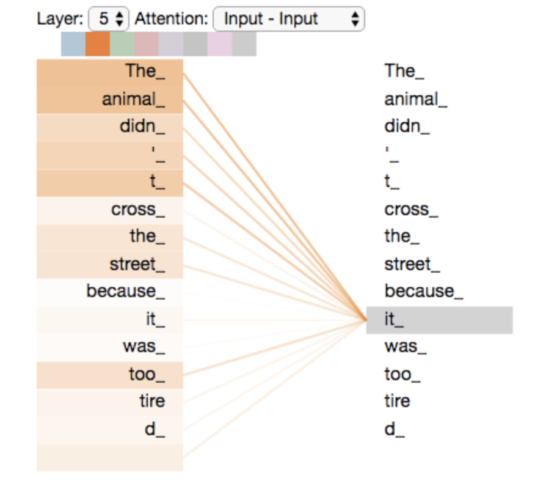

가장 윗단에 있는 `encoder #5` 에서 `"그것"` 이라는 단어를 `encoding` 할 때, `attention` 메커니즘은 입력의 여러 단어들 중에서 `"그 동물"` 이라는 단어에 집중하고 이 단어의 의미 중 일부를 `"그것"` 이라는 단어를 `encoding` 할 때 이용한다.

## `Self-Attention` 을 더 자세히 보자.

### 1. `self-attention` 계산의 가장 첫 단계는 `encoder` 에 입력된 벡터들(이 경우에서는 각 단어의 `embedding 벡터`)에게서부터 각 3개의 벡터를 만들어내는 일이다.

- 각 단어에 대해서 `Query 벡터`, `Key 벡터`, 그리고 `Value 벡터` 를 생성한다.
- 이 벡터들은 입력 벡터에 대해서 세 개의 학습 가능한 행렬들($W^Q$, $W^K$, $W^V$)을 각각 곱함으로써 만들어진다.

여기서 한가지 짚고 넘어갈 것은 <u>**이 새로운 벡터들(`Query`, `Key`, `Value`)이 기존의 `Embedding` 
벡터들 보다 더 작은 사이즈를 가진다.**</u>

- 기존의 벡터들은 크기가 512인 반면 이 새로운 벡터들은 크기가 64이다.
- 그러나 꼭 이렇게 더 작아야만 하는 것은 아니며, 이건 그저 `multi-head attention` 의 계산 복잡도를 일정하게 만들고자 내린 구조적인 선택일 뿐이다.

> 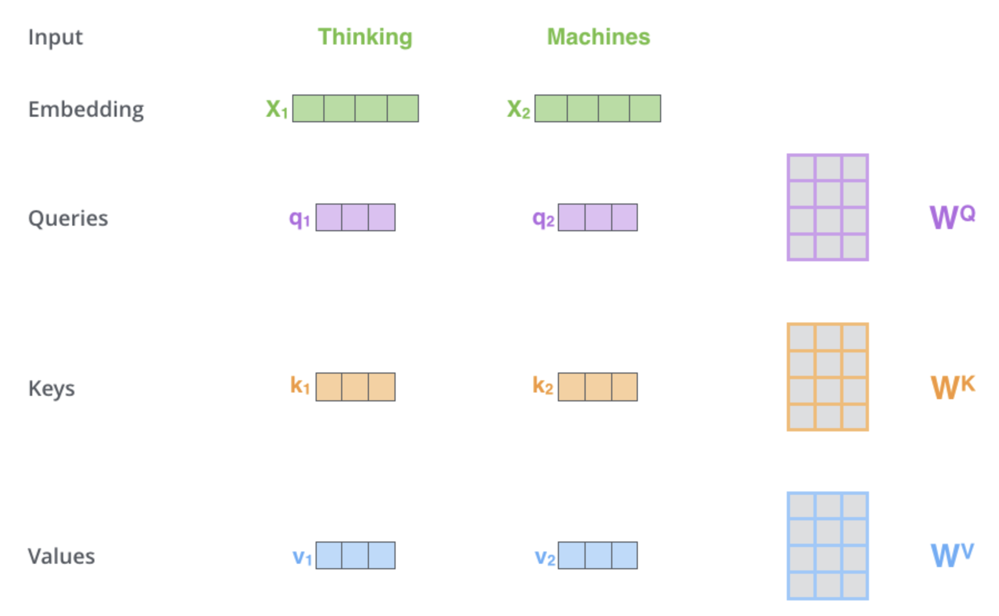

`Thinking` 의 `Embedding`벡터인 `$X_1$` 을 `weight` 행렬인 $W^Q$ 로 곱하는 것은 현재 단어와 연관된 `Query` 벡터인 $q_1$ 을 생성한다.

같은 방법으로 입력 문장에 있는 각 단어에 대한 `Query`, `Key`, `Value` 벡터를 만들 수 있다.

####
> 그렇다면 정확히 이 `Query`, `Key`, `Value` 벡터란 무엇을 의미하는 것일까?
####

### 2. `self-attention` 계산의 두 번째 스텝은 점수를 계산하는 것이다.

"`Thinking`" 에 대해서 `self-attention` 을 계산한다고 할 때, 이 단어와 입력 문장 속의 다른 모든 단어들에 대해서 각각 점수를 계산하여야 한다.

- 이 점수는 현재 위치의 이 단어를 `encode` 할 때 다른 단어들에 대해서 얼마나 집중을 해야 할지를 결정한다.

점수는 현재 단어의 `Query vector` 와 점수를 매기려 하는 다른 위치에 있는 단어의 `Key vector` 의 내적으로 계산된다.

- 위치 `#1` 에 있는 단어에 대해서 `self-attention` 을 계산한다 했을 때, 첫 번째 점수는 $q_1$ 과 $k_1$ 의 내적일 것이다.
- 그리고 동일하게 두 번재 점수는 $q_1$ 과 $k_2$ 의 내적일 것이다.

> 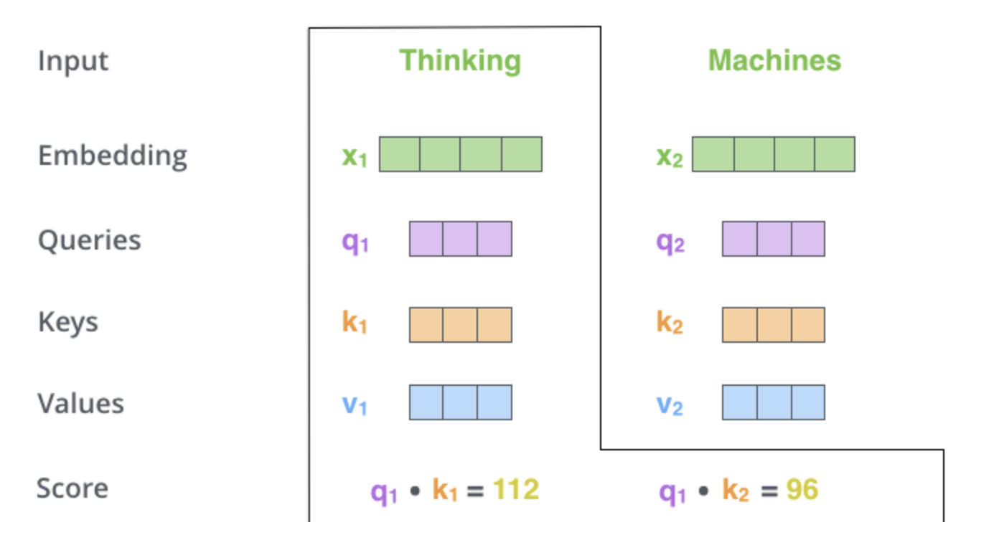

### 3 & 4. 세 번째와 네 번째 단계는 이 점수들을 8로 나누느 것이다.

- 이 8이란 숫자는 `Key` 벡터의 사이즈인 64의 제곱근이라는 식으로 계산이 된 것이다.
- 이 나눗셈을 통해 우리는 더 안정적인 `gradient` 를 가지게 된다.

그리고 이 값을 `softmax` 계산을 통과시켜 모든 점수들을 양수로 만들고 그 합을 1로 만들어 준다.

> 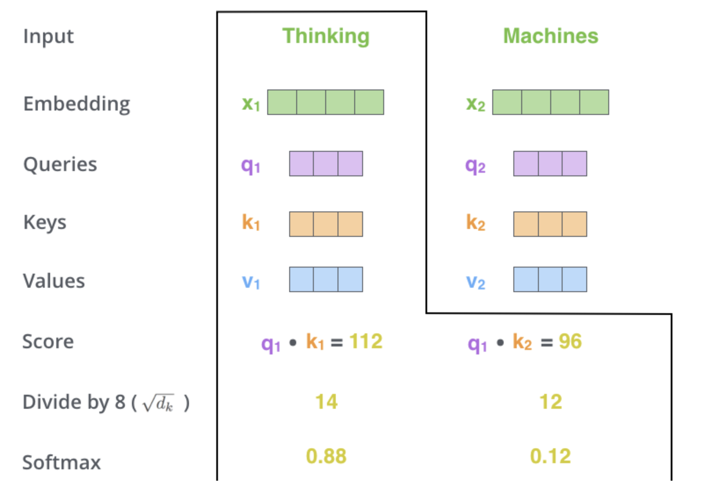

이 `softmax` 점수는 현재 위치의 단어의 `encoding` 에 있어서 얼마나 각 단어들의 표현이 들어갈 것인지를 결정한다.

- 당연하게 현재 위치의 단어가 가장 높은 점수를 가지며 가장 많은 부분을 차지하게 되겠지만,
- 가끔은 현재 단어에 관련이 있는 다른 단어에 대한 정보가 들어가는 것이 도움이 된다.

### 5. 다섯 번째 단계는 이제 입력의 각 단어들의 `value` 벡터에 이 점수를 곱하는 것이다.

이것을 하는 이유는 우리가 집중을 하고 싶은 관련이 있는 단어들은 그래도 남겨두고, 관련이 없는 단어들은 0.001 과 같은 작은 숫자(점수)를 곱해 없애버리기 위함이다.

### 6. 마지막 여섯 번째 단계는 이 점수로 곱해진 `weighted value` 벡터들을 다 합해 버리는 것이다.

이 단계의 출력이 바로 현재 위치에 대한 `self-attention layer` 의 출력이 된다.

> 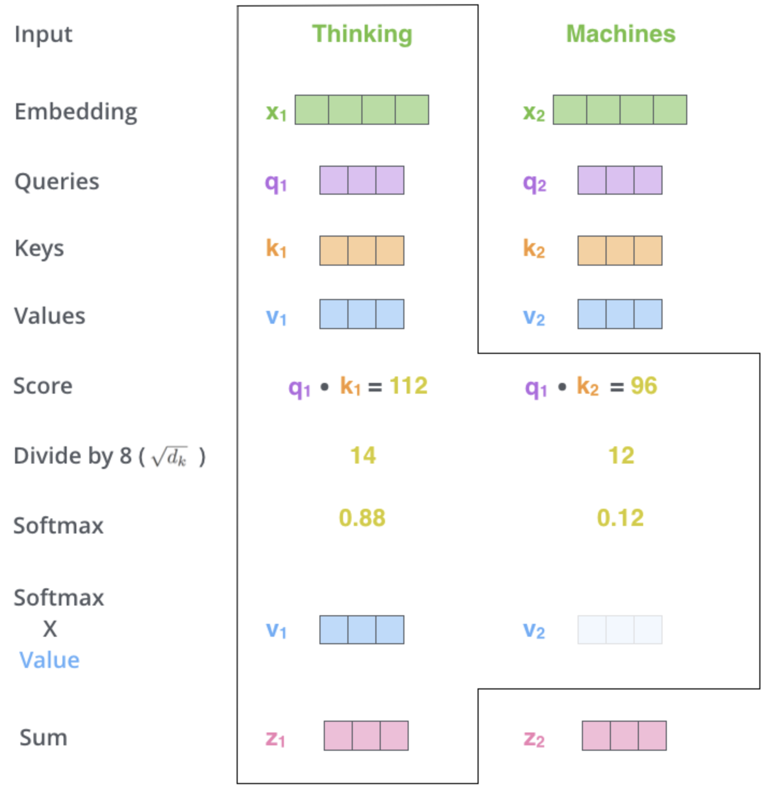

이 여섯가지 과정이 바로 `self-attention` 의 계산 과정이다. 이 결과로 나온 벡터를 `feed-forward` 신경망으로 보내게 된다.

- 그러나 실제 구현에서는 빠른 속도를 위해 이 모든 과정들이 벡터가 아닌 행렬의 형태로 진행된다.

## `Self-attention` 의 행렬 계산

### 1. 첫 스텝은 입력 문장에 대해서 `Query`, `Key`, `Value` 행렬들을 계산하는 것이다.

입력 벡터들(혹은 `embedding` 벡터들)을 하나의 행렬 `X` 로 쌓아 올리고, 그것을 우리가 학습할 `weight` 행렬들인 $W^Q$, $W^K$, $W^V$ 로 곱한다.

> 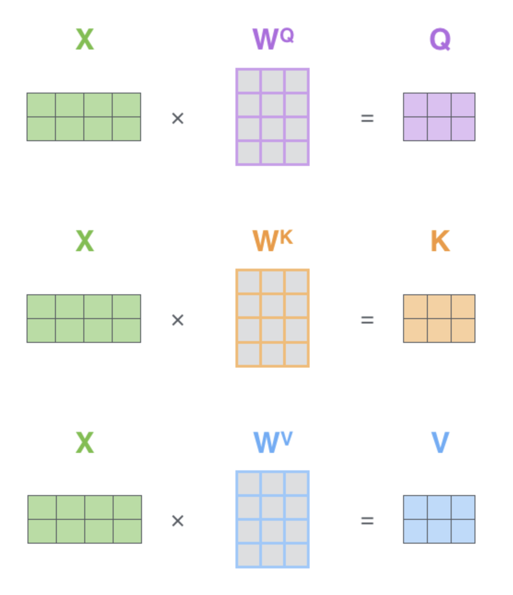

행렬 `X` 의 각 행은 입력 문장의 각 단어에 행당한다.

- `embedding` 벡터들(크기 512, 그림에서는 4)과 `Qeury`/`Key`/`Value` 벡터들(크기 64, 그림에서는 3)간의 크기 차이를 볼 수 있다.

### 2. 마지막으로, 우리는 현재 행렬을 이용하고 있어서 앞서 설명했던 `self-attention` 계산 단계 2부터 6까지를 하나의 식으로 압축할 수 있다.

> 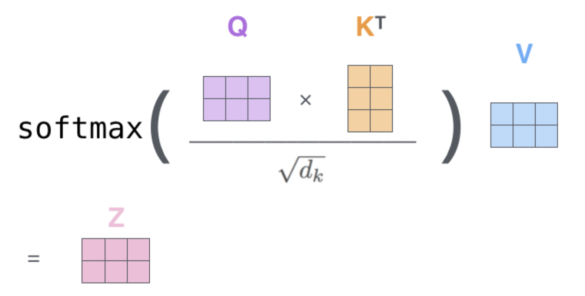

행렬 형태로 표현한 `self-attention` 계산

## The Beast With Many Heads

`"multi-headed" attention` 은 두 가지 방법으로 `attention layer` 의 성능을 향상시킨다.

1. 모델이 다른 위치에 집중하는 능력을 확장시킨다.
   -  위의 예에서는 $z_1$ 이 모든 다른 단어들의 `encoding` 을 조금씩 포함했지만, 
   -  사실 이것은 실제 자기 자신에게만 높은 점수를 줘 자신만을 포함해도 됐을 것이다.
   -  "그 동물은 길을 건너지 않았다 왜냐하면 그것은 너무 피곤했기 때문이다" 와 같은 문장을 번역할 때 "그것" 이 무엇을 가리키는지에 대해 알아낼 때 유용하다.
2. `attention layer` 가 여러 개의 "representation 공간" 을 가지게 해준다.
   - `multi-headed attention` 을 이용함으로써 우리는 여러 개의 `Query/Key/Value weight` 행렬들을 가지게 된다.(논문에서 제안된 구조는 8개의 `attention heads` 를 가지므로 우리는 각 `encoder/decoder` 마다 이런 8개의 세트를 가지게 되는 것이다.)
   - 각각의 `Query/Key/Value set` 는 랜덤으로 초기화되어 학습된다.
   - 학습이 된 후 각각의 세트는 입력 벡터들에 곱해져 벡터들을 각 목적에 맞게 투영시키게 된다.
   - 이러한 세트가 여러개 있다는 것은 각 벡터들을 각각 다른 representation 공간으로 나타낸 다는 것을 의미한다.

> 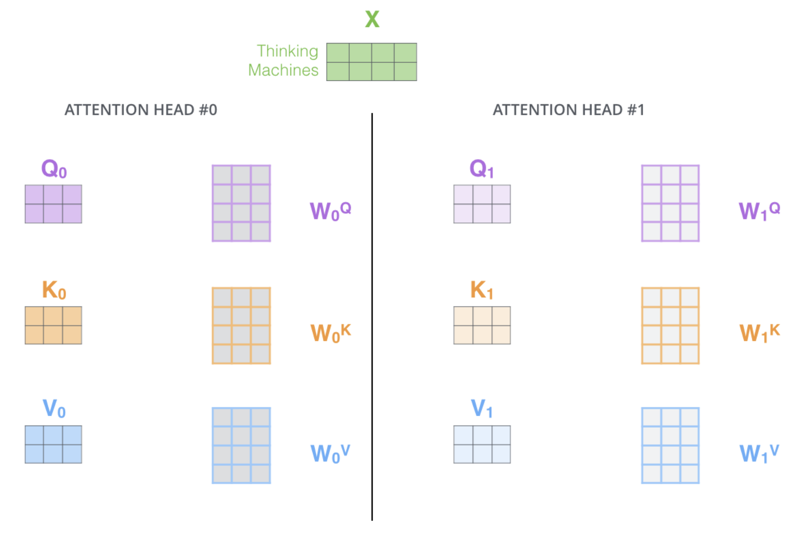

`multi-headed attention` 을 이용하기 위해서 우리는 각 `head` 를 위해서 각각의 다른 `Query/Key/Value weight` 행렬들을 모델에 가지게 된다.

입력 벡터들의 모음인 행렬 `X` 를 $W^Q$/$W^K$/$W^V$ 행렬들로 곱해 각 `head` 에 대한 $Q$/$K$/$V$  행렬들을 생성한다.

같은 `self-attention` 계산 과정을 8개의 다른 `weight` 행렬들에 대해 8번 거치게 되면, 8개의 서로 다른 $Z$ 행렬을 가지게 된다.

> 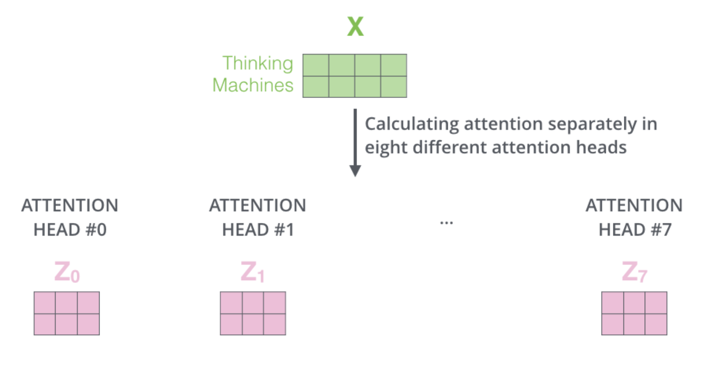

> 여기서 문제는 이 8개의 행렬을 바로 `feed-forward layer` 으로 보낼 수 없다는 것이다.

`feed-forward layer` 은 한 위치에 대해 오직 한 개의 행렬만을 `input` 으로 받을 수 있다.

이 8개의 행렬을 하나의 행렬로 합치는 방법을 고안해야 한다.

어떻게 할 수 있을까?

- 모두 이어 붙여서 하나의 행렬로 만들어버리고, 
- 그다음 하나의 또 다른 `weight` 행렬인 $W^O$ 를 곱한다.

> 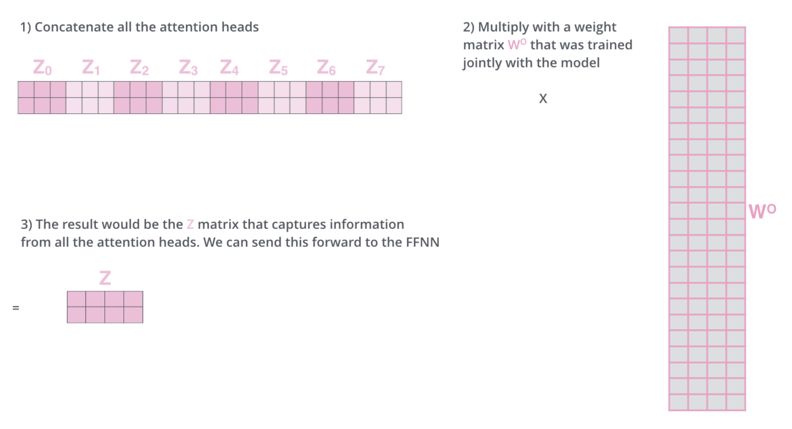

## `multi-headed self-attention` 은 이게 전부다.

> 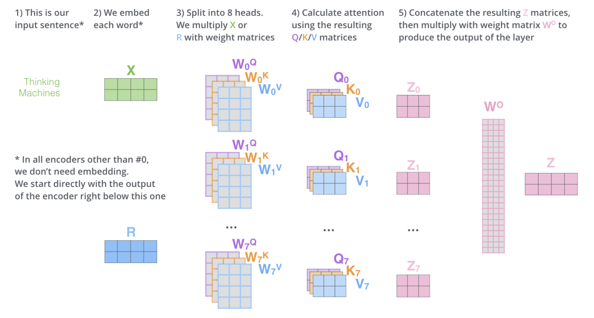

## 다시 예제 문장을 `multi-heade attention` 과 함께 보도록 하자

그 중에서도 특히 `"그것"` 이란 단어를 `encode` 할 때 여러 개의 `attention` 이 각각 어디에 집중하는지를 보도록 하자

> 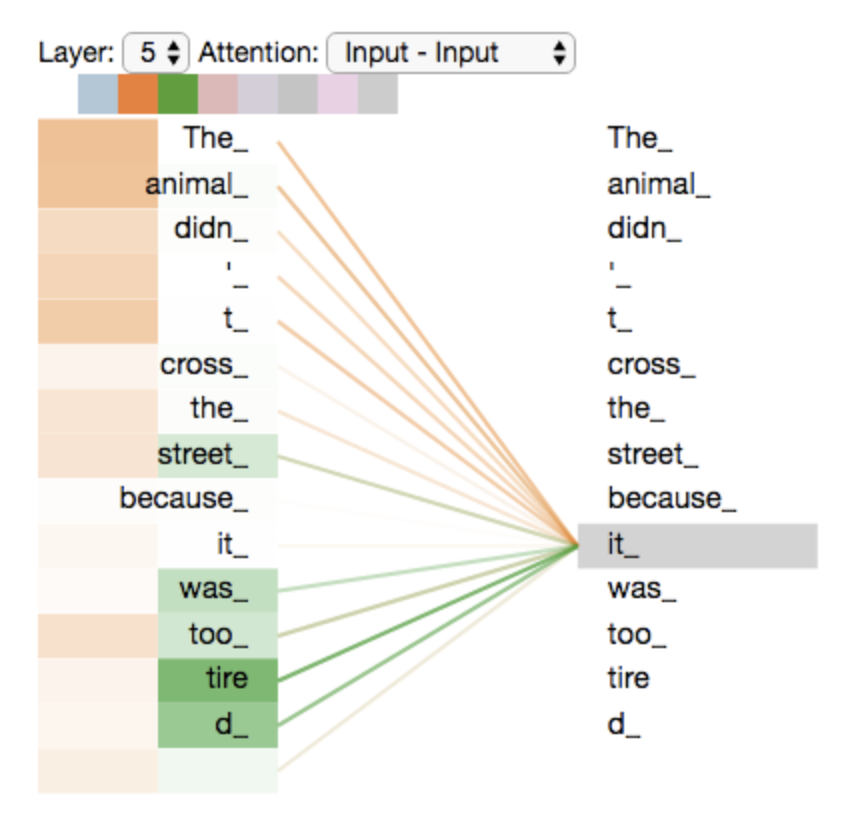

`"그것"` 이란 단어를 `encode` 할 때, 주황색의 `attention head` 는 `"그 동물"` 에 가장 집중하고 있는 반면 초록색의 `head` 는 `"피곤"` 이라는 단어에 집중을 하고 있다.

모델은 이 두개의 `attention head` 를 이용하여 `"동물"` 과 `"피곤"` 두 단어 모두에 대한 `representation` 을 `"그것"`의 `representation` 에 포함시킬 수 있다.

그러나 이 모든 `attention head` 들을 하나의 그림으로 표현하면, 이제 `attention` 의 의미는 해석하기가 어려워진다.

> 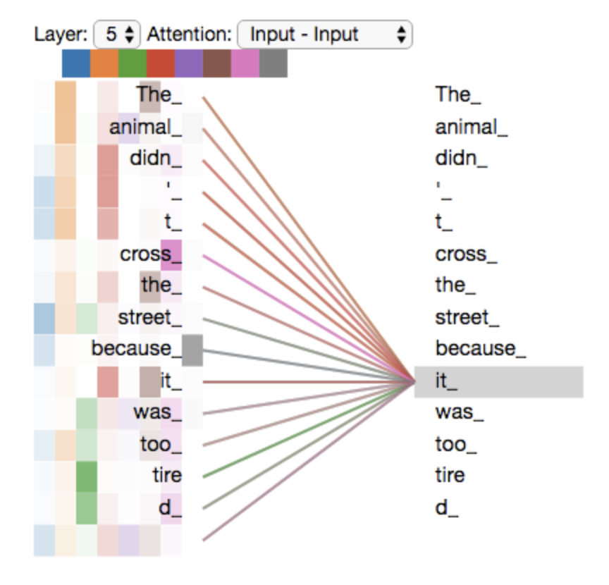

## `Positional Encoding` 을 이용해서 시퀀스의 순서 나타내기

지금까지 설명해온 `Transformer` 모델에서 한가지 부족한 부분은 이 모델이 입력 문장에서 단어들의 순서에 대해서 고려하고 있지 않다는 점이다.

단어들의 순서를 고려하기 위해서, `Transformer` 모델은 각각의 입력 `embedding` 에 `"positional encoding"` 이라고 불리는 하나의 벡터를 추가한다.

- 이 벡터들은 모델이 학습하는 특정한 패턴을 따르는데, 이러한 패턴은 모델이 각 단어의 위치와 시퀀스 내의 다른 단어 간의 위치 차이에 대한 정보를 알 수 있게 해준다.

- 이 벡터들을 추가하기로 한 배경에는 이 값들을 단어들의 `embedding` 에 추가하는 것이 `Query/Key/Value` 벡터들로 나중에 투영되었을 때 단어들 간의 거리를 늘릴 수 있다는 점이 있다.

> 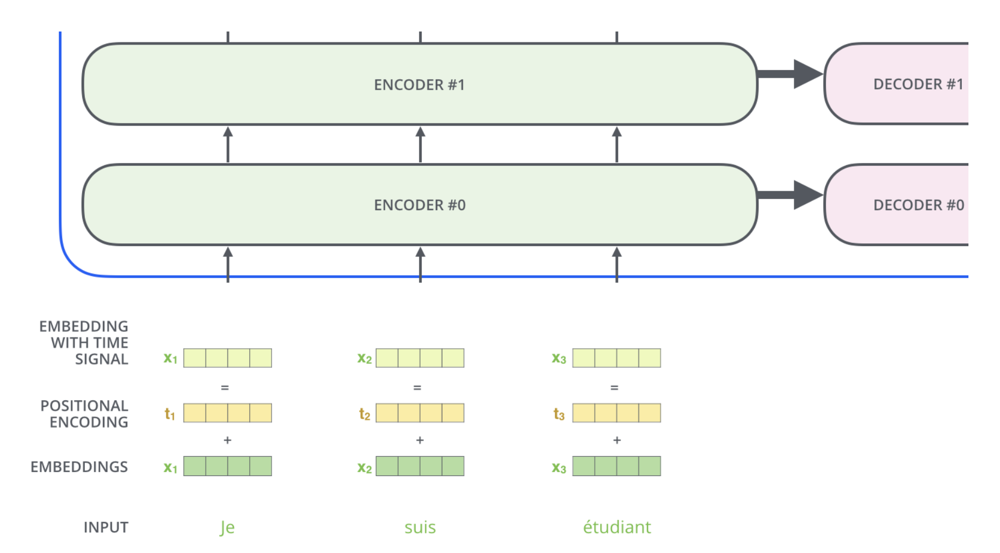

모델에게 단어의 순서에 대한 정보를 주기 위해, 위치 별로 특정한 패턴을 따르는 `positional encoding` 벡터들을 추가한다.

만약 `embedding` 의 사이즈가 4라고 가정한다면, 실제로 각 위치에 따른 `positional encoding` 은 아래와 같다.

> 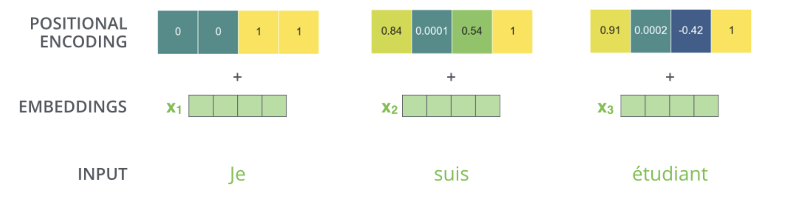

위는 크기가 4인 `embedding` 의 `positional encoding` 에 대한 실제 예시다.

그림에서 각 행은 하나의 벡터에 대한 `positional encoding` 에 해당한다.

그러므로 첫 번째 행은 우리가 입력한 문장의 첫 번째 단어의 `embedding` 벡터에 더할 `positional encoding` 벡터다.

각 행은 사이즈 512인 즉 512개의 셀을 가진 벡터이며 각 셀의 값은 1과 -1 사이를 가진다.

> 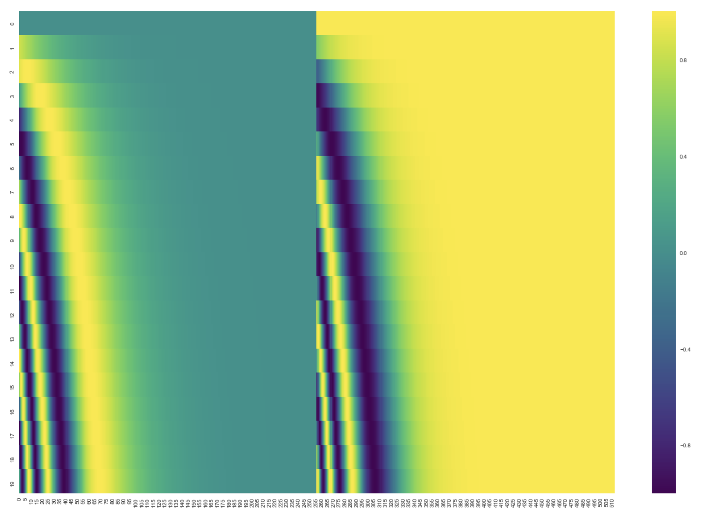

20개의 단어와 그의 크기 512인 `embedding` 에 대한 `positional encoding` 실제 예시이다.

그림에서 볼 수 있듯이 이 벡터들은 중간 부분이 반으로 나눠져 있다.

- 그 이유는 바로 왼쪽 반은(크기 256) sine 함수에 의해서 생성되었고, 나머지 오른쪽 반은 또 다른 함수인 cosine 함수에 의해 생성되었기 때문이다.
- 그 후 이 두 값들은 연결되어 하나의 `positional encoding` 벡터를 이루고 있다.

## The Residuals

각 `encoder` 내의 `sub-layer` 가 `residual connection` 으로 연결되어 있으며, 그 후에는 `layer-normalization` 과정을 거친다는 것이다.

> 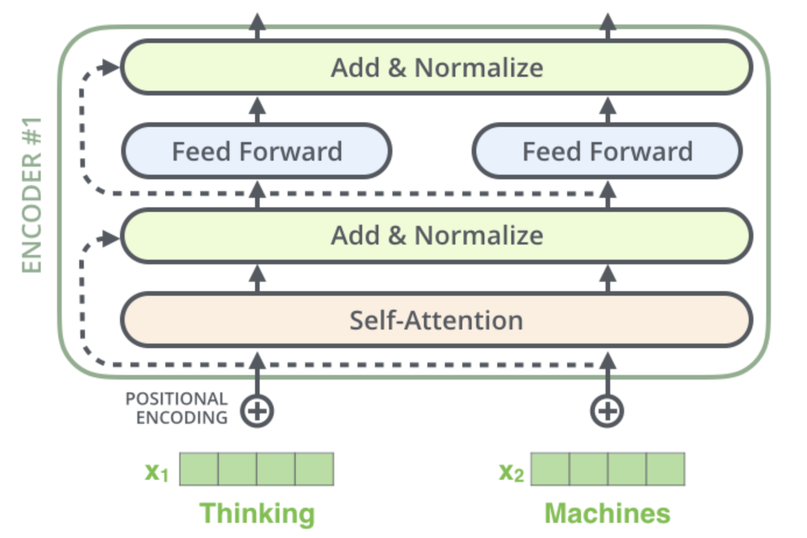

이 벡터들과 `layer-normalization` 과정을 시각화해보면 다음과 같다.

> 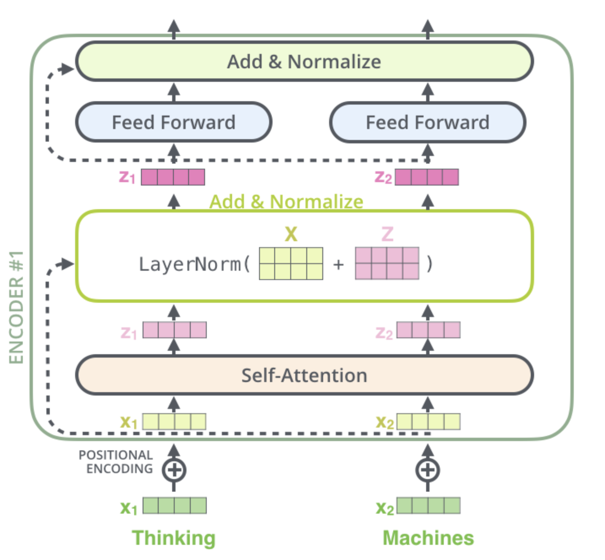

이것은 `decoder` 내에 있는 `sub-layer` 들에도 똑같이 적용되어 있다.

만약 2개의 `encoder` 와 `decoder` 로 이루어진 단순한 형태의 `Transformer` 를 생각해본다면 다음과 같은 모양일 것이다.

> 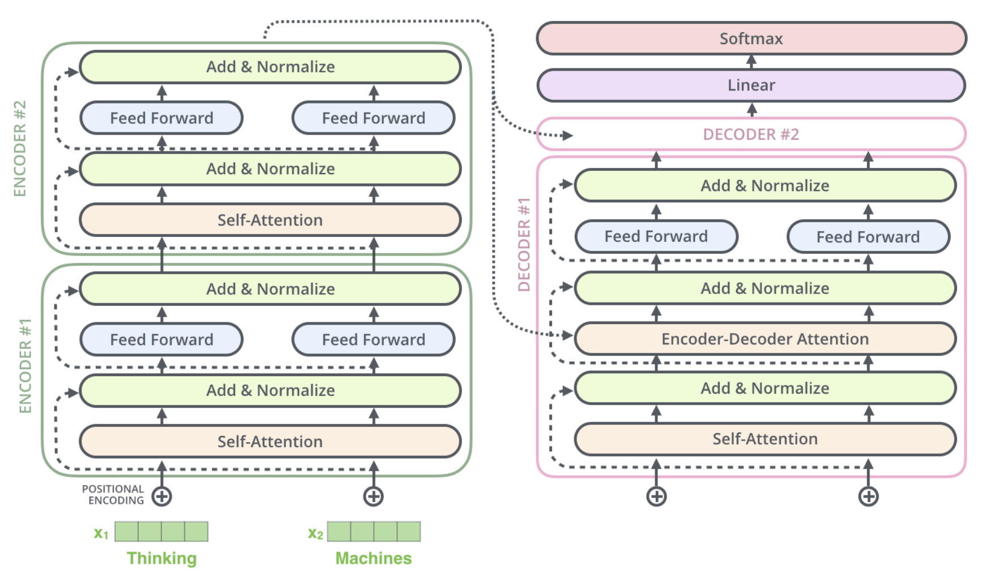

## The Decoder Side

`encoder` 가 먼저 입력 시퀀스를 처리하기 시작한다.

그다음 가장 윗단의 `encoder` 의 출력은 `attention` 벡터들인 `Key` 와 `Value` 로 변형된다.

이 벡터들은 이제 각 `decoder` 의 `encoder-decoder attention layer` 에서 `decoder` 가 입력 시퀀스에서 적절한 장소에 집중할 수 있도록 도와준다.

> 

`encoding` 단계가 끝나면 이제 `decoding` 단계가 시작된다.

`decoding` 단계의 각 스텝은 출력 시퀀스의 한 `element` 를 출력한다.

- 현재 기계 번역의 경우에는 영어 번역 단어

디코딩 스텝은 `decoder` 가 출력을 완료했다는 special 기호인 `<end of sentence>` 를 출력할 때까지 반복된다.

각 스텝마다의 출력된 단어는 다음 스텝의 가장 밑단의 `decoder` 에 들어가고 `encoder` 와 마찬가지로 여러 개의 `decoder` 를 거쳐 올라간다.

`encoder` 의 입력에 했던 것과 동일하게 `embed` 를 한 후 `positional encoding` 을 추가하여 `decoder` 에게 각 단어의 위치 정보를 더해준다.

> 

`decoder` 내에 있는 `self-attention layer` 들은 `encoder` 와는 조금 다르게 작동한다.

`decoder` 에서의 `self-attention layer` 은 `output sequence` 내에서 현재 위치의 이전 위치들에 대해서만 `attend` 할 수 있다.

이것은 `self-attention` 계산 과정에서 `softmax` 를 취하기 전에 현재 스텝 이후의 위치들에 대해서 `masking`(즉 그에 대해서 `-inf` 로 치환하는 것)을 해줌으로써 가능해진다.

## 마지막 Linear Layer 과 Softmax Layer 

여러 개의 `decoder` 를 거치고 난 후에는 소수로 이루어진 벡터 하나가 남게 된다.

`Linear layer` 은 `fully-connected` 신경망으로 `decoder` 가 마지막으로 출력한 벡터를 그보다 훨씬 더 큰 사이즈의 벡터인 `logits` 벡터로 투영시킨다.

모델이 training 데이터에서 총 10,000개의 영어 단어를 학습하였다고 가정하자

- 이를 모델의 `"output vocabulary"` 라고 부른다.

이 경우에 `logits vector` 의 크기는 10,000이 될 것이다.

- 벡터의 각 셀은 그에 대응하는 각 단어에 대한 점수가 된다.

이렇게 되면 `Linear layer` 의 결과로서 나오는 출력에 대해서 해석을 할 수 있게 된다.

그 다음에 나오는 `softmax layer` 는 이 점수들을 확률로 변환해주는 역할을 한다.

셀들의 변환된 확률 값들은 모두 양수 값을 가지며 다 더하게 되면 1이 된다.

가장 높은 확률 값을 가지는 셀에 해당하는 단어가 해당 스텝의 최종 결과물로서 출력되게 된다.

> 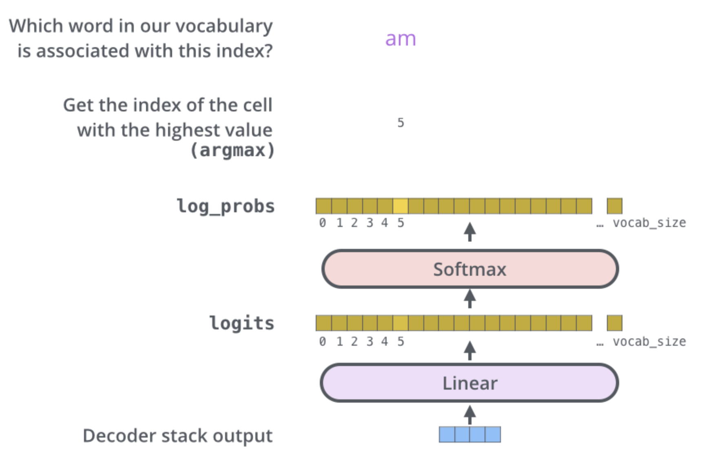

`decoder` 에서 나온 출력은 `Linear layer` 와 `softmax layer` 를 통과하여 최종 출력 단어로 변환된다.

