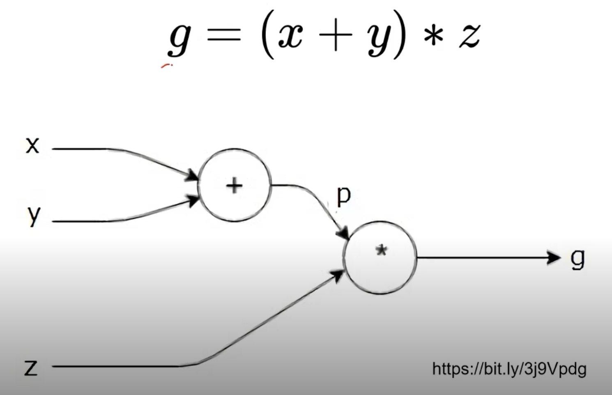

# Introduction to PyTorch

> 프레임워크를 공부하는 것이 딥러닝을 공부하는 것이다!

- 리더는 단 2개
  - PyTorch
    - facebook
    - Dynamic Computation Graph (Define by Run)
      - 자동 미분을 실행할 때 실행 시점에서 graph를 정의
      - 실행을 하면서 그래프를 생성하는 방식
  - TensorFLow
    - Google
      - Define and run
        - 그래프를 먼저 정의 -> 실행시점에 데이터 feed

> Computational Graph
    

- 연산의 과정을 그래프로 표현

> PyTorch 로 나오는 논문들의 개수가 우상향 하고 있음

- 개발 과정에서 debugging이 쉽다보니 논문을 작성하거나 아이디어를 구현할 때 장점!
- 학회에서는 연구가 많다보니 PyTorch를 많이 쓰는 듯

> TensorFlow

- Production에 굉장히 큰 장점
- Cloud 연결할 때 장점!
- Multi-GPU에서 장점!

> Why PyTorch

- Define by Run 의 장점
  - 즉시 확인 가능 -> pythonic code
- GPU support, Good API and community
- 사용하기 편한 장점이 가장 큼
- TF는 production 과 scalability의 장점

> PyTorch

- Numpy + AutoGrad + Function(DL)
- Numpy 구조를 가지는 Tensor 객체로 array 표현
- **자동미분**을 지원하여 DL 연산을 지원
- 다양한 형태의 DL을 지원하는 함수와 모델을 지원함
  - Dataset, Multi-GPU, Data Augmentation 등

