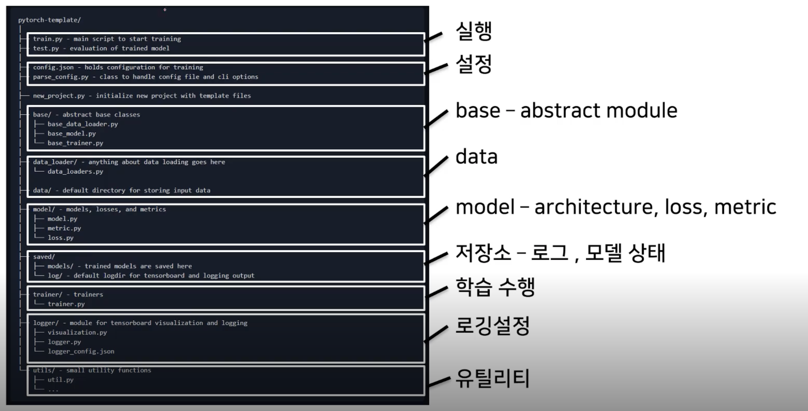

# PyTorch 프로젝트 구조 이해하기

## PyTorch Project Template Overview

> 개발(Idea) 초기 단계에서는 대화식 개발 과정이 유리

- 학습과정과 디버깅 등 지속적인 확인

> 배포 및 공유 단계에서는 notebook 공유의 어려움

- 쉬운 재현의 어려움, 실행순서 꼬임

> DL 코드도 하나의 프로그램

- 개발 용이성 확보와 유지보수 향상 필요

> 다양한 프로젝트 템플릿이 존재

> 사용자 필요에 따라 수정하여 사용

> 실행, 데이터, 모델, 설정, 로깅, 지표, 유틸리티 등 다양한 모듈들을 분리하여 프로젝트 템플릿화

> PyTorch Template 추천 repository

- https://github.com/victoresque/pytorch-template

## Module 구성

> 

## 사용방법

> git clone https://github.com/victoresque/pytorch-template.git

> 디렉토리 이동 후

> `python new_project.py <MyProject Name>`

> 실행 방법

- `python train.py -c config.json`

> Colab 에서 사용법

- pytorch_project.ipynb 파일 확인

    - 구글 ngrok 검색
    - 사이트 로그인
    - auth token 복사
    - `!pip install colab-ssh`
    - `launch_ssh(NGROK_TOKEN, PASSWORD)`
    - 이렇게 하면 외부에서 접속이 가능하게 만들어 줌

- Visual Studio Code 에서
  
  - Extention Remote - SSH 설치
  - command + shift + p 눌러서
  - Remote-SSH: Add New SSH Host 클릭
  - ssh root@<colab에 써있는 hostname> -p <colab에 써있는 port 번호> 입력 후 엔터
  - config 저장
  - command + shift + p 눌러서
  - Remote-SSH: Connect to Host 클릭
  - 저장된 host 클릭
  - 비밀번호 <colab에서 설정한 비밀번호> 입력
  - terminal 에서 `cd ..` 하고
  - `cd content` 하면 colab 에서의 폴더로 이동