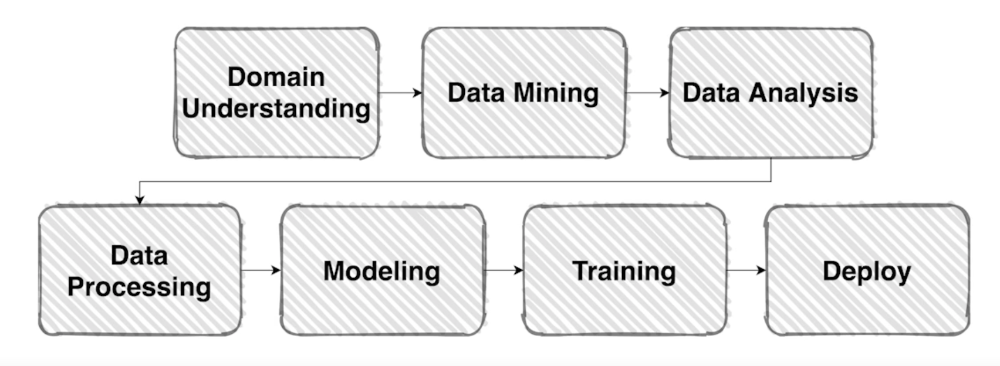
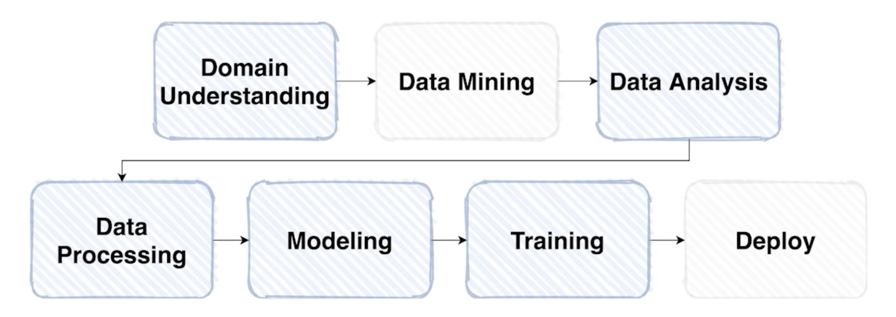

# Competition with AI Stages!

## Welcome, P Stage!

### What is P Stage?

> "백문이 불여일견, 백견이 불여일타"

### Goals

- U Stage에서 경험한 이론을 바탕으로 실제 데이터와 코드베이스를 통한 이해
- Competition 형태의 실습을 통해 점진적인 모델 성능 향상을 경험
- 머신러닝 파이프라인의 한 부분을 경험

## Competition with AI Stages

### Competition 이란?

> "주어진 데이터를 이용해 원하는 결과를 만들기 위한 가장 좋은 방법이란?"

- 다양한 문제들, 다양한 도메인의 문제들이 있음
- kaggle, DACON 등
- 전세계적으로 꽤 많은 인기를 가지고 있음
- 업체나 단체 곧 회사에서 주어진 데이터를 가지고 어떤 문제가 있는데 그 문제를 해결하기 위한 어떤 알고리즘 그리고 그 문제를 해결해서 이 데이터를 이용해서 어떤 결과를 만들고 싶은데 그게 잘 안되는 경우에 이런 플랫폼에 의뢰를 하게 됨
- 주최자가 참가자한테 원하는 거는 내가 이런 데이터를 줄 테니까 이걸 위해서 우리가 원하는 결과를 만들고 싶은데 그걸 위해서 가장 좋은 방법을 한번 서로 경쟁해서 나한테 좋은 방식을 알려달라는 취지

### AI Stages

- Competitions 탭으로 들어가면 이미지 분류 대회 리스트가 나오게 될 것

## Competition Details

### Overview

> "어디로 가야 하오.."

- 개요 부분이 중요하다.
- 그런데 읽고 넘어가는 사람이 많이 없다.
- 주최자가 참가자에게 돈을 줘가면서 무엇을 하려하고 왜 이문제가 발생해서 이 문제가 특별한 문제가 있어서 어려운 부분이 있는데 해결할 수 있었으면 좋겠다 이런 여러가지의 바램까지 overview 에서 볼 수 있음
- 목적, 이 문제의 의미, 이 문제를 해결했을 때 적용되는 대상, 이것들의 결과 산출물, 도메인, 문제를 제기하게 된 배경, 구체적인 문제점 등
- overview 를 통해 방향성을 도출할 수 있게 됨

> 잠깐, 이 `Overview` 에서 반드시 해야할 `숙제` 가 있습니다.

- Problem Definition (문제 정의)
  - 내가 지금 풀어야 할 문제가 무엇인가?
  - 이 문제의 Input 과 Output 은 무엇인가?
  - 이 솔루션은 어디서 어떻게 사용되어지는가?
  - 등

### Data Description

- File 형태, Metadata Field 소개 및 설명 - "데이터 스펙 요약본"

### Notebook

- 데이터 분석, 모델 학습, 테스트 셋 추론의 과정을 서버에서 연습 가능

### Submission & Leaderboard

- 테스트 예측 결과물 제출 & 순위 확인

### Discussion

- 캐글에선 여러가지 자료 공유가 많음
- 왜?
  - 등수를 올리는 것 보다, 문제를 해결하고 싶은 마음
- 스스로 성장하는 과정이 중요한데 서로 토의하고 자료를 공유하면서 성장할 수 있음

## 왜 P stage 는 Competition 을 선택 했나?

### Machine Learning Pipeline

- Simple Machine Learning Flow
    
    

- Competition 의 경우
    
    

    - Domain Understanding 이 가장 중요한데 데이터를 분석하면서 얻는 것도 시작이 될 수 있지만 대회의 Overview 를 보고 파악하는게 가장 중요하다!!

