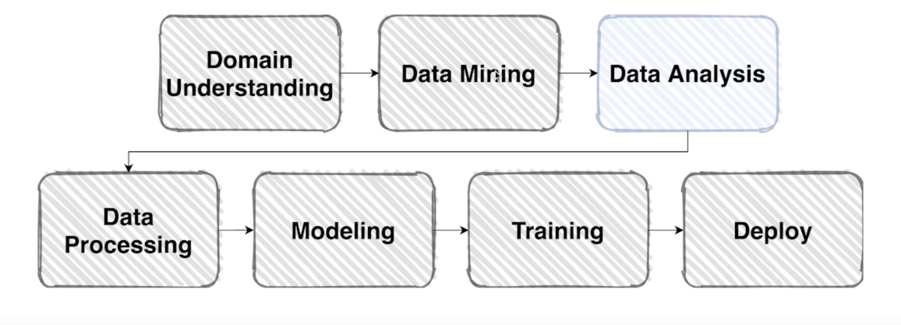
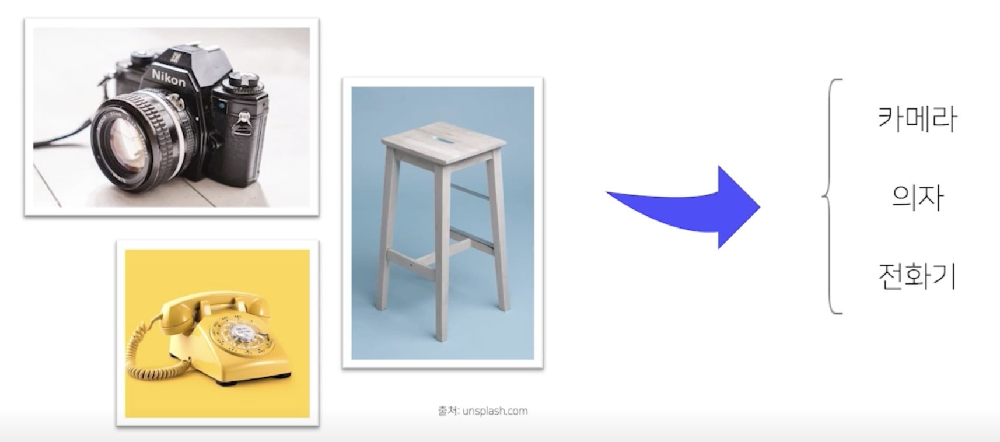
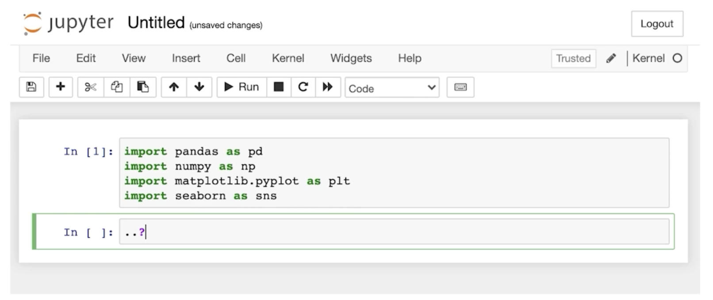
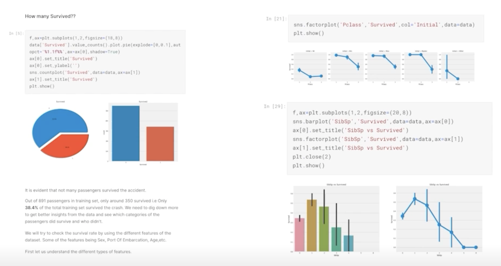
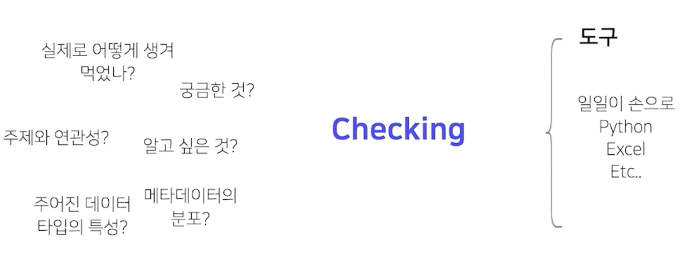
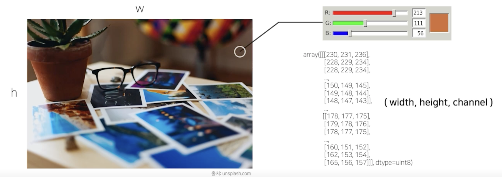
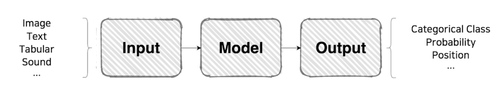
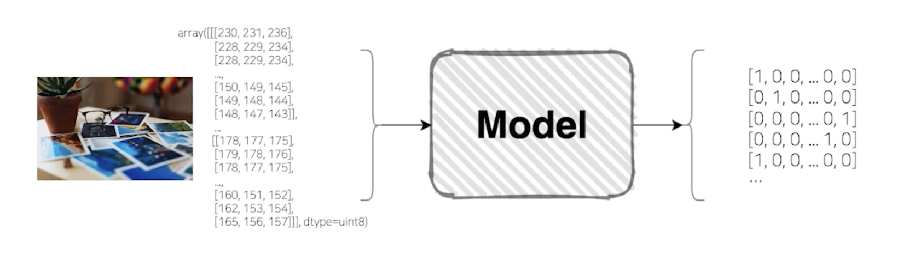

# Image Classification & EDA

## Overview

- 데이터와 한번 친해져 볼 시간 (Data Analysis)
    
    

- 이미지를 분류한다. 어떻게?

    

  - Input : 이미지
  - Output : 이미지의 Class

## EDA (Exploratory Data Analysis)

### EDA란?

- `Exploratory`(탐색적) `Data`(데이터) `Analysis`(분석)
  - 데이터를 이해하기 위한 노력
  - 데이터를 이해한다?
    - 이 사람이 이 데이터를 왜 줬을까?
    - 굳이 상금까지 내걸면서 이 사람이 무얼 나한테 요구하는거고 내가 뭘 Output 으로 내야하는걸까?를 Overview를 통해서 줬는데
    - 이런 내용 위에서 이 데이터가 어떤 특징이 있길래 어떤 부분이 어려웠는지 어떤 클래스를 하기가 어려웠고 Output을 내기가 어려웠는지를 검증해보고 Checking 해보고 확인해보는 시간

### 그런데, EDA에서 뭘 해야할 지 모르겠어요

- library import 하고 이 다음은..?

    

- 주어진 데이터에 대한 본인의 생각을 자유롭게 서술하시오. (50점)

    

  - 어떤 생각을 써가지고 스토리를 만들어내야 하는지 막막.....
  - 이렇게 잘 하는 사람의 EDA는 우리가 바로 할 수 없다.
  - 분석을 하는데 있어서 무엇이 필요한지를 생각해보는게 중요하다

### 사실, EDA의 진짜 목적은..

- 진짜로 여러분이 궁금한 건 뭐에요?

    

- 거창한 EDA를 만드는게 목표가 아니다.
- 데이터에 대해 궁금한 점, 의견, 다양한 생각을 검증해보는 것
- EDA의 목적은 궁금한 걸 알아보는 것

### 결국, 다시 돌아오게 될 것

- 도중에도 떠오르는 아이디어 때문에 다시금 확인해볼 필요가 생기기도 한다.

### 그러니, 처음에는 정말 아무렇게나 해보세요.

- 자신있게 아무거나 해볼 것

## Image Classification

### Image

- 시각적 인식을 표현한 인공물(Artifact)

    

- 컴퓨터가 Image 를 이해하는 방식을 어느정도 알고 있어야지 Image 를 넣어서 모델링을 하고 결과적으로 Class 를 만들어내는 것까지 생각해 볼 수 있을 것
- RGB 하나당 0~255까지의 데이터로 표현

### Model

- Input + Model = Output

    

### Image Classification Model

- Image + Classification Model = Class

    

## Baseline

### Baseline

- 베이스라인 코드는 강의를 거듭할 수록 점점 내용이 더해질 예정

    

> 강의를 본 후, 직접 코드를 작성해 보고, 예시 코드(혹은 자료)와 비교해 보는 것을 추천

    

    

