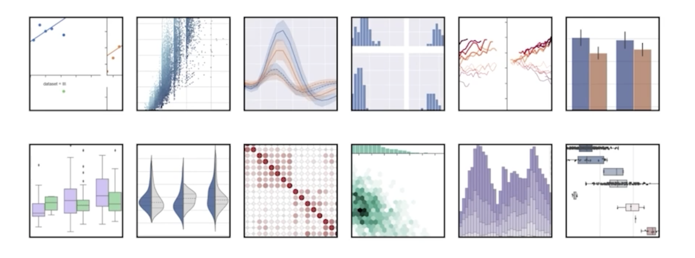

# Seaborn 소개

## 1. Seaborn 이란

### 1.1 Seaborn 소개

> 

- Seaborn 은 Matplotlib 기반 통계 시각화 라이브러리
  - 통계 정보 : 구성, 분포, 관계 등
  - Matplotlib 기반이라 Matplotlib 으로 커스텀 가능
  - 쉬운 문법과 깔끔한 디자인이 특징

> 

- 디테일한 커스텀보다는
  - 새로운 방법론을 위주로!
  - 앞서 공부한 이론과의 연결을 중심으로!

### 1.2 Seaborn 설치

- 아직 버전 1.0 이 나오지 않아 언제든 업데이트 가능성 존재
- 강의에서는 버전 0.11 로 진행
  - Kaggle, Google Colab 에서 버전이 다를 수 있으니 꼭 설치

- `pip intsll seaborn==0.11`
- `import seaborn as sns`

### 1.3 다양한 API

- Seaborn 은 시각화의 목적과 방법에 따라 API 를 분류하여 제공하고 있음
  - Categorical API
  - Distribution API
  - Relational API
  - Regression API
  - Multples API
  - Theme API

- 모든 내용을 소개하기 보다는 필요한 내용을 부분적으로 설명할 예정