# Dataset

## Overview

- 주어진 Vanilla Data를 모델이 좋아하는 형태의 Dataset으로..

    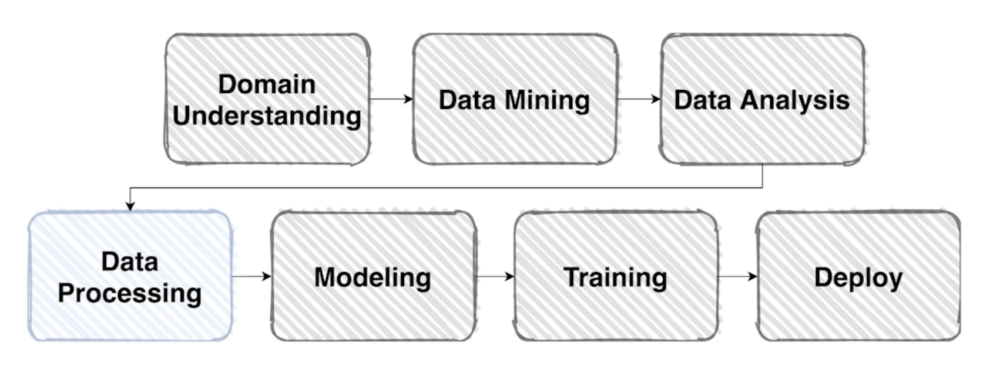

## Pre-processing (전처리)

- 생각보다 많은 시간이 소요되고 굉장히 중요한 작업
- 현업에서도 가장 많이 집중하고 중요하게 생각하는 영역

### Data Science is..

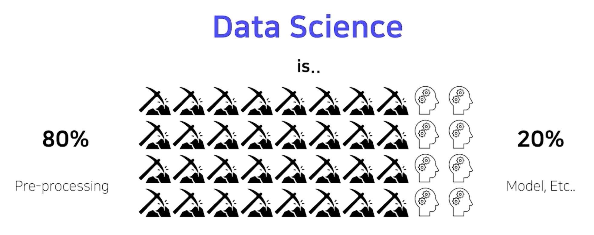

- 데이터 전처리 과정에 엄청난 시간을 쏟고 있음
- 데이터에 노이즈, 이상치, null값, 알 수 없는 값들이 너무 많이 들어있음
- 그러나 이미지 같은 경우 이상한 값들이 많이 없음
  - 주의할 점은 이미지 자체가 큰 경우, 용량자체가 큰 경우는 어려울 수 있음

- 어떤 모델이나 좋은 데이터를 넣어줄 때 성능이 오르는 것은 자명한 사실임

- 전체적인 파이프라인에 있어서 좋은 데이터를 만드는 노력이 너무나도 중요하고 전처리 과정에서 좋은 데이터를 만드는 과정을 거치는 것이 모델의 성능을 높이는데 중요

### Competition Data는?

- 보통 경진대회용 데이터는 그 품질이 매우 양호한 편..

    

### Bounding box

- 가끔 필요 이상으로 많은 정보를 가지고 있기도 한다.

    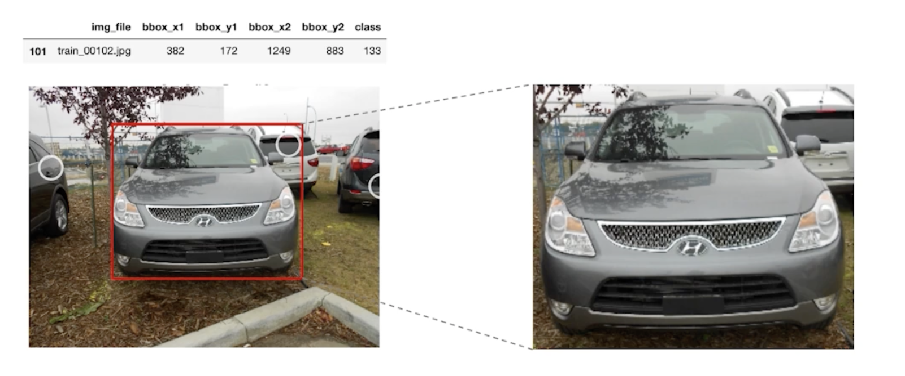

- 이미지의 모든 부분이 정보를 가지는 것이 아니라서 bounding box 를 사용해 필요한 곳만 뽑아내는 것도 중요한 벙법
- bounding box 에는 좌표가 (x, y) 2개 있음
  - 어떻게 박스를 만드냐? 2개 좌표가지고?
  - 직사각형은 2개의 좌표를 알면 만들 수 있음

### Resize

- 계산의 효율을 위해 적당한 크기로 사이즈 변경

    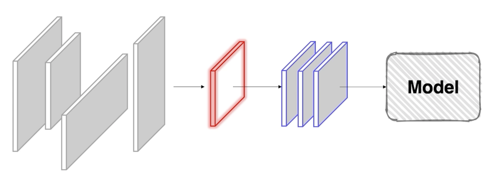

- 너무 큰 이미지는 연산량이 너무 많아서 학습이 오래 걸림
- 이미지 사이즈가 다양하기 때문에 맞추는 작업이 필요

### Example: APTOS Blindness Detection

- 도메인, 데이터 형식에 따라 정말 당야한 Case가 존재

    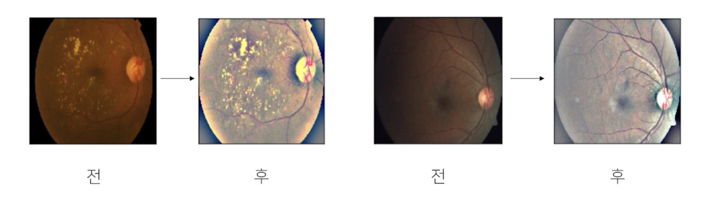

- 어두운 사진 -> 밝은 사진으로 전처리

> 데이터의 종류에 따라서 전처리하는 과정이 모두 다름

## Generalization

### Bias & Variance

- 학습이 너무 안 됐거나, 학습이 너무 됐거나

    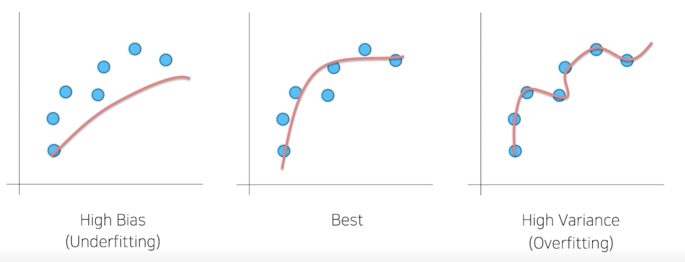

- 모든 데이터는 노이즈가 존재하는데 엄청나게 overfitting을 하게 되면 노이즈까지 fitting 하게 되는데 그래서 High Variance 라고 함
- 데이터를 조금만 쓰게 되는 경우에는 underfitting 이 되는데 High Bias 라고 함

### Train / Validation

- 훈련 셋 중 일정 부분을 따로 분리 검증 셋으로 활용

    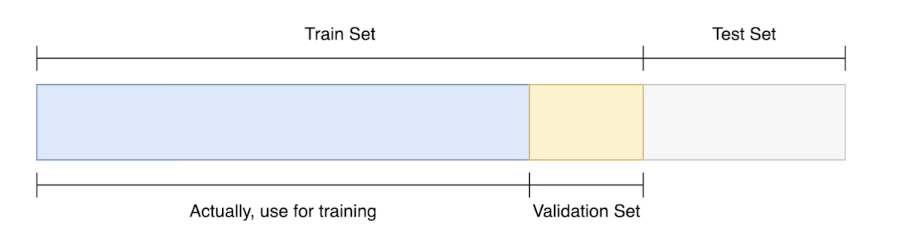

- 검증셋으로 나눠야 하는 궁극적인 목적은?
  - 학습을 했을 때 학습된 결과를 바탕으로 Test set에 적용해서 결과를 볼텐데
  - 학습이 제대로 됐는지 아닌지를 검증할 수 있는 방법이 사실 존재하지 않음
  - 그걸 검증하기 위해서는 학습에 이용되지 않은 데이터를 가지고 검증을 해야지만 
  - 일반화 되었다 아니다를 판단할 수 있는데 validation set 이 없으면 할 수 없음
- 검증하는 절차를 통해서 일반화가 됐는지 아닌지를 확인하는 절차
- Test set은 절대 건드리지 않는다.

## Data Augmentation

- 주어진 데이터가 가질 수 있는 Case(경우), State(상태)의 다양성이 목표

    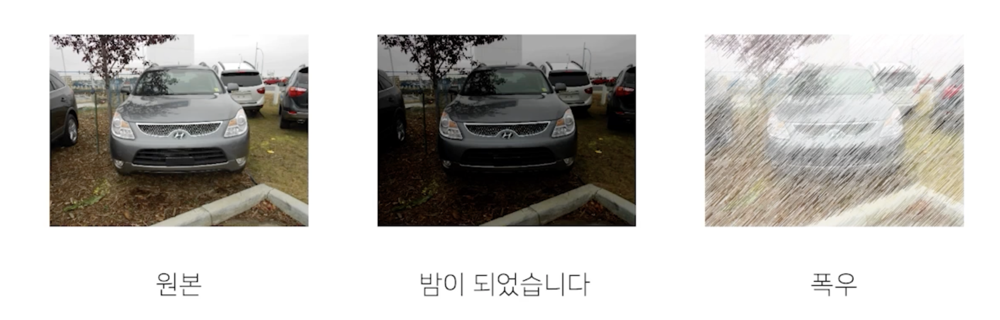

- 데이터를 일반화하는 과정이라고 설명할 수 있음
- 노이즈에 robust 한 결과를 만들 수 있게끔 하는 효과
- 데이터에 발생할 수 있는 여러가지 형태를 파악하는 것이 중요
- 문제가 만들어진 배경과 모델의 쓰임새를 살펴보면 힌트를 얻을 수 있음

### torchvision.transforms

- Image에 적용할수 있는 다양한 함수들

    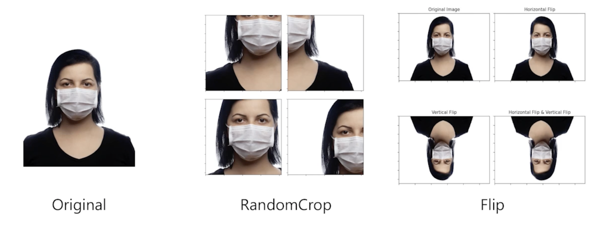

- 사진을 찍을 때 뒤집혀서 찍는 경우가 있을까?
  - Vertical Flip 같은 경우는 굳이 안해도 되는 방법일 수 있음

- 종류는 많고, 사용은 간편

    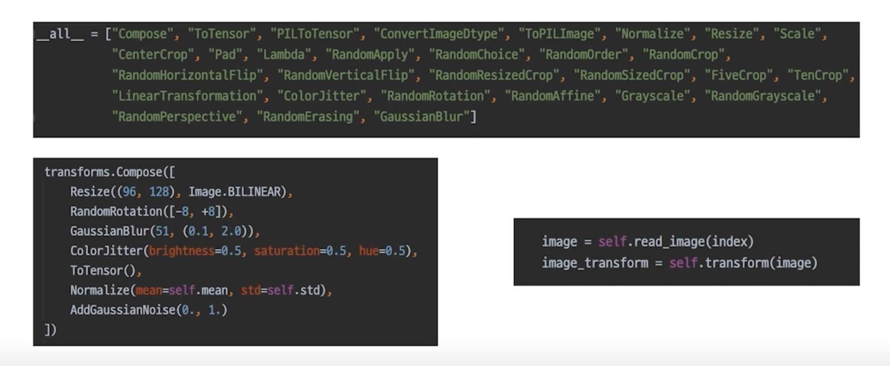

### Albumentations

- 더 빠르고 더 다양

    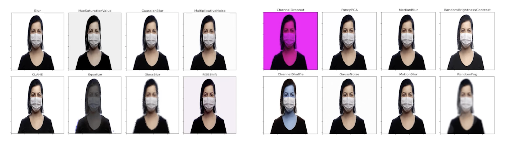

    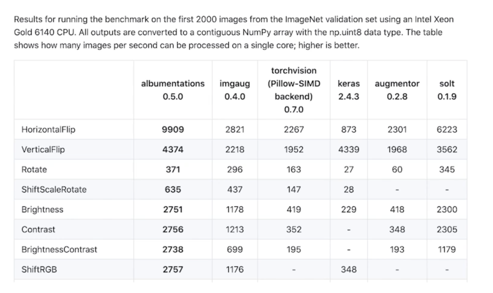

- torchvision 에 있는 transforms 만 사용하지 말고 얘도 사용해보자
  - github에서 설치가능
  - 사용방법도 간단

### `무조건` 이라는 단어를 제일 조심하세요

- 항상 좋은 결과를 가져다 주지는 않음
- 이러한 함수들은 여러가지 도구 가운데 하나일 뿐
- 무조건 적용 가능한 마스터키 같은 것도 사실 없음
- 앞서 정의한 Problem(주제) 을 깊이 관찰해서 어떤 기법을 적용하면 이러이러한 다양성을 가질 수 있겠다 가정하고 **실험으로 증명해야 함**

