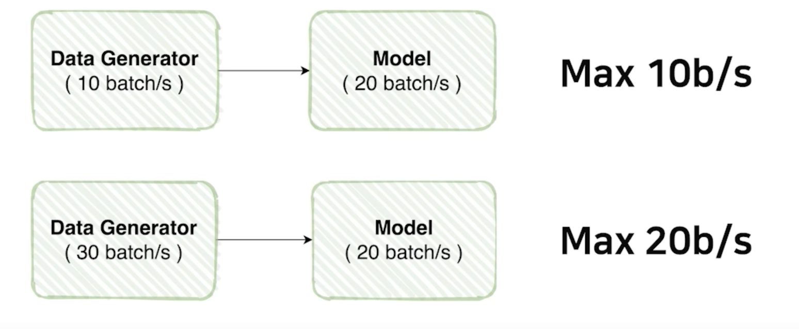
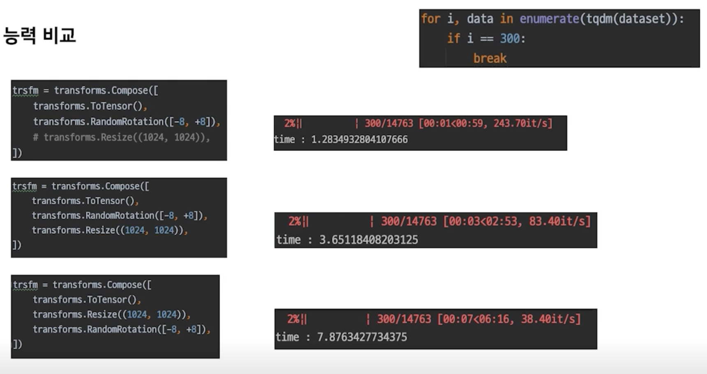
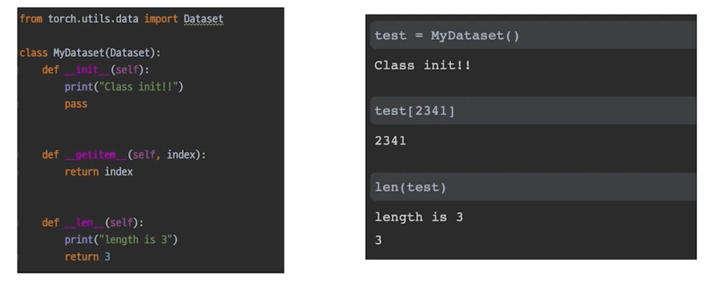
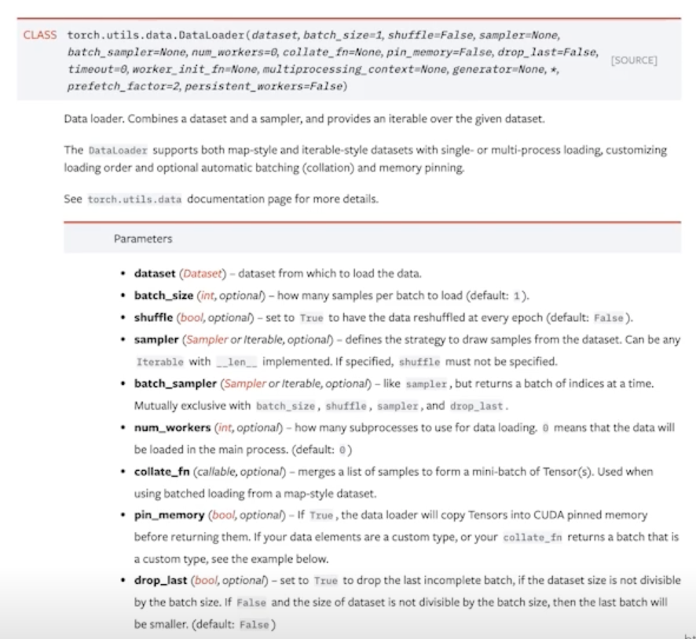
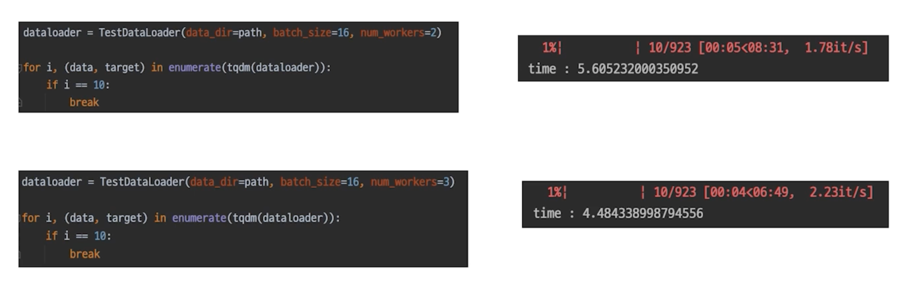
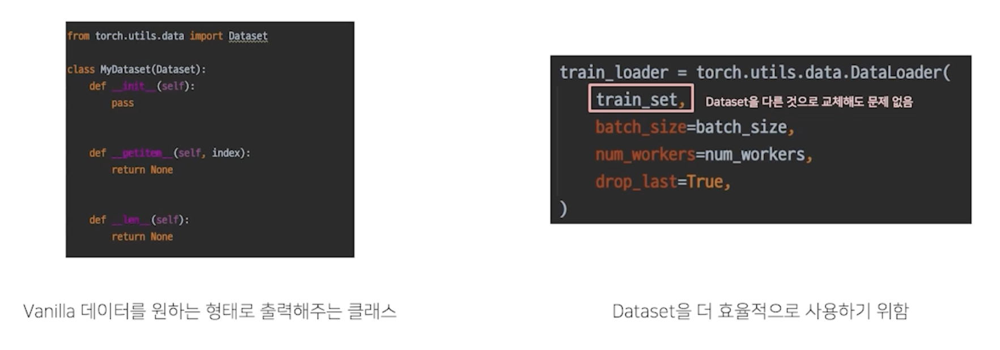

# Data Generation

## Overview

- 데이터 셋을 잘 구성했다 해도, 잘 출력해야만 실속이 있음

    

- 데이터를 잘 만들어 준다는 게 뭘 의미하는 걸까?

    

## Data Feeding

### Feed: 먹이를 주다

- 먹이를 주다 = 대상의 상태를 고려해서 적정한 양을 준다.

    

- 어떻게 Data랑 연결을 지을 수 있을까?

### 또 다른 예시

- 여기 어떤 제품을 만드는 공장이 있다고 생각해보자

    

- 발주가 몰렸는데 물량이 나오지 않는 상태라고 가정해보자
- 아무것도 모르는 공장을 물려받은 사장이
- "생산량을 늘리려면 역시, 많이 만들면 되지" 라는 생각으로 "제작"을 키우면

    

- 제작 공정만 늘린다고 해서 만들어지는 물량이 늘어날까?
- 포장 공정은 그대로라서 나오는 물량은 한계가 있을 것
- 제작을 늘릴거라면 포장 공정도 늘려야지만 실질적으로 나오는 제품의 양이 늘어날 것
- 그래서 제작만 늘린다고 해서 제품이 나오는 속도는 변하지 않을 것
- 전체적인 과정을 이해하지 못하면 이런 실수는 누구나 할 수 있음

> PyTorch 에 데이터를 Generation 하는데에 어떤 비슷한 문제가 있을까?

### 모델에 먹이(Data)를 주다?

- 혹시, 모델 학습을 할 때 비슷한 오류를 범하고 있지 않는가?

    

- 각각의 모델이 처리할 수 있는 양이 있다고 하자
- 모델은 정의를 해놓고 모델이 변하지 않는 이상 처리량은 동일
- 1초당 20 batch 가 돌아가는 모델이 있다고 가정을 해보자
- Data Generator 가 1초에 10 batch 만큼만 공급을 한다면?
- 아무리 모델이 빠른 성능을 가지고 있어도 아무리 빨라도 초당 10 batch 만큼만 처리 가능
- 반대로,
- 모델은 1초당 20 batch 의 처리량을 가지고 있는데 Data Generator 가 1초에 30 batch 만큼 공급을 하면
- 데이터는 만들 수 있는 역량이 충분해서 모델이 낼 수 있는 최대 성능을 끌어낼 수 있음
- 모델이 처리할 수 있는 양을 늘린다는 건 GPU를 바꾼다는 것인데 이건 힘듦
- 효율을 높이기 위해서 모델 처리량 만큼의 Data Generator 를 할 수 있느냐가 중요

### Example

- Dataset 생성 능력 비교

    

- Compose 안에 transforms 를 넣을 때도 여러가지를 신중하게 Test 해보면서 넣어야 함
- Dataset 을 만드는 과정도 튜닝 과정이 필요함

## torch.utils.data

### Datasets

- Vanilla Data 를 Dataset 으로 변환
- Dataset 구조

    

### 복습: Python Class

- 혹시 모르니 잠깐 복습하고 가죠

    

- `__init__` : 함수는 클래스를 선언할 때 실행
- `__getitem__` : 인덱싱으로 연결
- `__len__` : len() 함수 사용시 나오는 값

### DataLoader

- 내가 만든 Dataset 을 효율적으로 사용할 수 있도록 관련 기능 추가

    

- `batch_size` : 배치 사이즈 설정
- `num_workers` : 사용하는 cpu 개수 설정
- `drop_last` : 배치사이즈로 전체 개수를 자르고 남는 나머지 없애버림
- 엄청 기능이 많음

    

- `shuffle`, `collate_fn` 얘네들 잘 사용하는것도 필요!

### 간단한 실험: num_workers

- num_workers 가 늘어날 수록 데이터를 만들어내는 속도가 빨라짐
- 너무 많이 쓰면 효율이 떨어질 수 있음
- 하나하나 test 해봐야함
- 데이터가 커지면 커질수록 CPU의 성능도 중요할 수 있음

### Dataset 과 DataLoader 는 분리되는 것이 좋다.

- Dataset 과 DataLoader 는 엄연히 하는 일이 다르다.

    

- DataLoader 를 Dataset 마다 만들 필요가 없음

