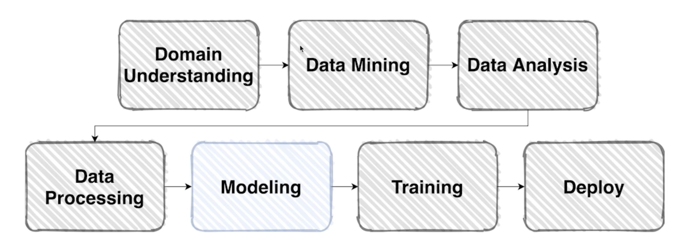
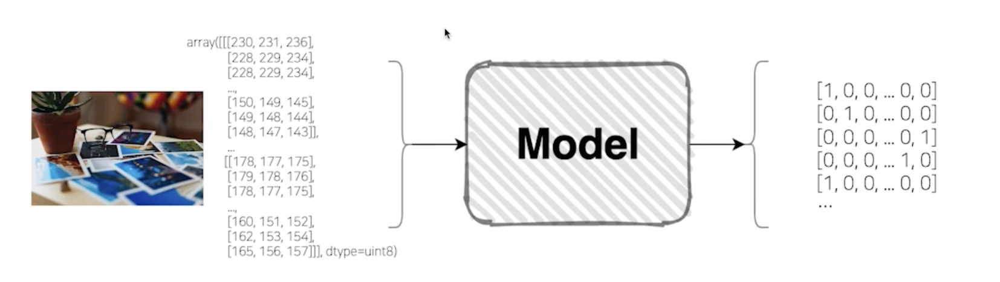
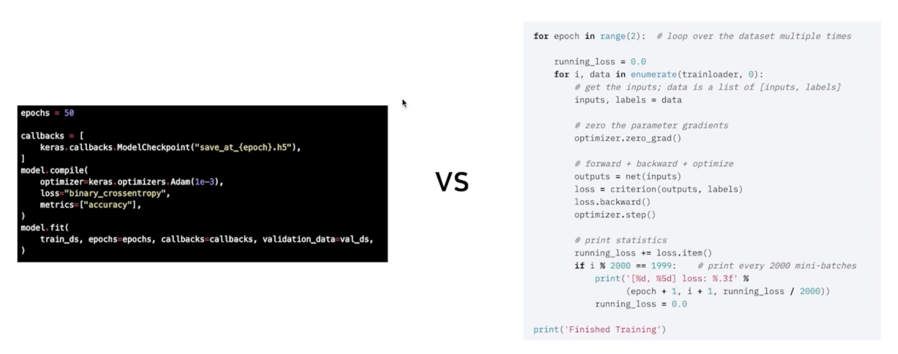
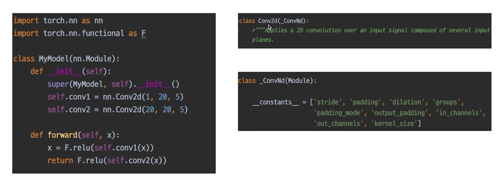
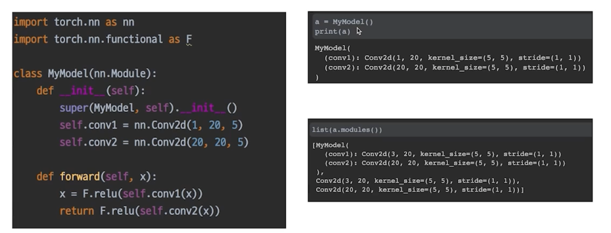
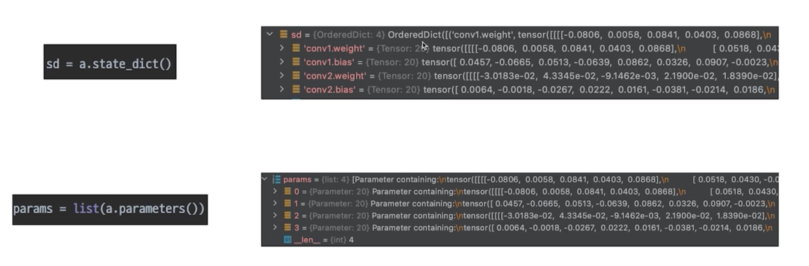
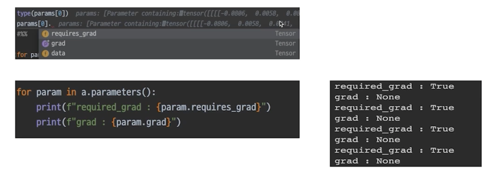
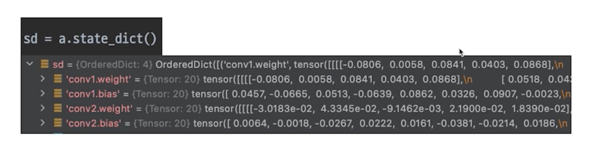

# Model 1 - Model with PyTorch

## Overview

- 이제, 데이터 셋으로 원하는 출력을 만들어 줄 모델을 구성할 차례

    

## Model

- 모델이 뭔가요?

    

- "In general, a model is an informative representation of an object, person or system"

## Design Model with PyTorch

### PyTorch

- Open Source Machine Learning Framework
  - 자유롭고 pythonic 하고 연구하기 좋은 Framework
  - 쉽지않은 부분도 있음
  - 연구를 하거나 공부를 시작하는 사람에게 있어서 장점이 있음
  - 자유도 측면에서 개발적인 장점이 있음

    

  

- Low-level, Pythonic, Flexibility

    - 리모컨은 한번만 사용법을 알려주면 쉽게 할 수 있음 (완제품의 특징)
      - 사용적인 측면에서 훨씬 좋음
    - 오른쪽도 리모컨이라고 가정하면 설명해주지 않으면 어떤 기능인지 전혀 알 수 없음
      - 전원을 누르자마자 소리가 나야하는 기능이 필요하다면
      - 리모컨은 그런기능이 없으면 더이상 어떻게 할 방법이 없음
      - 그러나 오른쪽은 기능을 추가 & 변경 가능

    - PyTorch 는 오른쪽처럼 하나하나의 기능을 알아서 직접 만들고 변형하는 특징

        

    - 왼쪽 Keras
      - 조작법만 알려주면 학습하는데 무리가 없음
    - 오른쪽 PyTorch
      - 과정을 하나하나 이해하지 못하면 이해하기 어려움
    
      

## nn.Module

- PyTorch 모델의 모든 레이어는 nn.Module 클래스를 따른다.

    

## modules

- `__init__` 에서 정의한 또 다른 nn.Module

    

- 파라미터를 저장하는 저장소
- 하나의 모델을 정의하면 거기에 연결된 여러가지 parameter를 들고 있는 Modules를 볼 수 있고 저장할 수 있음

## forward

- 이 모델(모듈)이 호출 되었을 때 실행 되는 함수

    

- 순전파를 거친 값이 나오게 됨

## nn.Module Family

- nn.Module 을 상속받은 모든 클래스의 공통된 특징
  - 모든 nn.Module 은 child modules 를 가질 수 있음
    - 내 모델을 정의하는 순간 그 모델에 연결된 모든 module 을 확인할 수 있음
  - 모든 nn.Modeul 은 forward() 함수를 가짐
    - 내가 정의한 모델의 forward() 를 한번만 실행한 것으로 그 모델의 forward 에 정의된 모듈 각각의 forward() 가 실행됨

## Parameters

- 모델에 정의되어 있는 modules 가 가지고 있는 계산에 쓰일 Parameter
  - state_dict() or parameters() 를 사용해서 모듈의 Parameter의 Tensor들을 볼 수 있음
  - state_dict() : key 값과 같이 Tensor 가 있음
    - 어느 쪽의 파라미터인지를 바로 알 수 있어서 장점
  - parameters() : Tensor 들만 있음

  

- 각 모델 파라미터들은 data, grad, requires_grad 변수 등을 가지고 있음
  - data : weight 와 bias 의 Tensor
  - grad : backward 를 진행하면서 loss의 gradient
  - requires_grad : True, False 로 학습을 시킬지 말지를 정하는 변수

  

## PyTorch 의 Pythonic

- Pythonic 하다는 것의 장점
  - state_dict() : 이 함수의 결과값은 Python의 Dictionary 형태
    - 우리가 이러한 형식과 구조를 미리 알고 있다면 여러가지 응용이 가능할 뿐더러, 발생할 수 있는 에러들도 핸들링 할 수 있음

  

> 여러 다른 Pythonic 한 것이 있으니 항상 물음표(?)를 가지고 자꾸 알아가고자 하면 성장할 수 있을 것!!